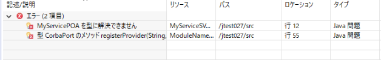
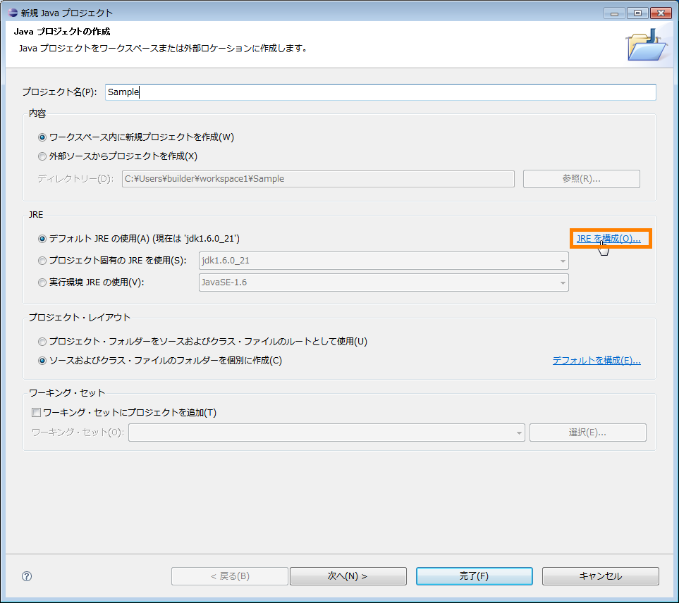
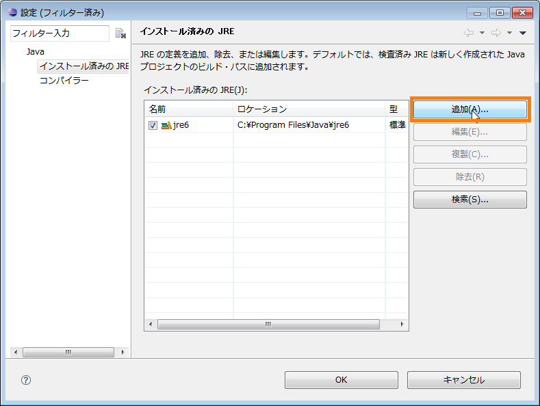
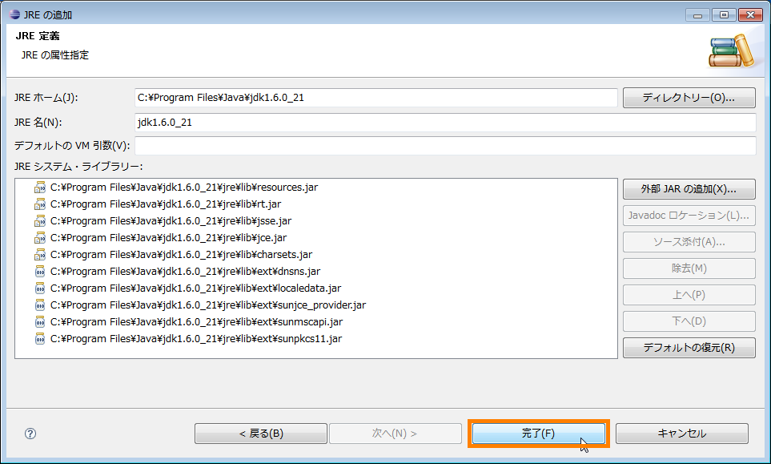
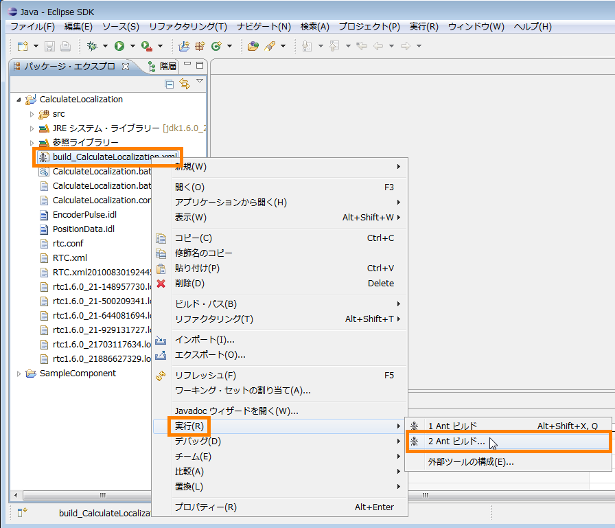
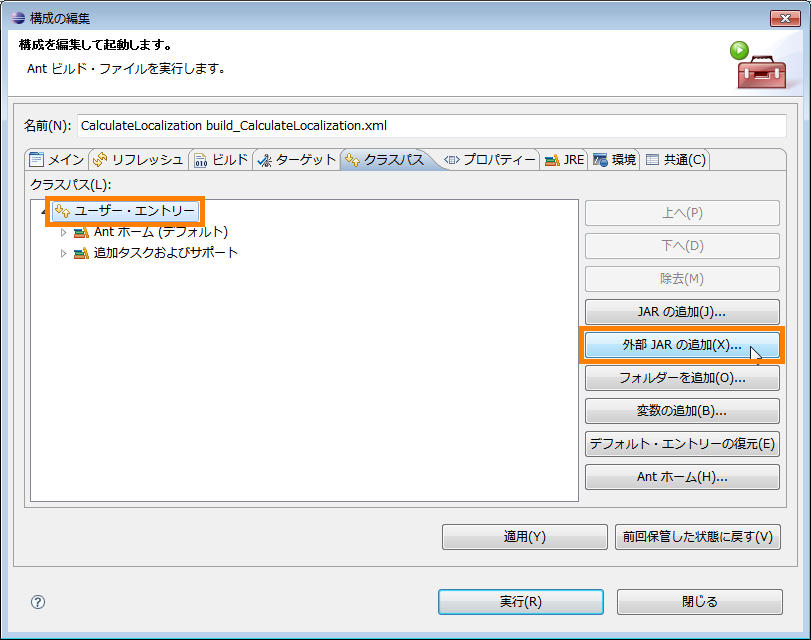

<!-- Adoc/faq/faq_rtc_creation -->

<!-- Title: RTコンポーネント作成に関する FAQ -->
#contents(4)

### An error is displayed when building an RTC with a service port in Eclipse
If an RTC with a service port is generated with RTCBuilder, an error such as "***POA cannot be resolved to a type" is displayed during the Eclipse build.

<div align="center"><a href="Error_POA.png"></a></div>

**Cause:**
idl compilation generates java files (stub sources, skeleton sources, and various utility sources) from the idl file used by the service port.
If the build is executed before idl compilation is performed, these source files (java files) required for the build cannot be found, resulting in an error.

**Solution:**
Right-click "build_JavaRTCTest.xml" from Eclipse's Package Explorer and execute [Run] > [Ant Build].
This runs idl compilation and generates the java files.
After executing "build_JavaRTCTest.xml", refresh the project with the [F5] key or similar, and the error display will disappear.
<br>
<br>

### The RTC is not displayed in the system editor
This phenomenon occurs when switching networks, and it will be displayed by restarting the NameService and RTC.
<br>
<br>

### I want to send data of about 2 MB or more through a data port
When sending image data or similar through a data port, care is required if the data size sent at one time exceeds about 2 MB.
<br>
In omniORB, the size that can be handled by giop (General Inter-ORB Protocol) is "2097152B (2 MB)" by default.
If you try to send data exceeding this size at one time, correct data cannot be sent due to the giop limit.
<br>
<br>
There are the following two ways to change this maximum size.
<br>
<br>
- **When specifying the maximum size in rtc.conf**
```
 # file: rtc.conf
 corba.nameservers: localhost
 naming.formats: %n.rtc
 corba.args: -ORBgiopMaxMsgSize 3145728 ※この行を追加 (Maxサイズを3Mに指定)
```
<br>
- **When specifying it with an environment variable**
```
  export ORBgiopMaxMsgSize=3145728
```

※ When specifying giopMaxMsgSize, it must be set on both the server and client (the paired components).
<br>
(omniORB configuration and API)<br>
[http://omniorb.sourceforge.net/omni41/omniORB/omniORB004.html](http://omniorb.sourceforge.net/omni41/omniORB/omniORB004.html)

<br>

### An IP address is not assigned when connecting to a Raspberry Pi
Restart the Raspberry Pi.
<br>
<br>

### A connection error occurs when connecting a data port on the Raspberry Pi to a data port on the PC
This is thought to be because the NameService on the PC side was started before the Raspberry Pi started. Restart the NameService again.
<br>
<br>

### Communication with the RTC becomes impossible when connected to a Raspberry Pi
This may be due to antivirus software. Change the WiFi setting to WPA2.
<br>
<br>

### ConsoleOut is not displayed in the service on the Raspberry Pi side

- **Name server problem**
  - This phenomenon occurs when the endpoint address of the name server is invalid. It may be resolved by restarting the name server again with rtm-naming.
In addition, if the Raspberry Pi has two or more network interfaces, such as wired LAN and wireless LAN, it may also be resolved by configuring it to use only the network used for connection with the PC.

- **Component problem**
  - It is possible that a name server other than localhost is registered in the configuration file (rtc.conf) loaded by the component. Configure the component to register with the localhost name server, such as by writing corba.nameservers:  localhost.
Also, if the Raspberry Pi has two or more network interfaces, such as wired LAN and wireless LAN, it may also be resolved by configuring it to use only the network used for connection with the PC.
<br>
<br>


### If the PC has two or more network interfaces, there are problems such as being unable to connect or no response in RTSystemEditor

- **Problem with the PC-side component**
  - If the PC has two or more network interfaces and the interface address on the side not used by the Raspberry Pi is being used as the component reference, this phenomenon occurs.
To set the endpoint, set the IP address to be used in rtc.conf as follows.

```
 corba.endpoints: 192.168.11.20
```

However, on Windows Vista and later, files under C:\Program Files cannot be edited easily. To deal with this, copy ConsoleIn.exe and rtc.conf to an appropriate directory such as c:\tmp, or create them there.

- **Problem with the Raspberry Pi-side component**
  - If the Raspberry Pi has two or more network interfaces, such as wired LAN and wireless LAN, and each is connected to a different network, the same problem as with the PC described above occurs. To set the endpoint, write the following in rtc.conf.

```
 corba.endpoints: 192.168.11.21
```
<br>
<br>

### About RT component instance naming rules
The instance naming rule for RT components is like **[RT component type name] + [number (0, 1, 2, 3...)]**.
<br>
<br>
The RT component type name is the name specified with the --type-name option in rtc-template, or the name specified for "type_name" in the component profile (usually written at the beginning of the *.cpp file).
Numbers are assigned sequentially, such as 0, 1, 2, 3..., to components generated on the same manager.
<br>
<br>
When the same component is started multiple times in separate processes, the instance number starts from 0 for each, so multiple components with the same name are started.
Depending on the case, multiple components may be registered with the same name in the name service, and the one registered earlier will be overwritten by the one registered later.
<br>
<br>
To avoid this, the following methods are available.

- **Start multiple components in the same process**
- **Specify name formats that do not conflict with each other using the naming.formats option in rtc.conf**

<br>


### To use non-standard data types with InPort / OutPort
Normally, in OpenRTM-aist, the following are defined in rtm/idl/BasicDataType.idl:
<br>
<br>
TimedShort、TimedLong、TimedUShort、TimedULong、TimedFloat、TimedDouble、TimedChar<br>
TimedBooleanTimedOctet、TimedString、TimedShortSeq、TimedLongSeq、TimedUShortSeq<br>
TimedULongSeq、TimedFloatSeq、TimedDoubleSeq、TimedCharSeq、TimedBooleanSeq<br>
TimedOctetSeq、TimedStringSeq
<br>
<br>
These 20 data types can be used as data types for InPort and OutPort.
<br>
<br>
If you want to define data types other than these and use them with InPort / OutPort, you need to define the data type in IDL and compile and link it at the same time when compiling the component.<br>
<br>
Suppose you want to use a data type for storing images, with members for size (width, height), depth, image data, and so on. In IDL, define this data type as follows.<br>
```
 #include <BasicDataType.idl>
 module RTC
 {
   struct TimedImage
   {
     Time tm;
     long width;
     long height;
     long depth;
     sequence<octet> data;
   };
 };
```
The Time type is a type for timestamps defined in OpenRTM. It may be omitted, but it is better to include it.
Save this as a file named TimedImage.idl.
<br>
<br>
Place this file in the directory where you create the component.
Next, create the component with rtc-template. At that time, specify this IDL file with the --consumer-idl option.
```
 rtc-template -bcxx
   --module-name=ConsoleIn --module-type='DataFlowComponent'
   --module-desc='Console input component'
   --module-version=1.0 --module-vendor='Noriaki Ando, AIST'
   --module-category=example
   --module-comp-type=DataFlowComponent --module-act-type=SPORADIC
   --module-max-inst=10 --outport=out:TimedImage
   --consumer-idl=TimedImage.idl
```

<br>
In this example, the TimedImage type defined in TimedImage.idl is used as the data type of the OutPort. Compile the generated code.

<br>
```
 make -f Makefile.ConsoleIn
```
This compiles TimedImage.idl with the IDL compiler, generates stubs, and links them to the component.
The method of using the data inside the component is the same as usual.
If you want to use the same data type in other components, copy only this IDL file and similarly specify the file with the --consumer-idl option of rtc-template.
This makes it possible to communicate between components using this data type.

<br>


<!-- **入出力ポートのデータ型の選択  -->
<!-- **ConsoleOut でコールバックが必要な訳は？ -->

&aname(errorjavaJDK);
### A new Java project cannot be created as JDK6 (1.6) compliant
When trying to create a Java project as a new project, a dialog like the following may be displayed, and JDK compliance may not be selectable.
<br>
For projects that use RTCBuilder to create RT components in Java, the JRE (Java runtime environment) specified in this dialog must be the JRE included in the JDK. As it is, the JRE inside the JDK cannot be selected, so change the settings.
<br>
<br>

1. As shown in the figure below, click the "Configure JREs..." link in the JRE frame. (Alternatively, cancel this dialog once, and from the Eclipse menu bar, select [Window] > [Preferences], then select "Installed JREs" under "Java" from the tree on the left side of the "Preferences" dialog.)
<br>
<br>
<div align="center"><a href="new_project_name_ja.png"></a></div>
<div align="center"><strong>New Java project dialog (when there is no JDK selection)</strong></div>
<br>
2. Click the [Add] button.
<br>
<div align="center"><a href="new_JRE_setting_ja.png"></a></div>
<div align="center"><strong>Installed JREs dialog (JDK is not yet displayed)</strong></div>
<br>
3. Select "Standard VM" and click the [Next] button.
<br>
<div align="center"><a href="new_JRE_VM_setting_ja.png"></a></div>
<div align="center"><strong>JRE type selection dialog</strong></div>
<br>
4. Click the [Directory] button and select the path to JDK6. (Reference: Normally, the JDK6 path is C:\Program Files\Java\jdk1.6.0_XX)
<br>
<div align="center"><a href="add_JRE_ja.png"></a></div>
<div align="center"><strong>Add JRE dialog</strong></div>
<br>
<div align="center"><a href="select_JDK_ja.png"></a></div>
<div align="center"><strong>Select the path to JDK6 and make the "Add JRE" dialog refer to the JDK</strong></div>
<br>
5. When reference to the path to the JDK succeeds, the "Add JRE" dialog will appear as shown below, so click the [Finish] button and close the dialog.
<br>
<div align="center"><a href="load_JDK_ja.png"></a></div>
<div align="center"><strong>Successfully referenced the JDK6 path</strong></div>
<br>
6. You will return to the "Installed JREs" dialog (with the JDK added), so check the JRE to make active as shown below and click the [OK] button.
<br>
<div align="center"><a href="set_active_JDK_ja.png"></a></div>
<div align="center"><strong>Since the JDK has been added to the "Installed JREs" dialog, change the active check to the JDK</strong></div>
<br>
7. The JDK can now be selected in the "New Java Project" dialog.
<br>
<div align="center"><a href="SelectJDKasJRE_ja.png"></a></div>
<div align="center"><strong>Specify configuration using the JRE inside the JDK as the "JRE"</strong></div>
<br>


&aname(Antbuild);
### How can I set a classpath to an arbitrary folder and perform an Ant build?
OpenRTM-aist (Java version) establishes coordination between code generation in RTCBuilder and build execution with Ant by setting the base path (path up to the parent folder) to the "jar" folder, where the OpenRTM-aist (Java version) library "OpenRTM-aist-X.X.X.jar" (X.X.X is the version) exists, in the environment variable RTM_JAVA_ROOT, and using it for classpath settings. Therefore, RTM_JAVA_ROOT must always hold the path (base path) to the OpenRTM-aist (Java version) library folder. However, RTM_JAVA_ROOT originally points to the installation location of OpenRTM-aist (Java version), so as a result, the OpenRTM-aist (Java version) library and other components (documents, samples, and utility tools) must always maintain that folder structure.
<br>
<br>
It is also possible to use the environment variable RTM_JAVA_ROOT exclusively for classpath settings. You could place the OpenRTM-aist (Java version) library folder wherever you like and set RTM_JAVA_ROOT accordingly. However, in this case, it is necessary to guarantee that "the environment variable RTM_JAVA_ROOT is not used for anything other than the classpath to the library."
<br>
<br>
Therefore, if for some reason you want to set the classpath somewhere other than the location pointed to by RTM_JAVA_ROOT, this section explains how to set the classpath.
<br>
<br>

- **Call the Eclipse Ant settings dialog**
<br>
From Eclipse's usual left-side view "Package Explorer", right-click build_<CompName>.xml and select [Run] > [Ant Build...].
<br>
<br>
<div align="center"><a href="Call_Ant_Setting_ja.png"></a></div>
<div align="center"><strong>Call the Ant settings dialog</strong></div>

<br>

- **Classpath settings**<br>
1. The Ant settings dialog is displayed, so select the "Classpath" tab.
<br>
<br>
<div align="center"><a href="Ant_Setting_Classpath_ja.png"></a></div>
<div align="center"><strong>Select the "Classpath" tab</strong></div>

<br>

2. Select "User Entries" once, then click the "Add External JARs" button.
<br>
<br>
<div align="center"><a href="Ant_External_Jar_ja.png"></a></div>
<div align="center"><strong>Add external JARs</strong></div>

<br>

3. When the "JAR Selection" dialog appears, specify the path to the target JAR library. As a result, the added JAR library is displayed in the Ant settings dialog as shown below.
<br>
<br>
<div align="center"><a href="Ant_Add_Jar_ja.png"></a></div>
<div align="center"><strong>Added JAR</strong></div>

<br>

**Important notes**<br>
The environment variable RTM_JAVA_ROOT must always be set (however, it may be a dummy). By specifying the classpath arbitrarily, even if the RTM_JAVA_ROOT setting becomes unnecessary, deleting that setting or not setting it at all will result in an error during the build. Also, a folder named "jar" must actually exist at the path indicated by RTM_JAVA_ROOT (it may be empty).
<br>
<br>


&aname(Antbuilderror);
### An exception is displayed when building from the command line using Ant with Java
When running Ant with Java, an exception like the following may be displayed.

```
 >ant -f build_ModuleName.xml
 Exception in thread "main" java.lang.UnsupportedClassVersionError: org/apache/to
 ols/ant/launch/Launcher : Unsupported major.minor version 52.0
        at java.lang.ClassLoader.defineClass1(Native Method)
        at java.lang.ClassLoader.defineClass(ClassLoader.java:800)
        at java.security.SecureClassLoader.defineClass(SecureClassLoader.java:142)
        at java.net.URLClassLoader.defineClass(URLClassLoader.java:449)
        at java.net.URLClassLoader.access$100(URLClassLoader.java:71)
        at java.net.URLClassLoader$1.run(URLClassLoader.java:361)
        at java.net.URLClassLoader$1.run(URLClassLoader.java:355)
        at java.security.AccessController.doPrivileged(Native Method)
        at java.net.URLClassLoader.findClass(URLClassLoader.java:354)
        at java.lang.ClassLoader.loadClass(ClassLoader.java:425)
        at sun.misc.Launcher$AppClassLoader.loadClass(Launcher.java:308)
        at java.lang.ClassLoader.loadClass(ClassLoader.java:358)
        at sun.launcher.LauncherHelper.checkAndLoadMain(LauncherHelper.java:482)
```

**Cause:** The Java version may be old.<br>
See the following link for the Java and Ant version requirements. Update as necessary.<br>
<br>
[Java and Ant version requirements](http://ant.apache.org/faq.html#java-version)
<br>

