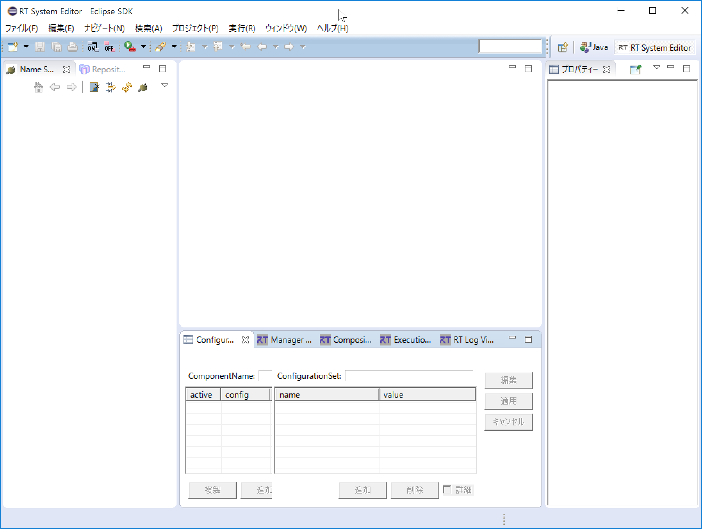
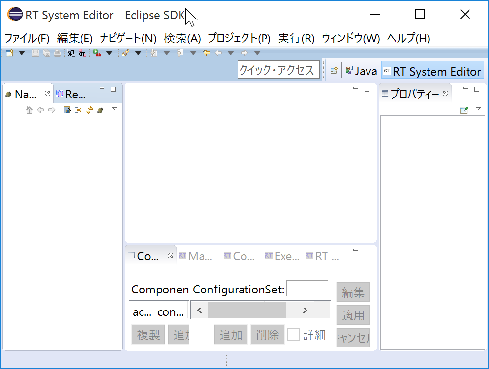

<!-- Title: RTSystemEditor、RTCBuilder、rtshell 等ツールに関する FAQ -->
#contents(4)

## RTSystemEditor

### Icons and other elements become small in high-resolution mode on Windows 10 and similar systems

Applications that do not support HiDPI mode on Windows 10 and similar systems may display windows and icons smaller at high resolutions.
Eclipse also only partially supports HiDPI mode, so everything is displayed smaller overall as shown below.


<div align="center"><a href="OpenRTP_normal.png"></a></div>
<div align="center"><strong>Normal display</strong></div>

<div align="center"><a href="OpenRTP_small.png"></a></div>
<div align="center"><strong>Display when HiDPI is not supported</strong></div>

This problem can be resolved by changing the registry and placing a manifest file using the following procedure.

Add the following key to the registry.

HKEY_LOCAL_MACHINE\SOFTWARE\Microsoft\Windows\CurrentVersion‌​\SideBySide\PreferEx‌​ternalManifest = (DWORD) 1

  - Download the reg file for adding this value to the registry from below and double-click it<br>
[ExternalManifestON.reg](http://openrtm.org/openrtm/sites/default/files/248/ExternalManifestON.reg)
1. Place a manifest file named `<exe file name>`.exe.manifest in the same folder as the exe
 - Manifest for OpenRTP: [eclipse.exe_.manifest](./eclipse.exe_.manifest)
<!-- a href="eclipse.exe_.manifest"></a>;<br-->
※When using it, rename it to eclipse.exe.manifest

 - Manifest for RTSystemEditorRCP: [RTSystemEditorRCP.exe_.manifest](./RTSystemEditorRCP.exe_.manifest)
<!-- div align="center"><a href="RTSystemEditorRCP.exe_.manifest"></a></div>;<br>-->
※Rename it to RTSystemEditorRCP.exe.manifest
<br>

### RTSystemEditor operation performance becomes poor
RTSystemEditor always synchronizes the display while collecting system information. When collecting this system information, if it accesses a reference to an object that is not running, it may wait for a timeout and become extremely slow.~
If an object that is not running occurs, delete it from the name service using "Delete from NameService". Also, deleting objects that are port-connected to objects that are not running from the name service and system editor should make the operation lighter.
<br>

<!-- ****RTコンポーネント以外の CORBA オブジェクトがネームサービスに登録されている場合、そのネームサービスを RtcLink のネームサービスビューで指定するとエラーダイアログが表示される。  -->
<!-- #br -->

### It is not possible to distinguish when multiple connections are made between the same ports in the system editor (duplicate connections)
Duplicate connections cannot be distinguished by the connection lines. Sorry for the inconvenience, but please check the project file.
<br>
<br>

### The [All Activate] button cannot be pressed in RTSystemEditor
Restart OpenRTP.
<br>
<br>

### Configurations are not displayed in RTSystemEditor
Restart OpenRTP.
<br>
<br>

### RT System Editor operation performance becomes poor
RT System Editor always synchronizes the display while collecting system information. When collecting this system information, if it accesses a reference to an object that is not running, it may wait for a timeout and become extremely slow.
If an object that is not running occurs, delete it from the name service view using "Delete from NameService". Also, deleting objects that are port-connected to objects that are not running from the name service and system editor may restore performance.
<br>
<br>

### A project named "RT System Editor_Files" is created in the Eclipse workspace. What is this?
Temporary information used internally by RT System Editor during execution is stored there. Since it is used temporarily during execution, do not delete it while it is running. When RT System Editor is stopped, there is no problem with deleting the entire project.
<br>
<br>

### Is there a way to distinguish when multiple connections are made between the same ports in the system editor (duplicate connections)?
**A. **Duplicate connections cannot be distinguished by the connection lines. Sorry for the inconvenience, but please check the project file.
<br>
<br>

## RTCBuilder
### The error "Error writing file." is displayed when saving in the RTC Profile Editor
This is displayed when the specified save destination is invalid. Set the save destination to a directory inside any project and save it.
<br>
<br>

### The data type pull-down menu is blank
This phenomenon may occur if the PC has not been restarted after installing OpenRTM-aist. Please restart the PC.
<br>
<br>

## rtc-template (cui version)
### About service port options 
When using a service provider port, give~
```
 "--service=PortName:ServiceName:Type"
```
and when using a service consumer port, give~
```
 "--consumer=PortName:ServiceName:Type"
```
~
These options have the following restrictions.
The component name given by "--module-name=" and the service interface name specified in the IDL must be different.
"Type" must be the same as the service interface name.
"ServiceName" and "Type" must be the same for the paired provider and consumer. (PortName is arbitrary as long as it is unique within the component.)
<br>
<br>

## Eclipse
&aname(eclipse);
### How to start Eclipse
- For Windows systems 
  - Find eclipse.exe in the Eclipse installation folder and double-click its icon.

- For UNIX systems
  - The following explanation assumes, as an example, that the login shell is bash.

- When the environment variable RTM_JAVA_ROOT is set in /etc/profile
  - You can start Eclipse by double-clicking the Eclipse icon in the file browser. You can also start it from the command line as described next.

- When the environment variable RTM_JAVA_ROOT is set in .bashrc
  - <span style="color**: red;">**Avoid starting it by double-clicking.**</span>; Be sure to start a terminal and start Eclipse from the command line. For example, if Eclipse is extracted to /usr/Eclipse, you can start Eclipse with the following command.~

```
 $ /usr/Eclipse/eclipse
```
- note:
  - Reason to avoid starting by double-clicking|When Ant building RTC code generated by RTCBuilder in Eclipse, the environment variable RTM_JAVA_ROOT is used. If Eclipse is started by double-clicking, the configuration file .bashrc is not loaded, and the Ant build may fail.
<br>
<br>

&aname(rtclinksunjava);
### A simple method for applying Oracle Java (JRE) to Eclipse in UNIX-like environments
In UNIX-like environments, it seems common that trying to install Java results in GCJ (The GNU Compiler for Java) being installed (this applies to many Linux distributions). Eclipse tools may malfunction unless Oracle JRE 1.6 or later is used. **If you just want to use Oracle Java only with Eclipse for the time being**, do the following.~
Obtain the JDK, execute it, and copy the resulting jre directory to the Eclipse installation directory before use.
<!-- ただし、この方法で RtcTemplate を動かす場合、Java についてのみ RTC テンプレートコード生成ができなくなります。 -->
<!-- ''*'' jdk-6u4-linux-i586.binなどでも大丈夫です。 -->
<br>
**Example of applying Oracle JRE to Eclipse (when using jdk-6u4-linux-i586.bin)**
```
 $ sh jdk-6u4-linux-i586.bin
 $ cp -r jdk1.6.0_04/jre eclipse/
```
<br>
<br>
