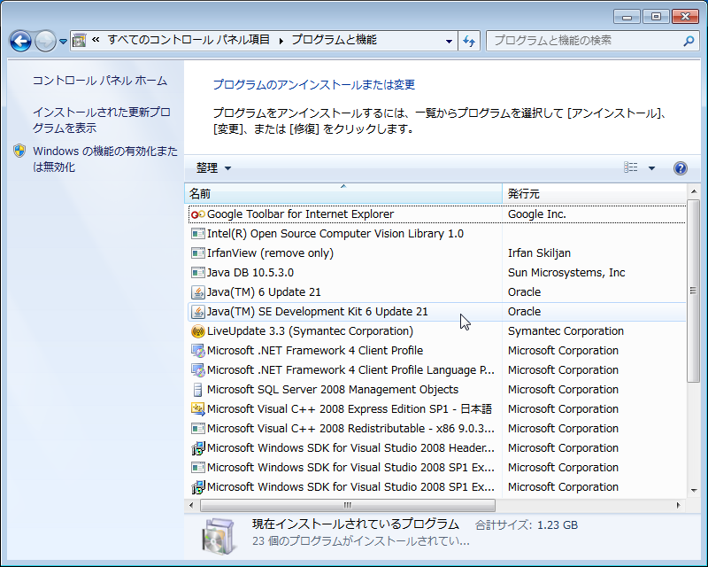
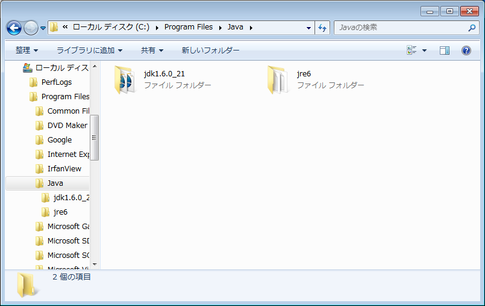

<!-- Title: OpenRTM-aist(C++版、Python版、Java版)に関するトラブルシューティング -->
#contents(4)
This page summarizes troubleshooting for OpenRTM-aist (C++ version, Python version, Java version).

<!-- #clear -->

## OpenRTM-aist (Common)
### Common to All OSes
#### The component should be running, but it is displayed as a zombie object.
Although the component is running and registered with the name server, it is displayed as a zombie object in the name service view of RTSystemEditor, and nothing is displayed even when it is dragged and dropped into the system editor.
##### [Cause] The host on which the component was started cannot be reached
The PC running RTSystemEditor may not be able to reach the host on which the component was started for some reason.~
First, check whether ping can reach the host on which the component was started from the PC running RTSystemEditor.~
For example, suppose there are the following three hosts A, B, and C.
  - hostA: Host where the component is running
  - hostB: Host where the name server is running
  - hostC: Host where RTSystemEditor is running

If the networks of these hosts are configured as follows,~
**[hostA]-(Network I)-[hostB]-(Network I)-[hostC]**~
and hostB is not configured to route properly between **Network I** and **Network II**, hostC cannot reach hostA.~
In such cases, hostB must be configured appropriately so that hostC can reach hostA.
##### [Cause] The firewall is enabled on the host where the component was started 
If a firewall is running on the host where the component is running, RTSystemEditor and the component may not be able to communicate, causing this phenomenon.~
Review the firewall settings or turn it off so that the component can communicate from the outside.
<br>
### Windows

&aname(tokkenn);
#### During installer execution, a message such as "... privileges are insufficient." is displayed, and installation cannot continue
  - Log on as a user with Administrator privileges and perform the installation.
<br>
#### The component is not registered with the name service.
After starting the name server and component, when you connect to the name server with RTSystemEditor or similar, the component may not be registered.~
In such a case,~
first set the following in rtc.conf to maximize the log level:~
```
 logger.log_level:PARANOID
```

Then try starting the component.~
If the component log does not contain a message like the following,~
```
 naming_svc NameServer connection succeeded: corba/ホスト名:ポート番号
```
registration with the name server has failed.~
In such a case, the following causes are possible.

##### corba.nameservers in rtc.conf is not set correctly
Check whether the rtc.conf loaded by the component is set correctly. Assuming the name server you want to use has the host name openrtm.aist.go.jp, the following line must be included in rtc.conf.
```
 corba.nameservers: openrtm.aist.go.jp
```

Also, if the name server was started with a port number specified, the port number must also be specified. If the port number specified when starting the name server is 1234, it must be set as follows.~
```
 corba.nameservers: openrtm.aist.go.jp:1234
```

If no port number is specified, the default port number 2809 is used. This is the default port number of the omniORB name server (omniNames). Be careful if you use a name server other than omniORB.
##### A network connection cannot be made from the host where the component was started to the host where the name server was started
Check whether a network connection can be made from the host where the component was started to the host where the name server was started.~
First, check whether ping can get through. If it cannot, review the network settings.~
Even if ping works, the connection may be prohibited by a firewall or similar. First, review the firewall settings on the host side where the name server was started. The easiest method is to turn off the firewall. For the method, refer to each OS or firewall setting procedure.
##### There are two or more network interfaces
If the host has two or more network interfaces, it is necessary to tell CORBA which interface to use.~
This must be considered for both the name server side and the component side.~
Suppose that each host has two interfaces, and the addresses of each interface are set as follows (assuming the mask is 255.255.255.0).~
  - **Name server host: eth0:192.168.0.1, eth1:192.168.100.1**~
  - **Component host: eth0:192.168.0.2, eth1:192.168.11.96**~
In this case, the name server host and component host should be connected on the 192.168.0 network.~
Therefore,~
  - **eth0:192.168.0.1 for the name server**~
  - **eth0:192.168.0.2 for the component**~
must be specified as the interfaces to use.~
On the name server side, the environment variable OMNIORB_USEHOSTNAME must be set when starting the name server.~

```
 (csh系)
 > setenv OMNIORB_USEHOSTNAME 192.168.0.1
```
```
 (bash系)
 > export OMNIORB_USEHOSTNAME=192.168.0.1
 > rtm-naming もしくは omniNames でネームサーバーを起動
```

You may also write this directly in rtm-naming (UNIX-like systems) or rtm-naming.bat (Windows).~
On the other hand, on the component side, you can specify the interface to use by writing the corba.endpoint setting in rtc.conf.~
```
 corba.endpoint: インターフェースIPアドレス:ポート番号
 corba:endpoint: 192.168.0.2:       (ポート番号を指定しない場合)
 corba:endpoint: 192.168.0.2:1234   (ポート番号を指定する場合)
```

The port number does not necessarily need to be specified, but be sure to add **: (colon)** after the IP address.
<br>

## OpenRTM-aist (C++ Version)
### Windows

&aname(cmakecompilererrro)
#### The compiler cannot be found when running CMake

The following error occurs when running CMake.

```
 No CMAKE_CXX_COMPILER could be found. 
```

First, check the following file:

&lt;project directory&gt;/&lt;build directory&gt;/CMakeFiles/CMakeError.log

##### (Cause 1) The wrong compiler was specified

When running (Configure) CMake, you specify the compiler. If you specify a compiler different from the installed Visual Studio, the compiler cannot be found and an error such as **No CMAKE_CXX_COMPILER could be found.** occurs.

Looking at CMakeError.log, an error occurs immediately after the compiler check starts, as shown below.

```
 Microsoft (R) Build Engine バージョン 4.6.1586.0
 [Microsoft .NET Framework、バージョン 4.0.30319.42000]
 Copyright (C) Microsoft Corporation. All rights reserved.
 
 2017/04/08 10:47:04 にビルドを開始しました。
 ノード 1 上のプロジェクト "C:\workspace\Flip\build\CMakeFiles\3.7.2\CompilerIdC\CompilerIdC.vcxproj" (既定のターゲット)。
 C:\workspace\Flip\build\CMakeFiles\3.7.2\CompilerIdC\CompilerIdC.vcxproj(18,3): error MSB4019: インポートされたプロジェクト 
 "C:\Microsoft.Cpp.Default.props" が見つかりませんでした。<Import> 宣言のパスが正しいかどうか、およびファイルがディスクに存在しているかどうかを確認してください。
 プロジェクト "C:\workspace\Flip\build\CMakeFiles\3.7.2\CompilerIdC\CompilerIdC.vcxproj" (既定のターゲット) のビルドが終了しました -- 失敗。
 
 ビルドに失敗しました。
 
 "C:\workspace\Flip\build\CMakeFiles\3.7.2\CompilerIdC\CompilerIdC.vcxproj" (既定のターゲット) (1) ->
  C:\workspace\Flip\build\CMakeFiles\3.7.2\CompilerIdC\CompilerIdC.vcxproj(18,3): error MSB4019: インポートされたプロジェクト 
 "C:\Microsoft.Cpp.Default.props" が見つかりませんでした。<Import> 宣言のパスが正しいかどうか、およびファイルがディスクに存在しているかどうかを確認してください。
  
     0 個の警告
     1 エラー
 
 経過時間 00:00:00.50
```

- Solution: Specify the correct compiler.

1. Check the installed OpenRTM
  - → Is it 32-bit or 64-bit? 
1. Check the installed Visual Studio
  - → Visual Studio 2008 (VC9), 2010 (VC10), 2012 (VC11), 2013 (VC12), 2015 (VC14), 2017 (VC15)
1. Delete the CMake cache
  - When changing the compiler specification, you must always delete the cache.
1. Specify the correct compiler in CMake Configure
  - Match 32-bit/64-bit to the installed OpenRTM
    - 32-bit is without suffix (example: Visual Studio 10 2010)
    - 64-bit is Win64 (example: Visual Studio 10 2010 Win64)


##### (Cause 2) Visual C++ is not installed
When installing Visual Studio, Visual C++, including the C++ compiler, may not have been installed.

- Solution: Install Visual C++
Start the installer again (download it first if you do not already have it), and perform installation from "Change."
Select Customize installation and confirm that Visual C++ is included in the items to be installed before installing.

In this case as well, the output content of CMakeError.log is the same as (Cause 1).


##### (Cause 3) rc.exe cannot be executed

In rare cases, even though the installed compiler is correctly specified when running CMake, an error such as **No CMAKE_CXX_COMPILER could be found.** may occur.
One possible cause is that when multiple versions of Visual Studio have been installed and uninstalled, inconsistencies may rarely occur in the toolchain settings, resulting in an error such as **rc.exe cannot be executed** as shown below.

```
   C:\Program Files (x86)\Microsoft Visual Studio 14.0\VC\bin\x86_amd64\CL.exe /c /nologo /W0 /WX- /Od /D _MBCS /Gm- /EHsc /RTC1 /MDd /GS /fp:precise /Zc:wchar_t /Zc:forScope /Zc:inline /Fo"Debug\\" /Fd"Debug\vc140.pdb" /Gd /TC /errorReport:queue CMakeCCompilerId.c
   CMakeCCompilerId.c
Link:
   C:\Program Files (x86)\Microsoft Visual Studio 14.0\VC\bin\x86_amd64\link.exe /ERRORREPORT:QUEUE /OUT:".\CompilerIdC.exe" /INCREMENTAL:NO /NOLOGO kernel32.lib user32.lib gdi32.lib winspool.lib comdlg32.lib advapi32.lib shell32.lib ole32.lib oleaut32.lib uuid.lib odbc32.lib odbccp32.lib /MANIFEST /MANIFESTUAC:"level='asInvoker' uiAccess='false'" /manifest:embed /PDB:".\CompilerIdC.pdb" /SUBSYSTEM:CONSOLE /TLBID:1 /DYNAMICBASE /NXCOMPAT /IMPLIB:".\CompilerIdC.lib" /MACHINE:X64 Debug\CMakeCCompilerId.obj
 LINK : fatal error LNK1158: 'rc.exe' を実行できません。 [C:\workspace\Flip\build\CMakeFiles\3.7.2\CompilerIdC\CompilerIdC.vcxproj]
 プロジェクト "C:\workspace\Flip\build\CMakeFiles\3.7.2\CompilerIdC\CompilerIdC.vcxproj" (既定のターゲット) のビルドが終了しました -- 失敗。
 
 ビルドに失敗しました。
```


- Solution: Copy rc.exe and rcdll.dll

A workaround for this is to copy rc.exe and rcdll.dll to the tool directory of the target compiler.

1. Find rc.exe and rcdll.dll
  - Open Explorer, open **C:\Program Files** (or **C:\Program Files (x86)**), and search for rc.exe. rcdll.dll should be in the same directory, so you only need to search for rc.exe.
  - Normally, several rc.exe files are found under **C:\Program Files (x86)\Windows Kits**, but the one under the x86 directory is the target.
  - In the search results, right-click the target rc.exe and select **"Open file location (I)"**
1. Open the compiler tool directory
  - Open another Explorer window and open the tool's bin directory
  - In the example log above, from **C:\Program Files (x86)\Microsoft Visual Studio 14.0\VC\bin\x86_amd64\link.exe**, you can see that the tool directory is **C:\Program Files (x86)\Microsoft Visual Studio 14.0\VC\bin** (the bin directory is the target; x86?amd64 can be ignored).
1. Copy rc.exe and rcdll.dll
  - Copy rc.exe and rcdll.dll from the Explorer window opened in step 1 to the tool directory opened in step 2


&aname(errorinit);
#### Application error: "The application failed to initialize properly. ..."
: |When trying to start the name server by executing rtm-naming.bat, an error like the above may appear. This error occurs because the VC++ library runtime components are not present in the execution environment. OpenRTM-aist (C++ version) cannot run in an environment where VC++-related development environments (Microsoft Visual Studio, Visual C++ Express, etc.) are not installed, so be sure to install a VC++-related development environment.~
OpenRTM-aist (C++ version) includes versions based on VC8 (VS2005) and versions based on VC9 (VS2008). If you used a VC8-based installer such as OpenRTM-aist-X.X.X-jp_vc8.msi (where X.X.X is the version), install the [Microsoft Visual C++ 2005 SP1 Redistributable Package (x86) ](http://www.microsoft.com/downloads/details.aspx?FamilyID=200b2fd9-ae1a-4a14-984d-389c36f85647&DisplayLang=ja). If you used a VC9-based installer such as OpenRTM-aist-X.X.X-jp_vc9.msi (where X.X.X is the version), install the [Microsoft Visual C++ 2008 Redistributable Package (x86) ](http://www.microsoft.com/downloads/details.aspx?displaylang=ja&FamilyID=9b2da534-3e03-4391-8a4d-074b9f2bc1bf).
<br>
&aname(errorapplication);
#### "This application has failed to start because the application configuration is incorrect. ..." 
When trying to start a sample RT component or similar by executing xxxComp.exe, an error like the above may appear. This error occurs because the VC++ library runtime components are not present in the execution environment. OpenRTM-aist (C++ version) cannot run in an environment where VC++-related development environments (Microsoft Visual Studio, Visual C++ Express, etc.) are not installed, so be sure to install a VC++-related development environment.~

OpenRTM-aist (C++ version) includes versions based on VC8 (VS2005) and versions based on VC9 (VS2008). If you used a VC8-based installer such as OpenRTM-aist-X.X.X-jp_vc8.msi (where X.X.X is the version), install the [Microsoft Visual C++ 2005 SP1 Redistributable Package (x86) ](http://www.microsoft.com/downloads/details.aspx?FamilyID=200b2fd9-ae1a-4a14-984d-389c36f85647&DisplayLang=ja). If you used a VC9-based installer such as OpenRTM-aist-X.X.X-jp_vc9.msi (where X.X.X is the version), install the [Microsoft Visual C++ 2008 Redistributable Package (x86) ](http://www.microsoft.com/downloads/details.aspx?displaylang=ja&FamilyID=9b2da534-3e03-4391-8a4d-074b9f2bc1bf).
<br>
#### Error "'windows.h' not found" during build with Visual C++ 2005 Express Edition
The following error may occur during build with Visual C++ 2005 Express Edition.
```
>c:\program files\omniorb\include\omnithread\nt.h(35) : fatal error C1083: include ファイルを開けません。'windows.h': No such file or directory
```

This is thought to be caused by **1. Microsoft Platform SDK is not installed**, or **2. include file path / library path settings are incomplete**.

##### 1. Microsoft Platform SDK is not installed
- Solution: Install Microsoft Platform SDK. At that time, refer to [here](/en/node/640#2005SDKattention). Alternatively, follow **2.** below.
##### 2. Include file path / library path settings are incomplete
- Solution: Due to the installation order or similar reasons, Microsoft Platform SDK may have been installed in a location different from the installation directory of Visual C++ 2005 Express Edition, and the Visual C++ 2005 Express Edition compiler may not be able to find the include files or libraries of Microsoft Platform SDK. In this case, the problem can be solved by adding the Microsoft Platform SDK installation directory to the include file search path and library search path.
  - How to add the include file search path: From the menu bar of Visual C++ 2005 Express Edition, select "Tools" → "Options" to open the "Options" window. From the tree view on the left, select "Projects and Solutions" → "VC++ Directories."~
Set the upper-right pull-down menu "Show directories for" to "Include files", and add the directory for Microsoft Platform SDK include files (for example, "C:\Program Files\Microsoft Platform SDK\Include") to the include file search path.
  - How to add the library file search path: In the same way, with "VC++ Directories" selected in the left tree view of "Options", set the upper-right pull-down menu "Show directories for" to "Library files", and add the directory for Microsoft Platform SDK library files (for example, "C:\Program Files\Microsoft Platform SDK\Lib") to the library file search path.
For specific methods of adding search paths, refer to the Visual C++ 2005 Express Edition help, etc.
<br>


#### An error occurs when executing rtm-naming 
Symptom: An application error occurs when executing rtm-naming.bat.~
VC++-related libraries may not be installed.

##### VC++-related libraries are not installed
If an application such as Visual Studio 2005 is not installed, install "Visual C++ 2005 Express Edition" from here: [Visual Studio 2005 Express Edition](http://www.microsoft.com/japan/msdn/vstudio/express/).
<br>
#### rtm-naming cannot be executed
Symptom: Even if rtm-naming.bat is executed, a black window (Command Prompt screen) opens for a moment and then closes.
##### [Cause] omniORB is not installed
Normally, rtm-naming.bat executes the omniORB name server **omniNames.exe**.~
If omniORB is not installed, **omniNames.exe** is not installed either, so the name server cannot be executed.~
Download and install omniORB from the download page.
##### [Cause] The log directory path contains double-byte characters
Normally, rtm-naming.bat executes the omniORB name server **omniNames.exe** as follows.~
```
 omniNames.exe -start 2809 -logdir %TEMP%
```

Normally, the environment variable %TEMP% points to the user's temporary directory:~
```
 C:\Documents and Settings\ユーザ名\Local Settings\Temp
```

Here, if the **user name** is Japanese, omniNames cannot correctly create the log file, so it terminates without running.~
The following three countermeasures are possible.
- Do not use a Japanese user name: Create a new user that does not use Japanese and run it in that environment.
- Rewrite rtm-naming.bat: Rewrite the following part in rtm-naming.bat under C: \Program Files\OpenRTM-aist\[version number]\bin** ~
```
 %cosnames% -start %port% -logdir %TEMP%\ 
```
as follows:
```
 %cosnames% -start %port% -logdir [パスに日本語を含まないログディレクトリ]
```
~

The **log directory whose path does not contain Japanese** should be a safe directory where you have write permission. For example, C:\tmp.
  - Use the Java version of orbd: When you install the Java version of OpenRTM-aist and the JDK, **start-orbd.vbs** appears in the examples of the Java version in the Start menu. This is a script that starts the CORBA name server included with the JDK.~
This name server does not have the Japanese path problem that omniNames has, so by using it, the name server can be started even if the user name is Japanese.
<br>
### Unix
#### A download error occurs during automatic package installation. 
The automatic installer included with OpenRTM-aist checks for the presence and version of packages, and if an appropriate package is not installed, it downloads and processes each package from its download site. For this reason, when installing with the automatic installer, be sure to connect the computer to the Internet.~
If a download error occurs even though the network connection is normal, the download may have failed due to line congestion or similar reasons, or the file location or name may have changed on the download site side. In the former case, try running the automatic installer again at a different time of day. In the latter case, find the relevant package and download and install it manually, or correct the download source address in the automatic installer and then start it again.~
In addition, if there has been a change on the download site side, we would appreciate it if you could contact us with the change information.
<br>
#### configure was executed, but it exits with an error.
Most configure errors occur when required packages cannot be found. If an error occurs, check whether the required packages are installed and whether the headers and libraries are installed in directories that autoconf can find.
<br>
#### The build does not complete even after running make, or an error occurs when running make. 
The package installation or the build of OpenRTM-aist (C++ version) may be incomplete. Start the automatic package installer again and redo the process from package installation. If any error message is displayed on the processing screen during package installation, manually install only the relevant package and then run configure. After confirming that no error message is displayed when running configure, run make again to complete the build.
<br>
&aname(openrtminstfault);
#### OpenRTM-aist installation fails 
If an old version of OpenRTM-aist has not been completely uninstalled, a new version cannot be installed. Uninstall the old version once, and then perform the installation again.
##### Common to Vine, Fedora, ubuntu, and debian:
Uninstall using pkg_install_XXXX.sh.~
```
>su
 #pkg_install_XXXX.sh -u
```

You will be asked for permission to uninstall, so complete the process while entering **y**.
Alternatively, follow the steps below.
##### Vine:
Uninstall using the apt-get command. Perform the uninstall using the following procedure.~
```
>su
 #apt-get remove OpenRTM-aist-example
 #apt-get remove OpenRTM-aist-dev
 #apt-get remove OpenRTM-aist-doc
 #apt-get remove OpenRTM-aist
```
##### Fedora:
Uninstall using the yum command. Perform the uninstall using the following procedure.~
```
>su
 #yum remove OpenRTM-aist-example
 #yum remove OpenRTM-aist-dev
 #yum remove OpenRTM-aist-doc
 #yum remove OpenRTM-aist
```
##### ubuntu/debian:
Uninstall using the apt-get command. Perform the uninstall using the following procedure.~
```
>su
 #apt-get remove OpenRTM-aist-example
 #apt-get remove OpenRTM-aist-dev
 #apt-get remove OpenRTM-aist-doc
 #apt-get remove OpenRTM-aist
```
<br>
&aname(notusecd);
#### A CD is requested when performing installation using apt-get or similar 
In distributions such as Ubuntu and Debian, when performing installation using apt-get, pkg_install_ubuntu.sh, or pkg_install_debian.sh, you may be asked for a CD as follows.
Media change:~
```
 　　'Ubuntu 7.10 _Gutsy Gibbon_ Japanese Remix - Release i386 (20071018)'
```

Please insert the disk labeled as above into the drive '/cdrom/' and press Enter.~
Of course, preparing the CD is one solution, but the following describes what to do if you cannot prepare it for various reasons.~
In this case, first enter **C-c** (Ctrl+c) to interrupt the installation process, and then redo the installation process using the following procedure.
##### 1. Edit **/etc/apt/sources.list**
At the beginning of **/etc/apt/sources.list**, there is a line such as~
```
 deb cdrom:[Ubuntu 7.10 _Gutsy Gibbon_ Japanese Remix - Release i386 (20071018)]/ gutsy main restricted
```

or~
```
 deb cdrom:[Debian GNU/Linux 4.0 r3 _Etch_ - Official i386 NETINST Binary-1 20080218-14:15]/ etch contrib main
```

Insert the **#** character at the beginning of the corresponding line and comment it out.~
```
 #deb cdrom:[Ubuntu 7.10 _Gutsy Gibbon_ Japanese Remix - Release i386 (20071018)]/ gutsy main restricted
```

or~
```
 #deb cdrom:[Debian GNU/Linux 4.0 r3 _Etch_ - Official i386 NETINST Binary-1 20080218-14:15]/ etch contrib main
```

##### 2. Redo the installation process
Redo the installation process that was interrupted earlier from the beginning.
<br>
#### The run.sh script for executing the sample program SimpleIO cannot be executed
The execute bit may not be set on run.sh. Set the execute bit and run it as shown below, or pass it directly to the shell and execute it.~
```
 > ls -al run.sh
 -rw-r--r--  1 n-ando  n-ando  1146  4 27 15:12 run.sh
 > chmod 755 run.sh
 > ./run.sh
```
or
```
 > sh run.sh
```
<br>
#### The sample program SimpleIO was started, but it does not work properly. 
The SimpleIO execution script run.sh assumes that the terminal window is one of kterm, xterm, or gnome-terminal. Therefore, if you are using a terminal window other than these, edit run.sh as appropriate before running it.~
<br>


## OpenRTM-aist (Python Version)
### Windows
&aname(pythonusage);
#### When rtm-naming.py is executed, omniNames displays "usage:" and exits  
##### Symptom
When rtm-naming.py is executed from a directory whose name contains spaces, such as "C:\Documents and Settings\Hoge\My Documents", omniNames displays "usage:" and exits.
##### Solution
This is due to a bug in rtm-naming.py. If the above symptom occurs, use one of the following methods to deal with it.
- Solution 1
  - Create an appropriate folder such as "RTMNaming" directly under C: \ (or in a location where the path name does not contain spaces), and execute rtm-naming.py.
- Solution 2
  - Edit line 48 of rtm-naming.py in C: \Python&lt;version&gt;\Lib\site-packages\OpenRTM\rtm-naming as follows.~
```
 rtm-naming.py 48行目
  cmd = "omniNames -start "+str(port)+" -logdir \""+str(currdir)+"\" &"
```
<br>

&aname(pythonexe);
#### python.exe does not start  
Add the Python installation folder to the environment variable Path (such as C:\Python26).
<br>

&aname(python);
#### In an environment where Cygwin is installed, multiple python.exe files may exist 
In an environment where Cygwin is installed, python.exe may also exist on Cygwin. In that case, the search path to python.exe on Cygwin is usually set to take precedence, so even if the environment variable Path is set properly, a version of python.exe different from the Python that should have been installed this time (that is, the one on Cygwin) may start. In this case, problems due to differences in Python versions will occur. A characteristic of this problem is that it is very difficult to identify the cause. When using the Python version of OpenRTM-aist in an environment where Cygwin or similar software is installed, make sure that python.exe is being started from the Python installation folder of the relevant version.
- Example confirmation methods: Check the version with python -V; in an environment with Cygwin, check which python.exe is being executed with which python; etc.
- Action when this problem is found: It can be solved by adding the Python installation folder (such as C**: \Python26) to the **beginning** of the **system environment variable Path** (not the *user environment variable Path*).
<br>

#### An "ImportError: DLL load failed" error occurs when importing omniORB with Python 2.6 + omniORBpy-3.4.
- This error occurs because mscr71.dll cannot be found. Obtain msvcr71.dll from [here](http://reddog.s35.xrea.com/wiki/MSVCR71.DLL.html) and copy it to a location where the path is set.
<br>

&aname(MSVCerror);
#### It exits with the error "MSVCP71.dll was not found, ..." 
** |This error occurs because msvcp71.dll is not in the WINDOWS\system32 folder. Obtain msvcp71.dll from [here](http://www.vector.co.jp/soft/win95/util/se435079.html).
<br>

&aname(rtc.conf);
#### "Can't open file: ./rtc.conf" or similar is displayed.
rtc.conf cannot be found in the startup folder of the RT component (or on the search path), so it cannot be started. In this case, the following is displayed.~
```
 Can't open file: ./rtc.conf
 Can't open file: /etc/rtc.conf
 Can't open file: /etc/rtc/rtc.conf
 Can't open file: /usr/local/etc/rtc.conf
 Can't open file: /usr/local/etc/rtc/rtc.conf
```
This is because the search path for rtc.conf is in the default state, and it was searched in the order above but could not be found, so this display appears. To avoid this, for example,~
```
 corba.nameservers: localhost
 naming.formats: %n.rtc
```
create a file named rtc.conf with this content and place it on the above search path (usually the current folder, that is, the same folder as the component).
<br>
#### The component is not registered with the name service
The line break code of rtc.conf may be CRLF.~
Check rtc.conf with the following command, and if the string CRLF is displayed, create rtc.conf again.~
```
 $ file rtc.conf
```
<br>
## OpenRTM-aist (Java Version)
### Common to All OSes
#### Data transfer takes time with Java version components
When sending and receiving especially large data (often seen with data of 100 kB or more) between Java version RT components and components in other languages such as C++, the speed may drop drastically. This is known to be a problem on the Java CORBA side, and it can be avoided by setting the timeout appropriately.~
Set the Java CORBA timeout by writing the following in the rtc.conf loaded by the Java version RTC.~
```
 corba.args: -ORBTCPReadTimeouts 1:60000:300:1
```
In Java (JDK 1.5 or later), the default is **100:3000:300:20**, and this means changing it to **1:60000:300:1**. Each item means the following, from left to right:
- The time (ms) for which the Read Thread is suspended when 0 bytes are read while reading CORBA data
- The maximum cumulative time (ms) that the Read Thread waits when reading CORBA data
- The timeout (ms) when reading the GIOP header
- The rate (%) at which the next suspension time is increased when the Read Thread is suspended while reading CORBA data

Therefore, **1:60000:300:1** means:
- When reading returns 0 bytes, suspend the Read Thread for 1 ms
- The maximum cumulative time that the Read Thread waits is 6000 ms
- The timeout when reading the GIOP header is 300 ms
- Increase the Read Thread suspension time by 1% at a time

For large data, the data cannot be read completely in a single read, so reads are normally performed several times.~
Since the next data does not arrive immediately, read returns with the number of read bytes as 0 bytes, but normally the next data arrives within 1 ms. With the default setting, the Read Thread waits 100 ms, but there is no need to wait that long; waiting about 1 ms allows the next data to be read immediately.~
With the default setting, after waiting 100 ms, another read returns 0, so it waits an additional 100 ms + 20%, or 120 ms. If the data is too large, repeating this 12 times reaches the maximum cumulative time of 3000 ms and causes a timeout, and even if the data is small, it takes the number of data fragments × 100 ms, making it extremely slow.~
Since Java CORBA splits data at 100 kB, when exchanging data larger than this, it is recommended to make the above setting in rtc.conf.
<br>
### Windows

&aname(JDKver);
#### "java -version" differs from the installed JDK version. 
If a JRE (Java Runtime Environment) newer than the JDK is already installed, "java -version" may remain the JRE version even after installing the JDK. This section explains how to check the installation in this case.
- How to check in "Add or Remove Programs"
  - Open "Add or Remove Programs" from the Windows Control Panel and confirm that JDK5 is installed.

<div align="center"><a href="add_or_delete_ja.png"></a></div>
<div align="center"><strong>Checking JDK5 in "Add or Remove Programs"</strong></div>
- How to check from My Computer
  - If the JDK is installed with the default settings, it is usually installed in a path such as~
```
 C:\Program Files\Java\jdk1.6.0_21
```
  - so directly check that the folder exists from My Computer.

<div align="center"><a href="confirm_Java_ja.png"></a></div>
<div align="center"><strong>Checking JDK5 from My Computer</strong></div>
<br>

### Unix

&aname(javafedora);
#### Handling Java installation on FedoraCore 
If the OS is FedoraCore, installing Java with yum may install GCJ (The GNU Compiler for Java), and using that GCJ may cause several problems.~
If problems occur, first check whether Oracle Java is being used.
- References
  - [Hints for JDK installation](/en/node/805#fedora)
  - [A simple method for applying Oracle Java to Eclipse in UNIX-like environments](/en/node/248#rtclinksunjava)
