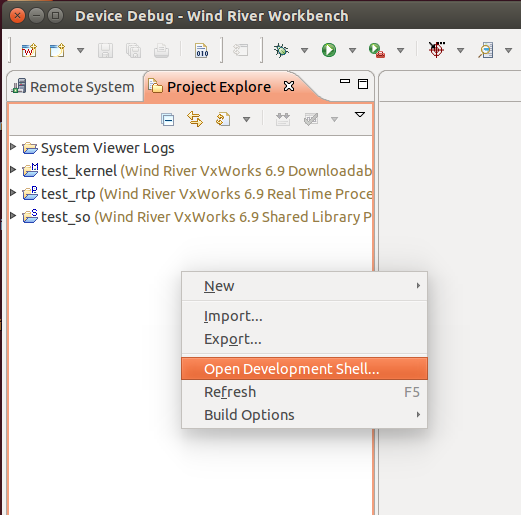

<br>
<a>No English version available.
</a>

<!-- Title: VxWorksへのインストール -->
#contents


## VxWorks

VxWorksはウインドリバー社が開発している組込みシステム向けリアルタイムOSです。
規模の大きな商用リアルタイムOSで最も普及しているOSであり、比較的大型の機器で使用されています。
x86、PowerPC、SH-4、ARM、MIPS、SPARC等の様々なCPU上で動作可能です。
DO-178B規格とIEC61508規格に準拠しており、航空・宇宙等の幅広い分野で使われています。

## Wind River Workbench

Wind River WorkbenchはVxWorksのコンパイル、デバッグ等をGUIで実行する統合開発環境です。


このページではVxWorksにOpenRTM-aist(C++版)を導入する手順を説明します。

## 環境構築

ホストPCはUbuntu 14.04(もしくは16.04)を想定しています。
Windowsには今後対応する予定です。


ホストPCに以下のソフトウェアをインストールしてください。


- Wind River Workbench
  - [https://www.windriver.com/japan/](https://www.windriver.com/japan/)

ウインドリバー社から購入してインストールしてください。

Workbenchは32bit環境で動作するため、64bitのUbuntuの場合はi386版libc6パッケージをインストールしてください。

```
 sudo apt-get install libc6:i386 libncurses5:i386 libstdc++6:i386
```

- tclsh
- cmake
- subversion


以下のコマンドでインストールしてください。

```
 sudo apt-get install tclsh cmake subversion
```


- ORBexpress
  - http://www.soft-service.co.jp/product/orb/

ORBexpressを使用する場合のみ必要です。


## ビルド

ビルドはコマンドラインの操作により実行します。

Workbenchから、Project Exploreを右クリックして**Open Development Shell**からコマンドラインシェルを起動してください。

<br>

<div align="center"><a href="command-line.png"></a></div>

<br>


通常のUbuntuのターミナル上でビルドする場合は、以下の手順で環境変数を設定してください。
Workbenchで起動したコマンドラインシェルを用いる場合は環境変数は設定済みのため、次の手順に進んでください。

### 環境変数の設定
以下の環境変数を設定してください。

<table class="table-alt">
  <tr>
    <th>変数名</th>
    <th>例</th>
  </tr>
  <tr>
    <td>WIND_HOME</td>
    <td>/home/openrtm/WindRiver</td>
  </tr>
  <tr>
    <td>WIND_USR</td>
    <td>${WIND_HOME}/vxworks-6.9/target/usr</td>
  </tr>
  <tr>
    <td>WRVX_COMPBASE</td>
    <td>${WIND_HOME}/components</td>
  </tr>
  <tr>
    <td>WIND_BASE</td>
    <td>${WIND_HOME}/vxworks-6.9</td>
  </tr>
  <tr>
    <td>WIND_HOST_TYPE</td>
    <td>x86-linux2</td>
  </tr>
  <tr>
    <td>WIND_GNU_BASE</td>
    <td>${WIND_HOME}/gnu/4.3.3-vxworks-6.9/${WIND_HOST_TYPE}</td>
  </tr>
  <tr>
    <td>WIND_FOUNDATION_PATH</td>
    <td>${WIND_HOME}/workbench-3.3/foundation</td>
  </tr>
</table>


WIND_HOMEはWorkbenchをインストールしたディレクトリにより適宜変更してください。


```
 export WIND_HOME=/home/openrtm/WindRiver
 export WIND_USR=${WIND_HOME}/vxworks-6.9/target/usr
 export WRVX_COMPBASE=${WIND_HOME}/components
 export WIND_BASE=${WIND_HOME}/vxworks-6.9
 export WIND_HOST_TYPE=x86-linux2
 export WIND_GNU_BASE=${WIND_HOME}/gnu/4.3.3-vxworks-6.9/${WIND_HOST_TYPE}
 export WIND_FOUNDATION_PATH=${WIND_HOME}/workbench-3.3/foundation
```


コンパイラの実行のために共有ライブラリパスの設定を行ってください。

```
 export LD_LIBRARY_PATH=${WIND_HOME}/lmapi-5.0/x86-linux2/lib:${WIND_FOUNDATION_PATH}/${WIND_HOST_TYPE}/lib:${LD_LIBRARY_PATH}
```


### omniORBのビルド

omniORBを使用する場合は、omniORBのソースコードのビルドが必要になります。
omniORBを使用しない場合は、次の手順に進んでください。


#### ソースコード入手
以下のコマンドでomniORBのソースコードを入手してください。

```
 wget https://jaist.dl.sourceforge.net/project/omniorb/omniORB/omniORB-4.2.2/omniORB-4.2.2.tar.bz2
 tar xf omniORB-4.2.2.tar.bz2
```


#### 修正パッチ適用
VxWorks 6.6、6.9対応の修正パッチを適用します。

```
 wget http://svn.openrtm.org/omniORB/trunk/vxworks/omniORB-4.2.2-vxworks.patch
 patch -p1 -d omniORB-4.2.2 < omniORB-4.2.2-vxworks.patch
```

#### IDLコンパイラなどのビルド
IDLコンパイラなどはUbuntu上で動作する必要があります。
以下の手順でUbuntu用にomniORBをビルドしてください。

```
 cd omniORB-4.2.2
 mkdir build
 cd build
 ../configure
 make
 cd ..
```

#### クロスコンパイル
VxWorks用にomniORBをビルドします。

```
 sed -i '1s/^/platform = ${VXWORKS_PLATFORM}\n/' config/config.mk
 cd src
 make export
```


ただし、VXWORKS_PLATFORMには動作環境に合ったものを入力するようにしてください。


<table class="table-alt">
  <tr>
    <th>VXWORKS_PLATFORM</th>
    <th>CPU</th>
    <th>VxWorksの<br>バージョン</th>
    <th>実装方法</th>
  </tr>
  <tr>
    <td>powerpc_vxWorks_kernel_6.6</td>
    <td>PowerPC</td>
    <td>6.6</td>
    <td>カーネルモジュール</td>
  </tr>
  <tr>
    <td>powerpc_vxWorks_RTP_6.6</td>
    <td>PowerPC</td>
    <td>6.6</td>
    <td>RTP</td>
  </tr>
  <tr>
    <td>powerpc_vxWorks_kernel_6.9</td>
    <td>PowerPC</td>
    <td>6.9</td>
    <td>カーネルモジュール</td>
  </tr>
  <tr>
    <td>powerpc_vxWorks_RTP_6.9</td>
    <td>PowerPC</td>
    <td>6.9</td>
    <td>RTP</td>
  </tr>
  <tr>
    <td>simlinux_vxWorks_kernel_6.6</td>
    <td>Linux上のシミュレータ</td>
    <td>6.6</td>
    <td>カーネルモジュール</td>
  </tr>
  <tr>
    <td>simpentium_vxWorks_RTP_6.6</td>
    <td>Linux上のシミュレータ</td>
    <td>6.6</td>
    <td>RTP</td>
  </tr>
  <tr>
    <td>simlinux_vxWorks_kernel_6.9</td>
    <td>Linux上のシミュレータ</td>
    <td>6.9</td>
    <td>カーネルモジュール</td>
  </tr>
  <tr>
    <td>simpentium_vxWorks_RTP_6.9</td>
    <td>Linux上のシミュレータ</td>
    <td>6.9</td>
    <td>RTP</td>
  </tr>
</table>

※カーネルモジュールのビルドの場合にはネームサーバー等は生成しません。VxWorksでネームサーバーを起動する場合はRTPのビルドも行ってください。

### OpenRTM-aistのビルド

#### ソースコードの入手
以下のコマンドでソースコードを入手してください。

```
 svn co http://svn.openrtm.org/OpenRTM-aist/trunk/OpenRTM-aist/
```


#### コンパイル
以下のコマンドでコンパイルを開始します。

```
 cd OpenRTM-aist/
 python convert_character_code.py ./ vxworks euc_jp
 mkdir src/lib/coil/common/coil
 cp src/lib/coil/common/*.* src/lib/coil/common/coil/
 cp build/yat.py utils/rtm-skelwrapper/
 mkdir build_vxworks
 cd build_vxworks/
 cmake -DCMAKE_TOOLCHAIN_FILE=${TOOLCHAIN_FILE} -DVX_VERSION=${VX_VERSION} -DORB_ROOT=${ORB_ROOT} -DOMNI_VERSION=${OMNI_VERSION} -DCORBA=${CORBA} -DVX_CPU_FAMILY=${ARCH} ..
 make
```


CMakeのオプションには以下を指定してください。

<table class="table-alt">
  <tr>
    <th>TOOLCHAIN_FILE</th>
    <th>VxWorks 6.6(カーネルモジュール、PowerPC)の場合は<br><strong>../Toolchain-vxworks6.6-Linux.cmake</strong>、<br>それ以外の場合は<strong>../Toolchain-vxworks6.cmake</strong></th>
  </tr>
  <tr>
    <td>VX_VERSION</td>
    <td><strong>vxworks-6.6</strong>か<strong>vxworks-6.9</strong></td>
  </tr>
  <tr>
    <td>ORB_ROOT</td>
    <td>omniORBのディレクトリ(例：/home/openrtm/omniORB-4.2.2)</td>
  </tr>
  <tr>
    <td>VX_CPU_FAMILY</td>
    <td><strong>ppc</strong>(PowerPC)、<strong>simlinux</strong>(カーネルモジュール、シミュレータ)、<strong>simpentium</strong>(RTP、シミュレータ)</td>
  </tr>
  <tr>
    <td>OMNI_VERSION</td>
    <td>omniORBのバージョン(40、41、42)、omniORBを使用しない場合は不要</td>
  </tr>
  <tr>
    <td>CORBA</td>
    <td>omniORB、もしくはORBexpress</td>
  </tr>
</table>

※RTPの場合はcmakeコマンドに**-DRTP=ON**を追加する必要があります。


## 動作確認

ビルドが完了したら以下の手順で動作確認を行ってください。

<hr>

- [OpenRTM-aist動作確認(VxWorks、カーネルモジュール、シミュレータ利用の場合)](./test_vxworks_km_simulator)
- [OpenRTM-aist動作確認(VxWorks、RTP、シミュレータ利用の場合)](./test_vxworks_rtp_simulator)
- [OpenRTM-aist動作確認(VxWorks、カーネルモジュール、PowerPC搭載ボード利用の場合)](./test_vxworks_km_ppcboard)
- [OpenRTM-aist動作確認(VxWorks、RTP、PowerPC搭載ボード利用の場合)](./test_vxworks_rtp_ppcboard)

