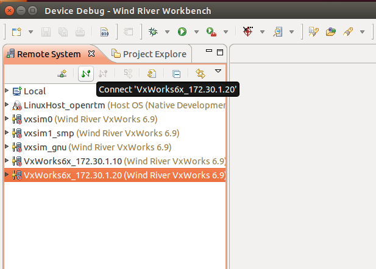
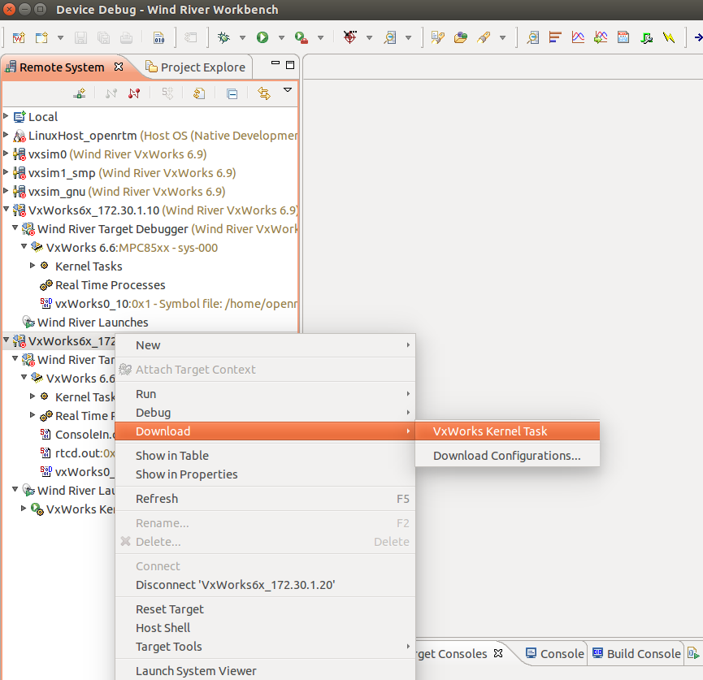
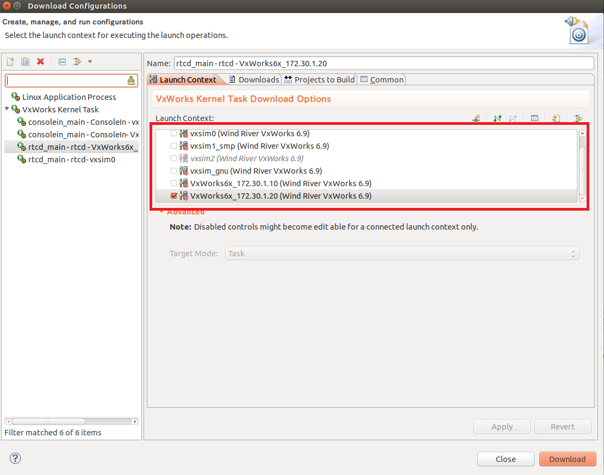
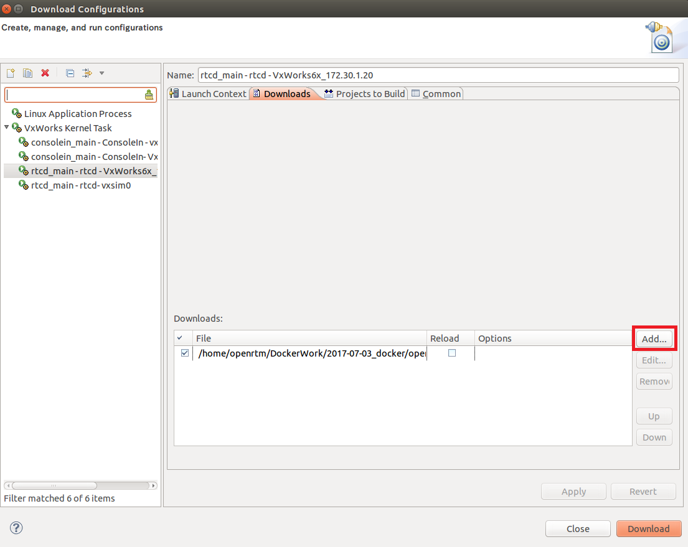
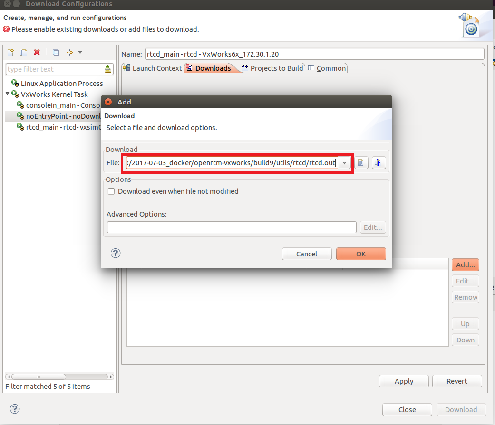
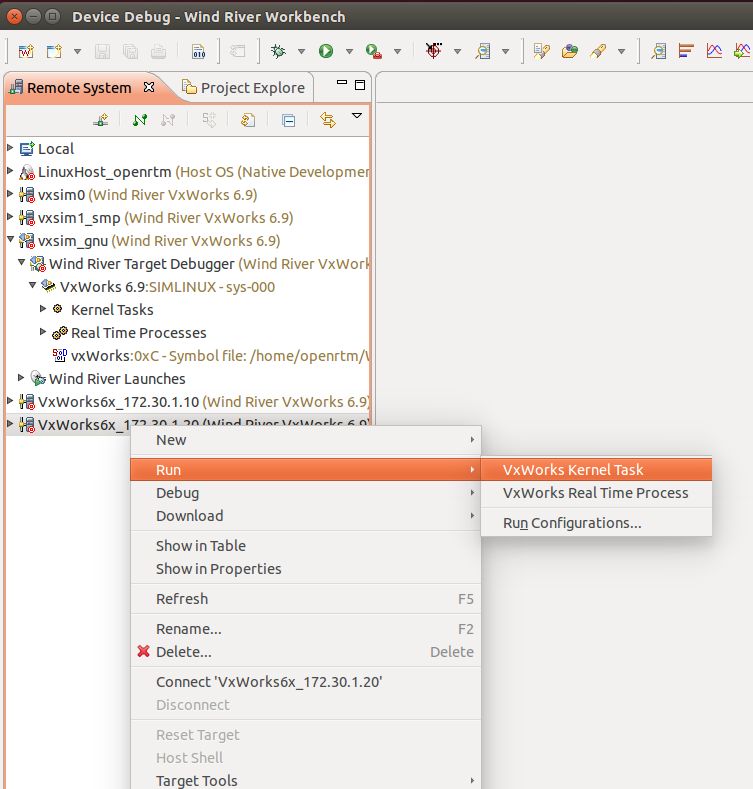
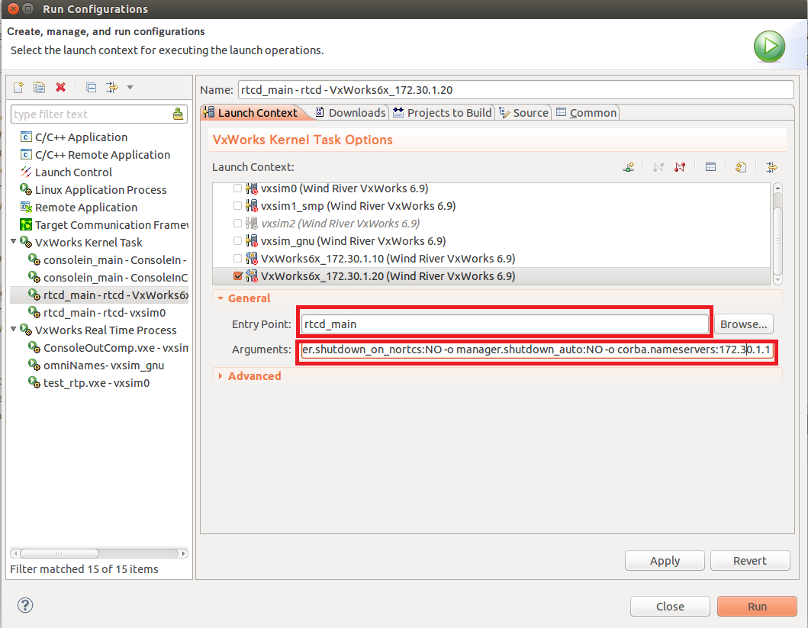
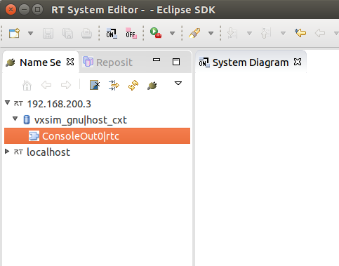
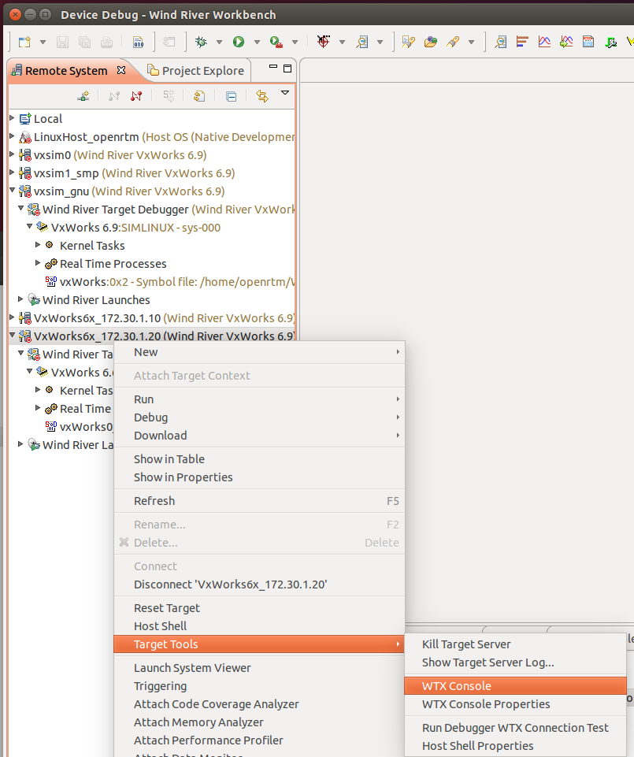

-------jp page!!-------

init
<!-- Title: OpenRTM-aist動作確認(VxWorks、カーネルモジュール、PowerPC搭載ボード利用の場合) -->
#contents


このページでは、PowerPCボード上でVxWorks用にビルドしたRTCのカーネルモジュールの動作確認を行う手順を説明します。


## WorkbenchとVxWorksとの接続

以下の手順でWorkbenchとVxWorksの接続を生成してください。

- [VxWorksターゲットサーバ－接続の生成手順](/ja/node/6379)

WorkbenchのRemote Systemでターゲットサーバを選択後にconnect 'xxxxx'ボタンを押すとVxWorksと接続します。


<br>

<div align="center"><a href="target02.png"></a></div>

<br>


## カーネルモジュールのロード

WorkbenchのRemote Systemでターゲットサーバを右クリックして、**Download**→**VxWorks Kernel Task**を選択してください。

<br>

<div align="center"><a href="server1.png"></a></div>

<br>


Download ConfigurationsウインドウのLaunch Contextタブから、ダウンロードするシステムにターゲットサーバを選択してください。


<br>

<div align="center"><a href="server5.png"></a></div>

<br>


Downloadsタブからダウンロードするモジュールを設定します。
Addボタンをクリックしてください。


<br>

<div align="center"><a href="server6.png"></a></div>

<br>


Addウインドウでrtcd.outのパスを設定後、OKボタンをクリックしてください。
rtcd.outはOpenRTM-aistのビルドディレクトリのutils/rtcd以下に生成されています。

- 例：/home/openrtm/OpenRTM-aist/build_vxworks/utils/rtcd/rtcd.out


<br>

<div align="center"><a href="server3.png"></div>

<br>

Downloadボタンをクリックするとダウンロードを開始します。

<br>

<div align="center"><a href="download.png"></a></div>

<br>


起動するRTCのカーネルモジュールについても同様の手順でダウンロードしてください。

- 例(ConsoleIn)：/home/openrtm/OpenRTM-aist/build_vxworks/examples/SimpleIO/ConsoleIn.out
- 例(ConsoleOut)：/home/openrtm/OpenRTM-aist/build_vxworks/examples/SimpleIO/ConsoleOut.out


## RTC実行

### マネージャ起動

WorkbenchのRemote Systemでターゲットサーバを右クリックして、**Run**→**VxWorks Kernel Task**を選択してください。

<br>

<div align="center"><a href="server2.png"></a></div>

<br>


Run Configurationsウインドウで各種設定を行います。
Entry Pointには**rtcd_main**と入力してください。
Argumentsには**"-o manager.shutdown_on_nortcs:NO -o manager.shutdown_auto:NO -o corba.nameservers:172.30.1.1"**を設定してください。ネームサーバーはVxWorksでは起動しないため、Ubuntu上のネームサーバーにRTCを登録します。
※ORBexpressを使用する場合はエンドポイントの設定**corba.endpoints:172.30.1.20:1234**も追加してください。
Runボタンを押すとマネージャが起動します。
IPアドレスは適宜変更してください。


<br>

<div align="center"><a href="server4.png"></a></div>

<br>


### RTCの起動
マネージャの起動と同様の手順で起動します。
Entry PointにはRTCを起動する関数を指定します。

- 例(ConsoleIn)：consolein_main
- 例(ConsoleOut)：consoleout_main


Argumentsには何も入力しなくても大丈夫です。

Ubuntuで起動したRTシステムエディタでRTCが起動したかを確認してください。


起動したRTCが登録されているかを確認してください。


<br>

<div align="center"><a href="ns3.png"></a></div>

<br>

RTCの接続、アクティブ化等の手順はUbuntuで動作確認する場合と同じです。


- [動作確認 (Linux編)](/ja/node/789)

ただしORBexpressを使用した場合にはデータポートのコネクタ接続時にエンディアンをbigに設定する必要があります。


### コマンドラインによる操作について

ターゲットサーバ接続後にWTX Consoleウインドウからコマンド入力ができます。


<br>

<div align="center"><a href="target03.png"></a></div>

<br>

以下のコマンドでRTCの動作確認ができます。
Workbench、omniORB、openRTM-aistのパス、UbuntuのIPアドレスは適宜変更してください。


```
 cd "/home/openrtm/openrtm-build/OpenRTM/OpenRTM_69_kernel_sim/OpenRTM-aist/build_vxworks/utils/rtcd"
 ld<rtcd.out
 cd "/home/openrtm/openrtm-build/OpenRTM/OpenRTM_69_kernel_sim/OpenRTM-aist/build_vxworks/examples/SimpleIO"
 ld<ConsoleIn.out
 
 taskSpawn "rtcd_main",100,67108864,1000000,rtcd_main,"-o","manager.shutdown_on_nortcs:NO","-o","manager.shutdown_auto:NO","-o","corba.nameservers:172.30.1.1"
 taskSpawn "consolein_main",100,0,1000000,consolein_main
```
-------jp page!!-------
