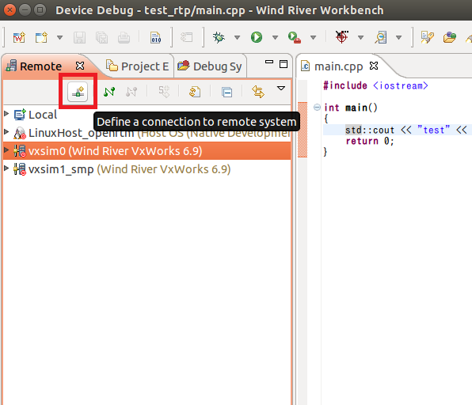
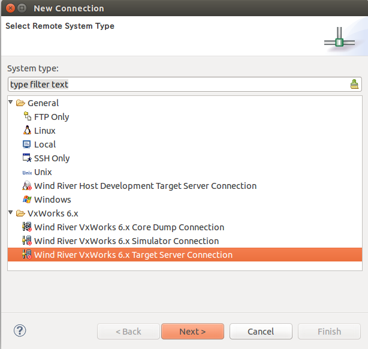
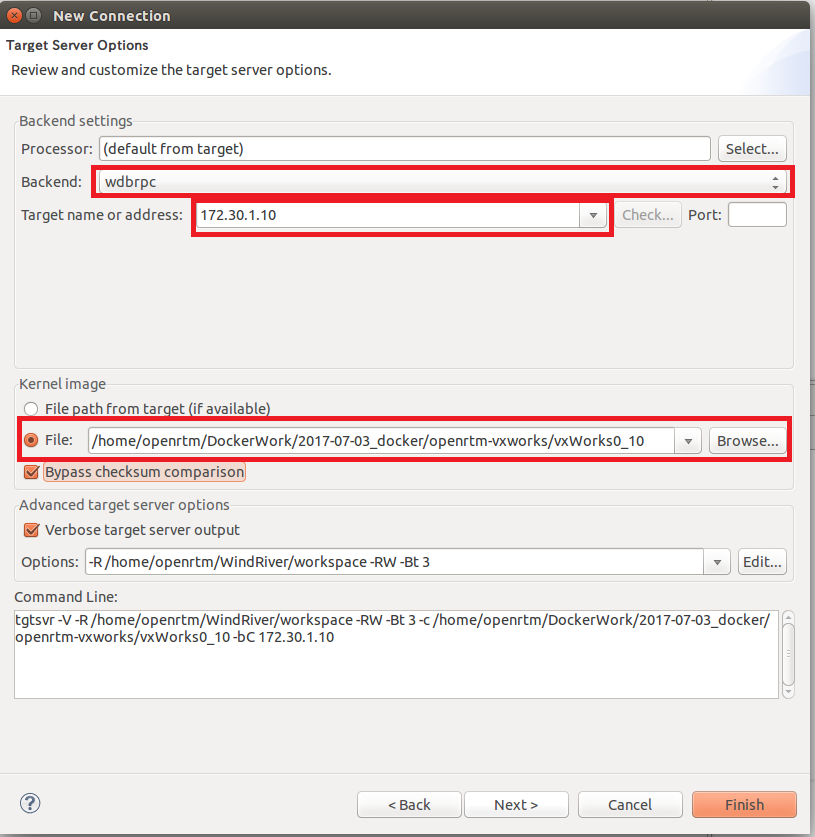

<!-- Title: Creating a VxWorks Target Server Connection -->
#contents

This page describes how to create a connection between Wind River Workbench and a VxWorks target server.

## Adding a Target Server

Click the **Define a connection to remote system** button to add a target server connection.

 

 

In the **New Connection** window, select **"Wind River VxWorks 6.x Target Server Connection"** from **Select Remote System Type**, and then click **Next**.

 

 

Configure the following settings in **Target Server Options**.

<table class="table-alt">
  <tr>
    <th>Option</th>
    <th>Setting</th>
  </tr>
  <tr>
    <td>Backend</td>
    <td>wdbrpc</td>
  </tr>
  <tr>
    <td>Target name or address</td>
    <td>IP address (for example: 172.30.1.10)</td>
  </tr>
  <tr>
    <td>Kernel Image</td>
    <td>Select <strong>File</strong>, then specify the path to the VxWorks kernel image file.</td>
  </tr>
</table>

 

 

Click the **Finish** button to create the connection to the target server.

