<!-- Title: OpenRTM-aist動作確認(VxWorks、カーネルモジュール、シミュレータ利用の場合) -->
#contents

このページでは、Workbenchのシミュレータを用いてVxWorks用にビルドしたRTCのカーネルモジュールの動作確認を行う手順を説明します。


## シミュレータの設定

以下の手順でシミュレータの設定を行ってください。

- [VxWorksシミュレータの設定](/ja/node/6378)

## シミュレータの接続

WorkbenchのRemote Systemでシミュレータを選択後にconnect 'xxxxx'ボタンを押すとシミュレータと接続します。


<br>

<div align="center"><a href="sim5.png">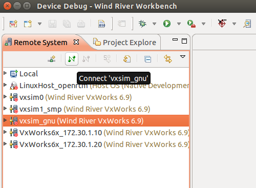</a></div>

<br>


## カーネルモジュールのロード

WorkbenchのRemote Systemでシミュレータを右クリックして、**Download**→**VxWorks Kernel Task**を選択してください。

<br>

<div align="center"><a href="load_module.png">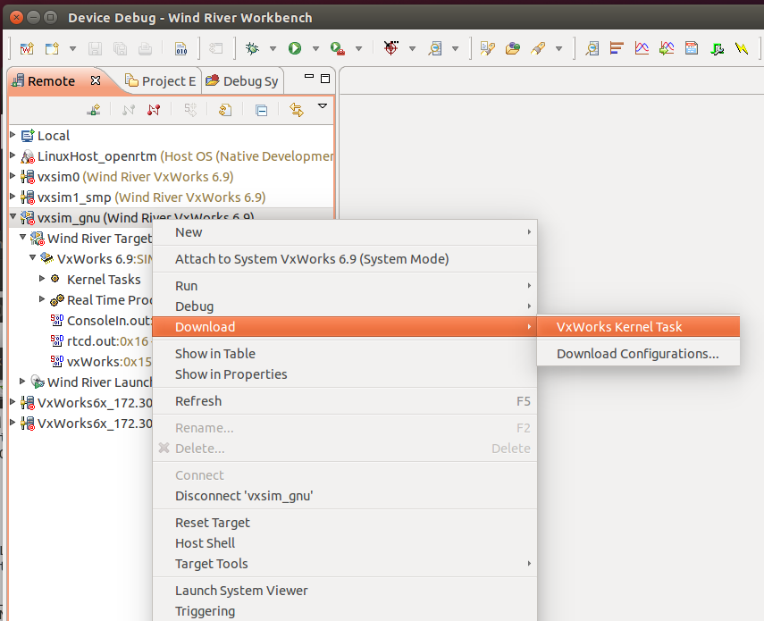</a></div>

<br>


Download ConfigurationsウインドウのLaunch Contextタブから、ダウンロードするシステムにシミュレータを選択してください。


<br>

<div align="center"><a href="Launch_context.png">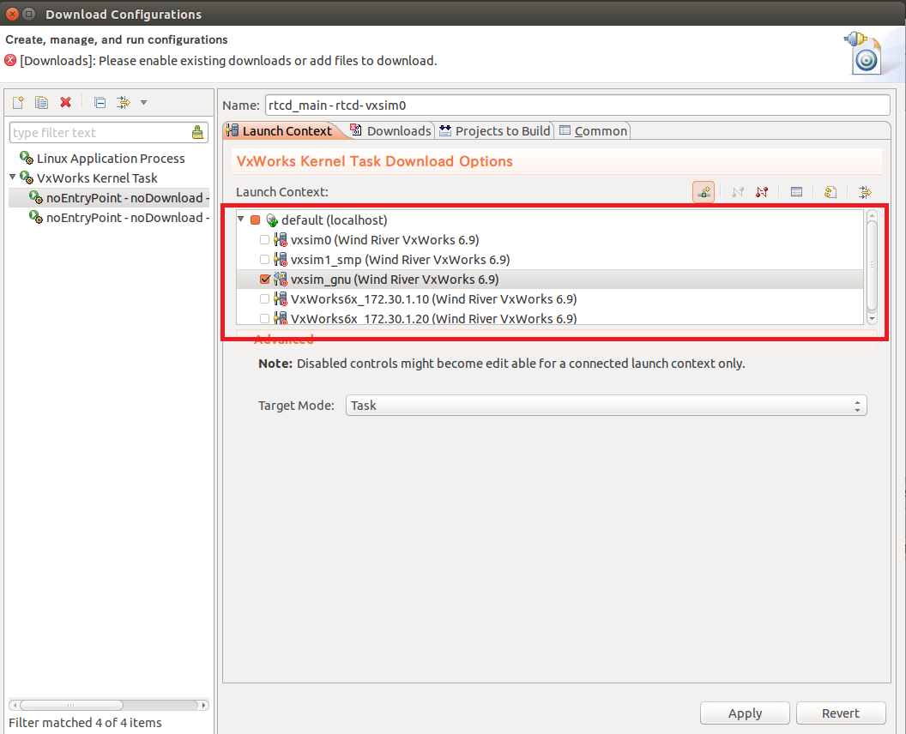</a></div>

<br>


Downloadsタブからダウンロードするモジュールを設定します。
Addボタンをクリックしてください。


<br>

<div align="center"><a href="downloads.png">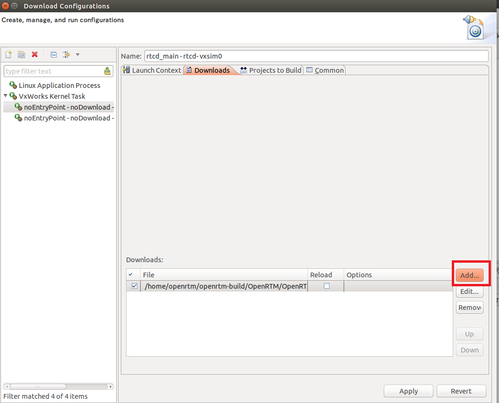</a></div>

<br>


Addウインドウでrtcd.outのパスを設定後、OKボタンをクリックしてください。
rtcd.outはOpenRTM-aistのビルドディレクトリのutils/rtcd以下に生成されています。

- 例：/home/openrtm/OpenRTM-aist/build_vxworks/utils/rtcd/rtcd.out


<br>

<div align="center"><a href="downloads2.png">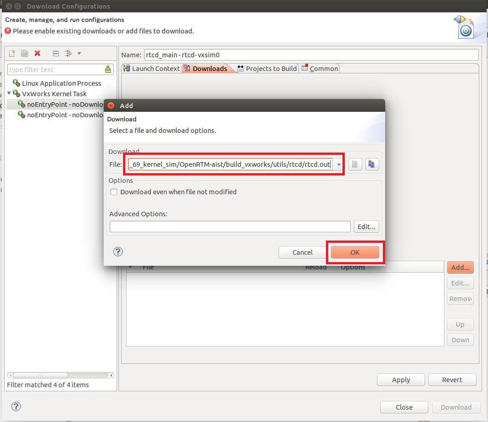</a></div>

<br>

Downloadボタンをクリックするとダウンロードを開始します。

<br>

<div align="center"><a href="download.png">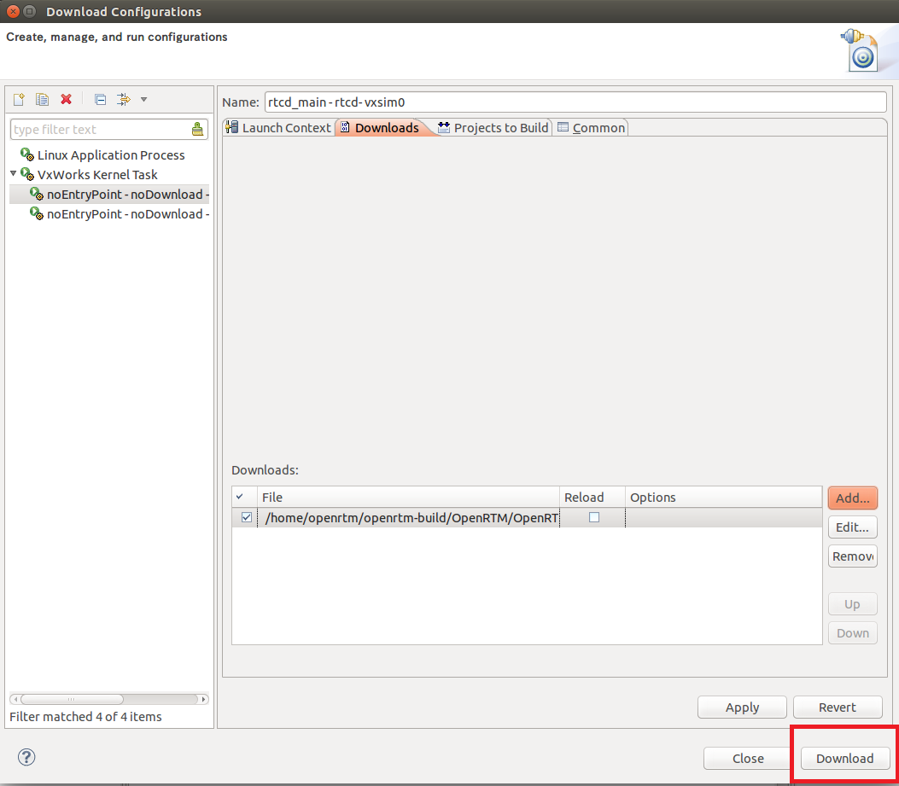</a></div>

<br>


起動するRTCのカーネルモジュールについても同様の手順でダウンロードしてください。

- 例(ConsoleIn)：/home/openrtm/OpenRTM-aist/build_vxworks/examples/SimpleIO/ConsoleIn.out
- 例(ConsoleOut)：/home/openrtm/OpenRTM-aist/build_vxworks/examples/SimpleIO/ConsoleOut.out


## RTC実行
### ネームサーバー起動
VxWorksシミュレータ上にネームサーバーを起動します。
ネームサーバーはリアルタイムプロセス(RTP)として起動するため、Remote Systemsからシミュレータを右クリックして**Run**→**VxWorks Real Time Process**をクリックしてください。

<br>

<div align="center"><a href="rtp.png">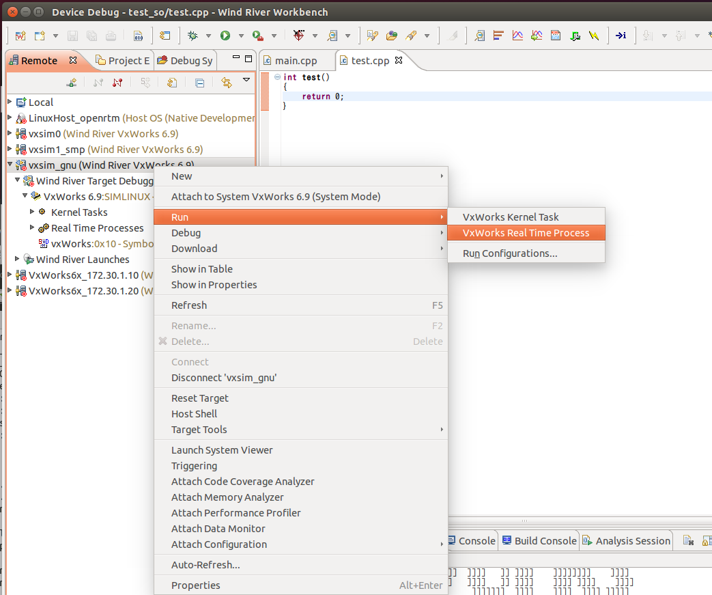</a></div>

<br>


Run ConfigurationsウインドウのLaunch Contextタブから各種設定を行ってください。

- 実行するシステムをシミュレータに設定
- omniNames.outのパス設定
- コマンドライン引数の設定

omniNames.outはomniORBの**RTPのビルドディレクトリ**に生成されています。
カーネルモジュールのビルドディレクトリには生成されないため、omniORBはRTPについてもビルドを行ってください。
共有ライブラリのパスに**libc.so.1**が無い場合はエラーとなるため、WorkbenchからomniNames.outのディレクトリにコピーしてください。

```
 cp $WIND_BASE/target/lib/usr/root/SIMPENTIUMgnu/bin/libc.so.1 /home/openrtm/omniORB-4.2.2/bin/simpentium_vxWorks_RTP_6.9/
```

RTPについてビルドできない場合は、VxWorksでネームサーバーは起動せずにUbuntu上のネームサーバーにRTCを登録するようにしてください。

- 例：/home/openrtm/omniORB-4.2.2/bin/simpentium_vxWorks_RTP_6.9/omniNames.out

Argumentsにはネームサーバーのポート番号を指定します。

- 例：-start 2809

設定が完了後にRunボタンをクリックするとネームサーバーが起動します。


<br>

<div align="center"><a href="nameserver.png">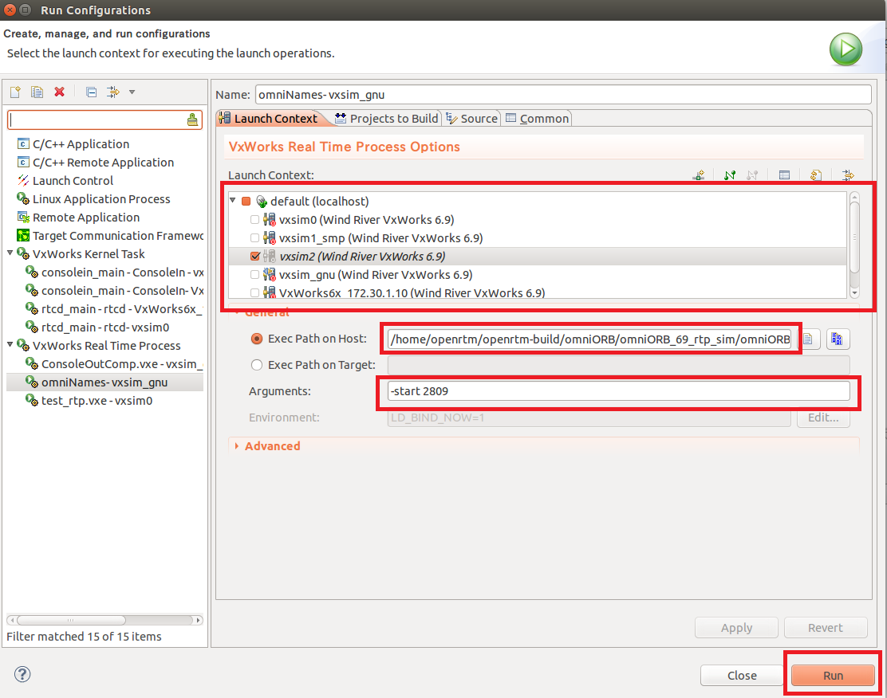</a></div>

<br>


### マネージャ起動

WorkbenchのRemote Systemでシミュレータを右クリックして、**Run**→**VxWorks Kernel Task**を選択してください。

<br>

<div align="center"><a href="run_task.png">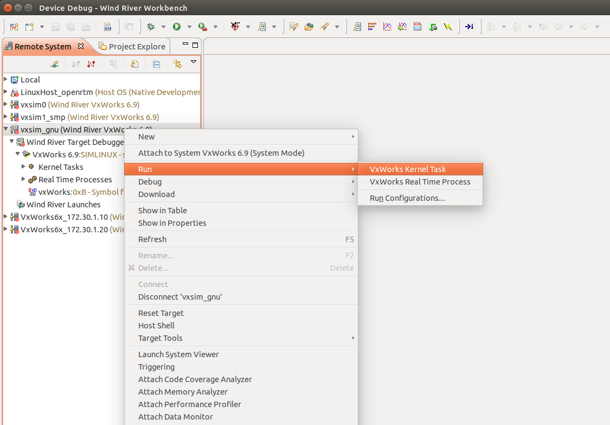</a></div>

<br>


Run Configurationsウインドウで各種設定を行います。
Entry Pointには**rtcd_main**と入力してください。
Argumentsには**"-o manager.shutdown_on_nortcs:NO -o manager.shutdown_auto:NO"**を設定してください。
Runボタンを押すとマネージャが起動します。

※Ubuntu側のネームサーバーを起動する場合は、Argumentsに**-o corba.nameservers:192.168.200.254**を追加してください。
Ubuntuのtap0インターフェースのIPアドレスは適宜確認してください。


<br>

<div align="center"><a href="run_task2.png">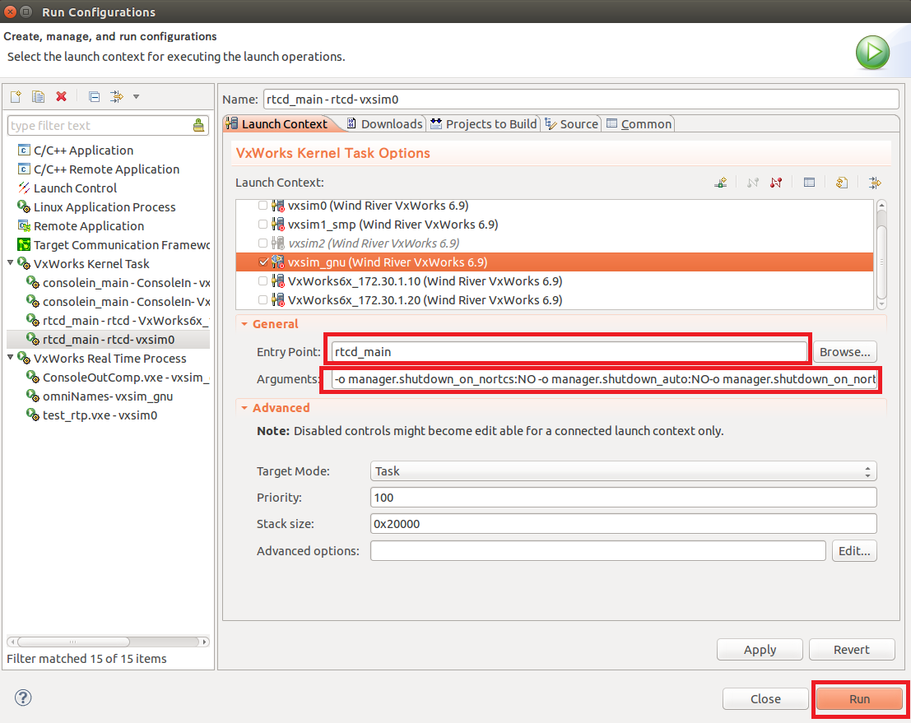</a></div>

<br>


### RTCの起動
マネージャの起動と同様の手順で起動します。
Entry PointにはRTCを起動する関数を指定します。

- 例(ConsoleIn)：consolein_main
- 例(ConsoleOut)：consoleout_main


Argumentsには何も入力しなくても大丈夫です。

Ubuntuで起動したRTシステムエディタでRTCが起動したかを確認してください。
VxWorksのネームサーバーにはネームサービス接続ボタンをクリック後、表示されたウインドウでIPアドレスを指定してOKをクリックすると接続します。


<br>

<div align="center"><a href="ns1.png">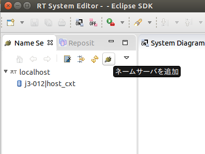</a></div>

<br>


<br>

<div align="center"><a href="ns2.png">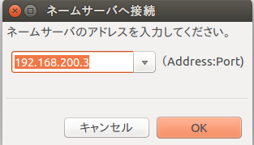</a></div>

<br>


起動したRTCが登録されているかを確認してください。


<br>

<div align="center"><a href="ns3.png"></a></div>

<br>

RTCの接続、アクティブ化等の手順はUbuntuで動作確認する場合と同じです。


- [動作確認 (Linux編)](/ja/node/789)


### コマンドラインによる操作について

シミュレータ接続後にTarget Consoleウインドウからコマンド入力ができます。


<br>

<div align="center"><a href="sim6.png">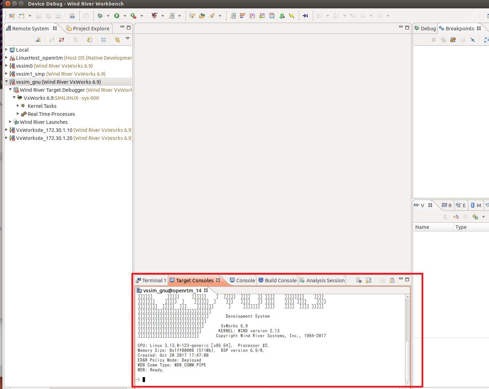</a></div>

<br>

以下のコマンドでRTCの動作確認ができます。
Workbench、omniORB、openRTM-aistのパスは適宜変更してください。

```
 cd "/home/openrtm/openrtm-build/omniORB/omniORB_69_rtp_sim/omniORB-4.2.2/bin/simpentium_vxWorks_RTP_6.9"
 cp "/home/openrtm/WindRiver/vxworks-6.9/target/lib/usr/root/SIMPENTIUMgnu/bin/libc.so.1","./"
 rtpSp "./omniNames.out -start 2809"
 
 cd "/home/openrtm/openrtm-build/OpenRTM/OpenRTM_69_kernel_sim/OpenRTM-aist/build_vxworks/utils/rtcd"
 ld<rtcd.out
 cd "/home/openrtm/openrtm-build/OpenRTM/OpenRTM_69_kernel_sim/OpenRTM-aist/build_vxworks/examples/SimpleIO"
 ld<ConsoleIn.out
 
 taskSpawn "rtcd_main",100,67108864,1000000,rtcd_main,"-o","manager.shutdown_on_nortcs:NO","-o","manager.shutdown_auto:NO"
 taskSpawn "consolein_main",100,0,1000000,consolein_main
```
