init
https://openrtm.org/openrtm/ja/node/6026/
<!-- Title: 10分で始めよう！ -->
#contents
最新バージョン OpenRTM-aist-1.1.2-RELEASE では C++版、Python版、Java版を一度にインストールできるようになりました。
また、これまで別途インストールしていた rtshell も同時にインストール可能になりました。

## Python 2.7 インストール

Python 2.7 をインストールしていない場合は、OpenRTM-aist はインストールできません。先に Python2.7 をインストールしてください。

インストールの際は、「Add python.exe to Path」の設定を変更し、「Will be installed on local hard drive」を選択してください。<br>
こうすると、python.exe と Scripts に PATH を通してくれます。　（例：Path=C:\Python27\;C:\Python27\Scripts;...）

<div align="center"><a href="python27_install.jpg">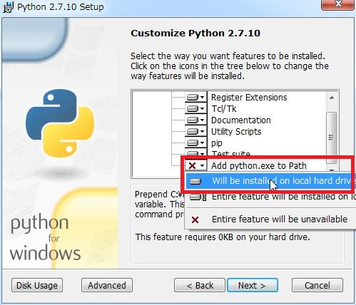</a></div>
<br>
<br>

## OpenRTM-aist インストール
ここでは32bit用インストーラー OpenRTM-aist-1.1.2-RELEASE_x86.msi を使った手順を紹介します。
インストーラーのダウンロードは、[OpenRTM-aist-1.1.2-RELEASE](/ja/node/6034) をご覧ください。


1. インストーラーを起動し、[次へ] をクリックします。
<br>
<br>

<div align="center"><a href="install1.png">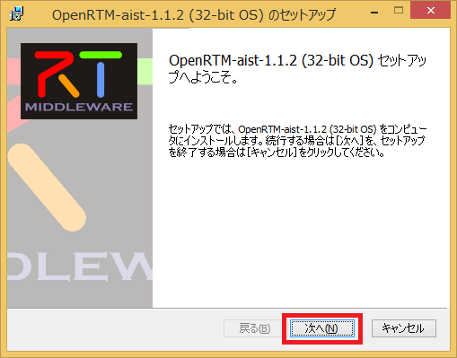</a></div>
<br>
<br>

1. 使用承諾契約書のページです。ソフトウェアライセンス条項に同意して、[次へ] をクリックします。
<br>
<br>

<div align="center"><a href="install2.png">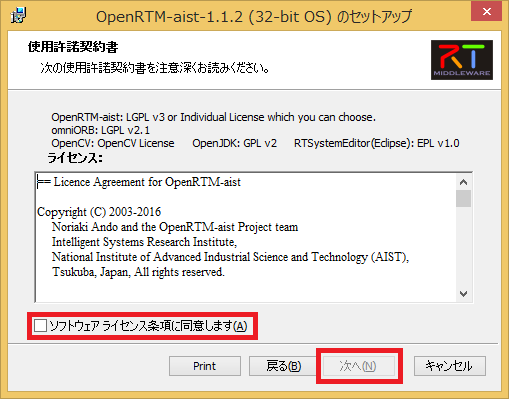</a></div>
<br>
<br>

1. インストールの種類を選択します。どちらかを選択して、[次へ] をクリックします。
<br>
<br>

<div align="center"><a href="install3.png">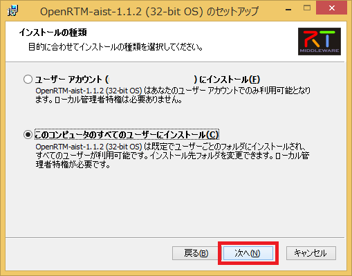</a></div>
<br>
<br>

1. セットアップの種類を選択します。[標準] を選択した場合、OpenRTM-aist の C++版、Java版、Python版、OpenRTP、RTSystemEditorRCP、rtshell、OpenRTM-aist-C++版の Visual Studio 2008 から 2015 までのランタイムライブラリ、OpenRTM-aist-1.0.0 から 1.1.1 までのランタイムライブラリがインストールされます。特に変更理由がないようであれば、[標準] をクリックします。
<br>
<br>

<div align="center"><a href="install4.png">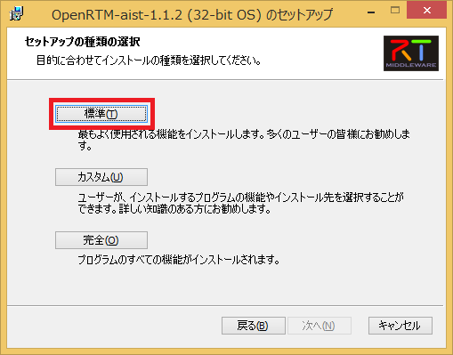</a></div>
<br>
<br>

1. [インストール] をクリックするとインストールが開始します。
<br>
<br>

<div align="center"><a href="install5.png">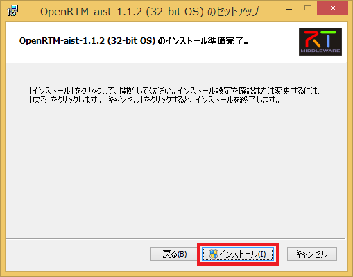</a></div>
<br>
<br>

<br>
<br>

<div align="center"><a href="install6.png">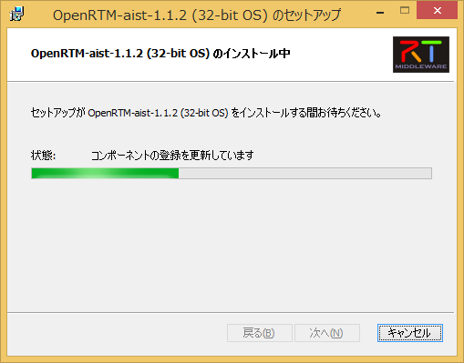</a></div>
<br>
<br>

1. インストールが終了しました。[完了] をクリックしてインストーラーを終了します。
<br>
<br>

<div align="center"><a href="install7_0.png">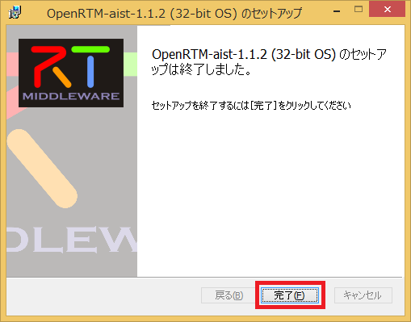</a></div>
<div align="center"><strong>インストール終了画面</strong></div>
<br>
<br>

※使用している Visual Studio のバージョンが2013(vc12)以外の場合は、環境変数の RTM_VC_VERSION を変更してください。


## サンプルコンポーネントを実行する
必須ではありませんが、ここからはスタートメニューに登録されたアプリケーションを多数起動します。毎回スタートメニューから順番にたどるのは大変ですので、

<br>

<div align="center"><a href="install8.png">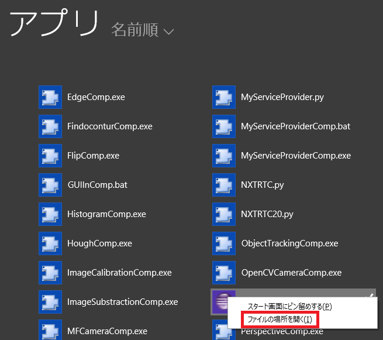</a></div>
<div align="center"><strong>ファイルの場所を開く</strong></div>
<br>

スタート画面の左下隅の矢印からアプリビューを表示して、OpenRTM-aist-1.1.2 の OpenRTP で右クリックし、[ファイルの場所を開く] を選択してください。

そして1つ上のフォルダーに移動してください。


<br>

<div align="center"><a href="install31.png">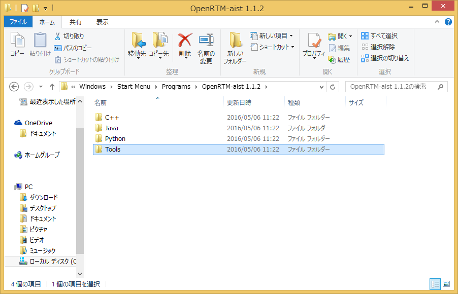</a></div><br>
<div align="center"><strong>スタートメニューフォルダー</strong></div>
<br>
<br>


このように、スタートメニューのフォルダーが開かれ、様々なアプリケーションにアクセスしやすくなります。
では、インストールされたサンプルコンポーネントを実行してみます。

### ConsoleInComp、ConsoleOutCompを使用する
ConsoleInComp、ConsoleOutComp は DataInPort、DataOutPort の使用方法を示したサンプルです。ConsoleIn 側で入力した数字が，ConsoleOut 側に表示されます。


#### rtm-naming起動

[OpenRTM-aist 1.1.2] > [Tools] の Start Naming Service をクリックして起動します。
<br>

<div align="center"><a href="install30.png">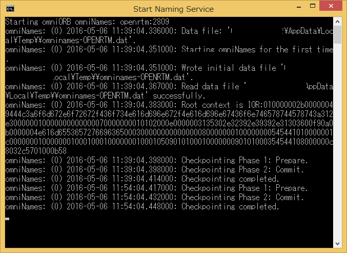</a></div><br>
<div align="center"><strong>Start Naming Service</strong></div>
<br>
<br>

#### サンプルコンポーネント起動

[OpenRTM-aist 1.1.2] > [C++] > [Components] > [Examples] の ConsoleInComp.exe と ConsoleOutComp.exe をクリックするとコンソール画面が起動します。 
<br>

<div align="center"><a href="install29.png">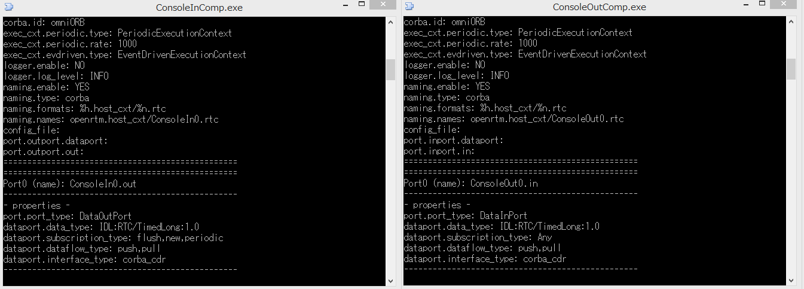</a></div><br>
<div align="center"><strong>ConsoleInComp.exe</strong>と<strong>ConsoleOutComp.exe</strong></div>
<br>
<br>


&aname(openrtp_start);
#### OpenRTP起動
ここから OpenRTP を操作します。[OpenRTM-aist 1.1.2] > [Tools] の OpenRTP をクリックして起動します。 
ワークスペースは適当な場所を指定してください。

<br>

<div align="center"><a href="install40.png"></a></div><br>
<div align="center"><strong>ワークスペースの選択</strong></div>
<br>
<br>

「ようこそ」画面は今のところ必要ないので左上の [ようこそ] タブの [×] ボタンをクリックして画面を閉じてください。


<br>

<div align="center"><a href="install41.png"></a></div><br>
<div align="center"><strong>初期起動時の画面</strong></div>
<br>
<br>


右上の「パースペクティブを開く」をクリックし、「RT System Editor」を選択することで、RTSystemEditor が起動します。 

<br>

<div align="center"><div align="center"><a href="install42.png"></a></div>;  <div align="center"><a href="install43.png">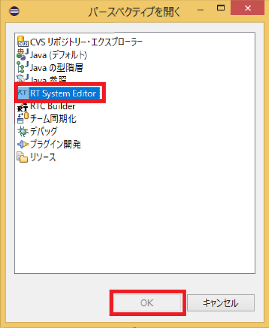</a></div>;</div>
<div align="center"><strong>パースペクティブの切り替え</strong></div>
<br>
<br>


※NameServerView にネームサーバーが表示されない時は、手動で localhost を追加します。画像の [ネームサーバの追加] をクリックしダイアログを表示します。localhost と入力し、[OK] をクリックして追加します。 

<br>

<div align="center"><a href="install44.png">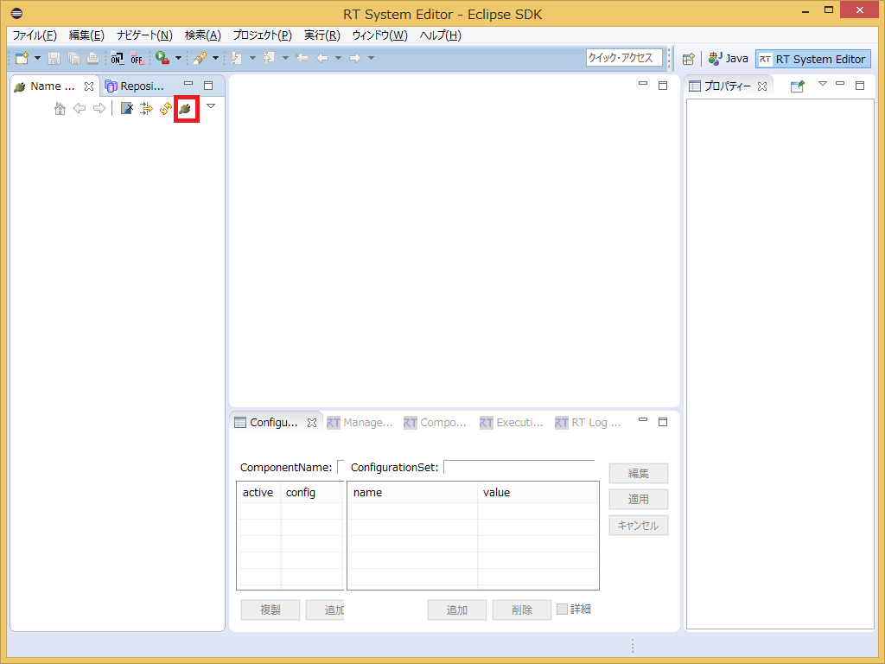</a></div><br>
<div align="center"><strong>ネームサーバの追加</strong></div>
<br>
<br>


NameServiceView にコンポーネントが表示されます。最初は折りたたまれて非表示です。[>] をクリックし展開すると、ConsoleInComp、ConsoleOutCompコンポーネントを確認できます。 

<br>

<div align="center"><a href="install45.png">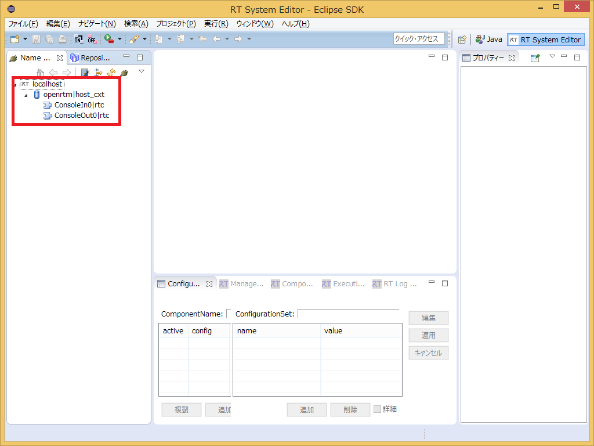</a></div><br>
<div align="center"><strong>コンポーネント起動確認</strong></div>
<br>
<br>


[OpenNewSystemEditor] をクリックして、SystemDiagram を表示します。 

<br>

<div align="center"><a href="install46.png">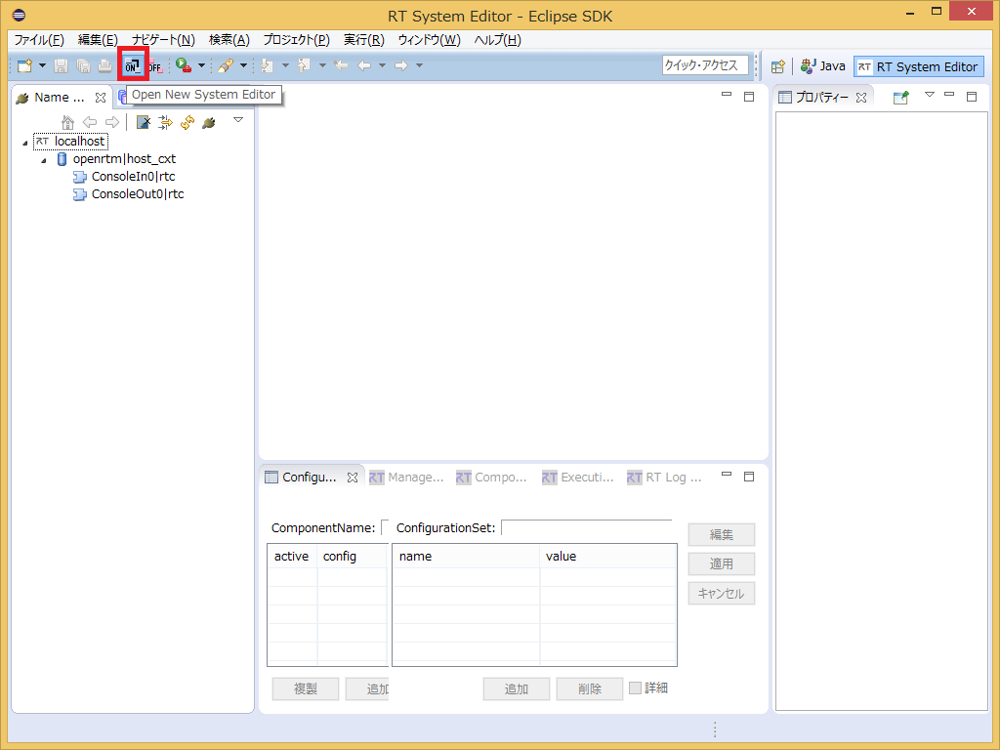</a></div><br>
<div align="center"><strong>SystemDiagramを表示</strong></div>
<br>
<br>

NameServiceView のコンポーネントをシステム・ダイアグラムにドラッグ＆ドロップすると画像のように表示されます。 

<br>

<div align="center"><a href="install47.png">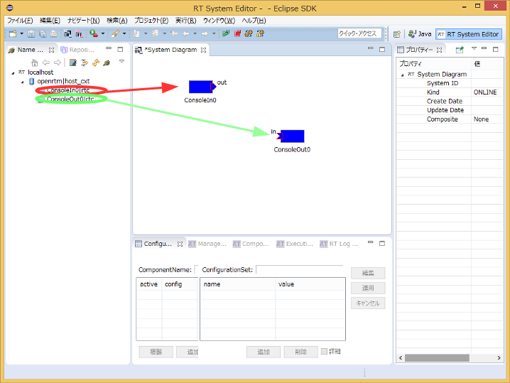</a></div><br>
<div align="center"><strong>コンポーネントをドラッグ＆ドロップ</strong></div>
<br>
<br>

コンポーネントを接続します。データポート間でドラッグ＆ドロップ後、接続に必要な情報の入力を促すダイアログが表示されるので、[OK] をクリックします。 

<br>

<div align="center"><div align="center"><a href="install48.png">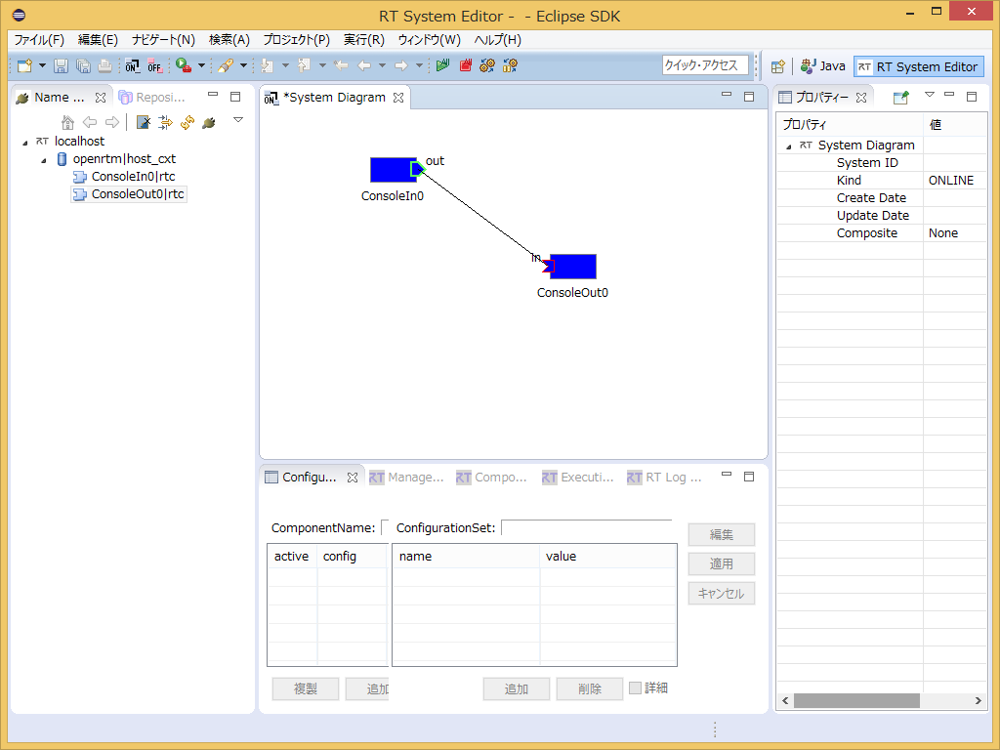</a></div>;  <div align="center"><a href="install49.png">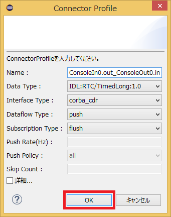</a></div>;</div>
<div align="center"><strong>コンポーネント接続</strong></div>
<br>
<br>


接続が完了しました。 


<br>

<div align="center"><a href="install50.png">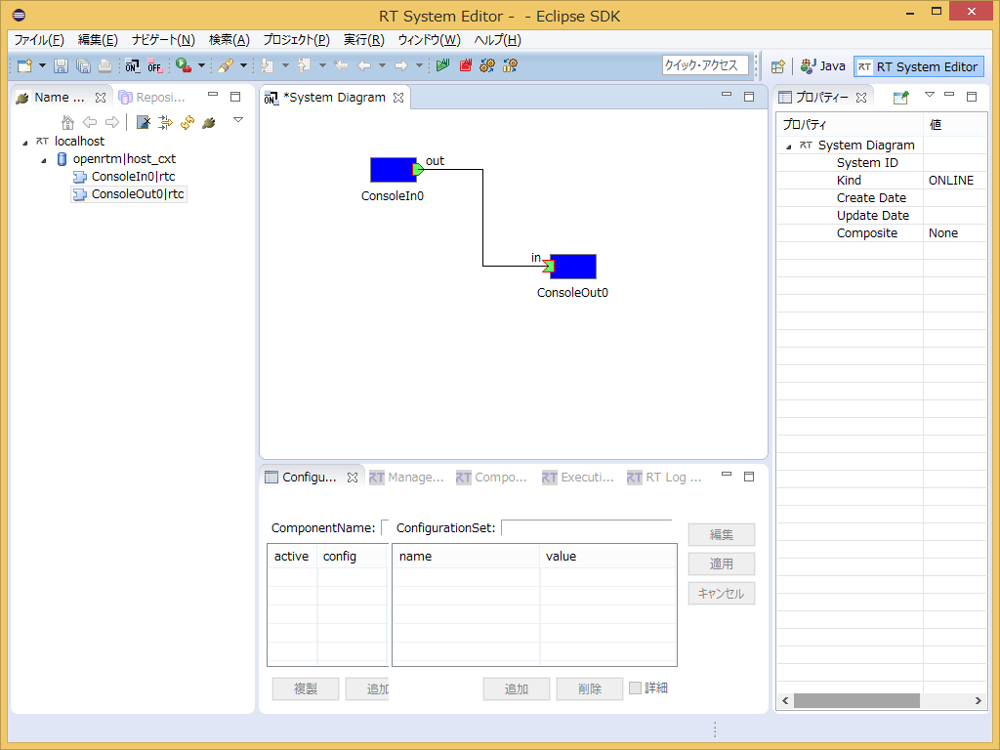</a></div><br>
<div align="center"><strong>接続完了</strong></div>
<br>
<br>

コンポーネントの状態を Activate にします。[All Activate] クリックしてください。コンポーネントの色が青から明るい緑に変わったら成功です。コンポーネントは個別に選択して Activate にすることも可能です。 

<br>

<div align="center"><div align="center"><a href="install51.png">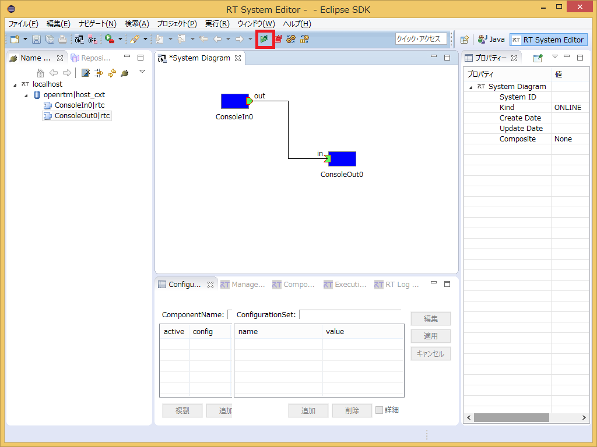</a></div>;  <div align="center"><a href="install52.png">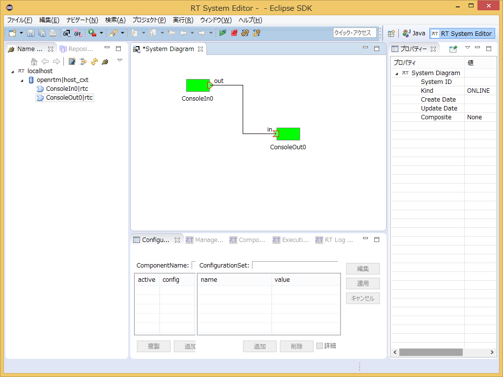</a></div>;</div>
<div align="center"><strong>Activate完了</strong></div>
<br>
<br>


次にコンソール画面で動作確認します。RTSystemEditor で接続後、ConsoleInComp.exe コンソールに、「Please input number:」と表示されます。 

<br>

<div align="center"><a href="install24.png">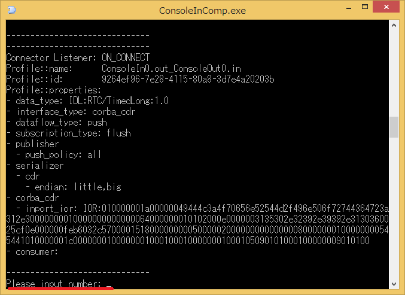</a></div><br>
<div align="center"><strong>ConsoleInComp.exe</strong>と<strong>ConsoleOutComp.exe</strong></div>
<br>
<br>


ConsoleInComp.exe コンソール画面を選択し、数値を入力し [Enter] を押すと、ConsoleOutComp.exe コンソールに数値が表示されます。 

<br>

<div align="center"><div align="center"><a href="install25.png">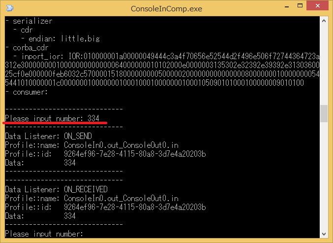</a></div>;  <div align="center"><a href="install26.png">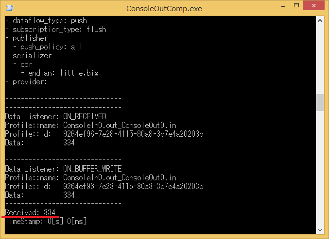</a></div>;</div>
<div align="center"><strong>動作確認</strong></div>
<br>
<br>

※数値以外の入力や、大きすぎる数値を入力するとエラー(赤)になります。
※コンポーネントがエラーを起こしたら、RTSystemEditor でコンポーネントを右クリックして Reset を選択してください。


以上で ConsoleInComp.exe と ConsoleOutComp.exe を使用した動作確認は終了です。コンポーネントを終了する場合は、Deactivate してから Exit して下さい。 

<br>

<div align="center"><a href="install53.png">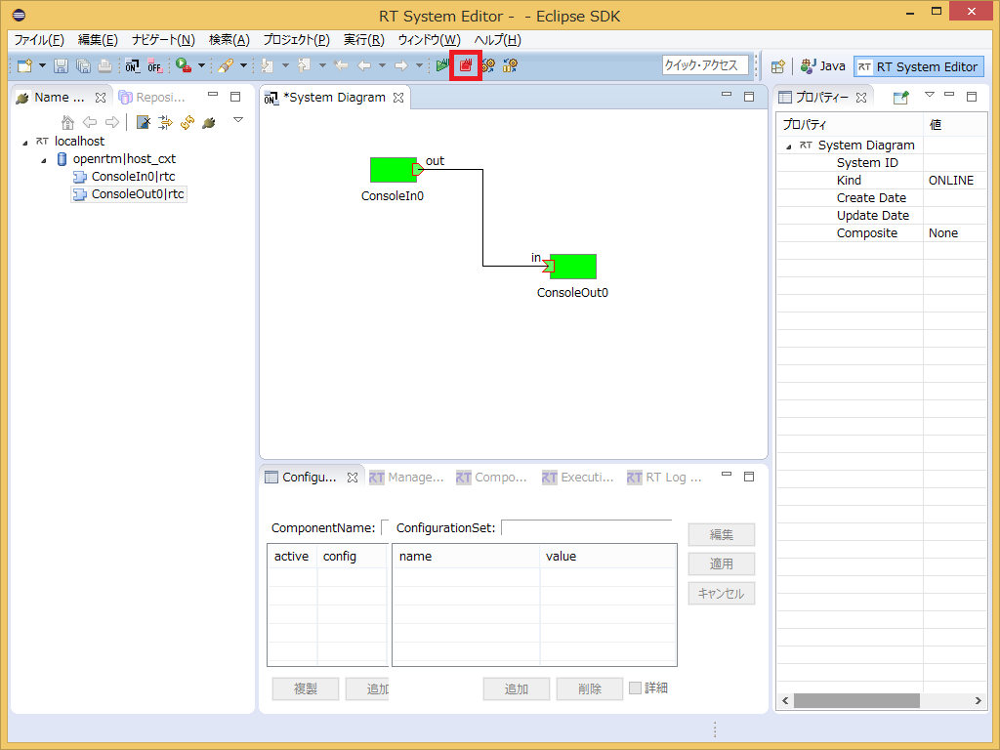</a></div><br>
<div align="center"><strong>コンポーネント非アクティブ化</strong></div>
<br>
<br>

<br>

<div align="center"><a href="install54.png">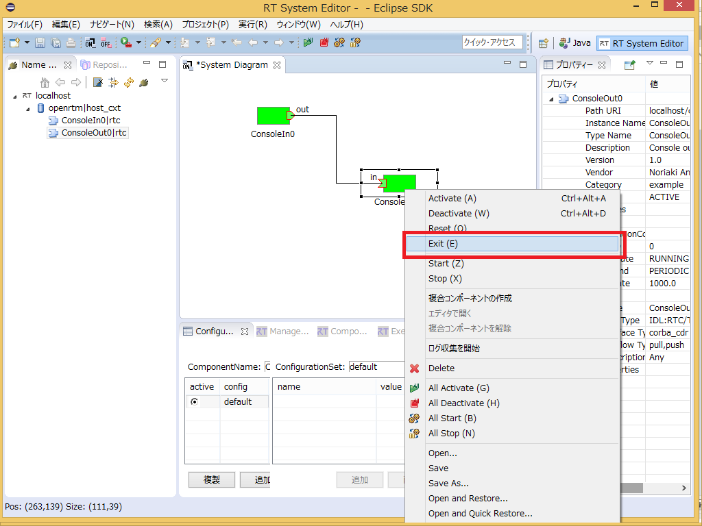</a></div><br>
<div align="center"><strong>コンポーネント終了</strong></div>
<br>
<br>

※Deactivate に時間がかかる場合は ConsoleInComp.exe の数値入力で止まっているので、何か数値を入力してください。

## rtshell を利用する

OpenRTM-aist-1.1.2 では rtshell が標準でインストールされます。
rtshell を利用することでコマンドラインから RTC のアクティブ化、非アクティブ化、終了等ができるようになります。

※64bit版をインストールした場合に dll の不足により動作できない場合があります。その場合は Windows Update を実行してください。

### RTC の操作
サンプルコンポーネントを起動し、rtshell によりコマンドラインからデータポートの接続、RTC のアクティブ化、非アクティブ化、終了を行います。
#### rtm-naming起動
[OpenRTM-aist 1.1.2] > [Tools] の Start Naming Service をクリックして起動します。 


#### サンプルコンポーネント起動
まずはサンプルコンポーネントを起動して、起動したコンポーネントを rtshell で操作します。
[OpenRTM-aist 1.1.2] > [Python] > [Components] > [Examples] のConsoleIn.py と ConsoleOut.py をクリックするとコンソール画面が起動します。


ConsoleIn.py、ConsoleOut.py と ConsoleInComp.exe、ConsoleOutComp.exe の基本的な動作は同じです。

#### コマンドプロンプトからの操作

次にコマンドプロンプトを起動してください。

<br>

<div align="center"><a href="install32.png">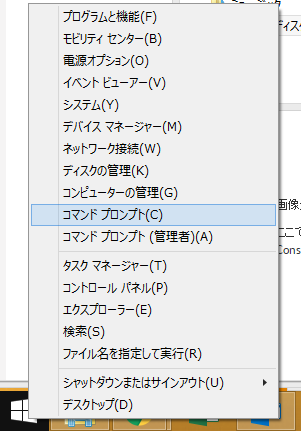</a></div><br>
<div align="center"><strong>コマンドプロンプトの起動</strong></div>
<br>
<br>

まず、C:\Python27\Scripts にパスを設定していない場合は以下のコマンドでパスを設定してください。

```
 set PATH=C:\Python27\Scripts;%PATH%
```

次に以下のコマンドでデータポートを接続します。

```
 rtcon /localhost/ConsoleIn0.rtc:out /localhost/ConsoleOut0.rtc:in
```

すると ConsoleIn.py、ConsoleOut.py コンソールに以下のような文字列が表示されます。


 ------------------------------
```
 Listener:        ON_CONNECT
 Profile::name:   outin
 Profile::id:     4d622f80-135f-11e6-b923-001c4231a7a3
```
 ------------------------------

<br>

<div align="center"><a href="install36.png">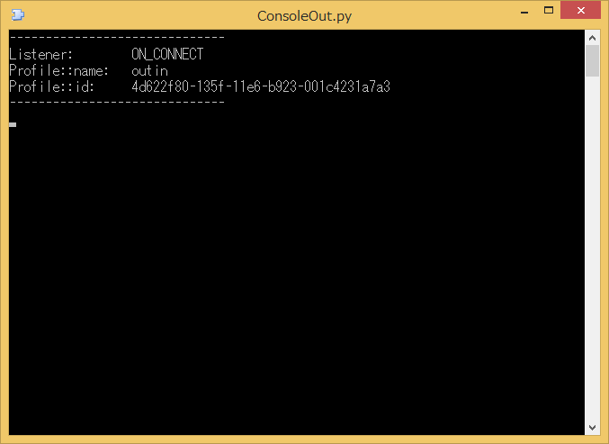</a></div><br>
<div align="center"><strong>データポート接続の表示</strong></div>
<br>
<br>

念のために RTシステムエディタで確認します。~
NameServiceView のコンポーネントをシステム・ダイアグラムにドラッグ＆ドロップすると、
データポートが接続されたことが確認できます。

<br>

<div align="center"><a href="install55.png">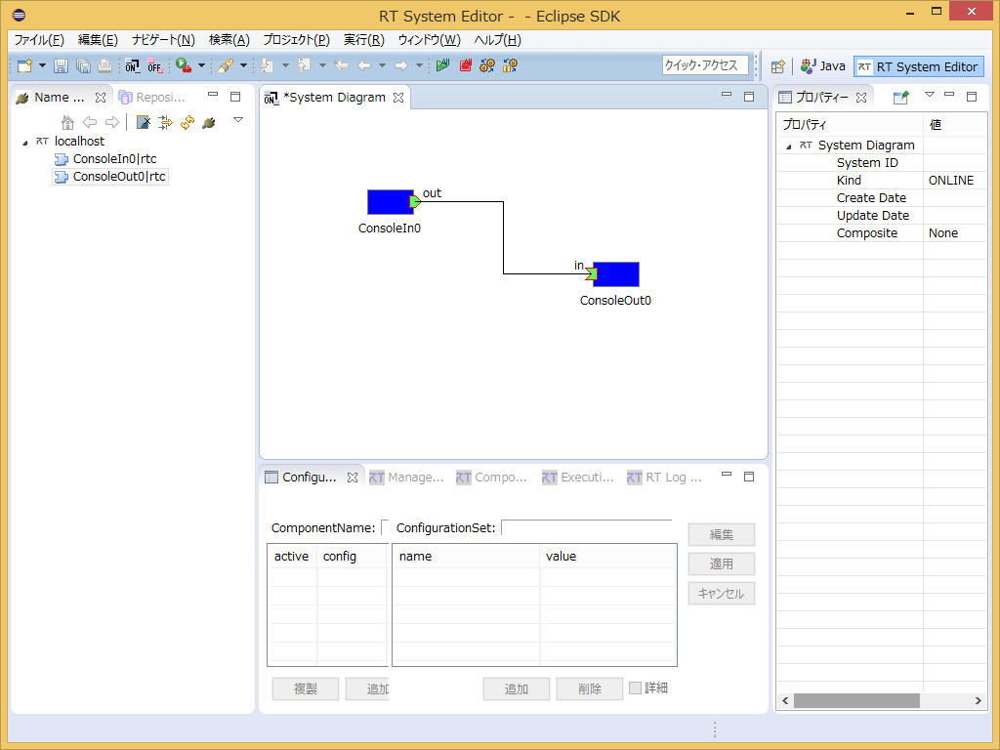</a></div><br>
<div align="center"><strong>データポート接続の確認</strong></div>
<br>
<br>


そして以下のコマンドで RTC をアクティブ化します。

```
 rtact /localhost/ConsoleIn0.rtc /localhost/ConsoleOut0.rtc
```

アクティブ化に成功していると ConsoleIn.py コンソールに、「Please input number:」と表示されます。 

RTシステムエディタを見てみると、RTC がアクティブ化されたことが確認できます。

<br>

<div align="center"><a href="install56.png">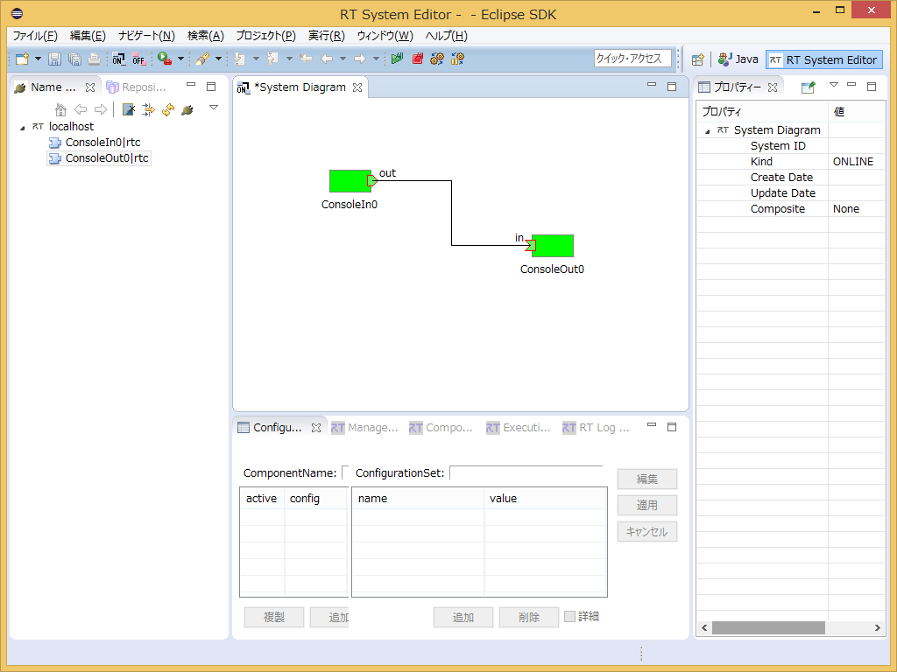</a></div><br>
<div align="center"><strong>アクティブ化の確認</strong></div>
<br>
<br>

そして ConsoleIn.py コンソール画面で数値を入力すると、ConsoleOut.py コンソールに数値が表示されます。 

<div align="center"><a href="install38.png">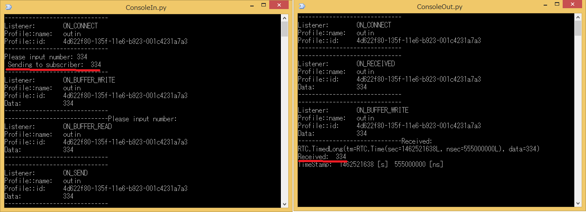</a></div><br>
<div align="center"><strong>ConsoleIn.py と ConsoleOut.py</strong></div>
<br>
<br>

以下のコマンドで RTC を非アクティブ化してください。

```
 rtdeact /localhost/ConsoleIn0.rtc /localhost/ConsoleOut0.rtc
```

※ConsoleIn が非アクティブ化できない場合、数値入力で止まっているので何か数値を入力してください。

最後に以下のコマンドで RTC を終了させてください。

```
 rtexit /localhost/ConsoleIn0.rtc
 rtexit /localhost/ConsoleOut0.rtc
```

## 次は。。。

下記リンク先をご覧ください。

- **もっとサンプルを動かしてみる　：　**[サンプルコンポーネント]({{ site.baseurl }}/ja/doc/installation/sample_components)
- **コンポーネントを作ってみる　：　**[ケーススタディー]({{ site.baseurl }}/ja/doc/casestudy)
- **OpenRTM の基礎から学ぶ　：　**[デベロッパーズガイド]({{ site.baseurl }}/ja/doc/developersguide)
- **コミュニティーに参加する　：　**[コミュニティー]({{ site.baseurl }}/ja/community)
- **公開されているコンポーネントを見てみる　：　**[プロジェクト](node/hoge)


<br>
<br>
