init<br>
https://openrtm.org/openrtm/ja/node/794<br>
doc/installation/install_1_1/cpp_1_1/test_windows_1_1<br>
動作確認 (Windows編)

<!-- Title: 動作確認 (Windows編) -->
#contents

## サンプルコンポーネントの場所

インストールまたはビルドが正常に終了したら、付属のサンプルで動作テストをします。
サンプルは、通常は以下の場所にあります。

- スタートメニュー: [スタート] > [OpenRTM-aist] > [C++] > [components] > [examples]
- C:\Program Files\OpenRTM-aist\1.0\examples\C++
- OpenRTM-aist/examples (ソースからビルドした場合)

サンプルコンポーネントセット SimpleIO を使って、OpenRTM-aist が正しくビルド・インストールされているかを確認します。

<!-- プログラムメニューに登録されているサンプルプログラムは、デフォルトでロー -->
<!-- カルホストのCORBAネームサーバを使用するように設定されています。したがっ -->
<!-- て、次に示すどちらかの方法（インストール方法により多少違いが生じます） -->
<!-- で、まずCORBAネームサーバを起動する必要があります。 -->

## サンプル (SimpleIO) を使用したテスト

RT コンポーネント ConsoleInComp、ConsoleOutComp からなるサンプルセットです。
ConsoleInComp はコンソールから入力された数値を OutPort から出力するコンポーネント、ConsoleOutComp は InPort に入力された数値をコンソールに表示するコンポーネントです。
これらは、最も Simple な I/O (入出力) を例示するためのサンプルです。
ConsoleInComp の OutPort から ConsoleOutComp の InPort へ接続を構成し、これらの2つのコンポーネントをアクティブ化 (Activate) することで動作します。

以下は、msi インストーラーで OpenRTM-aist をインストールした環境で、スタートメニューから各種プログラムを起動する前提で説明します。
スタートメニューから、OpenRTM-aist を右クリックし「開く」でフォルダーを開き、各プログラムへアクセスすると便利です。

<div align="center"><a href="win_start_menu_open_ja.png">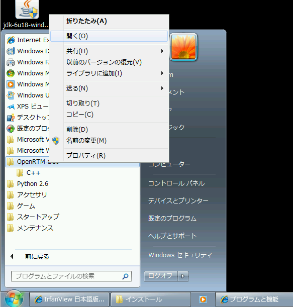</a></div>
<div align="center"><strong>スタートメニューの OpenRTM-aist を開く</strong></div>

### ネームサーバーの起動

まず、コンポーネントの参照を登録するためのネームサーバーを起動します。
[OpenRTM-aist 1.1] > [Tools] にあるショートカットの「Start C++ Naming Service」をダブルクリックしネームサーバーを起動します。

<div align="center"><a href="win_start_tool_ja.png">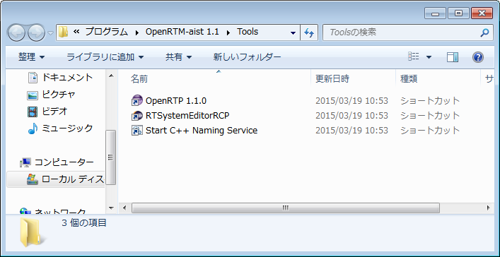</a></div>
<div align="center"><strong>ネームサーバーへのショートカット</strong></div>

起動すると、以下のようなコンソール画面が開きます。

<div align="center"><a href="win_naming_service_ja.png">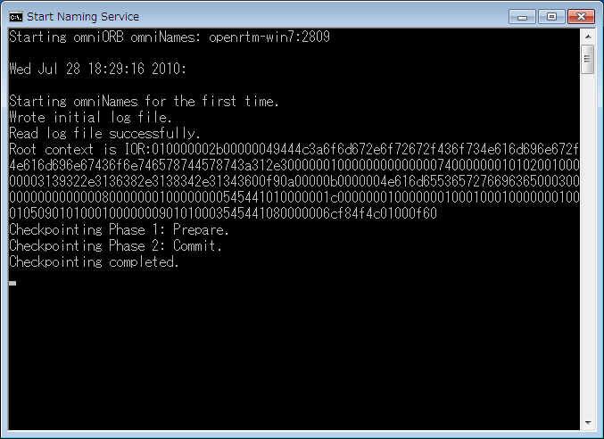</a></div>
<div align="center"><strong>ネームサーバーの起動</strong></div>

#### コンソール画面が開かない

ネームサーバーのコンソール画面が開かないケースがあります。
この場合下記のようないくつかの原因が考えられますので、原因を調査して対処してくださ。

##### omniORB がインストールされていない。

openrtm.org が提供する msi インストーラーには omniORB が含まれていますが、手動でインストールした場合には、omniORB が入っていない場合も考えられますので、omniORB がインストールされているか確認してください。

<!-- カスタムインストールを選択すると、omniORBをインストールせずにOpenRTM-aistをインストールすることもできます。 -->

##### 環境変数 OMNI_ROOT が設定されていない

「Start Naming Service」は %RTM_ROOT%\bin\rtm-naming.bat にあるバッチファイルからネームサーバー (omniNames.exe) を起動します。
この際、omniNames.exe を参照するために環境変数 OMNI_NAMES を利用しています。
通常インストーラーで OpenRTM-aist をインストールした場合には、OMNI_ROOT 環境変数が自動で設定されますが、何らかの理由で環境変数が無効になっていたり、手動でインストールした場合などは、環境変数が設定されていないことがあります。

環境変数 OMNI_ROOT が設定されていることを確認してください。
環境変数は、
- [コントロールパネル] > [システム] > [詳細設定]タブ > [環境変数]
- [マイコンピューター] を右クリック、[プロパティ] を選択、[詳細設定] タブ > [環境変数] などから参照・編集することができます。

#### その他

ユーザー名が2バイト文字の場合、ログを出力するフォルダーを適切に設定できずに omniNames.exe の起動に失敗する場合があります。
その場合、環境変数 TEMP を2バイト文字を含まない場所に設定することで改善する場合があります。
適当なテンポラリディレクトリー (以下のケースでは C:\temp) を作成し、そこを環境変数 TEMP が指すように、rtm-naming.bat の先頭部分で以下のように設定します。

```
 set cosnames="omninames"
 set orb="omniORB"
 set port=%1
 rem set OMNIORB_USEHOSTNAME=localhost
 set PATH=%PATH%;%OMNI_ROOT%\bin\x86_win32
 set TEMP=C:\temp
```

また、稀なケースですが、ホスト名やアドレスの設定の問題で、起動がうまくいかないケースがあります。
その場合、利用している PC の IPアドレス を omniNames.exe に教えてあげるとうまくいくケースがります。
環境変数 OMNIORB_USEHOSTNAME を以下のように設定します (以下は自ホストの IPアドレスが 192.168.0.11 の場合の例)。

```
 set cosnames="omninames"
 set orb="omniORB"
 set port=%1
 set OMNIORB_USEHOSTNAME=192.168.0.11
 set PATH=%PATH%;%OMNI_ROOT%\bin\x86_win32
```

### サンプルコンポーネントの起動

ネームサーバー起動後、適当なサンプルコンポーネントを起動します。
先ほど開いたスタートメニューフォルダーの、[OpenRTM-aist] > [C++] > [components] > [examples] を開くと、図のようにいくつかのコンポーネントがあります。

<div align="center"><a href="win_start_menu_comps_ja.png">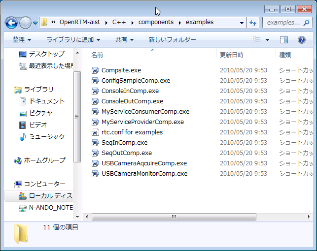</a></div>
<div align="center"><strong>サンプルコンポーネントフォルダー</strong></div>

ここでは、「ConsoleInComp.exe」「ConsoleOutComp.exe」をそれぞれダブルクリックして2つのコンポーネントを起動します。
起動すると、下図のような2つのコンソール画面が開きます。

<div align="center"><a href="win_consoleinout_window_ja.png">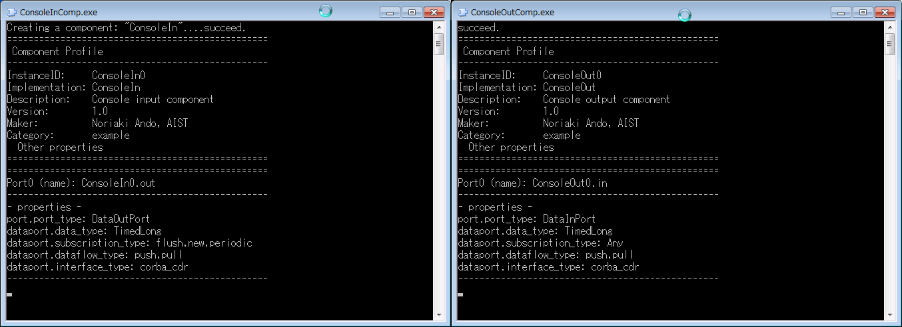</a></div>
<div align="center"><strong>ConsoleIn コンポーネントと ConsoleOut コンポーネント</strong></div>

#### コンポーネントが起動しない場合

コンポーネントが起動しない場合、いくつかの原因が考えられます。

##### コンソール画面が開いてすぐに消える

rtc.conf の設定に問題があり、起動できないケースがあります。上記スタートメニューフォルダーの [rtc.conf for examples] を開いて設定を確認してください。
例えば、corba.endpoint/corba.endpoints などの設定が現在実行中の PC のホストアドレスとミスマッチを起こしている場合などは、CORBA が異常終了します。

以下のような最低限の rtc.conf に設定しなおして試してみてください。

```
 corba.nameservers: localhost
```

##### ランタイムエラーが出て終了する

ライブラリ等が適切にインストールされていない・設定されていない等の原因でラインタイムエラーが出る場合があります。
- 再起動してみる
- OpenRTM-aist をすべてアンインストールし、再度インストールすることで改善される場合があります。

### RTSystemEditorRCP (RTSE) の起動

スタートメニューフォルダーから、RTSystemEditorRCP を起動します。
RTSystemEditorは [OpenRTM-aist] > [Tools] > [RTSystemEditorRCP] にあります。

<div align="center"><a href="rtse_start_ja.png">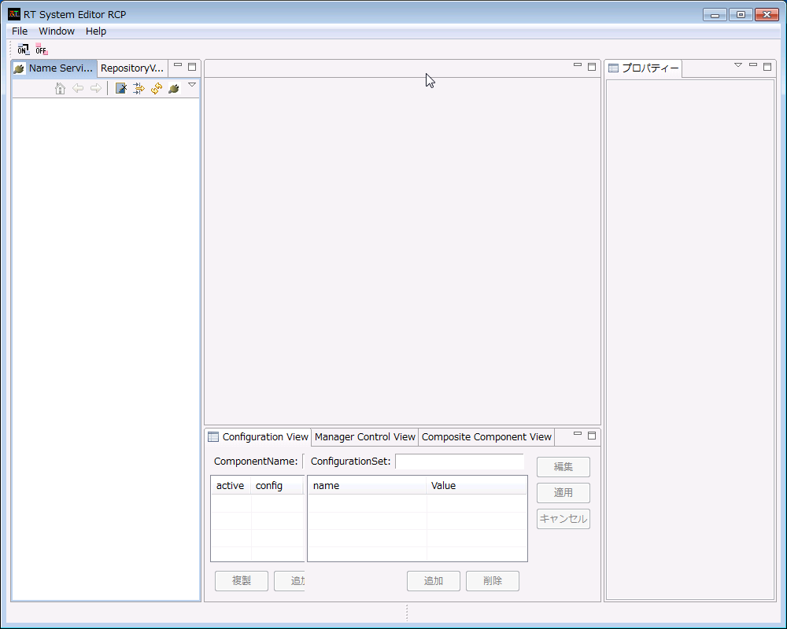</a></div>
<div align="center"><strong>RTSystemEditor の起動</strong></div>

<!-- &color(red){※ RTSystemEditor(RCP 版 ) を動作させるために、32bit 版の Java 動作環境 (JRE) または Java 開発環境 (JDK) が必要となります。~ -->
※ RTSystemEditor (RCP 版 ) を動作させるために、32bit 版の Java 動作環境 (JRE) または Java 開発環境 (JDK) が必要となります。~
インストーラーのオプションで JRE を yes で選択していればインストールされています。
<!-- [[Java のダウンロード:http://java.com/ja/download/manual.jsp]]}; -->

#### ネームサーバーへの接続

RTSE が起動したらまずネームサーバーへ接続します。左ペインの上部にある、<a href="rtse_connect_ns_icon.png">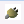</a>のアイコンをクリックして接続ダイアログを開きます。
接続ダイアログのホスト名の部分に先ほど起動したネームサーバーのアドレス (この場合同一ホストですので **localhost**) を指定します。
ポート番号も指定できますが、通常デフォルトの2809番を使用する場合は何も指定しません。

<div align="center"><a href="rtse_connect_dialog_ja.png"></a></div>
<div align="center"><strong>ネームサーバーへの接続ダイアログ</strong></div>

接続すると、ネームサービスビューに localhost が現れます。ツリー表示の [+] をクリックすると、先ほど起動した2つのコンポーネントが登録されていることがわかります。

<div align="center"><a href="rtse_ns_connected_ja.png">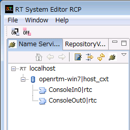</a></div>
<div align="center"><strong>ネームサーバーに登録されたコンポーネント</strong></div>

#### エディタへの配置

システムを編集するエディタを開きます。上部のエディタを [開く] ボタン<a href="rtse_open_editor_icon_ja.png"></a> をクリックすると、中央のペインにエディタが開きます。

左側のネームサービスビューに <a href="rtse_rtc_icon.png"></a>のアイコンで表示されているコンポーネント (2つ) を中央のエディタにドラッグアンドドロップします。

<div align="center"><a href="rtse_dnd_rtcs_ja.png"></a></div>
<div align="center"><strong>コンポーネントをエディタに配置</strong></div>

#### 接続とアクティブ化

ConsoleIn0 コンポーネントの右側にはデータが出力される OutPort <a href="rtse_outport_icon.png"></a> 、ConsoleOut0 コンポーネントの左側にはデータが入力される InPort <a href="rtse_inport_icon.png"></a> がそれぞれついています。

これら InPort/OutPort (まとめてデータポートと呼びます) を接続します。
OutPort から InPort (または InPort から OutPort) へドラッグランドドロップすると、図のようなダイアログが現れますので、デフォルト設定のまま [OK] ボタンをクリックします。

<div align="center"><a href="rtse_portconnect_ja.png">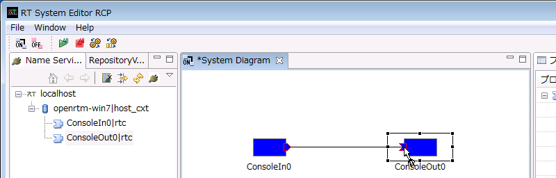</a></div>
<div align="center"><strong>データポートの接続</strong></div>

<div align="center"><a href="rtse_portconnect_dialog_ja.png">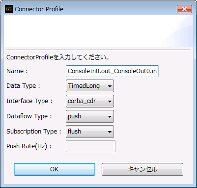</a></div>
<div align="center"><strong>データポート接続ダイアログ</strong></div>

2つのコンポーネントの間に接続線が現れます。次に、エディタ上部メニューの [All Activate] ボタン <a href="rtse_all_actevate_icon.png"></a> をクリックし、これらのコンポーネントをアクティブ化します。
アクティブ化されると、コンポーネントが緑色に変化します。

<div align="center"><a href="rtse_actevated_all_ja.png">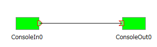</a></div>
<div align="center"><strong>アクティブ化されたコンポーネント</strong></div>

コンポーネントがアクティブ化されると ConsoleIn コンポーネント側では

```
 Please input number: 
```

というプロンプト表示に変わりますので、適当な数値 (short int の範囲内:32767以下) を入力し Enter キーを押します。
すると、ConsoleOut 側では、入力した数値が表示され、ConsoleIn コンポーネントから ConsoleOut コンポーネントへデータが転送されたことがわかります。

以上で、コンポーネントの基本動作の確認は終了です。


#### RTSystemEditorRCP (RTSE) の起動が起動しない場合

以下のメッセージが出て RTSystemEditorRCP (RTSE) が起動しない場合は、32bit 版の Java 動作環境 (JRE) または Java 開発環境 (JDK) をインストールする必要があります。
変更インストールで JRE を選択すればインストールされます。手順は、コントロールパネルの「プログラムのアンインストールまたは変更」を開き、OpenRTM-aist の右クリックして「変更」を選択します。
インストーラー画面での JRE 選択については、[OpenRTM-aistを10分で始めよう！](/ja/node/5710) のページをご覧ください。
<!-- [[Java のダウンロード:http://java.com/ja/download/manual.jsp]] -->

<div align="center"><a href="Clipboard01.jpg">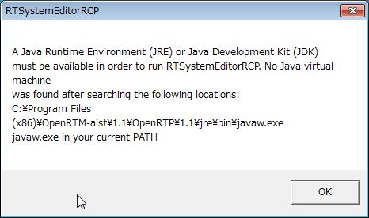</a></div>
<div align="center"><strong>RTSystemEditorRCP(RTSE) の起動時のエラー</strong></div>

## 他のサンプル

インストーラーには、このほかにもいくつかのサンプルコンポーネントが付属しています。
これらのコンポーネントも同様に起動し、RTSystemEditor でポート同士を接続し、アクティブ化することで試すことができます。

付属しているコンポーネントのリストと簡単な説明を以下に示します。

<table class="table-alt">
  <tr>
    <th>ConsoleInComp.exe</th>
    <th>コンソールから入力された数値を OutPort から出力する。ConsoleOutComp.exe に接続して使用する。</th>
  </tr>
  <tr>
    <td>ConsoleOutComp.exe</td>
    <td>InPort に入力された数値をコンソールに表示する<span style="color:default;">コンポーネント</span>;。ConsoleInComp.exe に接続して使用する。</td>
  </tr>
  <tr>
    <td>SequenceInComp.exe</td>
    <td>ランダムな数値(Short、Long、Float、Double とそのシーケンス型)を出力する<span style="color:default;">コンポーネント</span>;。SequenceOutComp.exe に接続して使用する。</td>
  </tr>
  <tr>
    <td>SequenceOutComp.exe</td>
    <td>InPort に入力される数値(Short、Long、Float、Double とそのシーケンス型)を表示。SequenceInComp.exe に接続して使用する。</td>
  </tr>
  <tr>
    <td>MyServiceProviderComp.exe</td>
    <td>MyService 型のサービスを提供する<span style="color:default;">コンポーネント</span>;。MyServiceConsumerComp.exe に接続して使用する。</td>
  </tr>
  <tr>
    <td>MyServiceConsumerComp.exe</td>
    <td>MyService 型のサービスを提供する<span style="color:default;">コンポーネント</span>;。MyServiceProviderComp.exe に接続して使用する。</td>
  </tr>
  <tr>
    <td>ConfigSampleComp.exe</td>
    <td>Configuration のサンプル。RtcLink から Configuration を変更して Configuration の挙動を理解するためのサンプル。</td>
  </tr>
  <tr>
    <td>USBCameraAcquireComp.exe</td>
    <td>USBカメラから画像を取得して OutPort から出力する<span style="color:default;">コンポーネント</span>;。USBCameraMonitor.exe に接続して使用する。</td>
  </tr>
  <tr>
    <td>USBCameraMonitor.exe</td>
    <td>InPort に入力される画像を画面に表示する<span style="color:default;">コンポーネント</span>;。USBCameraAquire.exe に接続して使用する。</td>
  </tr>
</table>


<br>

