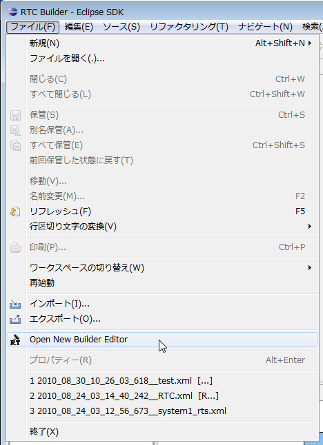

-------jp page!!-------

<!-- Title: RTCBuilder のインストール -->
#contents
## RTCBuilder とは 
RTCBuilder は RTコンポーネントのテンプレートを生成する開発ツールです。パラメーターを基に RTコンポーネントのテンプレートを生成する機能を持っています。
また、RTCBuilder は Eclipse にて動作し、直感的な操作と他の Eclipse プラグインとのシームレスな連携が可能です。~
<!-- RTCBuilder は RTSystemEditor がなくても動作しますが、 RTSystemEditor がインストールされている場合には、 RTCBuilder とメニューが統合されます。本マニュアルでは RTSystemEditor がインストールされていることを前提として説明されています。 -->

### 機能概要
提供される機能の一覧は以下のとおりです。
<table class="table-alt">
  <tr>
    <th>№</th>
    <th>画面要素名</th>
    <th>説明</th>
  </tr>
  <tr>
    <td>１</td>
    <td>RTC プロファイルエディタ</td>
    <td>RTコンポーネントの仕様であるプロファイル、データポート定義、サービスポート定義、コンフィギュレーション定義、その他拡張プロファイルを編集します。</td>
  </tr>
  <tr>
    <td>２</td>
    <td>ビルドビュー</td>
    <td>編集中の RTコンポーネントおよびデータポート、サービスポート、サービスインターフェースをアイコンでグラフィカルに表示します。</td>
  </tr>
  <tr>
    <td>３</td>
    <td>リポジトリビュー</td>
    <td>選択した RTリポジトリの情報を表示します。</td>
  </tr>
</table>

### 動作環境
RTCBuilderの動作に必要な環境は以下のとおりです。

<table class="table-alt">
  <tr>
    <th>№</th>
    <th>環境</th>
    <th>備考</th>
  </tr>
  <tr>
    <td>１</td>
    <td><a href="http://java.sun.com/javase/ja/6/download.html">Java Development Kit 6</a></td>
    <td>注意：Java1.5(5.0) では動作しません。;</td>
  </tr>
  <tr>
    <td>２</td>
    <td><a href="http://www.eclipse.org/downloads/index.php">Eclipse 3.4.2以上 </a>   <a href="http://archive.eclipse.org/eclipse/downloads/index.php">(archive)</a></td>
    <td>Eclipse本体</td>
  </tr>
  <tr>
    <td>３</td>
    <td><a href="http://www.eclipse.org/modeling/emf/downloads/">Eclipse EMF 2.2以上(SDO,XSD含む)</a></td>
    <td>RTCBuilderが依存するEclipseプラグイン   <strong>※</strong>ご使用になられる Eclipse のバージョンに合ったものをご使用ください。</td>
  </tr>
  <tr>
    <td>４</td>
    <td><a href="http://www.eclipse.org/gef/downloads/">Eclipse GEF 3.2以上(Draw2D含む)</a></td>
    <td>RTCBuilderが依存する Eclipse プラグイン   <strong>※</strong>ご使用になられる Eclipse のバージョンに合ったものをご使用ください。</td>
  </tr>
  <tr>
    <td>５</td>
    <td><a href="http://www.eclipse.org/projects/project_summary.php?projectid=eclipse.jdt">Eclipse Java development tools(JDT)</a></td>
    <td><strong>※</strong>ご使用になられる Eclipse のバージョンに合ったものをご使用ください。</td>
  </tr>
</table>

また以下の開発を行う言語によっては以下の環境をインストールしておくと便利です。
<table class="table-alt">
  <tr>
    <th>№</th>
    <th>環境</th>
    <th>備考</th>
  </tr>
  <tr>
    <td>１</td>
    <td><a href="http://www.eclipse.org/cdt/downloads.php">Eclipse CDT</a></td>
    <td>C++用の開発環境</td>
  </tr>
  <tr>
    <td>２</td>
    <td><a href="http://pydev.org/">Pydev for Eclipse</a></td>
    <td>python用の開発環境</td>
  </tr>
</table>
<!-- |２|[[Pydev for Eclipse:http://sourceforge.net/project/showfiles.php?roup_id=85796]]|python用の開発環境| -->
## RTCBuilder のインストール
RTCBuilder は Eclipse プラグインであるため、 Eclipse 本体をインストールする必要があります。
さらに、Eclipse は Java アプリケーションなので、Eclipse 本体をインストールする前に Java 実行環境（あるいはJDK：Java開発環境でもよい）をインストールする必要があります。
<!-- また、RTCBuilder をインストールする場合は、RTSystemEditor もインストールしておいた方がよいでしょう。 -->
- Java 実行環境のインストールについては、[EclipseについてのJava実行環境(JRE)のインストール](/node/1377#jre_install) を参照願います。
- Eclipseのインストールについては、[Eclipseについて の Eclipseのインストール](/node/1377#eclipse_install) を参照願います。

<!-- ***Java 実行環境インストール -->
<!-- 「RTSysyemEditor のインストール」の[[Java実行環境インストール :RTSystemEditor のインストール]]を参照してください。すでに、JDK（Java開発環境、ただし、''1.6以上''）がインストールされている場合はJava 実行環境(JRE)のインストールは必要ありません。RTCBuilderを用いてJavaのコードを生成する場合には、 JDK が必要にまります。~ -->
<!-- &br; -->
<!-- '' JDK インストール：''~ -->
<!-- ⇒　[[Java Development Kit 6:http://java.sun.com/javase/ja/6/download.html]]~ -->
<!-- ⇒　以下に''旧バージョンのJava Development Kit 5(JDK1.5)''のインストール方法が記載してあります。 -->
<!-- -[[UNIX :/ja/node/661#instjavaunixjdk]] -->
<!-- -[[Windows >/ja/node/666#instjava]] -->
<!-- &br; -->
<!--  -->
<!-- ***Eclipseインストール -->
<!-- 「RTSystemEditor のインストール」の[[Eclipseインストール :RTSystemEditor のインストール#insteclipse]]を参照してください。 -->
<!--  -->
<!-- 参考： -->
<!-- → [[''FAQ:'' Eclipseの起動方法 >RtcTemplate.#eclipse]] -->
<!--  -->
<!-- #br -->
<!--  -->
<!--  -->

### RTCBuilder のインストールと起動
[バイナリ(日本語版 jar ファイル(RTSE+RTCB)) ](/ja/node/941#binary)をダウンロードして、 Eclipse の plugin ディレクトリ(eclipse ディレクトリー以下の plugin というディレクトリー)にダウンロードした jar ファイルをそのままコピーします。

Eclipse を起動し、メニューから [ウインドウ] > [パースペクティブを開く] > [その他] を選択すると、 次のようなパースペクティブ選択画面が表示されます。
 

<!-- CENTER:''ツールバーからの起動'' -->
 
パースペクティブ一覧にある RTC Builder を選択すると、次のような画面が表示されて RTCBuilder が起動されます。
 

 
`ツールバーの` [Open New RTC Builder Editor] ボタンをクリックするか、メニューバーの [ファイル] > [Open New Builder Editor] を選択することで、Builder エディタが起動します。
 

 

 

<!-- #ref(fig2-4RTCBuilderInit.png,80%,center) -->
 

参考：[**FAQ:** Eclipseの起動方法 ](/ja/node/248#eclipse)
 
 

-------jp page!!-------
