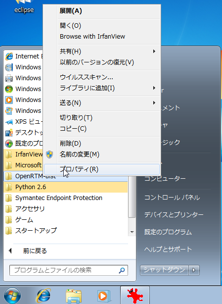
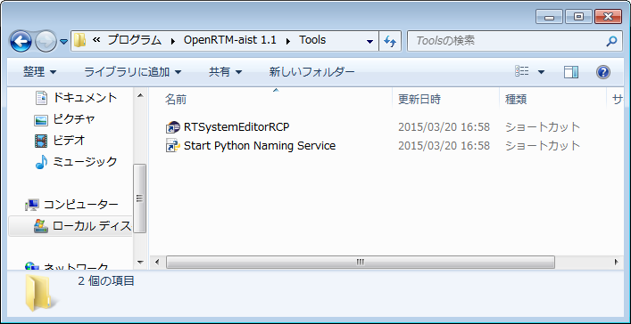
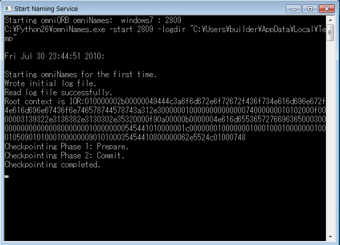
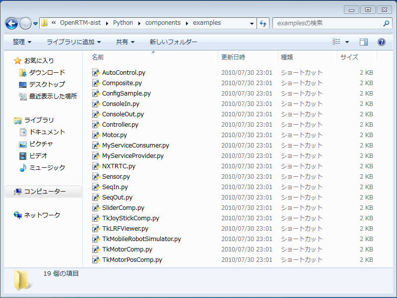
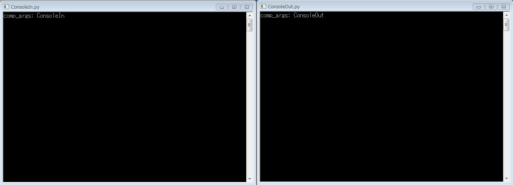
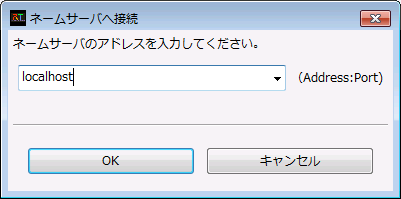
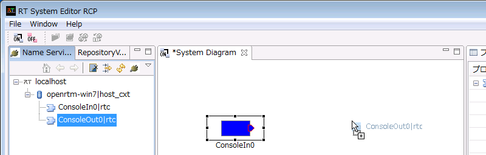

<!-- doc/installation/install_1_1/python_1_1/test_windows_python_1_1-->
<!-- https://openrtm.org/openrtm/ja/node/1225/edit-->
<!-- Title: 動作確認 (Windows編) -->
#contents

## サンプルコンポーネントの場所

インストールまたはビルドが正常に終了したら、付属のサンプルで動作テストをします。サンプルは、通常は以下の場所にあります。

- スタートメニュー: [スタート] > [OpenRTM-aist 1.1] > [Python] > [Components] > [Examples]
- C:\Program Files\OpenRTM-aist\1.1\examples\Python
- OpenRTM_aist/examples (ソースからビルドした場合)

サンプルコンポーネントセット SimpleIO を使って、OpenRTM-aist が正しくビルド・インストールされているかを確認します。

<!-- プログラムメニューに登録されているサンプルプログラムは、デフォルトでローカルホストの CORBA ネームサーバーを使用するように設定されています。 -->
<!-- したがって、次に示すどちらかの方法（インストール方法により多少違いが生じます） -->
<!-- まず CORBA ネームサーバーを起動する必要があります。 -->

## サンプル (SimpleIO) を使用したテスト

RT コンポーネント ConsoleIn、ConsoleOut からなるサンプルセットです。
ConsoleIn はコンソールから入力された数値を OutPort から出力するコンポーネント、ConsoleOut は InPort に入力された数値をコンソールに表示するコンポーネントです。
これらは、最も Simple な I/O (入出力) を例示するためのサンプルです。
ConsoleIn の OutPort から ConsoleOut の InPort へ接続を構成し、これらの2つのコンポーネントをアクティブ化 (Activate) することで動作します。

以下は、msi インストーラーで OpenRTM-aist-Python をインストールした環境で、スタートメニューから各種プログラムを起動する前提で説明します。
スタートメニューから、OpenRTM-aist を右クリックし「開く」でフォルダーを開き、各プログラムへアクセスすると便利です。

<div align="center"><a href="win_start_menu_open2_ja.png"></a></div>
<div align="center"><strong>スタートメニューのOpenRTM-aistを開く</strong></div>

### ネームサーバーの起動

まず、コンポーネントの参照を登録するためのネームサーバーを起動します。
[OpenRTM-aist 1.1] > [Tools] にあるショートカットの [Start Python Naming Service] をクリックしネームサーバーを起動します。


<div align="center"><a href="win_start_tool_python_ja.png"></a></div>
<div align="center"><strong>ネームサーバーへのショートカット</strong></div>

起動すると、以下のようなコンソール画面が開きます。

<div align="center"><a href="win_naming_service2_ja.png"></a></div>
<div align="center"><strong>ネームサーバーの起動</strong></div>

#### コンソール画面が開かない

ネームサーバーのコンソール画面が開かないケースがあります。
この場合下記のようないくつかの原因が考えられますので、原因を調査して対処してください。

##### omniORBpy がインストールされていない。

openrtm.org が提供する msi インストーラーには omniORBpy が含まれていますが、カスタムインストールを選択すると、omniORBpy をインストールせずに OpenRTM-aist-Python をインストールすることもできます。

また、手動でインストールした場合には、omniORBpy が入っていない場合も考えられますので、omniORBpy がインストールされているか確認してください。

##### py ファイルの関連付けが違っている

ネームサーバーを起動するファイルは、C:\Program Files (x86)\OpenRTM-aist\1.1\bin\rtm-naming.py です。（32bit 版 msi でインストールした場合）<br>
このディレクトリーでコンソール画面を開き、python rtm-naming.py を実行するとネームサーバーは起動するが、rtm-naming.py をダブルクリックして起動できない場合はインストールしている python を確認してください。<br>
Python の 32bit 版、64bit 版の両方をインストールしている場合、先にインストールしたものが py ファイルに関連付けられるようなので、OpenRTM-aist-Python のインストーラーと同じアーキテクチャの Python を先にインストールすると解決するかもしれません。

#### その他

ホスト名やアドレスの設定の問題で、起動がうまくいかないケースがあります。
その場合、利用している PC の IP アドレスを omniNames.exe に教えてあげるとうまくいくケースがあります。
環境変数 OMNIORB_USEHOSTNAME を以下のように設定します (以下は自ホストの IPアドレスが192.168.0.11の場合の例)。

```
 変数名(N): OMNIORB_USEHOSTNAME
 変数値(V): 192.168.0.11
```

### サンプルコンポーネントの起動

ネームサーバー起動後、適当なサンプルコンポーネントを起動します。
先ほど開いたスタートメニューフォルダーの、[OpenRTM-aist 1.1] > [Python] > [Components] > [Examples] を開くと、図のようにいくつかのコンポーネントがあります。

<div align="center"><a href="win_start_menu_comps2_ja.png"></a></div>
<div align="center"><strong>サンプルコンポーネントフォルダー</strong></div>

ここでは、「ConsoleIn.py」「ConsoleOut.py」をそれぞれダブルクリックして2つのコンポーネントを起動します。
起動すると、下図のような2つのコンソール画面が開きます。

<div align="center"><a href="win_consoleinout_window2.png"></a></div>
<div align="center"><strong>ConsoleIn コンポーネントと ConsoleOut コンポーネント</strong></div>

#### コンポーネントが起動しない場合

コンポーネントが起動しない場合、いくつかの原因が考えられます。

##### コンソール画面が開いてすぐに消える

rtc.conf の設定に問題があり、起動できないケースがあります。
サンプルコンポーネントのインストールフォルダー(インストール時に何も指定しなかった場合 C:\Program Files\OpenRTM-aist\1.0\examples\Python\SimpleIO) の「rtc.conf」を開いて設定を確認してください。
例えば、corba.endpoint/corba.endpoints などの設定が現在実行中の PC のホストアドレスとミスマッチを起こしている場合などは、CORBA が異常終了します。

以下のような最低限の rtc.conf に設定しなおして試してみてください。

```
 corba.nameservers: localhost
```

### RTSystemEditor (RTSE) の起動

スタートメニューフォルダーから、RTSystemEditor を起動します。
RTSystemEditorは [OpenRTM-aist] > [Tools] > [RTSystemEditorRCP] にあります。

<div align="center"><a href="rtse_start_ja.png"></a></div>
<div align="center"><strong>RTSystemEditor の起動</strong></div>

<!-- &color(red){※ RTSystemEditor (RCP 版) を動作させるために、32bit 版の Java 動作環境 (JRE) または Java 開発環境 (JDK) が必要となります。~ -->
<!-- [[Java のダウンロード:http://java.com/ja/download/manual.jsp]]}; -->
※ RTSystemEditor (RCP 版) を動作させるために、32bit 版の Java 動作環境 (JRE) または Java 開発環境 (JDK) が必要で、1.1.0-RELEASE 版では JRE が一緒にインストールされます。


#### ネームサーバーへの接続

RTSE が起動したらまずネームサーバーへ接続します。
左ペインの上部にある、<a href="rtse_connect_ns_icon.png"></a>のアイコンをクリックして接続ダイアログを開きます。
接続ダイアログのホスト名の部分に先ほど起動したネームサーバーのアドレス (この場合同一ホストですので **localhost**) を指定します。
ポート番号も指定できますが、通常デフォルトの2809番を使用する場合は何も指定しません。

<div align="center"><a href="rtse_connect_dialog_ja.png"></a></div>
<div align="center"><strong>ネームサーバーへの接続ダイアログ</strong></div>

接続すると、ネームサービスビューに localhost が表示されます。
ツリー表示の [+] をクリックすると、先ほど起動した2つのコンポーネントが登録されていることがわかります。

<div align="center"><a href="rtse_ns_connected_ja.png"></a></div>
<div align="center"><strong>ネームサーバーに登録されたコンポーネント</strong></div>

#### エディタへの配置

システムを編集するエディタを開きます。上部のエディタを開くボタン <a href="rtse_open_editor_icon.png"></a>をクリックすると、中央のペインにエディタが開きます。

左側のネームサービスビューに <a href="rtse_rtc_icon.png"></a> のアイコンで表示されているコンポーネント (2つ) を中央のエディタにドラッグアンドドロップします。

<div align="center"><a href="rtse_dnd_rtcs_ja.png"></a></div>
<div align="center"><strong>コンポーネントをエディタに配置</strong></div>

#### 接続とアクティブ化

ConsoleIn0 コンポーネントの右側にはデータが出力される OutPort <a href="rtse_outport_icon.png"></a> 、ConsoleOut0 コンポーネントの左側にはデータが入力される InPort <a href="rtse_inport_icon.png"></a> がそれぞれついています。

これら InPort/OutPort (まとめてデータポートと呼びます) を接続します。
OutPort から InPort (または InPort から OutPort) へドラッグランドドロップすると、図のようなダイアログが表示されますので、デフォルト設定のまま [OK] ボタンをクリックします。

<div align="center"><a href="rtse_portconnect_ja.png"></a></div>
<div align="center"><strong>データポートの接続</strong></div>

<div align="center"><a href="rtse_portconnect_dialog_ja.png"></a></div>
<div align="center"><strong>データポート接続ダイアログ</strong></div>

2つのコンポーネントの間に接続線が表示されます。次に、エディタ上部メニューの [All Activate] ボタン <a href="rtse_all_activate_icon.png"></a> をクリックし、これらのコンポーネントをアクティブ化します。
アクティブ化されると、コンポーネントが緑色に変化します。

<div align="center"><a href="rtse_activated_all.png"></a></div>
<div align="center"><strong>アクティブ化されたコンポーネント</strong></div>

コンポーネントがアクティブ化されると ConsoleIn コンポーネント側では

```
 Please input number: 
```

というプロンプト表示に変わりますので、適当な数値 (short int の範囲内:32767以下) を入力し Enter キーを押します。
すると、ConsoleOut 側では、入力した数値が表示され、ConsoleIn コンポーネントから ConsoleOut コンポーネントへデータが転送されたことがわかります。

以上で、コンポーネントの基本動作の確認は終了です。

## 他のサンプル

インストーラーには、このほかにもいくつかのサンプルコンポーネントが付属しています。
これらのコンポーネントも同様に起動し、RTSystemEditor でポート同士を接続し、アクティブ化することで試すことができます。

付属しているコンポーネントのリストと簡単な説明を以下に示します。

<table class="table-alt">
  <tr>
    <td>ConsoleIn.py</td>
    <td>コンソールから入力された数値を OutPort から出力する。ConsoleOut.py に接続して使用する。</td>
  </tr>
  <tr>
    <td>ConsoleOut.py</td>
    <td>InPort に入力された数値をコンソールに表示する<span style="color:default;">コンポーネント</span>;。ConsoleIn.py に接続して使用する。</td>
  </tr>
  <tr>
    <td>SeqIn.py</td>
    <td>ランダムな数値(Short、Long、Float、Double とそのシーケンス型)を出力する<span style="color:default;">コンポーネント</span>;。SeqOut.py に接続して使用する。</td>
  </tr>
  <tr>
    <td>SeqOut.py</td>
    <td>InPort に入力される数値(Short、Long、Float、Doubleとそのシーケンス型)を表示。SeqIn.py に接続して使用する。</td>
  </tr>
  <tr>
    <td>MyServiceProvider.py</td>
    <td>MyService 型のサービスを提供する<span style="color:default;">コンポーネント</span>;。MyServiceConsumer.py に接続して使用する。</td>
  </tr>
  <tr>
    <td>MyServiceConsumer.py</td>
    <td>MyService 型のサービスを利用する<span style="color:default;">コンポーネント</span>;。MyServiceProvider.py に接続して使用する。</td>
  </tr>
  <tr>
    <td>ConfigSample.py</td>
    <td>Configuration のサンプル。RTSystemEditor から Configuration を変更して Configuration の挙動を理解するためのサンプル。</td>
  </tr>
  <tr>
    <td>TkMobileRobotSimulator.py</td>
    <td>モバイルロボットの簡易シミュレーター。ロボットの速度を InPort で受け、移動後の位置を OutPort から出力する。</td>
  </tr>
  <tr>
    <td>NXTRTC.py</td>
    <td>LEGO MINDSTORM にて作成したモバイルロボットを制御するためのサンプル。InPort にて速度を受け、赤外線センサーと現在位置をそれぞれ OutPort から出力する。</td>
  </tr>
  <tr>
    <td>AutoControl.py</td>
    <td>モバイルロボット用の速度を出力する。測位センサーのデータを InPort で受け、ロボットの速度を計算して OutPort から出力する。</td>
  </tr>
  <tr>
    <td>Composite.py</td>
    <td>Composite 用のサンプル。Motor、Controller、Sensorを包含するコンポーネント。Composite の使用方法を理解するためのサンプル。</td>
  </tr>
  <tr>
    <td>Motor.py</td>
    <td>Composite コンポーネント用のサンプル。Composite の子要素として使用。</td>
  </tr>
  <tr>
    <td>Controller.py</td>
    <td>Composite コンポーネント用のサンプル。Composite の子要素として使用。</td>
  </tr>
  <tr>
    <td>Sensor.py</td>
    <td>Composite コンポーネント用のサンプル。Composite の子要素として使用。</td>
  </tr>
  <tr>
    <td>Slider.py</td>
    <td>Tk を用いた GUI コンポーネントのサンプル。Slider で指定した値を OutPort から出力する。</td>
  </tr>
  <tr>
    <td>TkMotorComp.py</td>
    <td>Tk を用いた GUI コンポーネントのサンプル。InPort で受け取った値を GUI で表示する。</td>
  </tr>
  <tr>
    <td>TkLRFViewer.py</td>
    <td>Tk を用いた GUI コンポーネントのサンプル。レーザーレンジセンサーなどから出力されるデータを表示する。</td>
  </tr>
  <tr>
    <td>TkJoystickComp.py</td>
    <td>Tk を用いた GUI コンポーネントのサンプル。簡易ジョイスティックコンポーネント。</td>
  </tr>
</table>

<!-- Title: 動作確認 (Windows編) -->
#contents

## サンプルコンポーネントの場所

インストールまたはビルドが正常に終了したら、付属のサンプルで動作テストをします。サンプルは、通常は以下の場所にあります。

- スタートメニュー: [スタート] > [OpenRTM-aist 1.1] > [Python] > [Components] > [Examples]
- C:\Program Files\OpenRTM-aist\1.1\examples\Python
- OpenRTM_aist/examples (ソースからビルドした場合)

サンプルコンポーネントセット SimpleIO を使って、OpenRTM-aist が正しくビルド・インストールされているかを確認します。

<!-- プログラムメニューに登録されているサンプルプログラムは、デフォルトでローカルホストの CORBA ネームサーバーを使用するように設定されています。 -->
<!-- したがって、次に示すどちらかの方法（インストール方法により多少違いが生じます） -->
<!-- まず CORBA ネームサーバーを起動する必要があります。 -->

## サンプル (SimpleIO) を使用したテスト

RT コンポーネント ConsoleIn、ConsoleOut からなるサンプルセットです。
ConsoleIn はコンソールから入力された数値を OutPort から出力するコンポーネント、ConsoleOut は InPort に入力された数値をコンソールに表示するコンポーネントです。
これらは、最も Simple な I/O (入出力) を例示するためのサンプルです。
ConsoleIn の OutPort から ConsoleOut の InPort へ接続を構成し、これらの2つのコンポーネントをアクティブ化 (Activate) することで動作します。

以下は、msi インストーラーで OpenRTM-aist-Python をインストールした環境で、スタートメニューから各種プログラムを起動する前提で説明します。
スタートメニューから、OpenRTM-aist を右クリックし「開く」でフォルダーを開き、各プログラムへアクセスすると便利です。

<div align="center"><a href="win_start_menu_open2_ja.png"></a></div>
<div align="center"><strong>スタートメニューのOpenRTM-aistを開く</strong></div>

### ネームサーバーの起動

まず、コンポーネントの参照を登録するためのネームサーバーを起動します。
[OpenRTM-aist 1.1] > [Tools] にあるショートカットの [Start Python Naming Service] をクリックしネームサーバーを起動します。


<div align="center"><a href="win_start_tool_python_ja.png"></a></div>
<div align="center"><strong>ネームサーバーへのショートカット</strong></div>

起動すると、以下のようなコンソール画面が開きます。

<div align="center"><a href="win_naming_service2_ja.png"></a></div>
<div align="center"><strong>ネームサーバーの起動</strong></div>

#### コンソール画面が開かない

ネームサーバーのコンソール画面が開かないケースがあります。
この場合下記のようないくつかの原因が考えられますので、原因を調査して対処してください。

##### omniORBpy がインストールされていない。

openrtm.org が提供する msi インストーラーには omniORBpy が含まれていますが、カスタムインストールを選択すると、omniORBpy をインストールせずに OpenRTM-aist-Python をインストールすることもできます。

また、手動でインストールした場合には、omniORBpy が入っていない場合も考えられますので、omniORBpy がインストールされているか確認してください。

##### py ファイルの関連付けが違っている

ネームサーバーを起動するファイルは、C:\Program Files (x86)\OpenRTM-aist\1.1\bin\rtm-naming.py です。（32bit 版 msi でインストールした場合）<br>
このディレクトリーでコンソール画面を開き、python rtm-naming.py を実行するとネームサーバーは起動するが、rtm-naming.py をダブルクリックして起動できない場合はインストールしている python を確認してください。<br>
Python の 32bit 版、64bit 版の両方をインストールしている場合、先にインストールしたものが py ファイルに関連付けられるようなので、OpenRTM-aist-Python のインストーラーと同じアーキテクチャの Python を先にインストールすると解決するかもしれません。

#### その他

ホスト名やアドレスの設定の問題で、起動がうまくいかないケースがあります。
その場合、利用している PC の IP アドレスを omniNames.exe に教えてあげるとうまくいくケースがあります。
環境変数 OMNIORB_USEHOSTNAME を以下のように設定します (以下は自ホストの IPアドレスが192.168.0.11の場合の例)。

```
 変数名(N): OMNIORB_USEHOSTNAME
 変数値(V): 192.168.0.11
```

### サンプルコンポーネントの起動

ネームサーバー起動後、適当なサンプルコンポーネントを起動します。
先ほど開いたスタートメニューフォルダーの、[OpenRTM-aist 1.1] > [Python] > [Components] > [Examples] を開くと、図のようにいくつかのコンポーネントがあります。

<div align="center"><a href="win_start_menu_comps2_ja.png"></a></div>
<div align="center"><strong>サンプルコンポーネントフォルダー</strong></div>

ここでは、「ConsoleIn.py」「ConsoleOut.py」をそれぞれダブルクリックして2つのコンポーネントを起動します。
起動すると、下図のような2つのコンソール画面が開きます。

<div align="center"><a href="win_consoleinout_window2.png"></a></div>
<div align="center"><strong>ConsoleIn コンポーネントと ConsoleOut コンポーネント</strong></div>

#### コンポーネントが起動しない場合

コンポーネントが起動しない場合、いくつかの原因が考えられます。

##### コンソール画面が開いてすぐに消える

rtc.conf の設定に問題があり、起動できないケースがあります。
サンプルコンポーネントのインストールフォルダー(インストール時に何も指定しなかった場合 C:\Program Files\OpenRTM-aist\1.0\examples\Python\SimpleIO) の「rtc.conf」を開いて設定を確認してください。
例えば、corba.endpoint/corba.endpoints などの設定が現在実行中の PC のホストアドレスとミスマッチを起こしている場合などは、CORBA が異常終了します。

以下のような最低限の rtc.conf に設定しなおして試してみてください。

```
 corba.nameservers: localhost
```

### RTSystemEditor (RTSE) の起動

スタートメニューフォルダーから、RTSystemEditor を起動します。
RTSystemEditorは [OpenRTM-aist] > [Tools] > [RTSystemEditorRCP] にあります。

<div align="center"><a href="rtse_start_ja.png"></a></div>
<div align="center"><strong>RTSystemEditor の起動</strong></div>

<!-- &color(red){※ RTSystemEditor (RCP 版) を動作させるために、32bit 版の Java 動作環境 (JRE) または Java 開発環境 (JDK) が必要となります。~ -->
<!-- [[Java のダウンロード:http://java.com/ja/download/manual.jsp]]}; -->
※ RTSystemEditor (RCP 版) を動作させるために、32bit 版の Java 動作環境 (JRE) または Java 開発環境 (JDK) が必要で、1.1.0-RELEASE 版では JRE が一緒にインストールされます。


#### ネームサーバーへの接続

RTSE が起動したらまずネームサーバーへ接続します。
左ペインの上部にある、<a href="rtse_connect_ns_icon.png"></a>のアイコンをクリックして接続ダイアログを開きます。
接続ダイアログのホスト名の部分に先ほど起動したネームサーバーのアドレス (この場合同一ホストですので **localhost**) を指定します。
ポート番号も指定できますが、通常デフォルトの2809番を使用する場合は何も指定しません。

<div align="center"><a href="rtse_connect_dialog_ja.png"></a></div>
<div align="center"><strong>ネームサーバーへの接続ダイアログ</strong></div>

接続すると、ネームサービスビューに localhost が表示されます。
ツリー表示の [+] をクリックすると、先ほど起動した2つのコンポーネントが登録されていることがわかります。

<div align="center"><a href="rtse_ns_connected_ja.png"></a></div>
<div align="center"><strong>ネームサーバーに登録されたコンポーネント</strong></div>

#### エディタへの配置

システムを編集するエディタを開きます。上部のエディタを開くボタン <a href="rtse_open_editor_icon.png"></a> をクリックすると、中央のペインにエディタが開きます。

左側のネームサービスビューに <a href="rtse_rtc_icon.png"></a> のアイコンで表示されているコンポーネント (2つ) を中央のエディタにドラッグアンドドロップします。

<div align="center"><a href="rtse_dnd_rtcs_ja.png"></a></div>
<div align="center"><strong>コンポーネントをエディタに配置</strong></div>

#### 接続とアクティブ化

ConsoleIn0 コンポーネントの右側にはデータが出力される OutPort <a href="rtse_outport_icon.png"></a> 、ConsoleOut0 コンポーネントの左側にはデータが入力される InPort <a href="rtse_inport_icon.png"></a> がそれぞれついています。

これら InPort/OutPort (まとめてデータポートと呼びます) を接続します。
OutPort から InPort (または InPort から OutPort) へドラッグランドドロップすると、図のようなダイアログが表示されますので、デフォルト設定のまま [OK] ボタンをクリックします。

<div align="center"><a href="rtse_portconnect_ja.png"></a></div>
<div align="center"><strong>データポートの接続</strong></div>

<div align="center"><a href="rtse_portconnect_dialog_ja.png"></a></div>
<div align="center"><strong>データポート接続ダイアログ</strong></div>

2つのコンポーネントの間に接続線が表示されます。次に、エディタ上部メニューの [All Activate] ボタン <a href="rtse_all_activate_icon.png"></a> をクリックし、これらのコンポーネントをアクティブ化します。
アクティブ化されると、コンポーネントが緑色に変化します。

<div align="center"><a href="rtse_activated_all.png"></a></div>
<div align="center"><strong>アクティブ化されたコンポーネント</strong></div>

コンポーネントがアクティブ化されると ConsoleIn コンポーネント側では

```
 Please input number: 
```

というプロンプト表示に変わりますので、適当な数値 (short int の範囲内:32767以下) を入力し Enter キーを押します。
すると、ConsoleOut 側では、入力した数値が表示され、ConsoleIn コンポーネントから ConsoleOut コンポーネントへデータが転送されたことがわかります。

以上で、コンポーネントの基本動作の確認は終了です。

## 他のサンプル

インストーラーには、このほかにもいくつかのサンプルコンポーネントが付属しています。
これらのコンポーネントも同様に起動し、RTSystemEditor でポート同士を接続し、アクティブ化することで試すことができます。

付属しているコンポーネントのリストと簡単な説明を以下に示します。

<table class="table-alt">
  <tr>
    <td>ConsoleIn.py</td>
    <td>コンソールから入力された数値を OutPort から出力する。ConsoleOut.py に接続して使用する。</td>
  </tr>
  <tr>
    <td>ConsoleOut.py</td>
    <td>InPort に入力された数値をコンソールに表示する<span style="color:default;">コンポーネント</span>;。ConsoleIn.py に接続して使用する。</td>
  </tr>
  <tr>
    <td>SeqIn.py</td>
    <td>ランダムな数値(Short、Long、Float、Double とそのシーケンス型)を出力する<span style="color:default;">コンポーネント</span>;。SeqOut.py に接続して使用する。</td>
  </tr>
  <tr>
    <td>SeqOut.py</td>
    <td>InPort に入力される数値(Short、Long、Float、Doubleとそのシーケンス型)を表示。SeqIn.py に接続して使用する。</td>
  </tr>
  <tr>
    <td>MyServiceProvider.py</td>
    <td>MyService 型のサービスを提供する<span style="color:default;">コンポーネント</span>;。MyServiceConsumer.py に接続して使用する。</td>
  </tr>
  <tr>
    <td>MyServiceConsumer.py</td>
    <td>MyService 型のサービスを利用する<span style="color:default;">コンポーネント</span>;。MyServiceProvider.py に接続して使用する。</td>
  </tr>
  <tr>
    <td>ConfigSample.py</td>
    <td>Configuration のサンプル。RTSystemEditor から Configuration を変更して Configuration の挙動を理解するためのサンプル。</td>
  </tr>
  <tr>
    <td>TkMobileRobotSimulator.py</td>
    <td>モバイルロボットの簡易シミュレーター。ロボットの速度を InPort で受け、移動後の位置を OutPort から出力する。</td>
  </tr>
  <tr>
    <td>NXTRTC.py</td>
    <td>LEGO MINDSTORM にて作成したモバイルロボットを制御するためのサンプル。InPort にて速度を受け、赤外線センサーと現在位置をそれぞれ OutPort から出力する。</td>
  </tr>
  <tr>
    <td>AutoControl.py</td>
    <td>モバイルロボット用の速度を出力する。測位センサーのデータを InPort で受け、ロボットの速度を計算して OutPort から出力する。</td>
  </tr>
  <tr>
    <td>Composite.py</td>
    <td>Composite 用のサンプル。Motor、Controller、Sensorを包含するコンポーネント。Composite の使用方法を理解するためのサンプル。</td>
  </tr>
  <tr>
    <td>Motor.py</td>
    <td>Composite コンポーネント用のサンプル。Composite の子要素として使用。</td>
  </tr>
  <tr>
    <td>Controller.py</td>
    <td>Composite コンポーネント用のサンプル。Composite の子要素として使用。</td>
  </tr>
  <tr>
    <td>Sensor.py</td>
    <td>Composite コンポーネント用のサンプル。Composite の子要素として使用。</td>
  </tr>
  <tr>
    <td>Slider.py</td>
    <td>Tk を用いた GUI コンポーネントのサンプル。Slider で指定した値を OutPort から出力する。</td>
  </tr>
  <tr>
    <td>TkMotorComp.py</td>
    <td>Tk を用いた GUI コンポーネントのサンプル。InPort で受け取った値を GUI で表示する。</td>
  </tr>
  <tr>
    <td>TkLRFViewer.py</td>
    <td>Tk を用いた GUI コンポーネントのサンプル。レーザーレンジセンサーなどから出力されるデータを表示する。</td>
  </tr>
  <tr>
    <td>TkJoystickComp.py</td>
    <td>Tk を用いた GUI コンポーネントのサンプル。簡易ジョイスティックコンポーネント。</td>
  </tr>
</table>

