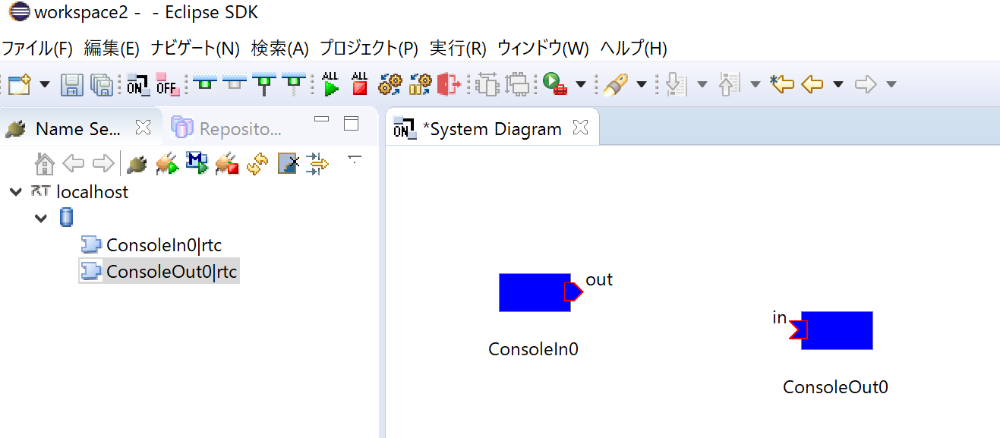

<!-- Titile: 動作確認(Linux編) -->
インストールが正常に終了したら、付属のサンプルで動作テストをします。サンプルは、通常は以下の場所にあります。

- /usr/share/openrtm-1.2/components/c++/examples
<!-- -/opt/local/share/openrtm-1.1/examples (Mac OS XにMacPortsでインストールした場合) -->


ソースからビルドした場合は、ソースディレクトリ以下の

- OpenRTM-aist/examples/<サンプルコンポーネントセット名>


サンプルコンポーネントセットSimpleIO(ソースからビルドした場合は、このコンポネントセット名のディレクトリ下にコンポーネントが実行可能なものと存在していますが、一括インストールスクリプトでインストールした場合は、上記のexamplesディレクトリ上に他のサンプルコンポーネント一と一緒に置かれていて特にSimpleIOというセット名に沿って別ディレクトリなどにまとめられてはいませんので、そのケースではコンポーネントセットとはConsoleInCompとConsoleOutCompの2つコンポーネントのセットだと理解してください)を使って、OpenRTM-aistが正しくインストール/ビルドされているかを確認します。

#contents


## サンプルコンポーネントセットSimpleIO

RTコンポーネントConsoleInComp、ConsoleOutCompからなるサンプルセットです。
ConsoleInCompはコンソールから入力された数値をOutPortから出力するコンポーネント、ConsoleOutCompはInPortに入力された数値をコンソールに表示するコンポーネントです。
これらは、基本的なI/O(入出力)を例示するためのサンプルです。
ConsoleInCompのOutPortからConsoleOutCompのInPortへ接続を構成し、これらの2つのコンポーネントをアクティブ化(Activate)することで動作します。

以降、簡単のためサンプルは/usr/share/openrtm-1.2/components/c++/examples以下にあるものとして説明を記述します。


## サンプルを使用したテスト

### RTSystemEditor、ネームサーバー起動
以下の手順に従ってRTSystemEditor、ネームサーバーを起動してください。

- [OpenRTP起動手順]({{ site.baseurl }}/ja/doc/installation/install_1_2/start_openrtp_linux_1_2)


### ConsoleInCompの起動

ターミナルを起動してConsoleInCompを起動します。

```
 $ /usr/share/openrtm-1.2/components/c++/examples/ConsoleInComp
```

自分でビルド・インストールした場合は、

```
 $ <source_dir>/OpenRTM-aist/examples/SimpleIO/ConsoleInComp
```

などとしてConsoleInCompを起動します。


### ConsoleOutCompの起動

別のターミナルを起動してConsoleOutCompを起動します。

```
 $ /usr/share/openrtm-1.2/components/c++/examples/ConsoleOutComp 
```

自分でビルド/インストールした場合は、同様に

```
 $ <source_dir>/OpenRTM-aist/examples/SimpleIO/ConsoleOutComp
```

などとしてConsoleOutCompを起動します。


#### エディタ画面への配置

RTSystemEditorのツリー表示の[localhost]の横の[>]をクリックし、そして<a href="icon_db.png"></a>アイコンの横の[>]をクリックすると、先ほど起動した2つのコンポーネントが登録されていることがわかります

<div align="center"><a href="rtm10.png"></a></div>
<div align="center"><strong>ConsoleInコンポーネントとConsoleOutコンポーネント</strong></div>

システムを編集するエディタを開きます。上部の[Open New System Editor]ボタン<div align="center"><a href="icon_open_editor.png"></a></div>; をクリックすると、中央のペインにエディタ画面が表示されます。

左側のネームサービスビューに <a href="icon-rtce.png"></a>のアイコンで表示されているコンポーネント(2つ)を中央のエディタ画面にドラッグアンドドロップします。

<div align="center"><a href="rtm11.png"></a></div>
<div align="center"><strong>コンポーネントをエディタに配置</strong></div>


#### 接続とアクティブ化

ConsoleIn0コンポーネントの右側にはデータが出力されるOutPort <a href="rtse_outport_icon.png"></a>; 、ConsoleOut0コンポーネントの左側にはデータが入力されるInPort <a href="rtse_inport_icon.png"></a> がそれぞれ配置されています。

これらInPort/OutPort(まとめてデータポートと呼びます)を接続します。

<div align="center"><a href="rtm13.png"></a></div>
<div align="center"><strong>データポートの接続</strong></div>

OutPortからInPort(またはInPortからOutPort)へドラッグランドドロップすると、図のようなダイアログが現れますので、デフォルト設定のまま[OK]ボタンをクリックします。

<div align="center"><a href="rtm12.png"></a></div>
<div align="center"><strong>データポート接続ダイアログ</strong></div>

2つのコンポーネントの間に接続線が現れます。次に、エディタ上部メニューの[All Activate]ボタン <a href="rtm14.png"></a> をクリックし、これらのコンポーネントをアクティブ化します。
アクティブ化されると、コンポーネントが緑色に変化します。

<div align="center"><a href="rtm15.png"></a></div>
<div align="center"><strong>アクティブ化されたコンポーネント</strong></div>

コンポーネントがアクティブ化されるとConsoleInコンポーネント側では

```
 Please input number: 
```

というプロンプト表示に変わりますので、適当な数値(short intの範囲内:32767以下)を入力しEnterキーを押します。
すると、ConsoleOut側では、入力した数値が表示され、ConsoleInコンポーネントからConsoleOutコンポーネントへデータが転送されたことがわかります。

以上で、コンポーネントの基本動作の確認は終了です。


