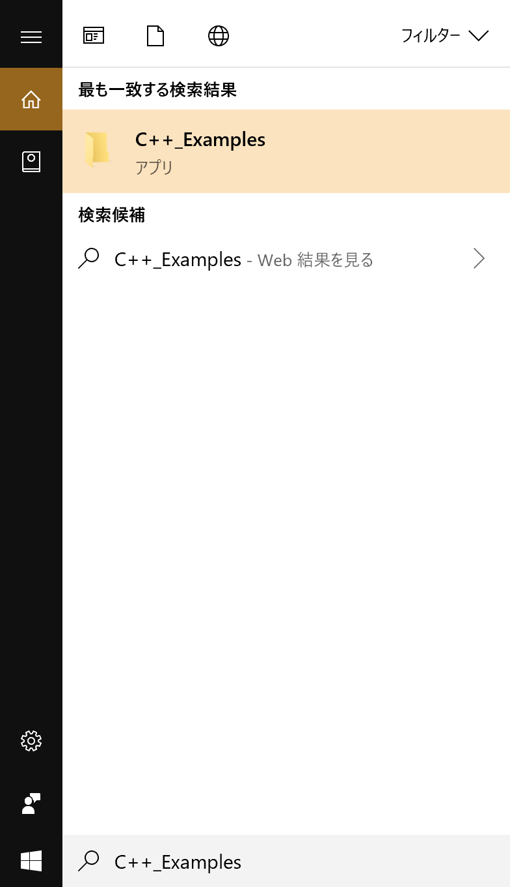
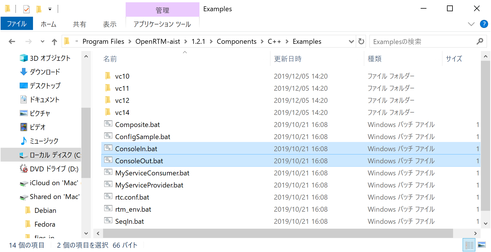
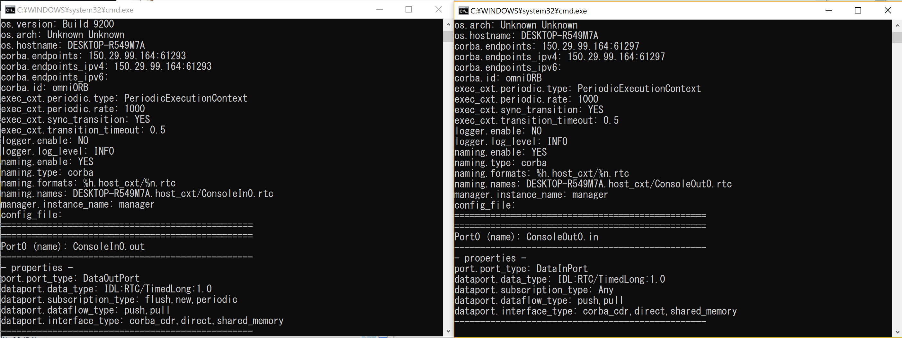
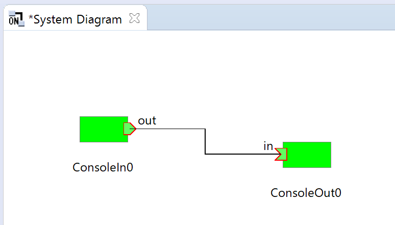

<!-- Title: 動作確認(Windows編) -->
#contents

## サンプルコンポーネントの場所

インストールまたはビルドが正常に終了したら、付属のサンプルで動作テストをします。
サンプルは、64bit版の場合、通常は以下の場所にあります。

- C:\Program Files\OpenRTM-aist\1.2.x\Components\C++\Examples
- OpenRTM-aist\examples (ソースからビルドした場合)

以下の手順で、サンプルコンポーネントセットSimpleIOを使用して、OpenRTM-aistが正しくビルド/インストールされているかを確認します。


## サンプル (SimpleIO)を使用した確認

RTコンポーネントConsoleIn、ConsoleOutからなるサンプルセットです。
ConsoleInはコンソールから入力された数値をOutPort から出力するコンポーネント、ConsoleOutはInPortに入力された数値をコンソールに表示するコンポーネントです。これらは簡単なI/O(入出力)を例示するためのサンプルです。
ConsoleInのOutPortからConsoleOutのInPortへ接続し、これらの2つのコンポーネントをアクティブ化(Activate)することで動作します。

以下は、MSIインストーラーでOpenRTM-aistをインストールした環境で、スタートメニューから各種プログラムを起動する前提で説明します。

### RTSystemEditor、ネームサーバーの起動
以下の手順に従ってRTSystemEditor、ネームサーバーを起動してください。

- [OpenRTP起動手順](/ja/node/6653)

### サンプルコンポーネントの起動
ネームサーバー起動後、適当なサンプルコンポーネントを起動します。

Windows 10の場合は右下の[ここに入力して検索]に**C++_Examples**と入力して、サンプルのディレクトリを開きます。

<div align="center"><a href="rtm7.png"></a></div>
<div align="center"><strong>ネームサーバーの起動を確認</strong></div>


<div align="center"><a href="rtm8.png"></a></div>
<div align="center"><strong>サンプルコンポーネントディレクトリ</strong></div>

「ConsoleIn.bat」「ConsoleOut.bat」をそれぞれダブルクリックして2つのコンポーネントを起動します。

## Windows Defenderからの警告

サンプルコンポーネントを起動しようとすると、Windows Defenderのファイアウォールにより[Windows セキュリティの重要な警告]ダイアログが表示されることがあります。[プライベート ネットワーク(ホームネットワークや社内ネットワークなど)(R)]にチェックを入れ[パブリックネットワーク(空港、喫茶店など)(非推奨)(U)]のチェックをはずしてアクセスを許可する(A)]をクリックしてください。このダイアログはWindows 10(build 1903)以外だと別のダイアログが表示されることがありますし、設定によっては表示されないこともあります。表示された場合は同様の設定をしてダイアログを閉じてください。

## サンプルコンポーネント起動後の画面

起動後数秒で下図のような2つのコンソール画面が開きます。

<div align="center"><a href="rtm9.png"></a></div>
<div align="center"><strong>ConsoleInコンポーネントとConsoleOutコンポーネント</strong></div>


### コンポーネントが起動しない場合

コンポーネントが起動しない場合、いくつかの原因が考えられます。

#### コンソール画面が開いてすぐに消える

環境変数**RTM_VC_VERSION**、**OMNI_ROOT**、**RTM_ROOT**が設定されていないとRTCの起動に失敗します。
MSIインストーラーでインストールした場合はOSを再起動すると解決する場合があります。


また、rtc.confの設定に問題があり、起動できないケースがあります。上記の**C++_Example**を用いて検索したフォルダー下のVCxx(Visual Studio 2019使用時はVC14)にある[rtc.conf]を開いて設定を確認してください。
例えば、corba.endpoint/corba.endpointsなどの設定が現在実行中のPCホストのIPアドレスとミスマッチを起こしている場合などは、CORBAが異常終了します。

以下のような内容(最低限の設定)にrtc.confを書きなおして試してみてください。

```
 corba.nameservers: localhost
```


#### ランタイムエラーが出て終了する

ライブラリなどが適切にインストールされていなかったり、設定されていないなどの原因でラインタイムエラーが発生する場合があります。その場合は下記の方法を試してみてください。
- 再起動してみる
- OpenRTM-aistをすべてアンインストールし、再度インストールすることで改善される場合があります。

### RTSystemEditorでのエディタ画面への配置

RTSystemEditorのツリー表示内の[localhost]‘の横の[>]をクリックし、そして<a href="icon_db.png"></a>アイコンの横の[>]をクリックすると、先ほど起動した2つのコンポーネントが登録されていることがわかります。

<div align="center"><a href="rtm10.png"></a></div>
<div align="center"><strong>ConsoleInコンポーネントとConsoleOutコンポーネント</strong></div>

システムを編集するエディタ(System Diagram)を開きます。上部の[Open New System Editor]ボタン<a href="icon_open_editor_ja.png"></a>をクリックすると、中央のペインにエディタ（System Diagram)画面が開きます。

左側のネームサービスビューから<a href="icon-rtce.png"></a>のアイコンで表示されているコンポーネント(2つ)を中央のエディタ・エリアにドラッグアンドドロップします。

<div align="center"><a href="rtm11.png"></a></div>
<div align="center"><strong>コンポーネントをSystem Diagramに配置</strong></div>


#### 接続とアクティブ化

ConsoleIn0コンポーネントの右側にはデータが出力されるOutPort <a href="rtse_outport_icon.png"></a>が、ConsoleOut0コンポーネントの左側にはデータが入力されるInPort <a href="rtse_inport_icon.png"></a>;が、それぞれ配置されています。

<div align="center"><a href="rtm13.png"></a></div>
<div align="center"><strong>データポートの接続</strong></div>

これら InPort/OutPort(まとめてデータポートと呼びます)を接続します。OutPortからInPort(またはInPortからOutPort)へドラッグランドドロップすると、図のようなダイアログが現れますので、デフォルト設定のまま[OK]ボタンをクリックします。

<div align="center"><a href="rtm12.png"></a></div>
<div align="center"><strong>データポート接続ダイアログ</strong></div>


2つのコンポーネントの間に接続線が現れます。次に、エディタ上部メニューの[All Activate]ボタン <a href="rtm14.png"></a>をクリックし、これらのコンポーネントをアクティブ化します。アクティブ化されると、コンポーネントが緑色に変化します。

<div align="center"><a href="rtm15.png"></a></div>
<div align="center"><strong>アクティブ化されたコンポーネント</strong></div>


コンポーネントがアクティブ化されるとConsoleInコンポーネント側のコンソール上の表示が

```
 Please input number: 
```

というプロンプト表示に変わりますので、適当な数値(short int の範囲内:32767以下)を入力しEnterキーを押してください。
すると、ConsoleOut側のコンソール画面にも入力した数値が表示され、ConsoleInコンポーネントからConsoleOutコンポーネントへデータが転送されたことがわかります。

以上で、コンポーネントの基本動作の確認は終了です。


## 他のサンプル

インストーラーには、このほかにもいくつかのサンプルコンポーネントが付属しています。これらのコンポーネントも同様に、ダブルクリックで起動、そしてRTSystemEditorを用いてポート間を接続し、アクティブ化することで試すことができます。

付属しているコンポーネント起動用バッチファイルのリストと簡単な説明を以下に示します。

<table class="table-alt">
  <tr>
    <td>ConsoleIn.bat</td>
    <td>LEFT:コンソールから入力された数値をOutPortから出力する<span style="color:default;">ConsoleInコンポーネント</span>; を起動します。ConsoleOutに接続して使用します。</td>
  </tr>
  <tr>
    <td>ConsoleOut.bat</td>
    <td>InPortに入力された数値をコンソールに表示する<span style="color:default;">ConsoleOutコンポーネント</span>;  を起動します。ConsoleInに接続して使用します。</td>
  </tr>
  <tr>
    <td>SeqIn.bat</td>
    <td>ランダムな数値(Short、Long、Float、Doubleとそのシーケンス型)を出力する<span style="color:default;">SequenceInComponentコンポーネント</span>;を起動します。SequenceOutComponentに接続して使用する。</td>
  </tr>
  <tr>
    <td>SeqOut.bat</td>
    <td>InPortに入力される数値(Short、Long、Float、Doubleとそのシーケンス型)を表示する<span style="color:default;">SequenceOutComponent</span>;を起動します。SequenceInComponentに接続して使用します。</td>
  </tr>
  <tr>
    <td>MyServiceProviderComp.bat</td>
    <td>MyService型のサービスを提供する<span style="color:default;">MyServiceProviderコンポーネント</span>; を起動します。MyServiceConsumerに接続して使用します。</td>
  </tr>
  <tr>
    <td>MyServiceConsumerComp.bat</td>
    <td>MyService型のサービスを提供する<span style="color:default;">MyServiceConsumerコンポーネント</span>; を起動します。MyServiceProviderに接続して使用します。</td>
  </tr>
  <tr>
    <td>ConfigSample.bat</td>
    <td>Configuration機能の使用例のサンプル<span style="color:default;">ConfigSampleコンポーネント</span>; を起動します。RtcLinkからConfigurationを変更してConfigurationの挙動を理解するためのサンプルです。</td>
  </tr>
  <tr>
    <td>Composite.bat</td>
    <td>複合コンポーネント作成サンプル<span style="color:default;">PeriodicECSharedComponentコンポーネント</span>; を起動します。Sensor、Controller、Motorの3つサブ・コンポネントを複合しています。 ConsoleInなどのコンポーネント接続して使ってみると良いでしょう。</td>
  </tr>
</table>


