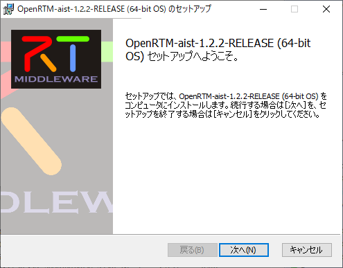
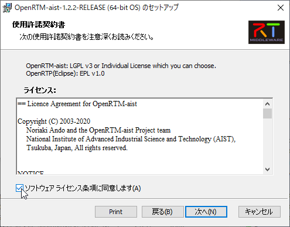
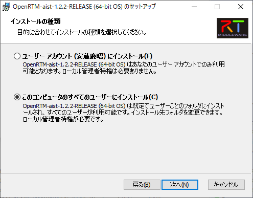
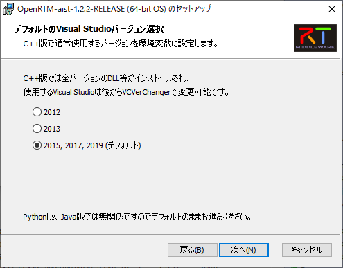
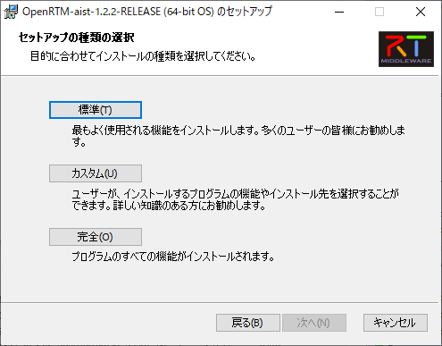
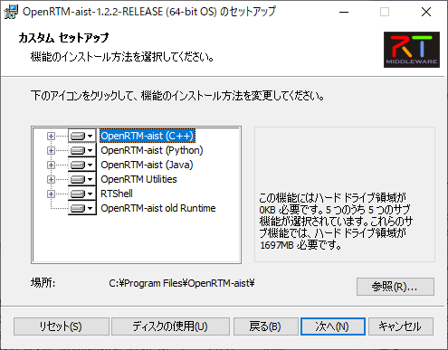
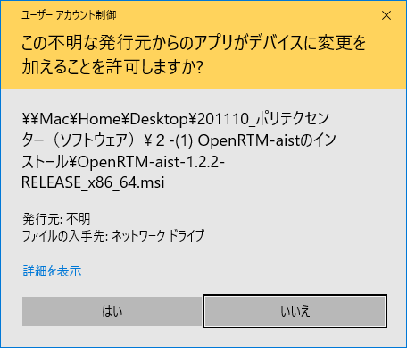

<br>
<a>No English version available.
</a>

<!-- Title: Windowsへのインストール -->
<div align="right"><a href="windows10-logo.png"></a></div>
#contents

## インストールの準備

### 32bit版と64bit版

現状、ほとんどのWindowsは64bit版が利用されていますので、基本的には以下は 64bit を前提として説明します。
インストールしているWindowsが32bit版の場合は、OpenRTM-aistやその他のソフトウェアは32bit版をインストールする必要があります。

<span style="color:red;">**NOTE: 基本的にすべて64bit版のソフトウェアを使用してください。**</span>;

<!-- MSIインストーラーによるOpenRTM-aistのインストール手順については下記のページに記載。 -->
<!-- - [[OpenRTM-aist 1.2系のインストール(Windows、MSIインストーラー使用):/ja/node/6652]] -->


### 必要なソフトウエアのインストール
OpenRTM-aistを利用するには、Python、CMake、Doxygen、Visual Studio等のソフトウェアのインストールが必要です。

#### Visual Studio

C++版の開発だけでなく、Python版、Java版のRTCを作成した際に、インストーラをビルドするのにも必要です。
以下のCommunity版（無料）をインストールするか、別途Visual Studio 2010/2012/2013/2015/2017/2019を入手してインストールしてください。

- [Microsoft **Download Visual Studio 2019**](https://visualstudio.microsoft.com/ja/downloads/?utm_source=mscom&utm_campaign=msdocs)
  - C++の開発環境を入れ忘れることがよくあります。以下の説明を一読することをお勧めします。
  - [OpenRTM.org **Visual Studioのインストール方法**](./visual_studio_1_2/visual_studio_2022) 

#### Python
<span style="color:red;">**NOTE:** Python2.7は2020年4月にサポートが終了しました。使用は推奨されていません。</span>;
<span style="color:gray;">OpenRTM-aist-1.2.2でもPython2.7は一応利用することはできます。</span>;

PythonはPython言語版のRTCの開発だけでなく、OpenRTM-aistの様々なツールでも使用していますので必ずインストールする必要があります。
2020年11月現在、サポートが提供されているPythonは 3.6, 3.8, 3.7, 3.9 (2020年10月リリース) ですが、OpenRTM-aistがサポートしているのは 3.6～3.8 までです。
最新版をインストールすることをお勧めします。

- [Python 3.8](https://www.python.org/downloads/windows/)
  - [python-3.8.5-amd64.exe (64bit版)](https://www.python.org/ftp/python/3.8.5/python-3.8.5-amd64.exe)
  - できるだけ最新版をインストールしてください。

#### CMake
CMakeはWindowsやLinux等様々な環境でビルドに必要なファイル（Visual Studioのプロジェクトファイル、Linux上のMakefile等）を自動生成するために必要です。

- [CMake(3.11以上推奨)](https://cmake.org/download/)
  - [cmake-3.18.1-win64-x64.msi (64bit版)](https://github.com/Kitware/CMake/releases/download/v3.18.1/cmake-3.18.1-win64-x64.msi)
  - できるだけ最新版をインストールしてください。


#### Doxygen & Graphviz

Doxygenは、ソースコード等のコメントからドキュメントを自動生成するツールです。
Graphvizは、Doxygenでドキュメントを生成する際に、クラス図等の図を生成するために必要とされるツールです。
OpenRTM-aistでは、RTCBuilderでRTCの設計時に様々な設計情報を記入することができ、それらはソースコードのコメントとして出力されます。
これをDoxygenで処理することで、RTCのキレイなドキュメントを生成することができます。

- [Doxygen](http://www.doxygen.nl/download.html)
  - [doxygen-1.8.19-setup.exe](http://doxygen.nl/files/doxygen-1.8.19-setup.exe) (32bit, 64bitの別なし）
  - できるだけ最新版をインストールしてください。

&aname(Graphviz);
- [Graphviz](https://graphviz.gitlab.io/download/)
  - [graphviz-install-2.44.1-win64.exe:](https://www2.graphviz.org/Packages/stable/windows/10/cmake/Release/x64/graphviz-install-2.44.1-win64.exe)

インストールの途中で[Install Options]としてsystem PATHをどうするかを聞かれますが、Add CMake to the system PATH for all usersを選択することを推奨します。
上記WebページからWindows版のバイナリ実行形式ファイルをダウンロードして実行してインストールしてください。

インストール後、コマンドプロンプトで dot -v を実行してプラグイン情報が表示されることを確認して下さい。
```
 >dot -v

 dot - graphviz version 2.44.1 (20200629.0846)
 libdir = "C:\Program Files\Graphviz 2.44.1\bin"
 Activated plugin library: gvplugin_dot_layout.dll
 Using layout: dot:dot_layout
 Activated plugin library: gvplugin_core.dll
 Using render: dot:core
 Using device: dot:dot:core
 The plugin configuration file:
        C:\Program Files\Graphviz 2.44.1\bin\config6
                was successfully loaded.
    render      :  cairo dot dot_json fig gdiplus json json0 map mp pic ps svg tk vml xdot xdot_json
    layout      :  circo dot fdp neato nop nop1 nop2 osage patchwork sfdp twopi
    textlayout  :  textlayout
    device      :  bmp canon cmap cmapx cmapx_np dot dot_json emf emfplus eps fig gif gv imap imap_np ismap jpe jpeg jpg json 
                      json0 metafile mp pdf pic plain plain-ext png ps ps2 svg tif tiff tk vml xdot xdot1.2 xdot1.4 xdot_json
    loadimage   :  (lib) bmp eps gif jpe jpeg jpg png ps svg
```

下記のように表示された場合、管理者でコマンドプロンプトを開き、dot -c を実行後に dot -v を実行すると上記のように表示されます。
```
 >dot -v

 dot - graphviz version 2.44.1 (20200629.0846)
 There is no layout engine support for "dot"
 Perhaps "dot -c" needs to be run (with installer's privileges) to register the plugins?
```

管理者でコマンドプロンプトを開く方法は、Windows10の検索窓に cmd と入力し、検索結果の「コマンドプロンプト」を右クリックして「管理者として実行」を選択します。

## OpenRTM-aistのインストール

上記のソフトウェアのインストールが完了したら、OpenRTM-aistのインストールを行います。

### インストーラのダウンロード

OpenRTM-aistのWindows版のインストーラ（msi形式）を以下のページからダウンロードします。

- [OpenRTM-aist-1.2.2-RELEASE]({{ site.baseurl }}/en/download)
  - [OpenRTM-aist-1.2.2-RELEASE_x86_64.msi (64bit版)](https://github.com/OpenRTM/OpenRTM-aist/releases/download/v1.2.2/OpenRTM-aist-1.2.2-RELEASE_x86_64.msi)

このインストーラには、以下の内容が含まれています。

- C++ 用開発環境
  - C++用過去バージョンのDLL (古いRTC実行時に必要)
- Python 用開発環境
- Java 用開発環境
- OpenRTP (GUIツール、RTCBUilder，RTSystemEditor）
  - JRE8環境 (OpenRTPに必要）
- rtshell (CUIツール）

したがって、ファイルサイズが1GB近くあり、ダウンロードに多少時間がかかります。ご注意ください。

### インストール

msiファイルが正しくダウンロードされたら、ファイルをダブルクリックしてインストールを開始してください。
以下のようなインストーラが起動しますので **「次へ」** をクリックして進みます。

<div align="center"><a href="openrtm122_inst_01.png"></a></div>

使用許諾契約書が表示されますので、**ソフトウェアライセンス条項に同意します** にチェックを入れます。
なお、OpenRTM-aist は LGPLｖ３、OpenRTPはEPL v1.0 ライセンスです。

<div align="center"><a href="openrtm122_inst_02.png"></a></div>

ユーザアカウントごとにインストールするか、すべてのユーザが使えるようにインストールするか選択します。
現在インストールを行っているアカウントが管理者権限があれば、**「すべてのユーザにインストール」** を推奨します。

<div align="center"><a href="openrtm122_inst_03.png"></a></div>

使用しているVisual Studioのバージョンを選択します。

<div align="center"><a href="openrtm122_inst_04.png"></a></div>

セットアップの種類を選択します。**「標準」**と**「完全」**は同じで、すべての項目をインストールします。通常か **「標準」** を選択します。

<div align="center"><a href="openrtm122_inst_05.png"></a></div>

**「カスタム」** をクリックすると、インストールする項目を選択できます。特定の言語のみインストールしたい場合などはこちらを選択します。

<div align="center"><a href="openrtm122_inst_06.png"></a></div>

インストールを開始すると、以下のようなダイアログが出ます。**「はい」** をクリックして先へ進んでください。

<div align="center"><a href="openrtm122_inst_08.png"></a></div>

すべてインストールが完了すると以下の画面となります。**「完了」** を押してウインドウを閉じてください。
以上でインストールは完了です。正しくインストールされているかどうかは、[「OpenRTMを10分で始めよう・サンプルコンポーネント」]({{ site.baseurl }}/en/doc/installation/lets_start121) などを見ながらサンプルコンポーネントを実行するなどして確認してください。


<br>

## インストーラーの作業内容

インストーラーは以下の作業内容に従ってファイルのコピー、システム設定を行います。
インストール、アンインストールが正しく行われているかの確認する際の参考のために以下に記しておきます。

- インストールディレクトリ(デフォルトはC:\Program Files)下に各種ファイルをコピー
- スタートメニュー以下にOpenRTM-aistフォルダーを作成し各種ショートカットを設定
- 環境変数の設定
 - 64bit用MSI利用時の設定

```
 RTM_BASE=C:\Program Files\OpenRTM-aist\\
 RTM_ROOT=C:\Program Files\OpenRTM-aist\1.2.1\\
 RTM_VC_VERSION= //ここにはユーザーが指定したVisual StudioにのっとったVCのバージョンを指定するテキストが入ります
 RTM_JAVA_ROOT=C:\Program Files\OpenRTM-aist\1.2.1\\
 OMNI_ROOT=C:\Program Files\OpenRTM-aist\1.2.1\omniORB\4.2.3_%RTM_VC_VERSION%\\
 OpenCV_DIR=C:\Program Files\OpenRTM-aist\1.2.1\OpenCV3.4\\
 OpenRTM_DIR=C:\Program Files\OpenRTM-aist\1.2.1\cmake\\
```

 - PATHへの追加設定(64bit用MSI利用時の設定)

```
 C:\Program Files\OpenRTM-aist\1.2.1\bin\%RTM_VC_VERSION%\\
 C:\Program Files\OpenRTM-aist\1.2.1\omniORB\4.2.1_%RTM_VC_VERSION%\bin\x86_win32\\
 C:\Program Files\OpenRTM-aist\1.2.1\OpenCV3.4\%RTM_VC_VERSION%\bin\\
```

 - 32bit用MSI利用時の設定

```
 RTM_BASE=C:\Program Files (x86)\OpenRTM-aist\\
 RTM_ROOT=C:\Program Files (x86)\OpenRTM-aist\1.2.1\\
 RTM_VC_VERSION= //ここにはユーザーが指定したVisual StudioにのっとったVCのバージョンを指定するテキストが入ります
 RTM_JAVA_ROOT=C:\Program Files (x86)\OpenRTM-aist\1.2.1\\
 OMNI_ROOT=C:\Program Files\OpenRTM-aist\1.2.1\omniORB\4.2.3_%RTM_VC_VERSION%\\
 OpenCV_DIR=C:\Program Files\OpenRTM-aist\1.2.1\OpenCV3.4\\
 OpenRTM_DIR=C:\Program Files\OpenRTM-aist\1.2.1\cmake\\
```

 - PATHへの追加設定

```
 C:\Program Files (x86)\OpenRTM-aist\1.2.1\bin\%RTM_VC_VERSION%\\
 C:\Program Files(x86)\OpenRTM-aist\1.2.1\omniORB\4.2.3_%RTM_VC_VERSION%\bin\x86_win32\\
 C:\Program Files(x86)\OpenRTM-aist\1.2.1\OpenCV3.4\x86\%RTM_VC_VERSION%\bin\\
```

<!--  -->
<!-- インストール環境の設定を確認するスクリプトを提供しています。スクリプトの使い方、確認できる内容について下記ページで解説しています。 -->
<!--  -->
<!-- - http://openrtm.org/openrtm/ja/content/rtm-install-check-script -->
<!--  -->
## インストールされるファイル
ファイルは以下のような構造でインストールされます。<br>
<!-- 上記のインストール環境の設定を確認する[[スクリプト:/ja/node/6092]]を実行すると、treeコマンドによるOpenRTM-aist下のディレクトリ構造をログファイルに保存しますので、詳細を確認できます。  -->


 `<install_dir>`
   + OpenRTM-aist
      + 1.x.x  :旧バージョンのランタイム
      + 1.2.1
         + bin: dll、lib各種コマンド
         + cmake: OpenRTMConfig.cmake
         + coil: coilヘッダファイル
         + Components
            + C++
               + Examples: C++サンプルコンポーネント
               + OpenCV: OpenCVのC++サンプルコンポーネント
            + Java: Java サンプルコンポーネント
            + Python: Python サンプルコンポーネント
         + etc: rtc.confサンプル
         + jar: jarファイル
         + jre: OpenJDK JRE
         + omniORB
         + OpenCV3.4
         + rtm: OpenRTM-aistヘッダファイル
            + ext: 拡張モジュール用ファイル 
            + idl: OpenRTM-aistIDLファイル
         + util
            + ExcelControlpy: PythonベースのMicrosoft Office用RTC
            + OpenRTP: RTCBuilderとRTSystemEditorツール
            + PowerPointControlpy: Microsoft Office PowerPoint用RTC
            + python_dist: pythonベースツール共通ライブラリ
            + RTCDT: PythonベースRTCの開発を支援するツール
            + rtc-template: RTCBuilderと似た機能を提供する古いツール
            + RTSystemEditor: RTSystem Editorのみのファイル
            + VCVerChanger: 使用しているVisual Studioのバージョンを指定するツール
            + WordContrlpy: PythonベースMicrosoft Office Word用RTC


