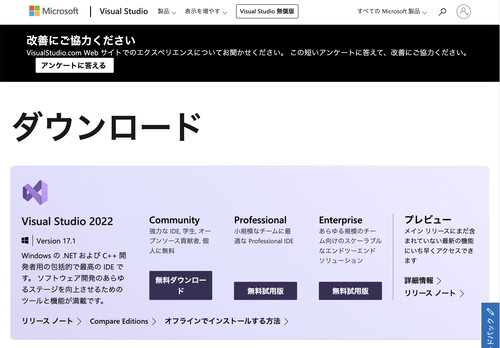
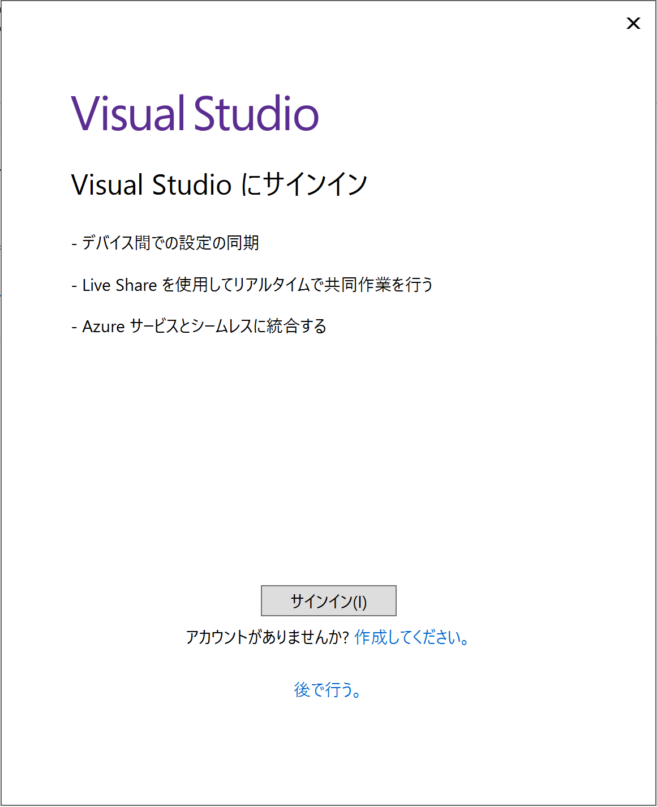
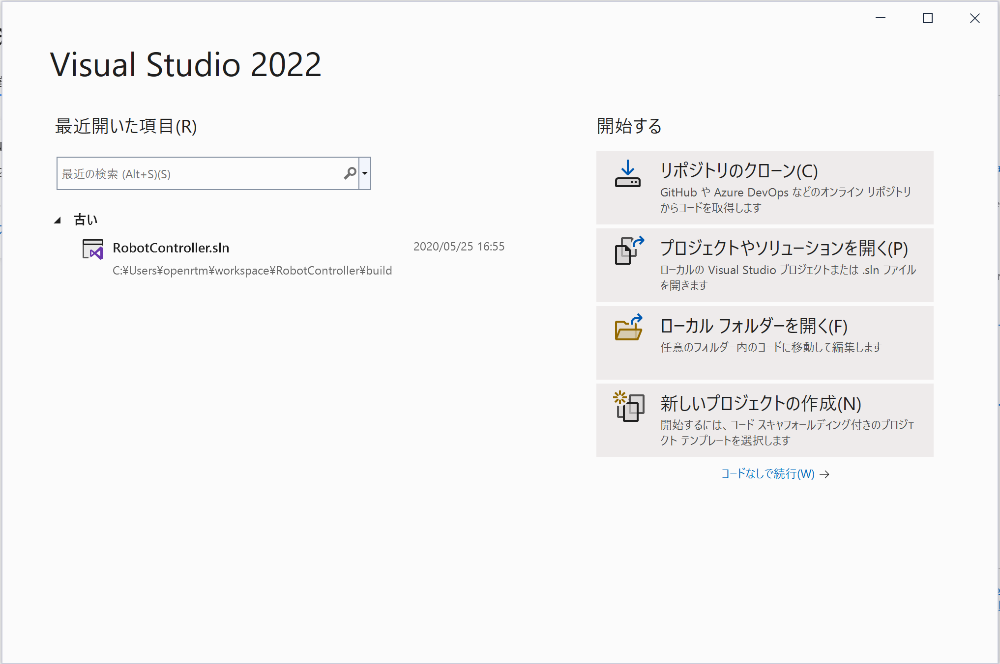

-------jp page!!-------

<!-- Title: Visual Studio Community 2022のインストール -->
#contents

## インストーラーの入手
以下のページからVisual Studio Community 2022のインストーラーを入手してください

- [Visual Studioのダウンロード](https://visualstudio.microsoft.com/ja/downloads/?utm_source=mscom&utm_campaign=msdocs)

[**Community**]とラベルされた下の[**無料ダウンロード**]ボタンをクリックするとインストーラーのダウンロードが始まります。 

## インストーラーの実行
ダウンロードが終了したら、ダウンロードしたファイルを開いて実行してください。指示にしたがってクリックしていくと以下の画面が表示されるので、[**C++によるデスクトップ開発**]にチェックを入れて[**インストール**]ボタンをクリックしてください。

#clear

## インストールの確認

インストールが完了するとサインインを求める画面が表示されるため、Microsoftアカウントでサインインしてください。サインインしなくても30日間は使用できます。
Microsoftアカウントの手順は以下を参考にしてください。

[新しいMicrosoftアカウントを作成する方法](https://support.microsoft.com/ja-jp/help/4026324/microsoft-account-how-to-create)

## C++コンパイラがインストールされているかの確認

C++によるデスクトップ開発機能がインストールされているかを必ず確認してください。

Visual C++のプロジェクトを作成できれば問題ありません。
まず、[**新しいプロジェクトの作成**]をクリックしてください。

この時、 
[**空のプロジェクト** 
Windows用にC++で最初から始めます。開始ファイルは提供しません] 
などが選択肢にあればインストールに問題ありません。

インストールされていない場合は、 
[探しているものが見つからない場合 
**さらにツールと機能をインストールする**] 
をクリックするとインストーラーが起動するので、[’’C++によるデスクトップ開発機能’’]をインストールしてください。

 

-------jp page!!-------
