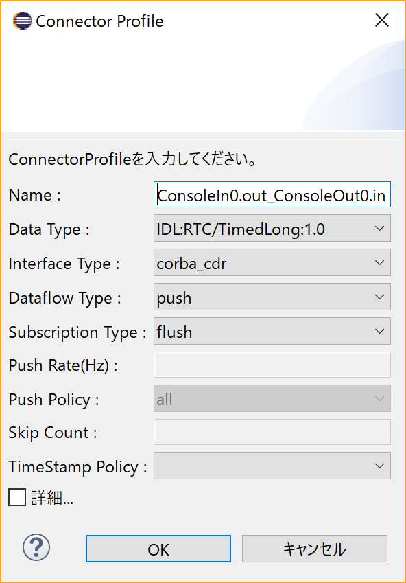

<br>
<a>No English version available.
</a>

<!-- Title: 動作確認(Linux編) -->
インストールが正常に終了したら、付属のサンプルで動作テストをします。サンプルは、通常は以下の場所にあります。
- /usr/share/openrtm-1.2/components/java/
<!-- -/opt/local/share/openrtm-1.1/examples (Mac OS X に MacPorts でインストールした場合) -->

ソースからビルドした場合は、ソースディレクトリ以下の
- OpenRTM-aist-Java/jp.go.aist.rtm.RTC/bin/RTMExamples/<サンプルコンポーネントセット名>

にあります。

サンプルコンポーネントセットSimpleIOを使って、OpenRTM-aistが正しくビルド・インストールされているかを確認します。

#contents(5)

## サンプルコンポーネントセットSimpleIO
RTコンポーネントConsoleIn、ConsoleOutからなるサンプルセットです。
ConsoleInはコンソールから入力された数値をOutPortから出力するコンポーネント、ConsoleOutはInPortに入力された数値をコンソールに表示するコンポーネントです。
これらは、最も簡単な(Simpleな)I/O(入出力)を例示するためのサンプルです。
ConsoleInのOutPortからConsoleOutのInPortへ接続を構成し、これらの2つのコンポーネントをアクティブ化(Activate)することで動作します。

以降、簡単のためサンプルは/usr/share/openrtm-1.2/components/java/SimpleIO以下にあるものとして説明を記述します。

## サンプルを使用したテスト
### ネームサーバー起動
以下の手順に従ってRTSystemEditor、ネームサーバーを起動してください。

- [OpenRTP起動手順]({{ site.baseurl }}/en/doc/installation/install_1_2/start_openrtp_linux_1_2)


### ConsoleInの起動

ターミナルを起動してConsoleInを起動します。

```
 $ sh /usr/share/openrtm-1.2/components/java/ConsoleIn.sh
```

自分でビルド・インストールした場合は、まず環境変数CLASSPATHの設定が必要です。

```
 export CLASSPATH=.:${RTM_JAVA_ROOT}/jar/OpenRTM-aist-1.2.0.jar: \ 
 ${RTM_JAVA_ROOT}/jar/commons-cli-1.1.jar: \ 
 ${RTM_JAVA_ROOT}/jar/jna-4.2.2.jar:${RTM_JAVA_ROOT}/jar/jna-platform-4.2.2.jar: \ 
 ${RTM_JAVA_ROOT}/bin
```

```
 $ java RTMExamples.SimpleIO.ConsoleInComp
```

などとしてConsoleInを起動します。


### ConsoleOutの起動

別のターミナルを起動してConsoleOutを起動します。

```
 $ sh /usr/share/openrtm-1.2/components/java/ConsoleOut.sh
```

自分でビルド・インストールした場合は以下のコマンドで実行します。

```
 $ java RTMExamples.SimpleIO.ConsoleOutComp
```

などとしてConsoleOutを起動します。


### エディタへの配置

RTSystemEditorのツリー表示の[>]をクリックすると、先ほど起動した2つのコンポーネントが登録されていることがわかります。

<div align="center"><a href="rtm10.png"></a></div>
<div align="center"><strong>ConsoleInコンポーネントとConsoleOutコンポーネント</strong></div>

システムを編集するエディタを開きます。上部のエディタを[Open New System Editor]ボタン<a href="rtse_open_editor_icon_ja.png"></a> をクリックすると、中央のペインにエディタが開きます。

左側のネームサービスビューに <a href="icon-rtce.png"></a> のアイコンで表示されているコンポーネント(2つ)を中央のエディタにドラッグアンドドロップします。

<div align="center"><a href="rtm11.png"></a></div>
<div align="center"><strong>コンポーネントをエディタに配置</strong></div>


### 接続とアクティブ化

ConsoleIn0コンポーネントの右側にはデータが出力されるOutPort <a href="rtse_outport_icon_n.png"></a> 、ConsoleOut0コンポーネントの左側にはデータが入力される InPort <a href="rtse_inport_icon_n.png"></a> がそれぞれついています。

これらInPort/OutPort(まとめてデータポートと呼びます)を接続します。
OutPortからInPort(またはInPortからOutPort)へドラッグランドドロップすると、図のようなダイアログが現れますので、デフォルト設定のまま[OK]ボタンをクリックします。

<div align="center"><a href="rtm13.png"></a></div>
<div align="center"><strong>データポートの接続</strong></div>

<div align="center"><a href="rtm12.png"></a></div>
<div align="center"><strong>データポート接続ダイアログ</strong></div>


2つのコンポーネントの間に接続線が現れます。次に、エディタ上部メニューの[Activate Systems]ボタン <a href="rtm14.png"></a> をクリックし、これらのコンポーネントをアクティブ化します。
アクティブ化されると、コンポーネントが緑色に変化します。

<div align="center"><a href="rtm15.png"></a></div>
<div align="center"><strong>アクティブ化されたコンポーネント</strong></div>


コンポーネントがアクティブ化されるとConsoleInコンポーネント側では

```
 Please input number: 
```

というプロンプト表示に変わりますので、適当な数値(short intの範囲内:32767以下)を入力しEnterキーを押します。
すると、ConsoleOut側では、入力した数値が表示され、ConsoleInコンポーネントからConsoleOutコンポーネントへデータが転送されたことがわかります。

以上で、コンポーネントの基本動作の確認は終了です。


