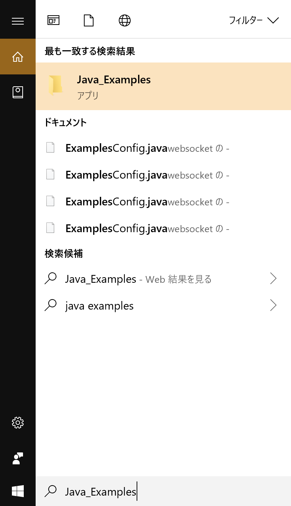
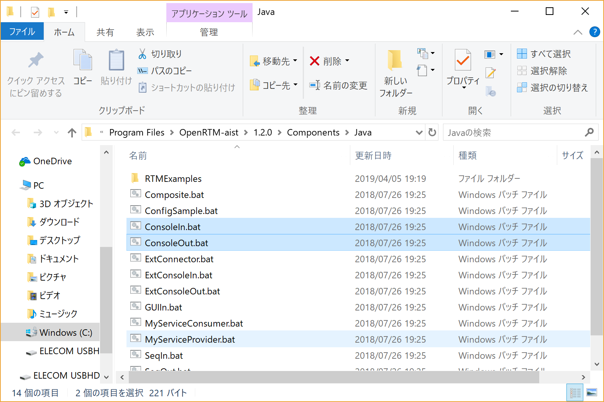
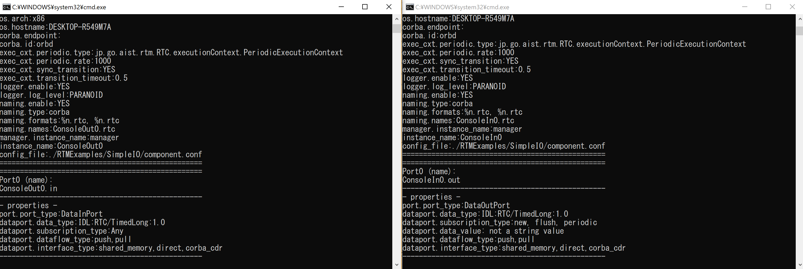
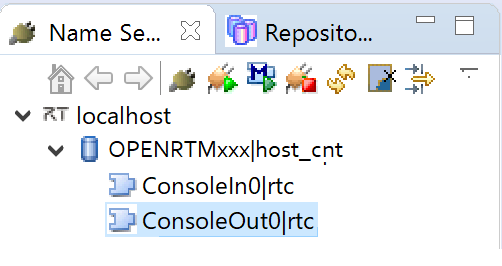

<!-- Title: 動作確認(Windows編) -->
#contents

## サンプルコンポーネントの場所

インストールまたはビルドが正常に終了したら、付属のサンプルで動作テストをします。
サンプルは、通常は以下の場所にあります。

- C:\Program Files\OpenRTM-aist\1.2.1\Components\Java
- OpenRTM-aist\jp.go.aist.rtm.RTC\bin\RTMExamples(ソースからビルドした場合)

サンプルコンポーネントセットSimpleIOを使って、OpenRTM-aistが正しくビルド・インストールされているかを確認します。


## サンプル(SimpleIO)を使用したテスト

RTコンポーネントConsoleIn、ConsoleOutからなるサンプルセットです。
ConsoleInはコンソールから入力された数値をOutPortから出力するコンポーネント、ConsoleOutはInPortに入力された数値をコンソールに表示するコンポーネントです。
これらは、最も簡単な(Simpleな)I/O(入出力)を例示するためのサンプルです。
ConsoleInのOutPortからConsoleOutのInPortへ接続を構成し、これらの2つのコンポーネントをアクティブ化(Activate)することで動作します。

以下は、msiインストーラーでOpenRTM-aistをインストールした環境で、スタートメニューから各種プログラムを起動する前提での説明です。

### RTSystemEditor、ネームサーバー起動
以下の手順に従ってRTSystemEditor、ネームサーバーを起動してください。

- [OpenRTP起動手順]({{ site.baseurl }}/ja/doc/installation/install_1_2/start_openrtp_proc_windows_1_2)

### サンプルコンポーネントの起動
ネームサーバー起動後、適当なサンプルコンポーネントを起動します。

Windows 10の場合は右下の[ここに入力して検索]に**Java_Examples**と入力してサンプルのフォルダーを開きます。

<div align="center"><a href="rtm27.png"></a></div>
<div align="center"><strong>ネームサーバーの起動を確認</strong></div>

<div align="center"><a href="rtm28.png"></a></div>
<div align="center"><strong>サンプルコンポーネントフォルダー</strong></div>

ここでは、「ConsoleIn.bat」「ConsoleOut.bat」をそれぞれダブルクリックして2つのコンポーネントを起動します。
起動すると、下図のような2つのコンソール画面が開きます。

<div align="center"><a href="rtm29.png"></a></div>
<div align="center"><strong>ConsoleInコンポーネントとConsoleOutコンポーネント</strong></div>

#### コンポーネントが起動しない場合

コンポーネントが起動しない場合、いくつかの原因が考えられます。

##### コンソール画面が開いてすぐに消える

環境変数**RTM_ROOT**、**RTM_JAVA_ROOT**が正しく設定されていない場合に問題が発生する可能性があります。
msiインストーラーでインストールした場合はOSを再起動すると解決する場合があります。


また、rtc.confの設定に問題があり、起動できないケースがあります。上記スタートメニューフォルダーの[rtc.conf for examples]を開いて設定を確認してください。
例えば、corba.endpoint/corba.endpointsなどの設定が現在実行中のPCのホストアドレスとミスマッチを起こしている場合などは、CORBAが異常終了します。

以下のような最低限のrtc.confに設定しなおして試してみてください。

```
 corba.nameservers: localhost
```


#### エディタへの配置

RTSystemEditorのツリー表示の[>]をクリックすると、先ほど起動した2つのコンポーネントが登録されていることがわかります。

<div align="center"><a href="rtm10.png"></a></div>
<div align="center"><strong>ConsoleInコンポーネントとConsoleOutコンポーネント</strong></div>

システムを編集するエディタを開きます。上部のエディタを[Open New System Editor]ボタン<a href="rtse_open_editor_icon_ja.png"></a> をクリックすると、中央のペインにエディタが開きます。

左側のネームサービスビューに <a href="icon-rtce.png"></a> のアイコンで表示されているコンポーネント(2つ)を中央のエディタにドラッグアンドドロップします。

<div align="center"><a href="rtm11.png"></a></div>
<div align="center"><strong>コンポーネントをエディタに配置</strong></div>


#### 接続とアクティブ化

ConsoleIn0コンポーネントの右側にはデータが出力されるOutPort <a href="rtse_outport_icon_n.png"></a> 、ConsoleOut0コンポーネントの左側にはデータが入力されるInPort <a href="rtse_inport_icon_n.png"></a>がそれぞれついています。

これらInPort/OutPort(まとめてデータポートと呼びます)を接続します。
OutPortからInPort(またはInPortからOutPort)へドラッグランドドロップすると、図のようなダイアログが現れますので、デフォルト設定のまま[OK]ボタンをクリックします。

<div align="center"><a href="rtm13.png"></a></div>
<div align="center"><strong>データポートの接続</strong></div>

<div align="center"><a href="rtm12.png"></a></div>
<div align="center"><strong>データポート接続ダイアログ</strong></div>


2つのコンポーネントの間に接続線が現れます。次に、エディタ上部メニューの[Activate Systems]ボタン <a href="rtm14.png"></a> をクリックし、これらのコンポーネントをアクティブ化します。
アクティブ化されると、コンポーネントが緑色に変化します。

<div align="center"><a href="rtm15.png"></a></div>
<div align="center"><strong>アクティブ化されたコンポーネント</strong></div>


コンポーネントがアクティブ化されるとConsoleInコンポーネント側コンソールが

```
 Please input number: 
```

というプロンプト表示に変わりますので、適当な数値(short intの範囲内:32767以下)を入力しEnterキーを押します。
すると、ConsoleOut側では、入力した数値が表示され、ConsoleInコンポーネントからConsoleOutコンポーネントへデータが転送されたことがわかります。

以上で、コンポーネントの基本動作の確認は終了です。


## 他のサンプル

インストーラーには、このほかにもいくつかのサンプルコンポーネントが付属しています。
これらのコンポーネントも同様に起動し、RTSystemEditorでポート同士を接続し、アクティブ化することで試すことができます。

付属しているコンポーネント起動用のバッチファイルのリストとそれにより起動されるコンポーネントの簡単な説明を以下に示します。

<table class="table-alt">
  <tr>
    <td>ConsoleInComp.bat</td>
    <td>コンソールから入力された数値をOutPortから出力するコンポーネントを起動します。ConsoleOutComp.classに接続して使用します。</td>
  </tr>
  <tr>
    <td>ConsoleOutComp.bat</td>
    <td>InPortに入力された数値をコンソールに表示するコンポーネントを起動します。ConsoleInComp.classに接続して使用します。</td>
  </tr>
  <tr>
    <td>SeqInComp.bat</td>
    <td>ランダムな数値(Short、Long、Float、Doubleとそのシーケンス型)を出力するコンポーネントを起動します。SequenceOutComp.classに接続して使用します。</td>
  </tr>
  <tr>
    <td>SeqOutComp.bat</td>
    <td>InPortに入力される数値(Short、Long、Float、Doubleとそのシーケンス型)を表示するコンポーネントを起動します。SequenceInComp.classに接続して使用します。</td>
  </tr>
  <tr>
    <td>MyServiceProviderComp.bat</td>
    <td>MyService型のサービスを提供するコンポーネントを起動します。MyServiceConsumerComp.classに接続して使用します。</td>
  </tr>
  <tr>
    <td>MyServiceConsumerComp.bat</td>
    <td>MyService型のサービスを提供するコンポーネントを起動します。MyServiceProviderComp.classに接続して使用します。</td>
  </tr>
  <tr>
    <td>ConfigSampleComp.bat</td>
    <td>Configurationのサンプルを起動します。RtcLinkからConfigurationを変更してConfigurationの挙動を理解するためのサンプルです。</td>
  </tr>
  <tr>
    <td>ExtConsoleIn.bat</td>
    <td>:外部からのトリガで制御されるコンソール入力された数値をOutportから出力するコンポーネントを起動します。ExtTrigger/ConsoleOutComp.classに接続して使用します。</td>
  </tr>
  <tr>
    <td>ExtConsoleOut.bat</td>
    <td>外部からのトリガで制御されるInportに入力された数値をコンソールに出力するコンポーネントを起動します。ExtTrigger/ConsoleInComp.classに接続して使用します。</td>
  </tr>
  <tr>
    <td>ExtConnector.bat</td>
    <td>ExtTrigger/ConsoleInComp.classとExtTrigger/ConsoleOutComp.classへの外部トリガー送るプログラムを起動します。</td>
  </tr>
  <tr>
    <td>GUIIn.bat</td>
    <td>スライダーの位置をOutportから出力するGUIのサンプルを起動します。ConsoleOutComp.classと接続することもできます。</td>
  </tr>
  <tr>
    <td>Composite.bat</td>
    <td>複合コンポーネントのサンプルを起動します。3つのコンポーネントを内包した複合コンポーネントが起動されます。｜</td>
  </tr>
</table>

