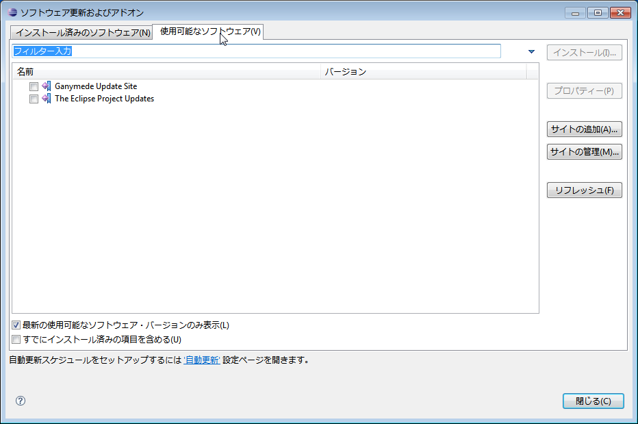
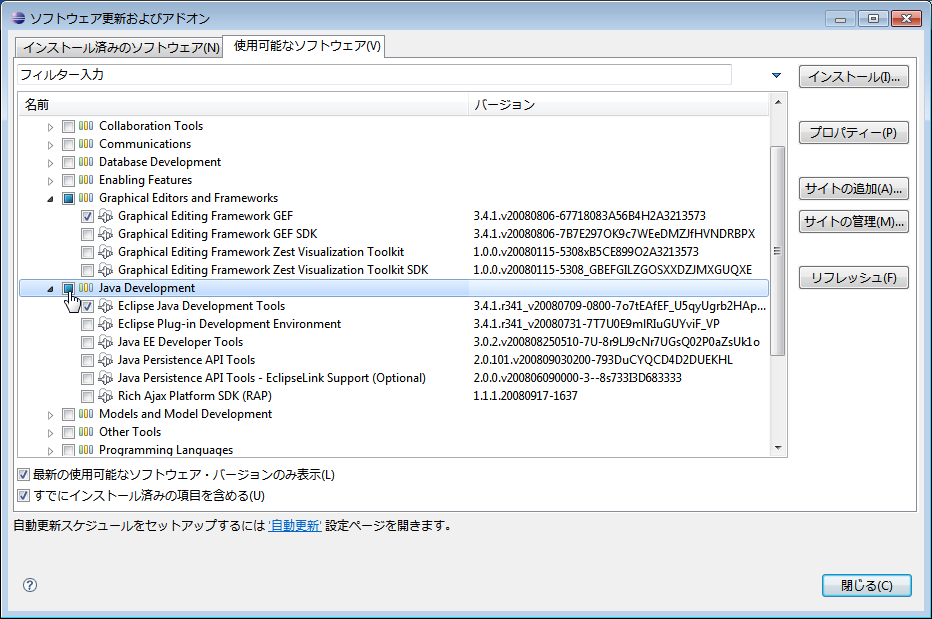
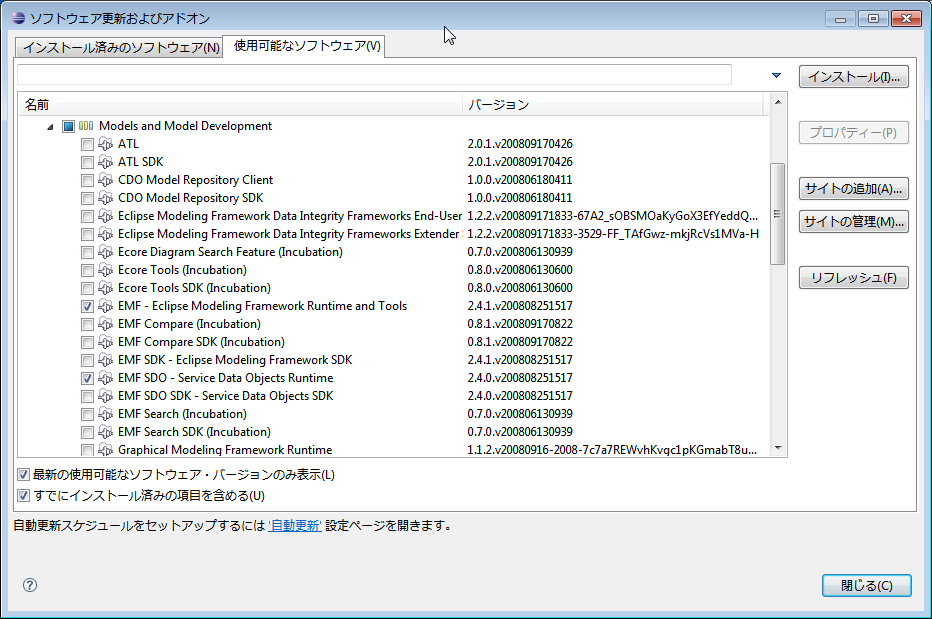
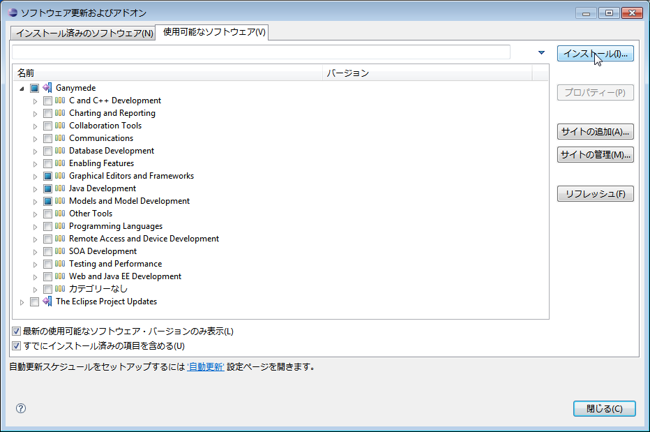

<!-- Title: Eclipseについて -->

#contents

本ページはOpenRTP自体を開発デバッグする人のためのページで、OpenRTPをユーザーとして使用する場合には、この情報は特に必要ありません。OpenRTPをインストールして使用するための情報は[インストーラによるインストール](../installer_install)を参照してしてください。

また本ページの情報は最新のEclipseには適合しない場合があります。

## Eclipseの概要
[Eclipse](http://www.eclipse.org/)はEclipse Foundationが開発するオープンソースのJava言語およびその他の言語のための統合開発環境を構築するためのフレームワークです。
Eclipseの基本部分はplug-inを実行するためのプラットフォームで、いろいろな開発環境は多くのplug-inの集合体として構築されます。
デフォルトで付属するJavaの開発環境自体もplug-inとして実現され、plug-inを追加することでいろいろな言語の開発環境として容易に拡張できます。
#clear

Eclipseの特徴として、

- plug-in機構により容易に拡張可能であり、plug-in同士の連携も可能である。
- Rich Client Platform (RCP)と呼ばれる仕組みにより、plug-inをスタンドアロン化が容易にできる。
- Javaで実装されているため、多くのプラットフォームで動作する。

などが挙げられます。
こうしたEclipseの特徴が、ロボット用統合開発環境を構築する上で有用であると判断し、EclipseをRTミドルウエアのツールのためのプラットフォームとして選択しました。

RTCBuilderとRTSystemEditorを利用するにはEclipseをインストールする必要があります。

&aname(eclipse_install);
## Eclipseのインストール
[OpenRTM-aistのインストーラー](../installer_install)でインストールするか、もしくはPleiades All in One Eclipseをインストールしてください。

### Pleiades All in One Eclipseの導入

以下のプラグイン導入済みのeclipseパッケージをダウンロードして適当な場所に展開してください。

- [Pleiades All in Oneダウンロード](http://mergedoc.osdn.jp/)

**Pleiades All in One Ultimate**、**Full Edition**のパッケージを入手してください。

Pleiades All in One EclipseにはLinux版はないため、[eclipse.org](https://www.eclipse.org/downloads/)からeclipseのインストーラーを入手してインストール、日本語化、プラグインの導入を行ってください。

&aname(jdk_install);
## JDK(Java Development Kit)のインストール
RTC Builder、RT System Editorを使用するためにはJDK8が必要です(JDK11などの新しいバージョンでは動作しません)。下記リンクを参照してインストールしてください。
- [JDK8のインストール]({{ site.baseurl }}/ja/doc/installation/common/install_jdk8)

## プラグインのインストール
RTCBuilderとRTSystemEditorは下記のEclipseプラグインを使用しています。Pleiades All in Oneを使用する場合は導入済みです。

- [EMF (Eclipse Modeling Framework)](http://www.eclipse.org/modeling/emf/)
- [GEF (Graphical Editing Framework)](http://www.eclipse.org/gef/)
- [XSD (XML Schema Infoset Model)](http://www.eclipse.org/modeling/mdt/?project=xsd#xsd)
- [SDO (EMF Service Data Objects)](http://www.eclipse.org/modeling/emf/?project=sdo)
- [JDT (Eclipse Java development tools)](http://www.eclipse.org/projects/project_summary.php?projectid=eclipse.jdt)

以下の手順で、これらのプラグインをインストールしてください。

1. Eclipseのメニューから[ヘルプ]>[ソフトウエア更新]を選択します。
1. このような[ソフトウェア更新およびアドイン]ダイアログが表示されますので、「使用可能なソフトウェア」タブを選択します。

1. Genymede Update Siteを展開してプラグインを選択します。

1. [インストール]をクリックします。

1. これで、これらのプラグインが自動的にダウンロードされて、インストールされます。

インストール後Eclipseをいったん終了します。

