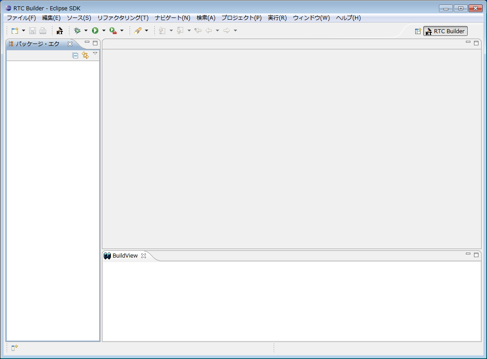

 
<a>No English version available.
</a>

<!-- Title: RTCBuilderのインストール -->
#contents

本ページはRTCBuilderのプラグインを個別に開発・デバッグをする目的で、Eclipse環境にインストールする方法を説明しています。

単にRTCBuilderを使用する場合は、[インストーラによるインストール](../installer_install)を参照してOpenRTP(RTCBUilder、RTSystemEditorを含む)をインストールして使用してください。

## RTCBuilderとは
RTCBuilderはRTコンポーネントのテンプレートを生成する開発ツールです。パラメーターを基にRTコンポーネントのテンプレートを生成する機能を持っています。
また、RTCBuilderはEclipseにて動作し、直感的な操作と他のEclipseプラグインとのシームレスな連携が可能です。~

### 機能概要
提供される機能の一覧は以下のとおりです。
<table class="table-alt">
  <tr>
    <th>№</th>
    <th>画面要素名</th>
    <th>説明</th>
  </tr>
  <tr>
    <td>１</td>
    <td>RTCプロファイルエディタ</td>
    <td>RTコンポーネントの仕様であるプロファイル、データポート定義、サービスポート定義、コンフィギュレーション定義、その他拡張プロファイルを編集します。</td>
  </tr>
  <tr>
    <td>２</td>
    <td>ビルドビュー</td>
    <td>編集中のRTコンポーネントおよびデータポート、サービスポート、サービスインターフェースをアイコンでグラフィカルに表示します。</td>
  </tr>
  <tr>
    <td>３</td>
    <td>リポジトリビュー</td>
    <td>選択したRTリポジトリの情報を表示します。</td>
  </tr>
</table>

### 動作環境
RTCBuilderの動作に必要な環境は以下のとおりです。

<table class="table-alt">
  <tr>
    <th>№</th>
    <th>環境</th>
    <th>備考</th>
  </tr>
  <tr>
    <td>１</td>
    <td><a href="https://docs.aws.amazon.com/ja_jp/corretto/latest/corretto-8-ug/downloads-list.html">Java Runtime Environment 8</a></td>
    <td>;</td>
  </tr>
  <tr>
    <td>２</td>
    <td>Eclipse 3.4.2以上   http://www.eclipse.org/downloads/index.php   http://archive.eclipse.org/eclipse/downloads/index.php</td>
    <td>Eclipse本体</td>
  </tr>
  <tr>
    <td>３</td>
    <td><a href="http://www.eclipse.org/modeling/emf/downloads/">Eclipse EMF 2.2以上(SDO,XSD含む)</a></td>
    <td>RTCBuilderが依存するEclipseプラグイン **※**ご使用になられるEclipseのバージョンに合ったものをご使用ください。</td>
  </tr>
  <tr>
    <td>４</td>
    <td><a href="http://www.eclipse.org/gef/downloads/">Eclipse GEF 3.2以上(Draw2D含む)</a></td>
    <td>RTCBuilderが依存するEclipseプラグイン **※**ご使用になられるEclipseのバージョンに合ったものをご使用ください。</td>
  </tr>
  <tr>
    <td>５</td>
    <td><a href="http://www.eclipse.org/projects/project_summary.php?projectid=eclipse.jdt">Eclipse Java development tools(JDT)</a></td>
    <td>**※**ご使用になられるEclipseのバージョンに合ったものをご使用ください。</td>
  </tr>
</table>

また以下の開発を行う言語によっては以下の環境をインストールしておくと便利です。
<table class="table-alt">
  <tr>
    <th>№</th>
    <th>環境</th>
    <th>備考</th>
  </tr>
  <tr>
    <td>１</td>
    <td><a href="http://www.eclipse.org/cdt/downloads.php">Eclipse CDT</a></td>
    <td>C++用の開発環境</td>
  </tr>
  <tr>
    <td>２</td>
    <td><a href="http://pydev.org/">Pydev for Eclipse</a></td>
    <td>python用の開発環境</td>
  </tr>
</table>

## RTCBuilderのインストール

RTCBuilderはEclipseプラグインであるため、Eclipse本体をインストールする必要があります。
さらに、EclipseはJavaアプリケーションなので、Eclipse本体をインストールする前にJava実行環境（あるいはJDK：Java開発環境でもよい）をインストールする必要があります。
- Java実行環境のインストールについては、[EclipseについてのJDK(Java Development Kit)のインストール]({{ site.baseurl }}/en/doc/installation/install_1_2/openrtp_1_2/eclipse#jdk_install)を参照してください。
- Eclipseのインストールについては、[EclipseについてのEclipseのインストール](../eclipse#eclipse_install)を参照してください。

### RTCBuilderのビルド
Eclipseを直接導入した場合はRTCBuilderのビルドが必要です。
以下のページの手順でプラグインの生成、導入を行ってください。

- [RTCBuilder、RTSystemEditorのビルド](https://openrtm.org/openrtm/ja/build_12_openrtp)

### RTCBuilderの起動

Eclipseを起動し、メニューから[ウインドウ]>[パースペクティブを開く]>[その他]を選択すると、次のようなパースペクティブ選択画面が表示されます。

パースペクティブ一覧にある[RTC Builder]を選択すると、次のような画面が表示されてRTCBuilderが起動されます。

`ツールバーの[Open` New RTC Builder Editor]ボタンをクリックするか、メニューバーの[ファイル]>[Open New Builder Editor]を選択することで、Builderエディタが起動します。

参考：[**FAQ:**Eclipseの起動方法]({{ site.baseurl }}/en/doc/faq/faq_rtp_tools#eclipse)

