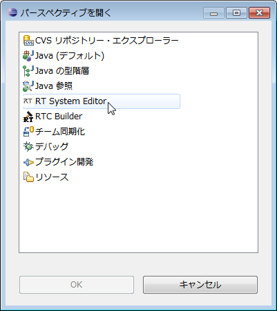
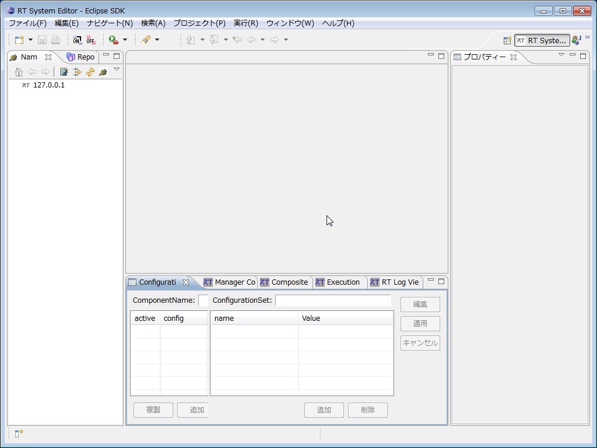

<!-- Title: RTSystemEditorのインストール -->
#contents

本ページはOpenRTP自体を開発デバッグする人が、RTSystemのプラグインをEclipse環境にインストールするのためのページです。基本知識としてEclipseにおけるPluginの開発に関する知識が別途必要になります。

RTCBuilderとRTSystemEditorをOpenRTPとしてインストールしてをOpenRTM-aist自体の開発を行わずにユーザーとして使用する場合には、このページの情報は特に必要ありません。OpenRTPをインストールして使用するための情報は[インストーラによるインストール](../installer_install)を参照してしてください。

## RTSystemEditorとは
RTSystemEditorは、OpenRTM-aistに含まれる開発ツールの１つであり、RTCをリアルタイムにグラフィカル操作する機能を持っています。また、Eclipse統合開発環境のプラグインとして作成されており、Eclipse上にて既存のプラグインとシームレスに操作を行うことができます。

#clear

### 機能概要
RTSystemEditorは、RTCをリアルタイムにグラフィカル操作する機能を持っています。提供される機能の一覧は以下のとおりです。

<table class="table-alt">
  <tr>
    <th>№</th>
    <th>機能名称</th>
    <th>機能概要</th>
  </tr>
  <tr>
    <td>１</td>
    <td>コンポーネントコンフィグレーション表示/編集機能</td>
    <td>選択したコンポーネントのコンフィギュレーションプロファイル情報をコンフィグレーションビューに表示し編集する。</td>
  </tr>
  <tr>
    <td>２</td>
    <td>コンポーネント動作変更機能</td>
    <td>選択したコンポーネントの動作を変更する。</td>
  </tr>
  <tr>
    <td>３</td>
    <td>コンポーネント組み立て機能</td>
    <td>システムエディタ上でシステムの組み立てやリポジトリおよびファイルシステムのコンポーネント仕様の編集を行う。</td>
  </tr>
  <tr>
    <td>４</td>
    <td>システムセーブ/オープン機能</td>
    <td>システムエディタの内容をセーブ/オープンする。</td>
  </tr>
  <tr>
    <td>５</td>
    <td>システム復元機能</td>
    <td>保存したシステムエディタの内容をシステムに復元する。</td>
  </tr>
</table>

### 動作環境
RTSystemEditorの動作に必要な環境は以下のとおりです。

<table class="table-alt">
  <tr>
    <th>№</th>
    <th>環境</th>
    <th>備考</th>
  </tr>
  <tr>
    <td>１</td>
    <td><a href="https://docs.aws.amazon.com/ja_jp/corretto/latest/corretto-8-ug/downloads-list.html">Java Runtime Environment 8</a></td>
    <td>;</td>
  </tr>
  <tr>
    <td>２</td>
    <td>Eclipse 3.4.2以上   http://www.eclipse.org/downloads/index.php   http://archive.eclipse.org/eclipse/downloads/index.php</td>
    <td>Eclipse本体</td>
  </tr>
  <tr>
    <td>３</td>
    <td>Eclipse EMF 2.2.4 <a href="http://www.eclipse.org/downloads/download.php?file=/modeling/emf/emf/downloads/drops/2.2.4/R200710030400/emf-sdo-runtime-2.2.4.zip">EMF＋SDO Runtime</a>および<a href="http://www.eclipse.org/downloads/download.php?file=/modeling/emf/emf/downloads/drops/2.2.4/R200710030400/xsd-runtime-2.2.4.zip">XSD Runtime</a></td>
    <td>RTSystemEditorが依存するEclipseプラグイン</td>
  </tr>
  <tr>
    <td>４</td>
    <td><a href="http://www.eclipse.org/downloads/download.php?file=/tools/gef/downloads/drops/R-3.2.2-200702081315/GEF-runtime-3.2.2.zip">Eclipse GEF 3.2.2</a></td>
    <td>RTSystemEditorが依存するEclipseプラグイン</td>
  </tr>
  <tr>
    <td>５</td>
    <td><a href="http://www.eclipse.org/projects/project_summary.php?projectid=eclipse.jdt">Eclipse Java development tools(JDT)</a></td>
    <td>※使用するEclipseのバージョンに合ったものをご使用ください。</td>
  </tr>
</table>

## RTSystemEditorのインストール
RTSystemEditorはEclipseプラグインであるため、Eclipse本体をインストールする必要があります。さらに、EclipseはJavaアプリケーションなので、Eclipse本体をインストールする前にJava実行環境(あるいはJDK：Java開発環境でもよい）をインストールする必要があります。
- Java実行環境のインストールについては、[EclipseについてのJDK(Java Development Kit)のインストール]({{ site.baseurl }}/ja/doc/installation/install_1_2/openrtp_1_2/eclipse#jdk_install)を参照してくだ
さい。
- Eclipseのインストールについては、[EclipseについてのEclipseのインストール](../eclipse#eclipse_install)を参照してください。

### RTSystemEditorのビルド
Eclipseを直接導入した場合はRTSystemEditorのビルドが必要です。
以下のページの手順でプラグインの生成、導入を行ってください。

- [RTCBuilder、RTSystemEditorのビルド]({{ site.baseurl }}/ja/build_12_openrtp)

### RTSystemEditorのインストールと起動

Eclipseを起動し、メニューから[ウィンドウ]>[パースペクティブを開く]>[その他]を選択すると、次のようなパースペクティブ選択画面が表示されます。

 
パースペクティブ一覧にあるRTSystemEditorを選択すると、次のような画面が表示されてRTSystemEditorが起動されます。

 

もし、パースペクティブの一覧にRTSystemEditorが表示されない場合は、EMFやGEFやXSDやJDTが正しくインストールできているか、RTSystemEditorがpluginディレクトリに正しくコピーされているかを再度チェックしてください。
### Eclipseの再起動
RTSystemEditorの起動が確認できましたら、いったん、Eclipseを終了してください。再度、同じワークスペースを指定してEclipseを起動すると、RTSystemEditorが起動された状態から始まります。

参考:
- [**FAQ:**Eclipseの起動方法]({{ site.baseurl }}/ja/doc/faq/faq_rtp_tools)

