 
<a>No English version available.
</a>

<!-- Title: RTSystemEditor、RTCBuilderのデバッグ -->
#contents

本ページはRTCBuilder/RTSystemEditorの開発・デバッグに関する情報を記したページです。EclipseにおけるPlugin開発の知識が必要になります。

RTCBuilderとRTSystemEditorを利用するのみであれば、このページの情報は不要です。
OpenRTP （RTCBuilder、RTSystemEditor）をインストールして使用するための情報は[インストーラによるインストール](../installer_install)を参照してしてください。

## 必要なソフトウエアの入手

### eclipse

RTSystemEditor、RTCBuilderはeclipseのプラグインとして動作します。
以下のサイトからから、eclipseをダウンロードしてください。
その際にパッケージはUltimateのFull Edisionを選択してください。
Standard Editionだとプラグイン開発環境を手動でインストールする必要があります。

- http://mergedoc.osdn.jp/

### JDK

JDK8相当のJREかJDKが必要なため、以下のリンクを参照してJDK8をインストールしてください。
- [JDK8のインストール]({{ site.baseurl }}/en/doc/installation/common/install_jdk8)

### RTSystemEditor、RTCBuilderのソースコード

以下のリポジトリからOpenRTPのソースコードを入手してください。

- [OpenRTP-aist](https://github.com/OpenRTM/OpenRTP-aist/)

## ビルド

eclipse.exeを実行してください。

### JREの設定
使用するJREを設定します。

[ウィンドウ]→[設定]→[Java]→[インストール済みのJRE]で、[追加]→[標準 VM]を選択後にJREのパス(例：C:\Program Files (x86)\Java\jdk1.8.0_131\jre)を追加後にチェックを入れる

<a href="plugin4_1_ja.png">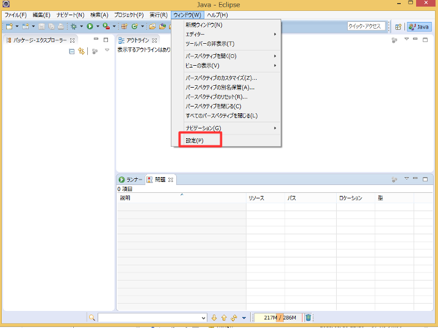</a>

<a href="plugin5_1_ja.png">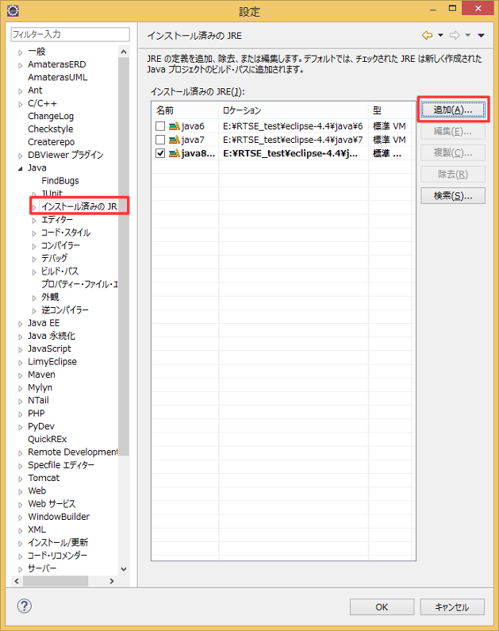</a>

<a href="plugin6_ja.png">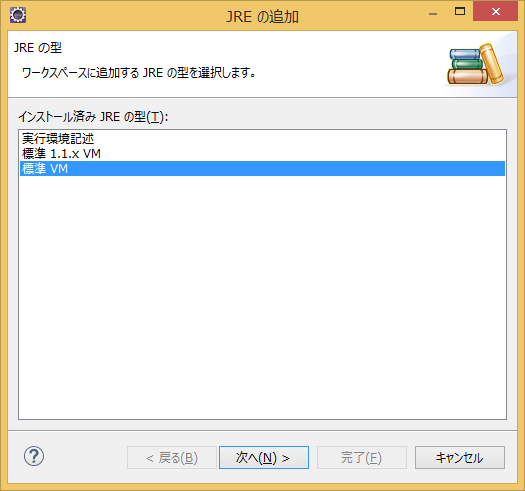</a>

<a href="plugin7_1_ja.png">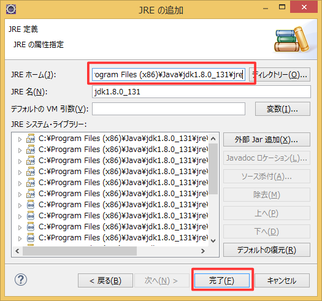</a>

<a href="plugin8_1_ja.png">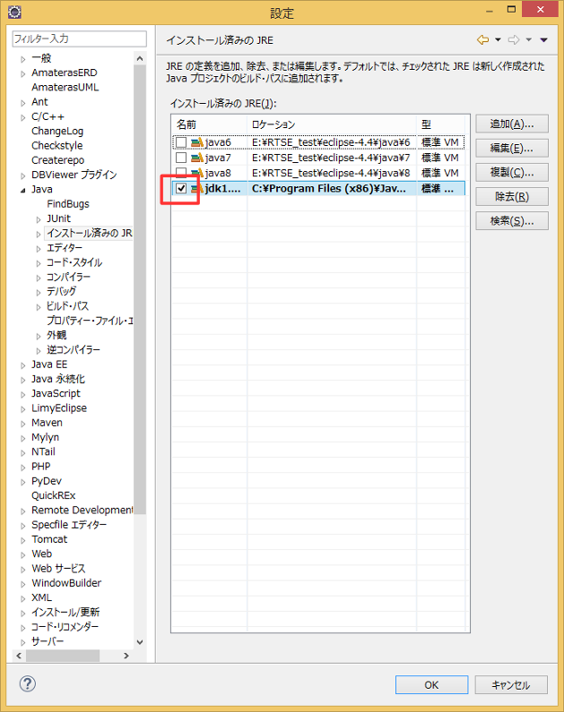</a>

### コンパイラー準拠レベルの設定
初期の状態でコンパイラー準拠レベルが1.6に設定されている場合があるようなので、[ウィンドウ]→[設定]→[Java]→[コンパイラー]でコンパイラー準拠レベルを1.8に設定してください。

<a href="plugin9_1_ja.png">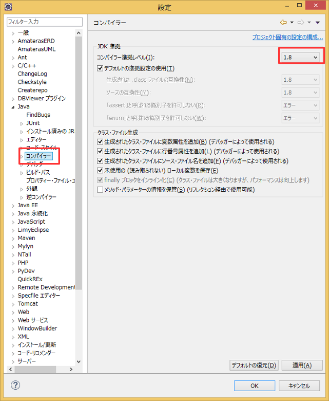</a>

### RTSystemEditor、RTCBuilderプロジェクトのインポート
RTSystemEditor、RTCBuilderを開発環境のeclipseにインポートします。
[ファイル]→[インポート]→[プラグイン開発]→[プラグインおよびフラグメント]を選択後、[次へ]をクリックしてください。

<a href="plugin12_ja.png">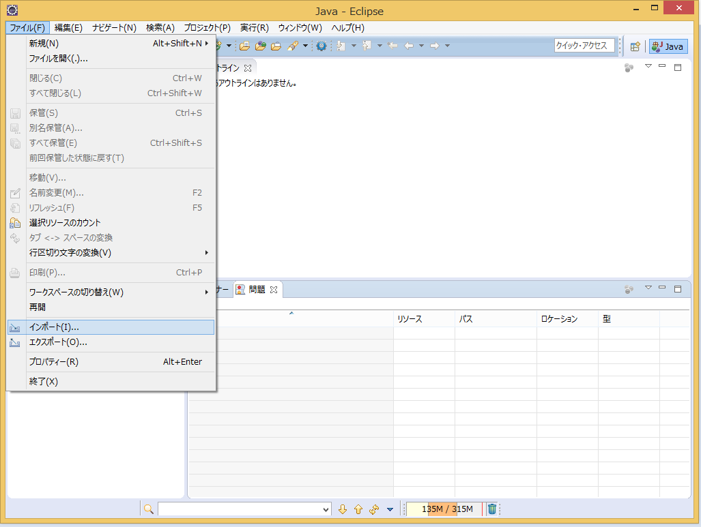</a>

<a href="plugin13_ja.png">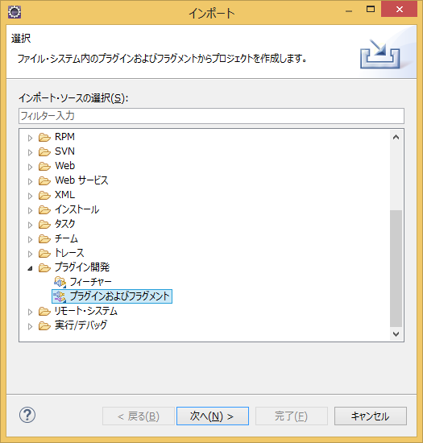</a>

[インポート先]の[ディレクトリ]をオンにして、rtmtoolsをチェックアウトしたディレクトリを設定して次へ進んでください。

<a href="plugin14_1_ja.png">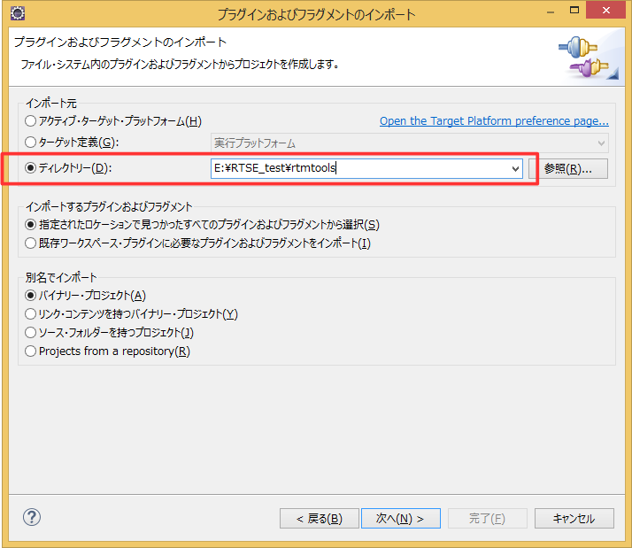</a>

全て追加を選択して、完了ボタンを押してください。

<a href="plugin15_1_ja.png">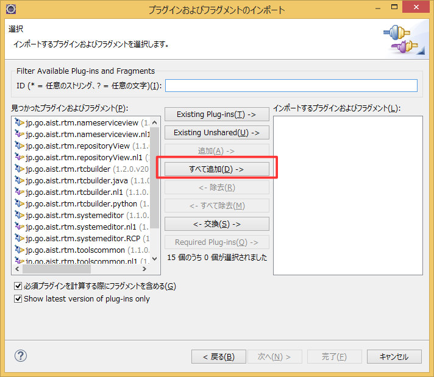</a>

### IDLコンパイル
IDLファイルのコンパイルを行います。
パッケージエクスプローラーでjp.go.aist.rtm.toolscommonプロジェクトの「buildForCliant」を右クリックして[実行]→[Antビルド]を選択すれば開始します。

<a href="plugin2_1_ja.png">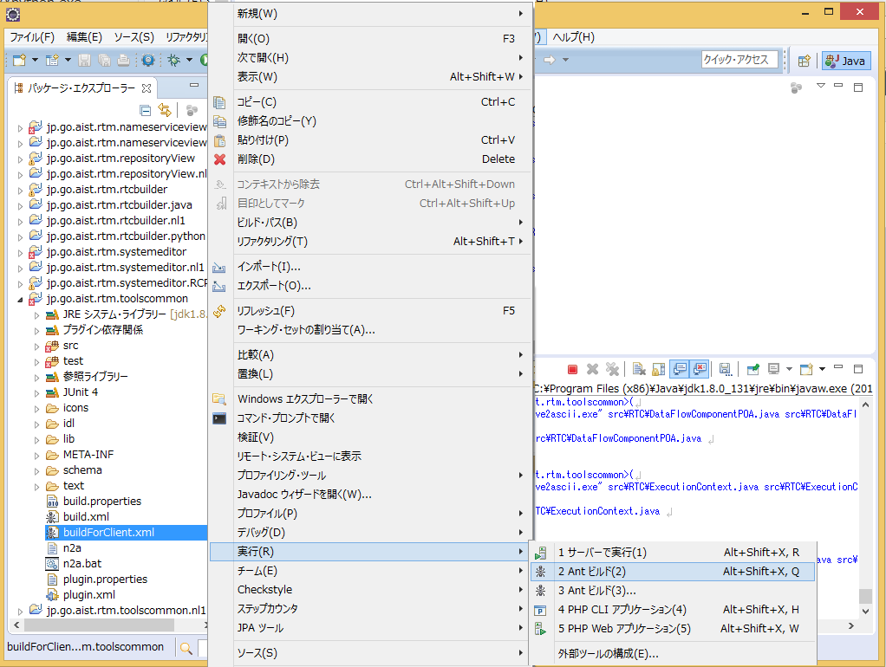</a>

#### Antビルドで文字化けする場合
Antビルドで文字化けする場合は、[実行]→[外部ツール]→[外部ツールの構成]→[Antビルド]をダブルクリックして、[共通]タブ→[エンコード]でその他[MS932]に設定してください。

<a href="plugin10_ja.png">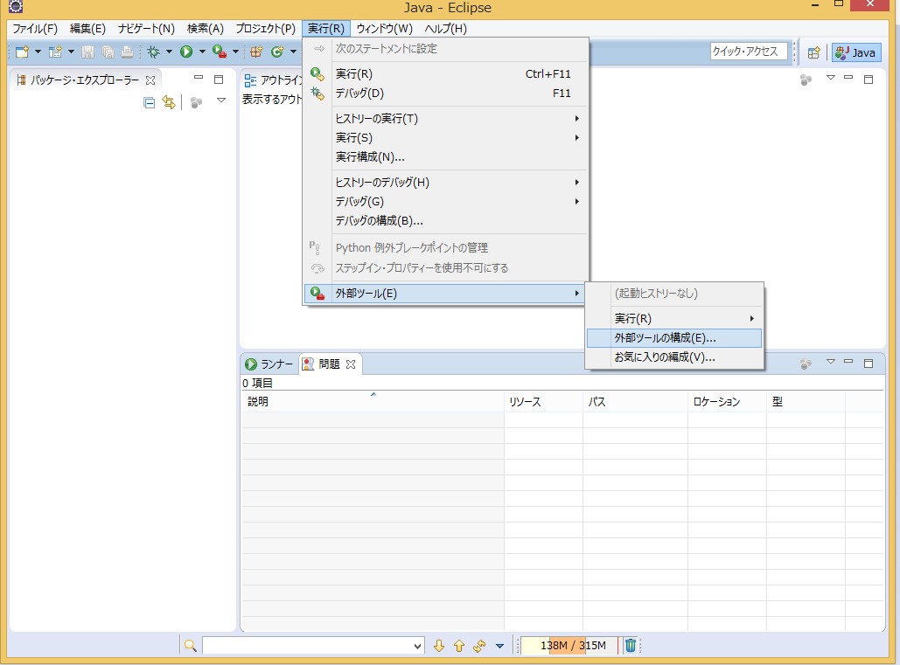</a>

<a href="plugin11_1_ja.png">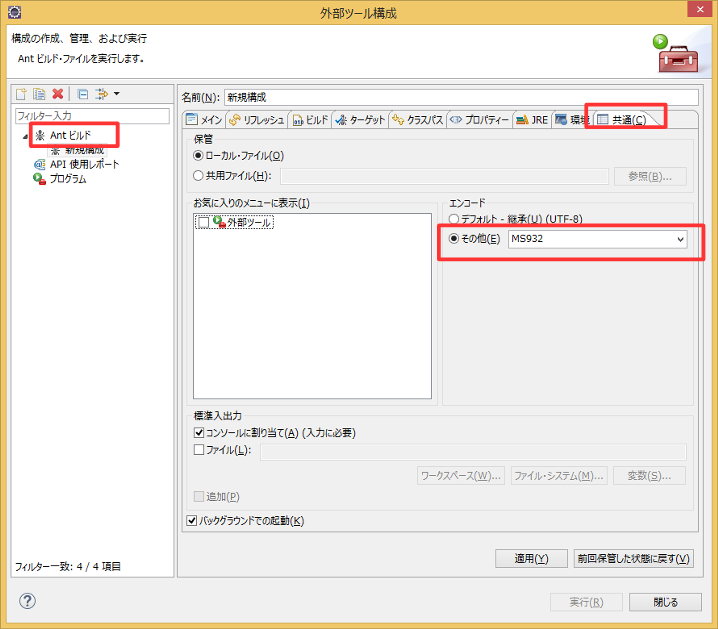</a>

### クラスパスの修正
環境によってはクラスパスが正しく設定されない場合があります。
その場合はデバッグ時にClassNotFoundExceptionの例外が発生するため、rtmtoolsに存在するplugin.xml全てを修正してください。
パッケージエクスプローラーでplugin.xmlをダブルクリックして、[ランタイム]タブから[クラスパス]に「.」を追加してください。([MANIFEST.MF]の[Bundle-ClassPath]に追加しても可)

<a href="plugin1_1_ja.png">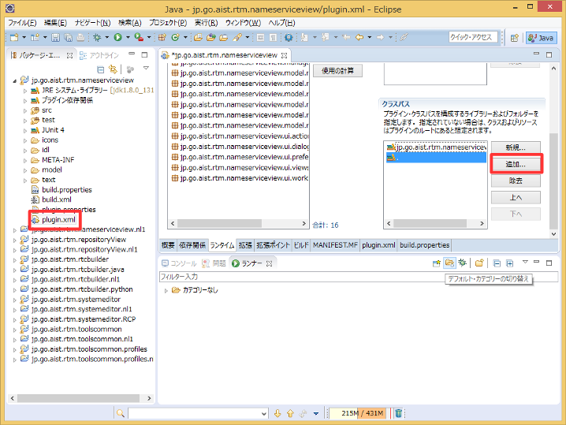</a>

これで準備完了です。

## デバッグ実行
上部の虫のマークのボタンから、[デバッグ]→[Eclipse アプリケーション]でデバッグが開始します。

<a href="plugin3_1_ja.png">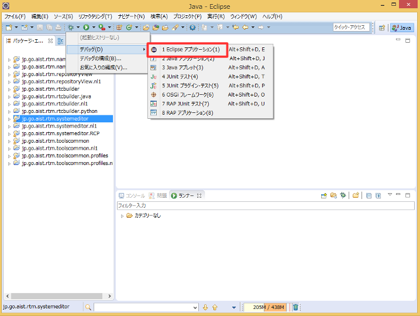</a>

