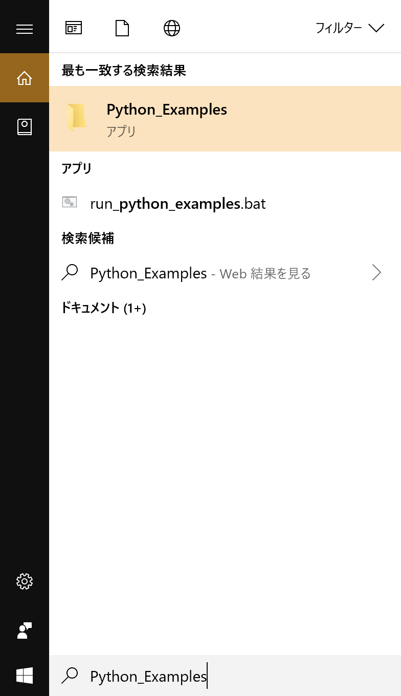
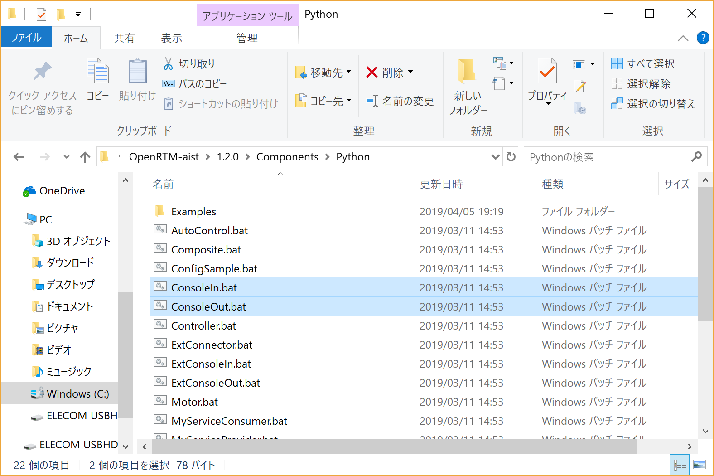
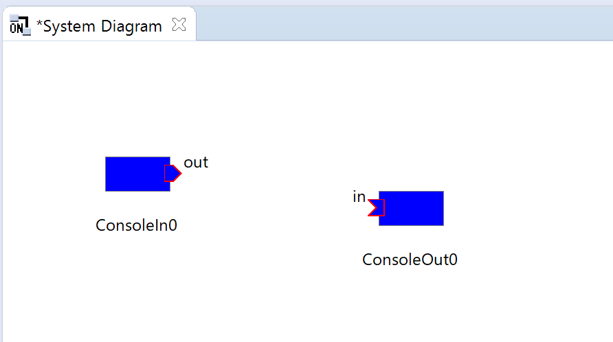

-------jp page!!-------

<!-- Title: 動作確認(Windows編) -->
#contents

## サンプルコンポーネントの場所

インストールまたはビルドが正常に終了したら、付属のサンプルで動作テストをします。サンプルは、通常は以下の場所にあります。

- c:\Program Files\OpenRTM-aist\1.2.<span style="color:blue;">x</span>;\Components\Python
- <span style="color:blue;"><ソースディレクトリ></span>;/OpenRTM-aist/examples(ソースからビルドした場合)

サンプルコンポーネントセットSimpleIOを使って、OpenRTM-aistが正しくビルド・インストールされているかを確認します。


## サンプル(SimpleIO)を使用した動作確認

RTコンポーネント ConsoleIn、ConsoleOutからなるサンプルセットです。ConsoleInはコンソールから入力された数値をOutPortから出力するコンポーネント、ConsoleOutはInPortに入力された数値をコンソールに表示するコンポーネントです。
これらは、最もSimpleなI/O(入出力)を例示するためのサンプルです。ConsoleInのOutPortからConsoleOutのInPortへ接続を構成し、これらの2つのコンポーネントをアクティブ化(Activate)することで動作します。

## 動作確認環境
以下では、MSIインストーラーでOpenRTM-aistをデフォルトでインストールした環境で、スタートメニューから各種プログラムを起動する場合しOpenRTPを使う方法を説明します。OpenRTPを使わないでrtshellを使う場合は、rtshellのインストールにおける[動作確認(Windows編)]({{ site.baseurl }}/ja/doc/installation/install_rtshell/check_windows)を参照してください。なお、ソースビルドした場合は、サンプルコンポネントは、<span style="color:blue;"><ソースディレクトリ></span>;\OpenRTM-aist\examples\SimpleIOにありますので、リンク先や下記の説明でのConsoleIn/ConsoleOutコンポーネントの場所はそこに置き換えてください。

## 動作確認手順
### RTSystemEditor、ネームサーバーの起動
以下の手順に従ってRTSystemEditor、ネームサーバーを起動してください。

- [OpenRTP起動手順]({{ site.baseurl }}/ja/doc/installation/install_1_2/start_openrtp_linux_1_2)


### サンプルコンポーネントの起動
ネームサーバー起動後、適当なサンプルコンポーネントを起動します。

Windows 10の場合は右下の[ここに入力して検索]に**Python_Examples**と入力してサンプルのディレクトリを開きます。

<div align="center"><a href="rtm7-2.png"></a></div>
<div align="center"><strong>ネームサーバーの起動を確認</strong></div>

<div align="center"><a href="rtm8-2.png"></a></div>
<div align="center"><strong>サンプルコンポーネントディレクトリ</strong></div>

ここでは、「ConsoleIn.bat」「ConsoleOut.bat」をそれぞれダブルクリックして2つのコンポーネントを起動します。起動すると、下図のような2つのコンソール画面が開きます。

<div align="center"><a href="rtm9-2.png"></a></div>
<div align="center"><strong>ConsoleInコンポーネントとConsoleOutコンポーネント</strong></div>

#### コンポーネントが起動しない場合

コンポーネントが起動しない場合、いくつかの原因が考えられます。

##### コンソール画面が開いてすぐに消える

rtc.confの設定に問題があり、起動できないケースがあります。上記検索から開かれるディレクトリの[rtc.conf for examples]を開いて設定を確認してください。例えば、corba.endpoint/corba.endpointsなどの設定が現在実行中のPCのホストアドレスとミスマッチを起こしている場合などは、CORBAが異常終了します。

以下のような最低限のrtc.confに設定しなおして試してみてください。

```
 corba.nameservers: localhost
```


##### omniORBpyがインストールされていない。

openrtm.orgが提供するMSIインストーラーにはomniORBpyが含まれていますが、カスタムインストールを選択すると、omniORBpyをインストールせずにOpenRTM-aist-Pythonをインストールできます。また、手動でインストールした場合には、omniORBpyが入っていない場合も考えられますので、omniORBpyがインストールされているか確認してください。

##### pyファイルの関連付けが違っている

ConsoleIn、ConsoleOutを起動するファイルは、

C:\Program Files\OpenRTM-aist\1.2.<span style="color:blue;">x</span>;\Components\Python\Examples\SimpleIO\ConsoleIn.py<br>
C:\Program Files\OpenRTM-aist\1.2.<span style="color:blue;">x</span>;\Components\Python\Examples\SimpleIO\ConsoleOut.py

です。（64bit版MSIでインストールした場合）このディレクトリでコンソール画面を開き、python ConsoleIn.pyを実行すると起動するが、ConsoleIn.pyをダブルクリックして起動できない場合はインストールしているpythonを確認してください。Pythonの32bit版、64bit版の両方をインストールしている場合、先にインストールしたものがpyファイルに関連付けられるようなので、OpenRTM-aist-Pythonのインストーラーと同じアーキテクチャのPythonを先にインストールすると解決するかもしれません。

##### その他

ホスト名やアドレスの設定の問題で、起動がうまくいかないケースがあります。その場合、利用しているPCのIPアドレスをomniNames.exeに教えてあげるとうまくいくケースがあります。
環境変数OMNIORB_USEHOSTNAMEを以下のように設定します(以下は自ホストのIPアドレスが192.168.0.11の場合の例)。

```
 変数名(N): OMNIORB_USEHOSTNAME
 変数値(V): 192.168.0.11
```

### RTSystemEditorでのエディタへの配置

RTSystemEditorのツリー表示の[>]をクリックすると、先ほど起動した2つのコンポーネントが登録されていることがわかります。

<div align="center"><a href="rtm10.png"></a></div>
<div align="center"><strong>ConsoleInコンポーネントとConsoleOutコンポーネント</strong></div>

システムを編集するエディタ(System Diagram)を開きます。上部の[Open New System Editor]ボタン<a href="rtse_open_editor_icon_ja.png"></a>をクリックすると、中央のペインにエディタ(System Diagram)が開きます。左側のネームサービスビューに <a href="rtse_rtc_icon_n.png"></a> のアイコンで表示されているコンポーネント(2つ)を中央のエディタ・エリアにドラッグアンドドロップします。

<div align="center"><a href="rtm11.png"></a></div>
<div align="center"><strong>コンポーネントをSystem Diagramに配置</strong></div>


### 接続とアクティブ化

ConsoleIn0コンポーネント・アイコンの右側にはデータが出力されるOutPort <a href="rtse_outport_icon_n.png"></a>;が 、ConsoleOut0コンポーネント・アイコンの左側にはデータが入力されるInPort <a href="rtse_inport_icon_n.png"></a>がそれぞれ配置されています。

これらInPort/OutPort(まとめてデータポートと呼びます)を接続します。OutPortからInPort(またはInPortからOutPort)へドラッグランドドロップすると、図のようなダイアログが現れますので、デフォルト設定のまま[OK]ボタンをクリックします。

<div align="center"><a href="rtm13.png"></a></div>
<div align="center"><strong>データポートの接続</strong></div>

<div align="center"><a href="rtm12.png"></a></div>
<div align="center"><strong>データポート接続ダイアログ</strong></div>


2つのコンポーネントの間に接続線が現れます。次に、エディタ上部メニューの[All Activate]ボタン <a href="rtm14.png"></a> をクリックし、これらのコンポーネントをアクティブ化します。アクティブ化されると、コンポーネントが緑色に変化します。

<div align="center"><a href="rtm15.png"></a></div>
<div align="center"><strong>アクティブ化されたコンポーネント</strong></div>


コンポーネントがアクティブ化されるとConsoleInコンポーネント側のコンソールには

```
 Please input number: 
```

というプロンプト表示に変わりますので、適当な数値(short intの範囲内:32767以下)を入力しEnterキーを押してください。すると、ConsoleOut側のコンソールにも入力した数値が表示され、ConsoleInコンポーネントからConsoleOutコンポーネントへデータが転送されたことがわかります。

以上で、OpenRTPを用いたコンポーネントの基本動作の確認は終了です。


## 他のサンプル

インストーラーには、このほかにもいくつかのサンプルコンポーネントが付属しています。これらのコンポーネントも同様に起動し、RTSystemEditorでポート同士を接続し、アクティブ化することで試すことができます。付属しているコンポーネントのリストと簡単な説明を以下に示します。

<table class="table-alt">
  <tr>
    <td>ConsoleIn.py</td>
    <td>コンソールから入力された数値をOutPortから出力する。ConsoleOut.pyに接続して使用する。</td>
  </tr>
  <tr>
    <td>ConsoleOut.py</td>
    <td>InPortに入力された数値をコンソールに表示する<span style="color:default;">コンポーネント</span>;。ConsoleIn.pyに接続して使用する。</td>
  </tr>
  <tr>
    <td>SeqIn.py</td>
    <td>ランダムな数値(Short、Long、Float、Doubleとそのシーケンス型)を出力する<span style="color:default;">コンポーネント</span>;。SeqOut.pyに接続して使用する。</td>
  </tr>
  <tr>
    <td>SeqOut.py</td>
    <td>InPortに入力される数値(Short、Long、Float、Doubleとそのシーケンス型)を表示。SeqIn.pyに接続して使用する。</td>
  </tr>
  <tr>
    <td>MyServiceProvider.py</td>
    <td>MyService型のサービスを提供する<span style="color:default;">コンポーネント</span>;。MyServiceConsumer.pyに接続して使用する。</td>
  </tr>
  <tr>
    <td>MyServiceConsumer.py</td>
    <td>MyService型のサービスを利用する<span style="color:default;">コンポーネント</span>;。MyServiceProvider.pyに接続して使用する。</td>
  </tr>
  <tr>
    <td>ConfigSample.py</td>
    <td>Configurationのサンプル。RTSystemEditorからConfigurationを変更してConfigurationの挙動を理解するためのサンプル。</td>
  </tr>
  <tr>
    <td>TkMobileRobotSimulator.py</td>
    <td>モバイルロボットの簡易シミュレーター。ロボットの速度をInPortで受け、移動後の位置をOutPortから出力する。</td>
  </tr>
  <tr>
    <td>NXTRTC.py</td>
    <td>LEGO MINDSTORMを用いたモバイルロボットを制御するためのサンプル。InPortにて速度を受け、赤外線センサーと現在位置をそれぞれOutPortから出力する。</td>
  </tr>
  <tr>
    <td>AutoControl.py</td>
    <td>モバイルロボット用のコンポーネントで速度を出力する。測位センサーのデータをInPortで受け、ロボットの速度を計算してOutPortから出力する。</td>
  </tr>
  <tr>
    <td>Composite.py</td>
    <td>Composite用のサンプル。Motor、Controller、Sensorを包含するコンポーネント。Compositeの使用方法を理解するためのサンプル。</td>
  </tr>
  <tr>
    <td>Motor.py</td>
    <td>Compositeコンポーネント用のサンプル。Compositeの子要素として使用。</td>
  </tr>
  <tr>
    <td>Controller.py</td>
    <td>Compositeコンポーネント用のサンプル。Compositeの子要素として使用。</td>
  </tr>
  <tr>
    <td>Sensor.py</td>
    <td>Compositeコンポーネント用のサンプル。Compositeの子要素として使用。</td>
  </tr>
  <tr>
    <td>SliderComp.py</td>
    <td>Tcl/Tkを用いたGUIコンポーネントのサンプル。Sliderで指定した値をOutPortから出力する。</td>
  </tr>
  <tr>
    <td>TkMotorComp.py</td>
    <td>Tcl/Tkを用いたGUIコンポーネントのサンプル。InPortで受け取った値の速度で回転する様子をGUIで表示する。</td>
  </tr>
  <tr>
    <td>TkMotorPosComp.py</td>
    <td>Tcl/TKを用いたGUIコンポーネントのサンプル。InPortで受け取った値を回転角として動く様子をGUIで表示する。</td>
  </tr>
  <tr>
    <td>TkLRFViewer.py</td>
    <td>Tcl/Tkを用いたGUIコンポーネントのサンプル。レーザーレンジセンサーなどから出力されるデータを表示する。</td>
  </tr>
  <tr>
    <td>TkJoystickComp.py</td>
    <td>Tcl/Tkを用いたGUIコンポーネントのサンプル。簡易ジョイスティックコンポーネント。</td>
  </tr>
</table>

-------jp page!!-------
