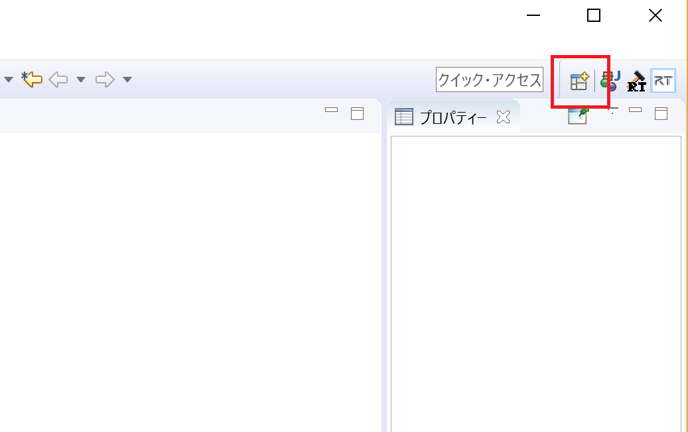
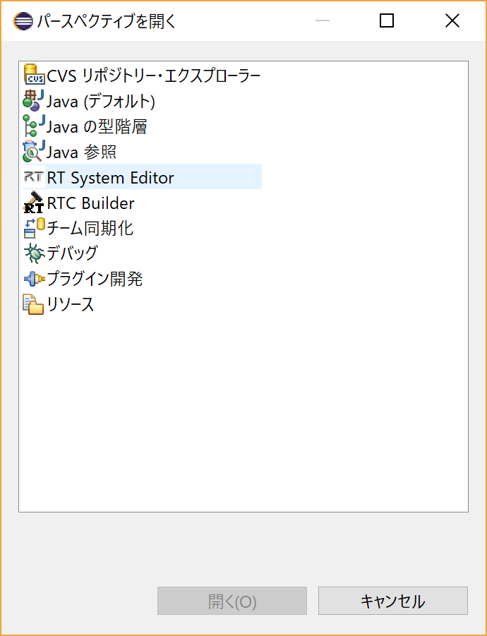
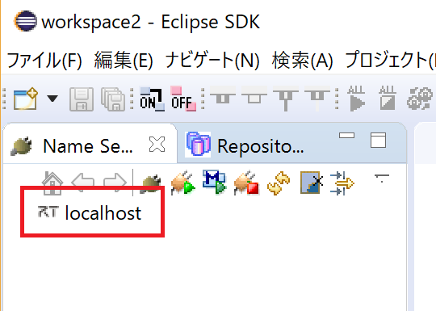
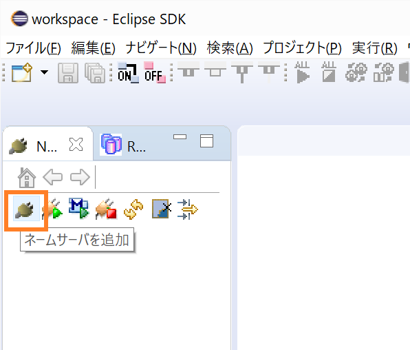
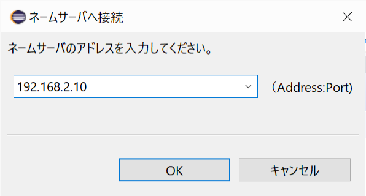

<br>
<a>No English version available.
</a>

<!-- Title: OpenRTPの起動手順(1.2系、Linux) -->
#contents


## OpenRTPの起動
RTCの操作、RTシステムの構築を行うためのツールRTSystemEditorを起動します。
RTSystemEditorはOpenRTPというツールの中に含まれているため、まずはOpenRTPを起動する必要があります。

- 以下のコマンドでOpenRTPを起動してください。

```
 $ openrtp
```

### RTSystemEditor(RTSE)の起動

- OpenRTPの[パースペクティブを開く]ボタンをクリックしてください。

<div align="center"><a href="rtm3.png"></a></div>
<div align="center"><strong>パースペクティブを開くをクリック</strong></div>

- [パースペクティブを開く]ウィンドウから[RTSystemEditor]を選択して開くボタンをクリックしてください。

<div align="center"><a href="rtm4.png"></a></div>
<div align="center"><strong>RTSystemEditorの起動</strong></div>

## ネームサーバーの起動
- コンポーネントの参照を登録するためのネームサーバーを起動します。

<div align="center"><a href="rtm5.png"></a></div>
<div align="center"><strong>ネームサーバーの起動</strong></div>

- ネームサーバーの起動に成功するとネームサービスビューに**localhost**と表示されます。

<div align="center"><a href="rtm6.png"></a></div>
<div align="center"><strong>ネームサーバーの起動を確認</strong></div>

## リーモートのRTCを使う場合
Raspbianのような小さな構成のシステムの場合、openrtp自体がサポートされていないことがあります。その場合は、他のホストで動いているOpenRTPから、Raspbian上のネームサービースをリモート接続するか、他のOpenRTPが動作しているホスト上にあるネームサービスにRaspbian上で動作しているRTCを登録する必要があります。以下にその手順を示します。

### リモート環境で動いているネームサーバーサービスを登録する方法
- まずRTCが動いているホストマシンのコマンドラインから
```
 $ rtm-naming
```

と入力し、ネームサービスを起動し、動作させたいRTCを起動します。

- OpenRTPを動かすマシンで
```
 $ openrtp
```
と入力し、OpenRTPを起動します。同一マシンでRTCを動かす手順と同様に、[RTSystemEditor]を選んでパースペクティブを開きます。そして[ネームサーバーを追加」ボタンをクリックします。

<div align="center"><a href="rtm6-2.png"></a></div>
<div align="center">''ネームサーバーの追加’’</div>
- ネームサーバーのアドレスを聞かれますので、アドレスを指定します。デフォルト以外のポート番号を使った場合は、アドレスに<アドレス>:<ポート番号>の形でポート番号も指定してください。

<div align="center"><a href="rtm6-3.png"></a></div>
<div align="center"><strong>ネームサーバーのアドレス指定</strong></div>
### リモートマシン上のRTCをOpenRTPが動いているネームサービスに登録する方法

- RTCのファイルがあるディレクトリ移動し、rtc.confを編集します。例えば
```
 sudo gedit rtc.conf
```

と入力し、rtc.confの編集を開始します。
```
 corba.nameservers: localhost
```

の行を
```
 corba.nameservers: <OpenRTPが動作しているホストのアドレス>
```

と書き換えます

これにより、ネームサービスにリモートで動作しているRTCが登録され、そのネームサービスを表示しているOpenRTPのName Service Viewに表示されます。


