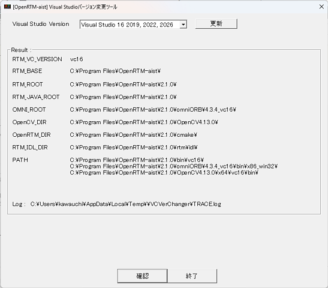

<!-- Title: Installation -->

#contents

<!-- ** Preparing for Installation -->

<!-- *** 32-bit and 64-bit Versions -->
<!--  -->
<!-- Currently, most Windows systems use the 64-bit version, so the following explanation assumes a 64-bit environment. -->
<!-- If the installed Windows is a 32-bit version, OpenRTM-aist and other software must also be installed as 32-bit versions. -->
<!--  -->
<!-- &color(red){''NOTE: In principle, always use 64-bit versions of software.''}; -->

## Installing Required Software

To use OpenRTM-aist, it is necessary to install software such as Python, CMake, Doxygen, and Visual Studio.

### Visual Studio

It is required not only for C++ development, but also for building installers when creating RTCs in Python or Java.
Install the following Community Edition (free), or obtain and install Visual Studio 2019/2022/2026 separately.

- [Microsoft **Download Visual Studio 2026**](https://visualstudio.microsoft.com/ja/downloads/?utm_source=mscom&utm_campaign=msdocs)

The latest version of Visual Studio currently verified to work is 2026.  
It is common to forget to install the C++ development environment. We recommend reading the following explanation.
  - [Installing Visual Studio Community 2026](/en/doc/installation/install_2_1/install_windows_2_1/install_2_1/visual_studio_2_1/visual_studio_2026)

### Python

Python is required not only for developing RTCs in the Python language version, but is also used by various OpenRTM-aist tools, so it must be installed.
The versions of Python supported by OpenRTM-aist are 3.10, 3.11, 3.12, 3.13, and 3.14.
It is recommended to install the latest version.

- [Python Releases for Windows](https://www.python.org/downloads/windows/)
  - [python-3.13.13-amd64.exe (64-bit version)](https://www.python.org/ftp/python/3.13.13/python-3.13.13-amd64.exe)

Please note the following when installing.
  - The Python installation location can be specified using the [Customize installation] option during installation.
  - For instructions on specifying the installation location using [Customize installation], refer to the explanation on the following page.
<!-- --- [[OpenRTM-aistを10分で始めよう！・Pythonのインストール:/ja/doc/installation/lets_start#toc1]]  -->
    - [Getting Started with OpenRTM-aist in 10 Minutes! - Installing Python](/en/node/7323#toc1)

### CMake

CMake is required to automatically generate files necessary for building in various environments such as Windows and Linux (Visual Studio project files, Linux Makefiles, etc.).  
Install the latest version whenever possible.

- [CMake (3.11 or later recommended)](https://cmake.org/download/)
  - [cmake-4.3.3-windows-x86_64.msi (64-bit version)](https://github.com/Kitware/CMake/releases/download/v4.3.3/cmake-4.3.3-windows-x86_64.msi)
  - During installation, it is recommended to select [Add Cmake to the system PATH for all users] on the [Install Option] screen.

### Doxygen & Graphviz

Doxygen is a tool that automatically generates documentation from comments in source code and other files.  
Graphviz is a tool required by Doxygen to generate diagrams such as class diagrams when generating documentation.  
In OpenRTM-aist, various design information can be entered during RTC design using RTCBuilder, and this information is output as comments in the source code.
By processing these comments with Doxygen, well-formatted RTC documentation can be generated.  
Install the latest version whenever possible.

- [Doxygen](https://doxygen.nl/download.html#latestsrc)
  - [doxygen-1.17.0-setup.exe](https://www.doxygen.nl/files/doxygen-1.17.0-setup.exe) (no distinction between 32-bit and 64-bit)
  - If you are unable to download it using Microsoft Edge, refer to the explanation for OpenRTM-aist.
    - [Getting Started with OpenRTM-aist in 10 Minutes! - Downloading OpenRTM-aist](/en/node/7323#toc2)

&aname(Graphviz);
- [Graphviz](https://graphviz.gitlab.io/download/)
  - [windows_10_cmake_Release_graphviz-install-15.0.0-win64.exe](https://gitlab.com/api/v4/projects/4207231/packages/generic/graphviz-releases/15.0.0/windows_10_cmake_Release_graphviz-install-15.0.0-win64.exe)

During installation, you will be asked how to configure the system PATH under [Install Options]. It is recommended to select "Add Graphviz to the system PATH for all users".
Download and run the Windows binary executable from the above web page to install it.

After installation, execute dot -v from the command prompt and confirm that plugin information is displayed.

 >dot -v

<!-- If the following message is displayed, open the command prompt as Administrator, run dot -c, and then run dot -v again to display the plugin information. -->
<!-- >dot -v -->
<!-- dot - graphviz version 3.0.0 (20220226.1711) -->
<!-- There is no layout engine support for "dot" -->
<!-- Perhaps "dot -c" needs to be run (with installer's privileges) to register the plugins? -->
<!--  -->
<!-- To open the command prompt as Administrator, type cmd in the Windows 10 search box, right-click "Command Prompt" in the search results, and select "Run as administrator". -->

### JDK8

This is required for Java development.
Refer to the explanation on the following page.
    - [Installing JDK8](/en/node/6911)

## Installing OpenRTM-aist

After completing the installation of the above software, proceed with installing OpenRTM-aist.

### Downloading the Installer

Download the Windows installer (MSI format) for OpenRTM-aist.

<table class="table-alt">
  <tr>
    <th><a href="https://openrtm.org/pub/Windows/OpenRTM-aist/2.1/OpenRTM-aist-2.1.0-RELEASE_x86_64.msi">OpenRTM-aist-2.1.0-RELEASE_x86_64.msi </a></th>
    <th>MD5:e1804a5aaa4fab85a5cdc777bd9c48c1</th>
    <th>719MB</th>
  </tr>
</table>

If you are unable to download it using Microsoft Edge, refer to the explanation on the following page.
- [Getting Started with OpenRTM-aist in 10 Minutes! - Downloading OpenRTM-aist](/en/node/7323#toc2)

This installer includes the following contents.

- Development environment for C++
  - OpenCV 4.13.0
  - DLLs from previous C++ versions (required for running older RTCs)
- Development environment for Python
- Development environment for Java
- omniORB 4.3.4
- OpenRTP (GUI tools: RTCBuilder and RTSystemEditor)
  - JRE8 environment (required for OpenRTP)
- VCVerChanger (GUI tool)
- rtshell (CUI tool)

### Installation

For details of the installation process, refer to the following page.
    - [Getting Started with OpenRTM-aist in 10 Minutes! - Installing OpenRTM-aist](/en/node/7323#toc3)

To confirm that the installation has been completed correctly, try running the sample components.
    - [Getting Started with OpenRTM-aist in 10 Minutes! - Running Sample Components](/en/node/7323#toc5)

For details on the system environment variables configured by the installer and the installed files, refer to the following page.
    - [OpenRTM-aist Installer Operations](/en/doc/installation/install_2_1/install_windows_2_1/install_workcontent_2_1)

### Checking System Environment Variables

The system environment variable RTM_VC_VERSION is configured according to the installed version of Visual Studio.
After installation, this environment variable should expand to the value vc16; however, it has been confirmed that in some cases it may not be expanded due to Windows behavior.
Therefore, it is recommended to verify the system environment variables using VCVerChanger.

Type VCVerChanger in the search box and start the application.
After it starts, click the "Confirm" button, check the displayed path, and then click "Exit".

