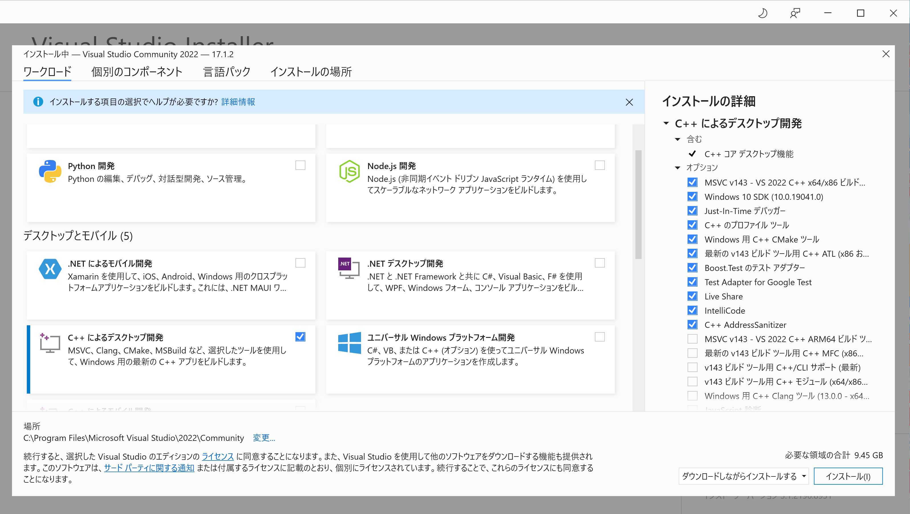
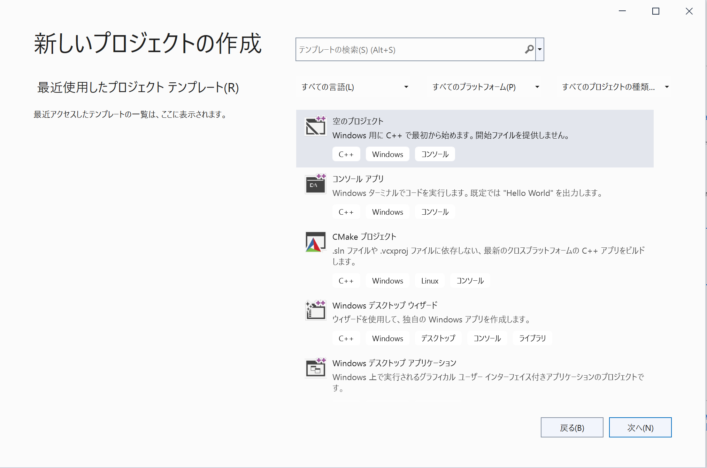
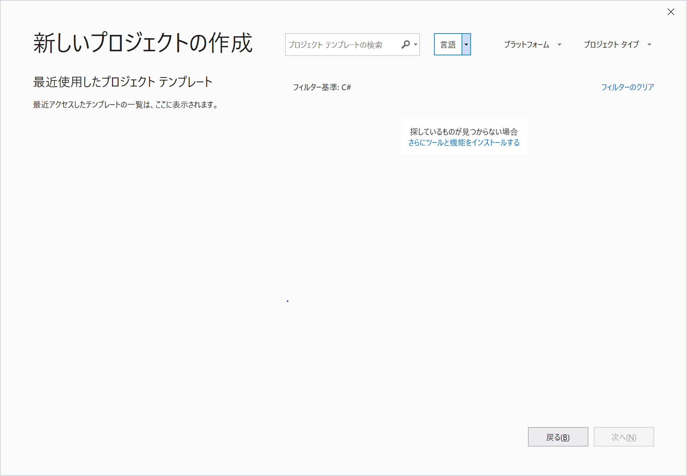

<!-- Title: Visual Studio Community 2022のインストール -->
#contents

## Obtaining the Installer

Please obtain the Visual Studio Community 2026 installer from the following page.

- [Download Visual Studio](https://visualstudio.microsoft.com/ja/downloads/?utm_source=mscom&utm_campaign=msdocs)

Click the [**Free Download**] button under the label [**Community**] to begin downloading the installer.  
The installation procedure is explained using version 2022 as an example.

#clear

## Running the Installer

After the download is complete, open and run the downloaded file. Follow the instructions by clicking through the screens until the following screen appears. Check [**Desktop development with C++**] and click the [**Install**] button.

#clear

## Verifying the Installation

#clear

When the installation is complete, a sign-in screen will appear. Sign in with a Microsoft account. You can use Visual Studio for 30 days without signing in.
For information about Microsoft accounts, refer to the following.

[How to Create a New Microsoft Account](https://support.microsoft.com/ja-jp/help/4026324/microsoft-account-how-to-create)

#clear

## Verifying That the C++ Compiler Is Installed

Be sure to verify that the Desktop development with C++ feature has been installed.

If you can create a Visual C++ project, there is no problem.
First, click [**Create a new project**].

#clear

At this point, if options such as the following are available, the installation is successful. 

[**Empty Project** 
Start from scratch with C++ for Windows. No starter files are provided.]

#clear

If it has not been installed, 

[Can't find what you're looking for? 
**Install more tools and features**]

Clicking this option launches the installer. Install [**Desktop development with C++**].

#clear

 
 
