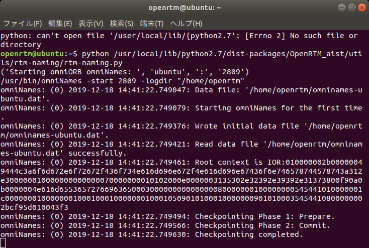
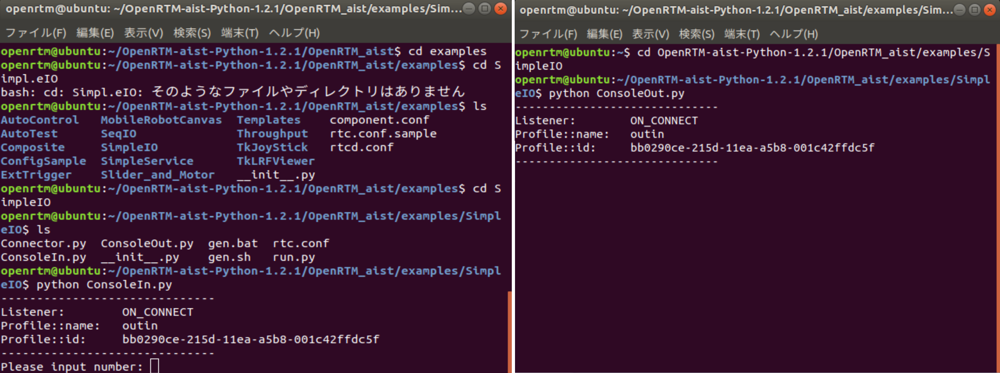

<!-- /node/6996 -->
<!-- Title: 動作確認(Linux編) -->
After installation has completed successfully, perform an operation test using the included samples. The samples are normally located in the following directory.

- /usr/share/openrtm-1.2/components/python/<Sample Component Set Name>

Use the sample component set SimpleIO to verify that OpenRTM-aist has been built and installed correctly.

#contents(3)

## Sample Component Set SimpleIO

This is a sample set consisting of the RT Components ConsoleIn and ConsoleOut. ConsoleIn is a component that outputs numerical values entered from the console through an OutPort, while ConsoleOut is a component that displays numerical values received through an InPort on the console. These components are samples intended to demonstrate simple I/O (input/output). They operate by creating a connection from the OutPort of ConsoleIn to the InPort of ConsoleOut and activating these two components.

In the following explanation, it is assumed that the samples are located under /usr/share/openrtm-1.2/components/python/SimpleIO and that the search path has been configured for the Python executable.

## Verifying Operation Using the Samples

### Starting the Name Server

- Start the name server. It can be started with the following command.

```bash
$ rtm-naming
```

- In environments where OpenRTM-aist (C++) is not installed, the following scripts are provided so that it can be started.

```bash
$ python /usr/lib/python2.7/dist-packages/OpenRTM_aist/utils/rtm-naming/rtm-naming.py
      or
$ python3 /usr/lib/python3/dist-packages/OpenRTM_aist/utils/rtm-naming/rtm-naming.py
```

Here, {Python2.7|python3} depends on the version of Python installed in the Linux environment when the Python edition of OpenRTM-aist was installed. If Python 2.7 was installed, use "python2.7". (The default on Ubuntu 18.04 is Python 2.7.)

The following screen will be displayed.

<div align="center"><a href="startnameservice002.png"></a></div>
<div align="center"><strong>Name Server Window</strong></div>

### Starting the Sample Components

- Open a terminal.
- Change the current directory to /usr/share/openrtm-1.2/components/python/SimpleIO.

```bash
$ cd /usr/share/openrtm-1.2/components/python/SimpleIO
```

- Start the ConsoleIn component with the following command.

```bash
$ python ConsoleIn.py
```

- Open another terminal.
- Set the current directory to the same location as above.
- Start the ConsoleOut component with the following command.

```bash
$ python ConsoleOut.py
```

#### Checking Names on the Name Service

- Open another terminal.

Check the registered names as follows.

```bash
$ rtls -R localhost
.:
ConsoleIn0.rtc  ConsoleOut0.rtc
```

#### Connecting the Sample Components

- Connect the ConsoleIn0 component and ConsoleOut0 component using the following command.

In the terminal opened above, enter:

```bash
rtcon /localhost/ConsoleIn0.rtc:out /localhost/ConsoleOut0.rtc:in
```

### Activating the Sample Components

- In the terminal above, enter:

```bash
rtact /localhost/ConsoleIn0.rtc /localhost/ConsoleOut0.rtc
```

When executed, the terminals running ConsoleIn.py and ConsoleOut.py will change as shown below, and the terminal running ConsoleIn.py will display the prompt "Please input number:".

<div align="center"><a href="simpleio_ubuntu.png"></a></div>
<div align="center"><strong>Console Windows of ConsoleIn and ConsoleOut Components After Activation</strong></div>

- Enter an arbitrary numerical value (within the range of short int: 32767 or less) in the terminal running ConsoleIn and press the Enter key.
- The same value entered will be displayed in the ConsoleOut.py terminal window. This confirms that data has been transferred from the ConsoleIn component to the ConsoleOut component.

### Deactivating and Exiting the Sample Components

- Deactivate the components with the following command.

```bash
rtdeact /localhost/ConsoleIn0.rtc /localhost/ConsoleOut0.rtc
```

- The ConsoleIn.py terminal will be waiting for input, so enter an arbitrary numerical value (32767 or less) and press the Enter key.

- Enter the following commands and confirm in each terminal that ConsoleIn.py and ConsoleOut.py have terminated.

```bash
rtexit /localhost/ConsoleIn0.rtc
rtexit /localhost/ConsoleOut0.rtc
```

This completes the verification of the basic component operations using the command line.
