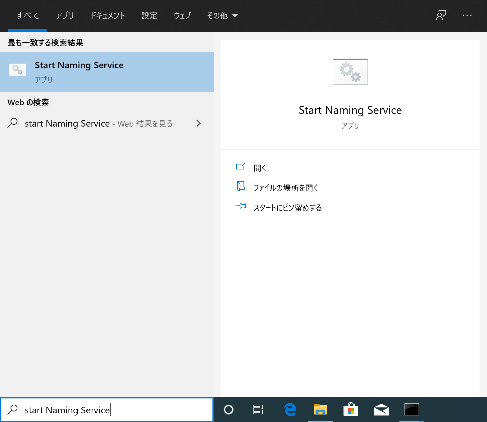
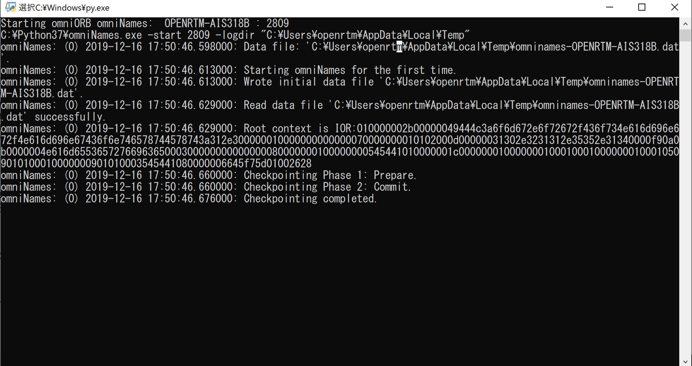
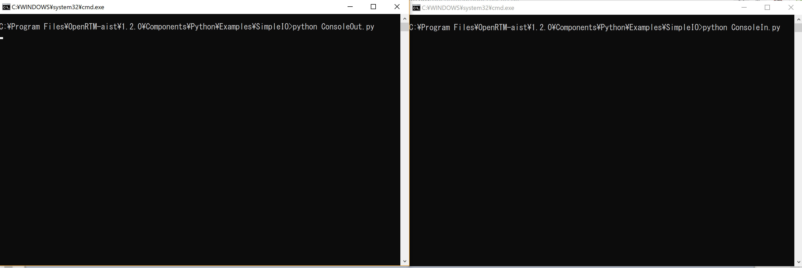
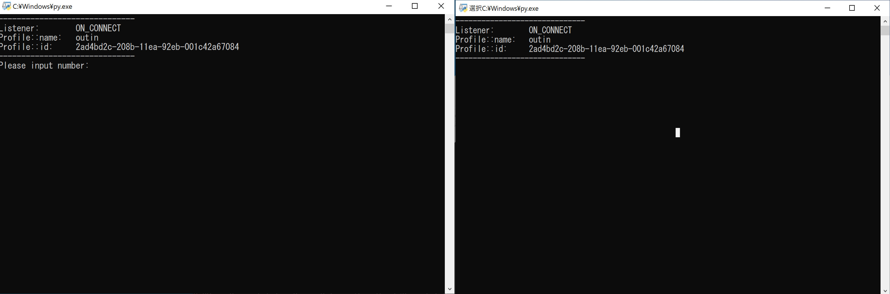

<!-- Title: 動作確認(Windows編) -->

#contents(3)

## Test Environment

The following explanation assumes an environment where OpenRTM-aist has been installed with the MSI installer using the default settings on Windows 10.

Use the sample component set SimpleIO to verify that rtshell has been installed correctly.

## Operation Check Using the Sample (SimpleIO)

This sample set consists of the RT Components ConsoleIn and ConsoleOut. ConsoleIn is a component that outputs numerical values entered from the console through an OutPort, while ConsoleOut is a component that displays numerical values received through an InPort on the console. These components are samples intended to demonstrate simple I/O (input/output). They operate by connecting the OutPort of ConsoleIn to the InPort of ConsoleOut and activating these two components.

## Starting the Name Server

First, start the Name Server using the following procedure.

- Enter "start naming service" in the [Type here to search] box at the lower-left corner of the screen.
- Click [Start Naming Service].

<div align="center"><a href="rtshell6.png"></a></div>

- The following screen will be displayed.

<div align="center"><a href="rtshell5.png"></a></div>

## Starting the Sample Components

Start the sample components.

On Windows 10, enter **Python_Examples** in the [Type here to search] box at the lower right and open Explorer at the directory containing the sample component startup files.

<div align="center"><a href="rtm8-2.png"></a></div>
<div align="center"><strong>Sample Component Startup Files</strong></div>

Double-click "ConsoleIn.bat" and "ConsoleOut.bat" to start the two components. After startup, two console windows will open as shown below.

The sample components are normally installed under the following directory, so you may also start them directly from Explorer.

- C:\Program Files\OpenRTM-aist\1.2.<span style="color:blue;">x</span>;\Components\Python

<div align="center"><a href="rtm9-2.png"></a></div>
<div align="center"><strong>ConsoleIn Component and ConsoleOut Component</strong></div>

### If the Components Do Not Start

If the components do not start, there may be several possible causes.

#### The Console Window Opens and Immediately Closes

There may be a problem with the rtc.conf configuration. Open the Examples\SimpleIO\rtc.conf file under the directory containing the sample startup files and check the settings. For example, CORBA may terminate abnormally if settings such as corba.endpoint or corba.endpoints do not match the host address of the currently running PC.

Try replacing the configuration with the following minimal rtc.conf setting.

```text
corba.nameservers: localhost
```

#### omniORBpy Is Not Installed

The MSI installer provided by openrtm.org includes omniORBpy. However, if you select a custom installation, OpenRTM-aist-Python can be installed without omniORBpy. In addition, if OpenRTM-aist was installed manually, omniORBpy may not be installed. Verify that omniORBpy is installed.

#### Incorrect Association for .py Files

The files used to start ConsoleIn and ConsoleOut are:

C:\Program Files\OpenRTM-aist\1.2.<span style="color:blue;">x</span>;\Components\Python\Examples\SimpleIO\ConsoleIn.py<br>
C:\Program Files\OpenRTM-aist\1.2.<span style="color:blue;">x</span>;\Components\Python\Examples\SimpleIO\ConsoleOut.py

Try double-clicking these files directly. If they do not start correctly, the file association is incorrect.

#### Other Causes

Startup may fail due to host name or address configuration issues. In such cases, operation may succeed if the PC's IP address is provided to omniNames.exe.

Set the environment variable OMNIORB_USEHOSTNAME as follows (the example below assumes the local host IP address is 192.168.0.11).

```text
Variable name (N): OMNIORB_USEHOSTNAME
Variable value (V): 192.168.0.11
```

## Operating rtshell

- Open a command-line console.

- From the command line, execute the rtls command as shown below and confirm that the following output is displayed.

```text
C:\Users\openrtm>rtls -R 127.0.0.1
.:
ConsoleIn0.rtc  ConsoleOut0.rtc
```

- Connect the ConsoleIn component and ConsoleOut component.

```text
rtcon /localhost/ConsoleIn0.rtc:out /localhost/ConsoleOut0.rtc:in
```

- Activate the ConsoleIn component and ConsoleOut component.

```text
rtact /localhost/ConsoleIn0.rtc /localhost/ConsoleOut0.rtc
```

- The ConsoleIn and ConsoleOut consoles will then change as shown below, and "Please Input number:" will be displayed in the ConsoleIn console.

<div align="center"><a href="rtm9-3.png"></a></div>

- Enter a numerical value (within the range of a 16-bit integer) in the ConsoleIn console and press the Enter key.

- Confirm that the value entered in the ConsoleIn console is displayed in the ConsoleOut console.
If the same value is displayed, operation has been verified successfully.

- Deactivate the components by entering the following command.

```text
rtdeact /localhost/ConsoleIn0.rtc /localhost/ConsoleOut0.rtc
```

At this time, enter a numerical value in the ConsoleIn.py console and press the Enter key to release the input-waiting state.

Then enter:

```text
rtexit /localhost/ConsoleIn0.rtc
rtexit /localhost/ConsoleOut0.rtc
```

and confirm that the console windows close.
