<!-- Title: OpenRTM-aistを10分で始めよう！ -->
#contents

The latest version, OpenRTM-aist-2.1.0-RELEASE, installs the C++ edition, Python edition, Java edition, OpenRTP, and rtshell.

# Preparation

## Installing Python

If Python is not installed, OpenRTM-aist cannot be installed.
Please install Python before installing OpenRTM-aist. Supported versions are
"3.14", "3.13", "3.12", "3.11", and "3.10".

For downloading Python, see [Installing OpenRTM-aist 2.1 on Windows](/en/doc/installation/install_2_1/install_windows_2_1/install_2_1).

The Python installation location supports the [Customize installation] option during installation.

Configure the search path automatically using the following method. This adds the directory containing python.exe and the Scripts directory to the Path.  (Example: Path=C:\Python313;C:\Python313\Scripts;...)

**[Installation Procedure]**

- Launch the Python installer. Version 3.13 is used as an example here.
- Check [add python *** to PATH] at the bottom of the first screen, then select [Customize installation].

<a href="py313_install_1.png">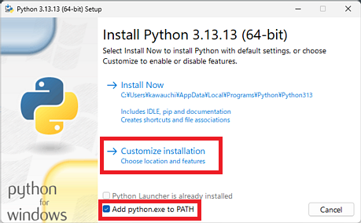</a>

- No changes are required on the [Optional Features] screen. Select [Next] to continue.

<a href="py313_install_2.png">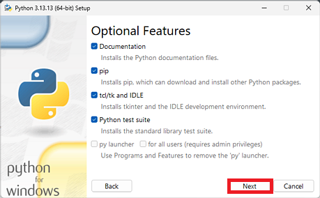</a>

- On the [Advanced Options] screen, check [Install for all users], and specify the installation destination in [Customize install location]. (Example: Path=C:\Python313;C:\Python313\Scripts;...)

<a href="py313_install_3.png">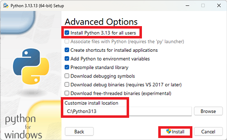</a>

- Select [Install] to complete the installation.

## Downloading OpenRTM-aist

For downloading the installer, see [Download](/en/node/7332).

If you are using Microsoft Edge and cannot download because the following message appears, follow the procedure below.

<a href="edge-download-01.png">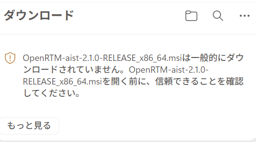</a>

- Click the "..." displayed when you hover the mouse cursor over the item.

<a href="edge-download-02.png">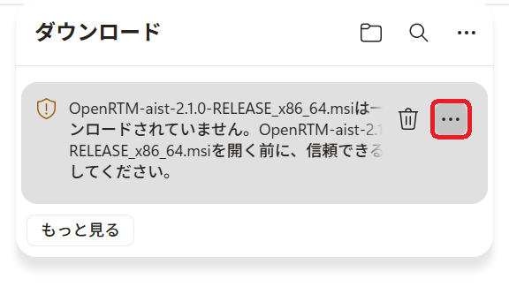</a>

- Click "Keep".

<a href="edge-download-03.png">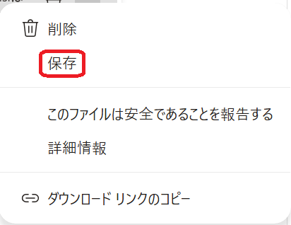</a>

- Click the "✓" (check mark) next to "Delete", then click "Keep anyway" from the displayed menu.

<a href="edge-download-04.png">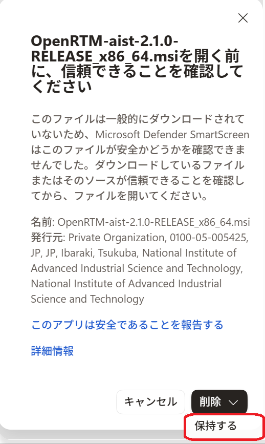</a>

- The download is now complete. Click "Open file" to start the installer.

## Installing OpenRTM-aist

**[Installation Procedure]**

1. Launch the installer and click [Next].

<a href="RTM210_msi_1.png">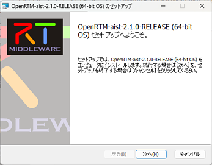</a>

 

1. This is the license agreement page. Accept the software license terms and click [Next].

<a href="RTM210_msi_2.png">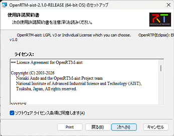</a>

 

1. Select the installation type. Click [Next] with the default settings.

<a href="RTM210_msi_3.png">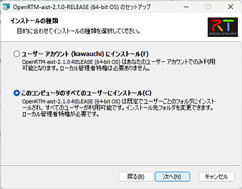</a>

 

1. Select the setup type.
Click [Typical] to install all features.
 

<a href="RTM210_msi_4.png">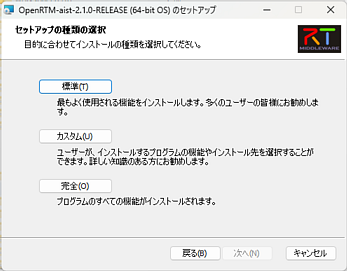</a>

 

1. Installation is complete. Click [Finish] to exit the installer.

<a href="RTM210_msi_5.png">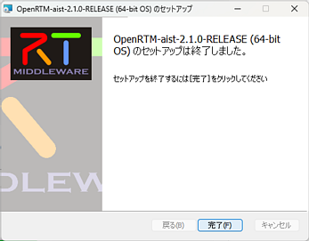</a>

 

<!-- ※使用しているVisual Studio のバージョンが2019(vc14)以外の場合は、以下のページを
参考に環境変数のRTM_VC_VERSIONを変更してください。&br; -->
<!-- [[RTM_VC_VERSIONの変更:/ja/node/6136/]] -->

## Checking System Environment Variables

We have confirmed cases where nested environment variables are not expanded recursively, but this can be resolved using the VerChanger tool. For details, see the following page.

- [Checking System Environment Variables](/en/doc/installation/install_2_1/install_win_2_1/install_2_1#toc9)

## Running Sample Components

This section explains how to verify the connection operation between two RTCs using the RTSystemEditor feature of OpenRTP.

&aname(openrtp_start);

### Starting OpenRTP

- Launch it by clicking the desktop shortcut.

<a href="OpenRTP210-001.png">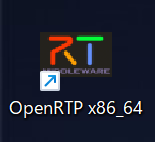</a>

<strong>Starting OpenRTP</strong>

- Specify any appropriate location for the workspace.

<strong>Selecting a Workspace</strong>

 

- The "Welcome" screen is not needed, so click the [×] button on the [Welcome] tab in the upper-left corner to close the screen.

<strong>Screen at Initial Startup</strong>

 

### Using RTSystemEditor

- Click [Open Perspective] in the upper-right corner of the screen. In the dialog that appears, select [RT System Editor] and click [Open] to start RTSystemEditor.

;  

;

<strong>Switching Perspectives</strong>

 

- Only during the first startup, a dialog saying "Failed to start the toolbar." will be displayed. Follow the instructions to exit OpenRTP and start it again.

<a href="OpenRTP210-002.png">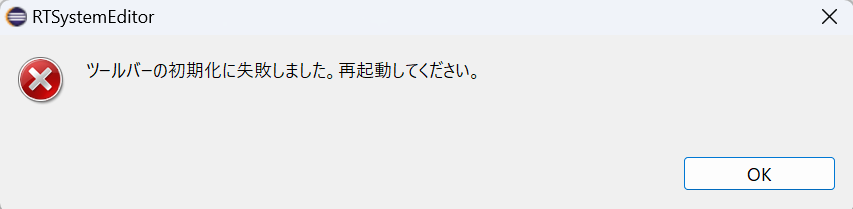</a>

<strong>Restart OpenRTP</strong>

- Press the Name Service startup button to start the localhost name server.

<a href="OpenRTP210-003.png">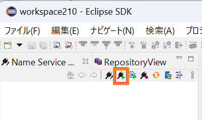</a>
;  
<a href="OpenRTP210-004.png">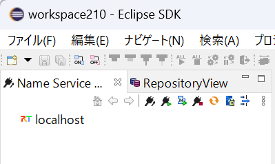</a>
;

### Starting C++ ConsoleIn and ConsoleOut

- Enter "c++_e" in lowercase in the Windows search box. When the C++_Examples candidate appears, click it.

<a href="menu-c++RTC_001.png">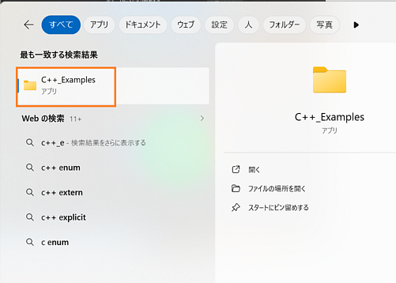</a>

<strong>Select C++_Examples</strong>

- A list of C++ sample RTCs will be displayed. Double-click ConsoleIn and ConsoleOut to start them.

<a href="menu-c++RTC_002.png">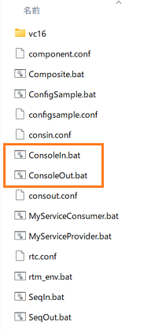</a>

<strong>Start ConsoleIn and ConsoleOut</strong>

 

- After startup, console windows similar to the following will be displayed.

<!-- CENTER:&ref(ConsoleIn001.png,center,90%);&ref(ConsoleOut001.png,center,90%); -->

;

<strong>ConsoleIn.bat and ConsoleOut.bat</strong>

 

- Click [Open New System Editor] from the toolbar to display the [System Diagram].

<strong>Display the System Diagram</strong>

 

- Drag and drop the ConsoleIn and ConsoleOut components from [NameServiceView] onto the [System Diagram]. They will be displayed as shown below.

<strong>Drag and Drop Components</strong>

 

- Connect the components by dragging and dropping between the data ports. After that, a dialog prompting for the information required for the connection will appear. Click [OK].

;  

;

<strong>Connecting Components</strong>

 

- The components will be connected as shown in the image below.

<strong>Connection Complete</strong>

 

- Change the component state to Active. Click [All Activate]. If the component color changes from blue to light green, the operation is successful. Components can also be activated individually by selecting them and right-clicking. (If [All Activate] is not displayed, try restarting OpenRTP. Alternatively, you may activate the components individually.)

 

<strong>Activation Complete</strong>

 

### Verifying Operation in the Component Console Windows

- Next, verify operation in the console windows. After connecting the components in RTSystemEditor, "Please input number:" is displayed in the ConsoleIn window.

<strong>"Please input number:" Displayed</strong>

 

- Enter any numeric value in the ConsoleIn window and press [Enter]. The value is displayed in the ConsoleOut window.

;

<strong>Operation Verification</strong>

 

  - Entering non-numeric values or excessively large values may cause abnormal behavior. In that case, stop the batch file using the Ctrl-C key and restart from launching the batch files again.

- To terminate the components, click [All Deactivate] from the toolbar. Then right-click the components and select [Exit].

  - If deactivation takes a long time, ConsoleIn is waiting for numeric input. In that case, enter any numeric value.

<strong>Deactivating Components</strong>

 

<strong>Terminating Components</strong>

 

- This completes the operation verification using ConsoleIn and ConsoleOut.

## Using rtshell

rtshell is installed by default with OpenRTM-aist.

By using rtshell, you can activate, deactivate, and terminate RTCs from the command line. 

See [Installing and Verifying rtshell Operation (Windows Edition)](/en/doc/installation/install_rtshell/check_windows).

## Next...

Please refer to the links below.

- **Try running more samples　　　&t;：　**[Sample Components](/en/node/811)
- **Try creating a component　　　&t;：　**[Case Study](/en/node/110)
- **Learn OpenRTM from the basics　&t;：　**[Developer's Guide](/en/node/113)
- **Join the community　　　　　&t;：　**[Community](/en/node/624)
- **Browse published components　&t;：　**[Projects](/en/node/123)
