<!-- Title: OpenRTM-aistを10分で始めよう！ -->
#contents

最新バージョンOpenRTM-aist-2.0.2-RELEASEではC++版、Python版、Java版、OpenRTP、rtshell がインストールされます。

# 事前準備
## Pythonのインストール
Pythonをインストールしていない場合は、OpenRTM-aistをインストールできません。
OpenRTM-aistをインストールする前に、Pythonをインストールしてください。バージョンは、"3.12"、"3.11"、"3.10"、"3.9"、"3.8"に対応しています。

Pythonのダウンロードは [OpenRTM-aist 2.0系のWindowsへのインストール]({{ site.baseurl }}/ja/doc/installation/install_2_0/install_windows_2_0/install_2_0) をご覧ください。

Pythonのインストール先は、インストール時の選択 [Customize installation]に対応しています。

サーチパスは、以下の方法で自動で設定されるようにしてください。こうすると、python.exeが置いてあるディレクトリとScriptsディレクトリがPathに追加されます。  (例: Path=C:\Python38;C:\ Python38\Scripts;...）

**[インストール手順]**

- Pythonインストーラーを起動します。ここではバージョン3.8を例に説明します。
- 最初の画面の下部にある[add python *** to PATH]にチェックを入れて、[Customize installation]を選択してください。

- 次の[Optional Features]画面で変更はありません。[Next]を選択して進んでください。

<a href="python38-install002.png">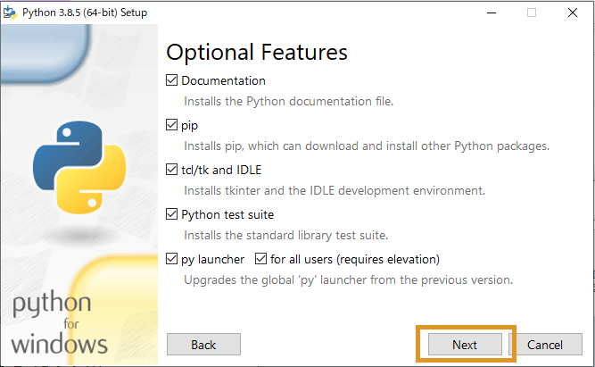</a>

- [Advanced Options]画面では、[Install for all users]にチェックを入れて、[Customize install location]でインストール先を設定してください。(例: Path=C:\Python38;C:\ Python38\Scripts;...）

<a href="python38-install003.png">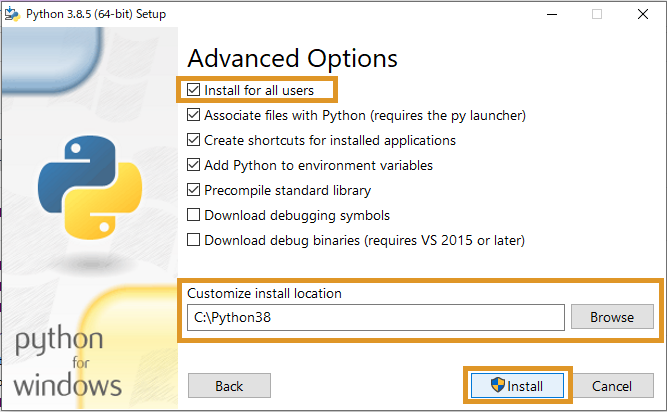</a>

- [Install] を選択してインストールを完了します。

## OpenRTM-aistのダウンロード

インストーラーのダウンロードは [ダウンロード]({{ site.baseurl }}/ja/download) をご覧ください。

Microsoft Edge をお使いで、下記メッセージが出てダウンロードできない場合の手順を紹介します。

<a href="msi-download-01.png">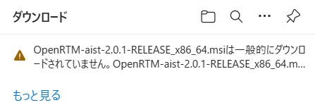</a>

- マウスオーバーで表示される「・・・」をクリックします

<a href="msi-download-02.png">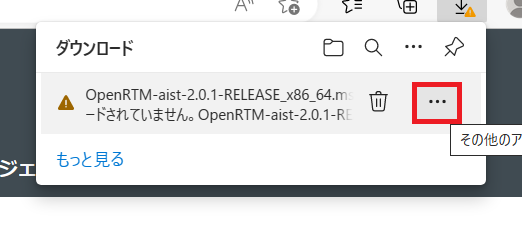</a>

- 「保存」をクリックします

<a href="msi-download-03.png">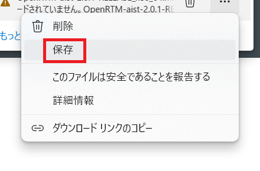</a>

- 「詳細表示」をクリックします

- 「保存する」をクリックします

<a href="msi-download-05.png">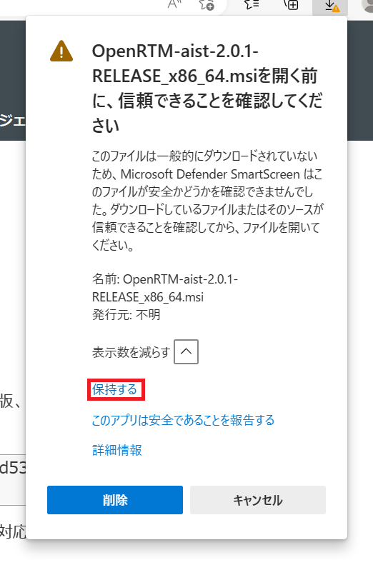</a>

- これでダウンロードが完了しますので、「ファイルを開く」をクリックするとインストーラが起動します

## OpenRTM-aistのインストール

**[インストール手順]**
1. インストーラーを起動します。[WindowsによってPCが保護されました]の画面が表示されたら[詳細情報]をクリックして[実行]ボタンを表示させて、[実行]をクリックします。(この画面はWindowsのあるバージョン以降でMicrosoft Corp.に登録されていないアプリケーションのインストール時に表示される画面で、本ソフトウエアは登録をしていないため、この画面が表示されます。)
1. [次へ]をクリックします。ここではバージョン2.0.0の画像で説明していますが、2.0.2でも手順は同様です。

 
1. 使用承諾契約書のページです。ソフトウェアライセンス条項に同意して[次へ]をクリックします。

<a href="RTM2.0.0-msi-2.png">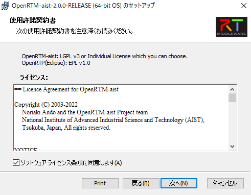</a>

 
1. インストールの種類を選択します。デフォルトのまま[次へ]をクリックします。

<a href="RTM2.0.0-msi-3.png">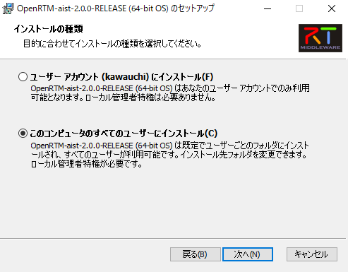</a>

 
1. Visual Studioのバージョンを選択します。
  - C++版で使用するVisual Studioのバージョンをシステム環境変数に設定します。
  - インストールされている Visual Studioのバージョンを選択して[次へ]をクリックします。
    - Visual Studioのダウンロードは [OpenRTM-aist 2.0系のWindowsへのインストール]({{ site.baseurl }}/ja/doc/installation/install_2_0/install_windows_2_0/install_2_0) をご覧ください。
    - Visual Studioのバージョンは、インストール終了後にツールのVCVerChangerで変更できます。[(VCVerChangerの使い方)]({{ site.baseurl }}/ja/content/vc_version_changer)
    - Python版、Java版では無関係ですのでデフォルトのまま[次へ]をクリックしてください。

<a href="RTM2.0.0-msi-4.png">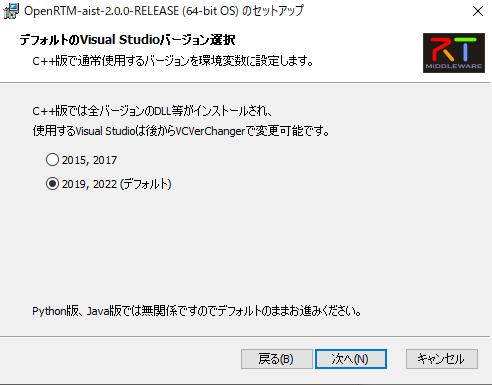</a>

 
1. セットアップの種類を選択します。
[標準]を選択した場合、OpenRTM-aistのC++版、Java版、Python版、OpenRTP、RTSystemEditorRCP、RTShell、OpenRTM-aist-C++版のVisual Studio 2015から2022までのランタイムライブラリ、OpenRTM-aist-1.0.0から2.0.0までのランタイムライブラリがインストールされます。特に変更理由がないようであれば[標準]をクリックします。
 

 
1. [インストール]をクリックするとインストールが開始されます。

<a href="RTM2.0.0-msi-6.png">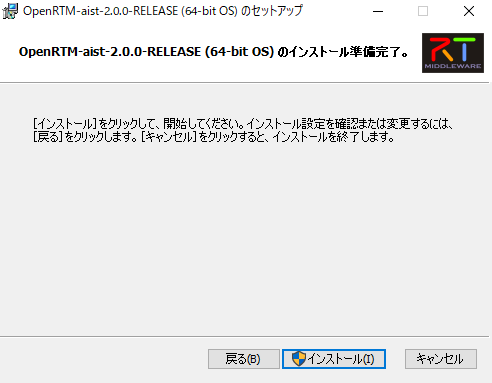</a>

 

<a href="RTM2.0.0-msi-7.png">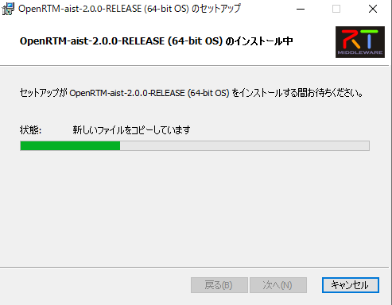</a>

 
1. インストールが終了しました。[完了]をクリックしてインストーラーを終了します。

 
<!-- ※使用しているVisual Studio のバージョンが2019(vc14)以外の場合は、以下のページを参考に環境変数のRTM_VC_VERSIONを変更してください。&br; -->
<!-- [[RTM_VC_VERSIONの変更:/ja/content/vc_version_changer]] -->

## VCVerChangerの実行

インストーラはOpenRTM-aistが使用するシステム環境変数をレジストリに登録しています。この環境変数の中に、他の環境変数である%RTM_VC_VERSION%を含むものがあります。
このようなネストされた環境変数が再帰的に展開されない場合があります。

解決のため、VCVerChanger を実行して下さい。「確認」ボタンを押すと、環境変数を展開してレジストリに書き戻します。
[(VCVerChangerの使い方)]({{ site.baseurl }}/ja/content/vc_version_changer)

## サンプルコンポーネントを実行する
### 事前準備
- 必須ではありませんが、ここからはスタートメニューに登録されたアプリケーションを多数起動します。毎回スタートメニューから順番にたどるのは大変ですので、
スタートボタンからスタートメニューを表示させ[OpenRTM-aist 2.0.2 x86_64]>[C++_Examples]を右クリックして[ファイルの場所を開く]を選択してください。
 

<a href="start-menu.png">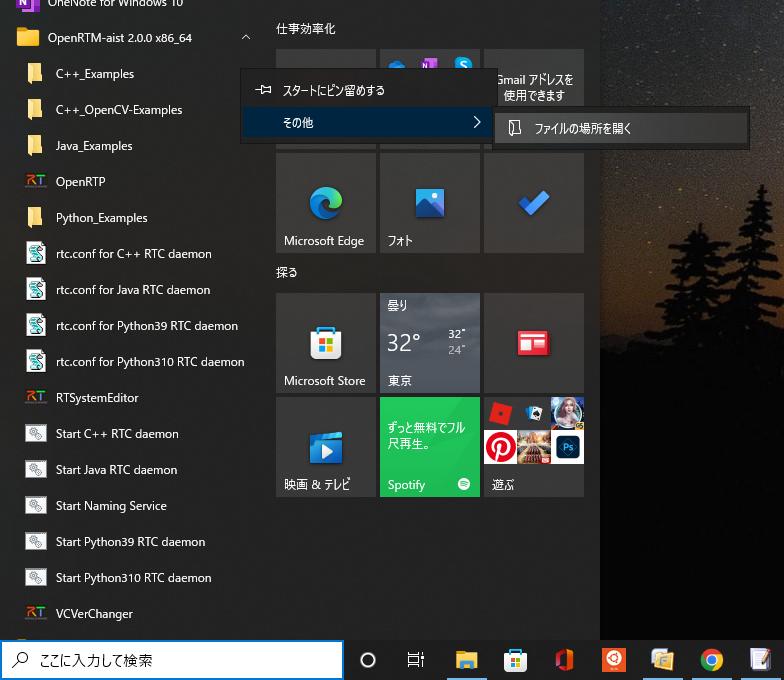</a>

<strong>ファイルの場所を開く</strong>

 

 

<strong>スタートメニューフォルダー</strong>

 
  - このように、スタートメニューのフォルダーが開かれ、メニューに登録されているアプリケーションにアクセスしやすくなります。

## Naming Serviceの起動
- Start Naming Serviceをダブルクリックします。以下のようなコンソール画面が表示されます。

<a href="StartNameService122-001.png">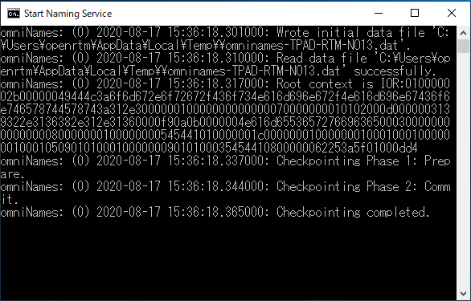</a>

<strong>Start Naming Service</strong>

 
## サンプルコンポーネント
### ConsoleInComp、ConsoleOutCompを使用する
ConsoleInComp、ConsoleOutCompはDataInPort、DataOutPortの使用方法を示したサンプルです。ConsoleIn側で入力した数字が，ConsoleOut側に表示されます。ここではこの二つのコンポーネントを使用し、動作確認を行います。
### サンプルコンポーネントの起動
- [OpenRTM-aist 2.0.2 x86_64]>[C++_Example]フォルダー内のConsoleIn.batとConsoleOut.batをダブルクリックします。もし[Windows セキュリティのの重要な警告]画面が表示されたら[プライベートネットワーク(ホームネットワーク社内ネットワークなど)(R)]にチェックマークをつけて[アクセスを許可する(A)]をクリックしてください。以下のようなコンソール画面が表示されます。
<!-- CENTER:&ref(ConsoleIn001.png,center,90%);&ref(ConsoleOut001.png,center,90%); -->

;

<strong>ConsoleIn.batとConsoleOut.bat</strong>

 

&aname(openrtp_start);
## OpenRTP起動
- デスクトップのショートカットをクリックして起動します。スタートメニューでは、[OpenRTM-aist 2.0.2 x86_64]>[OpenRTP]と選択してください。先ほど開いたフォルダー画面からOpenRTPをダブルクリックすることによっても起動できます。
  - ワークスペースは適当な場所を指定してください。

<strong>ワークスペースの選択</strong>

 
- 「ようこそ」画面は必要ないので左上の[ようこそ]タブの[×]ボタンをクリックして画面を閉じてください。

<a href="OpenRTP122-002.png">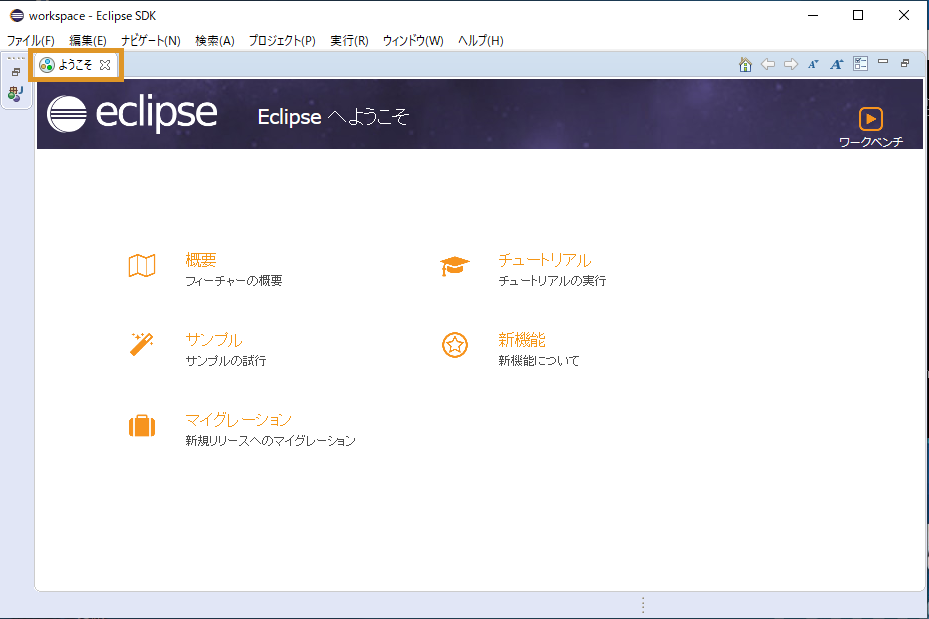</a>

<strong>初期起動時の画面</strong>

 

## RTSystemEditorの使用
- 画面右上の[パースペクティブを開く]をクリックします。表示されるダイアログで[RT System Editor]を選択して[開く]をクリックするとRTSystemEditorが起動します。

<a href="OpenRTP122-003.png">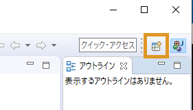</a>
;  

;

<strong>パースペクティブの切り替え</strong>

 
- [NameServiceView]にコンポーネントが表示されます。最初は折りたたまれているため表示されていませんが、[>]をクリックし展開すると、ホスト名のホストコンテキストとConsoleIn、ConsoleOutコンポーネントが確認できます。設定により、ホストコンテキスト(図中 “TPAD-RTM-NO13|host_cxt” のような “ホスト名|host_cxt” の階層) が表示されず、直接コンポーネントが表示される場合もあります。

<a href="OpenRTP122-005.png">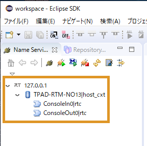</a>

<strong>コンポーネント起動確認</strong>

 
  - NameServerViewにネームサーバーが表示されない時は、手動でlocalhostを追加します。画像の[ネームサーバを追加]をクリックしてダイアログを表示します。「localhost」と入力し[OK]をクリックして追加します。それでも起動されなかった場合は、一度すべてのコンソール画面を閉じてNaming Serviceの起動からの手順をやり直してみてください。

;  
<a href="OpenRTP122-007.png">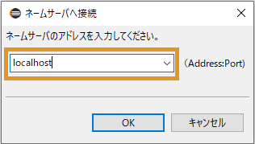</a>
;

<strong>ネームサーバの追加</strong>

 
- ツールバーから [Open New System Editor]をクリックして、[System Diagram]を表示します。

<strong>System Diagramを表示</strong>

 
- [NameServiceView]にあるConsoleIn、ConsoleOutのコンポーネントを[System Diagram]上にドラッグ＆ドロップすると、以下の画像のように表示されます。

<strong>コンポーネントをドラッグ＆ドロップ</strong>

 
- データポート間でドラッグ＆ドロップしてコンポーネントを接続します。その後、接続に必要な情報の入力を促すダイアログが表示されるので[OK]をクリックします。

;  

;

<strong>コンポーネント接続</strong>

 
  - 以下の画像のように接続されます。

<strong>接続完了</strong>

 
- コンポーネントの状態をActiveにします。[All Activate]クリックしてください。コンポーネントの色が青から明るい緑に変わったら成功です。コンポーネントは個別に選択して右クリックをすることに個別にActiveにすることも可能です。([All Activate]が表示されていない場合は、Openrtpを再起動してみてください。または、コンポーネントを個別にActiveにしても良いです。）

<a href="OpenRTP122-013.png">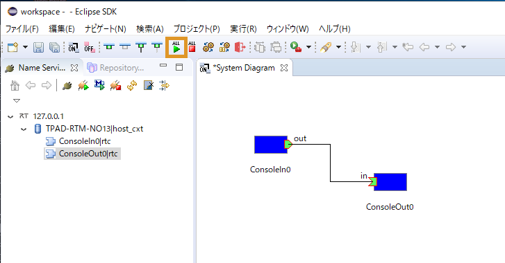</a>

 

<a href="OpenRTP122-014.png">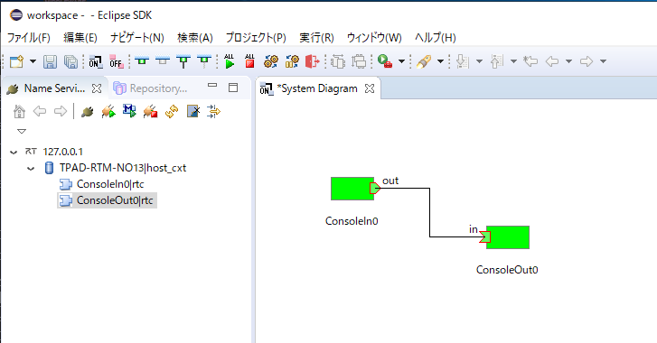</a>

<strong>Activate完了</strong>

 
### コンポーネントのコンソール画面での動作確認
- 次にコンソール画面で動作確認します。RTSystemEditorで接続後、ConsoleIn画面に「Please input number:」と表示されます。

<strong>「Please input number:」と表示</strong>

 
- ConsoleIn画面で任意の数値を入力し[Enter]を押すと、ConsoleOut画面に数値が表示されます。

<a href="Console122-002.png">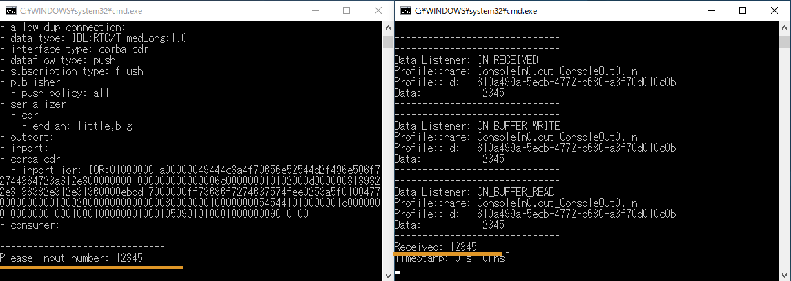</a>
;

<strong>動作確認</strong>

 
  - 数値以外の入力や、大きすぎる数値を入力すると動作がおかしくなることがあります。その場合はCntrl-Cキーでバッチファイルの動作を停止させ、再度バッチファイルの起動からやり直してください。
- コンポーネントを終了する場合は、ツールバーから[All Deactivate]をクリックします。その後、コンポーネントを右クリックして[Exit]してください。
  - Deactivateに時間がかかる場合はConsoleInの数値入力で止まっているので、その場合は何か数値を入力してください。

<strong>コンポーネントのDeactivate</strong>

 

<strong>コンポーネントの終了</strong>

 
- 以上でConsoleInとConsoleOutを使用した動作確認は終了です。

## rtshellを利用する
OpenRTM-aistではrtshellが標準でインストールされます。
rtshellを利用することでコマンドラインからRTCのActivate、Deactivate、終了等ができるようになります。 
[rtshellのインストール・動作確認(Windows編)]({{ site.baseurl }}/ja/doc/installation/install_rtshell/check_windows) をご覧ください。

## 次は...
下記リンク先をご覧ください。
- **もっとサンプルを動かしてみる　&t;：　**[サンプルコンポーネント]({{ site.baseurl }}/ja/node/811)
- **コンポーネントを作ってみる　　&t;：　**[ケーススタディー]({{ site.baseurl }}/ja/node/110)
- **OpenRTMの基礎から学ぶ　　　&t;：　**[デベロッパーズガイド]({{ site.baseurl }}/ja/node/113)
- **コミュニティーに参加する　　　&t;：　**[コミュニティー]({{ site.baseurl }}/ja/node/624)
- **公開コンポーネントを見てみる　&t;：　**[プロジェクト]({{ site.baseurl }}/ja/node/123)

