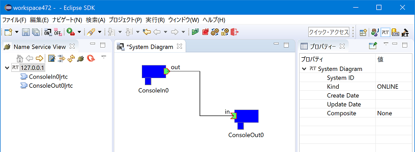
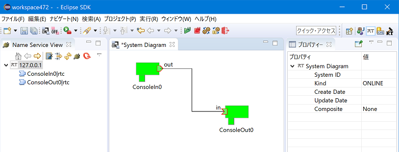
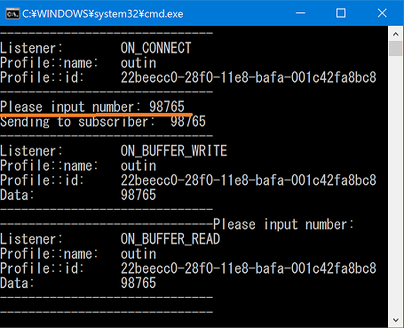
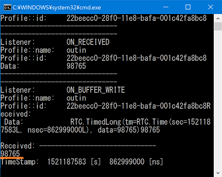

-------jp page!!-------
<!-- Title: OpenRTM-aistを10分で始めよう！ -->
#contents
最新バージョンOpenRTM-aist-1.2.1-RELEASEではC++版、Python版、Java版、OpenRTPがインストールされます。また、rtshellも同時にインストールされます。

# 事前準備
## Pythonのインストール
Pythonをインストールしていない場合は、OpenRTM-aistをインストールできません。
OpenRTM-aistをインストールする前に、Pythonをインストールしてください。バージョンは、"3.7"、"3.6"、"2.7"に対応しています。

Pythonのダウンロードは[OpenRTM-aist-1.2.1-RELEASE]({{ site.baseurl }}/ja/node/6877)をご覧ください。

<!-- http://opensource.org/licenses/eclipse-1.0.php -->
<!-- http://sourceforge.jp/projects/opensource/wiki/licenses%2FEclipse_Public_License(日本語訳) -->

Pythonのインストール先は、3.6または3.7の場合はインストール時の選択[Install Now] [Customize installation]のどちらにも対応しています。
2.7の場合はデフォルトの[Install for all users]設定のみに対応しています。

サーチパスは、以下の方法で自動で設定されるようにしてください。こうすると、python.exeが置いてあるディレクトリとScriptsディレクトリがPathに追加されます。<br> (例: Path=C:\Python27;C:\Python27\Scripts;...）

- Python 3.6または3.7のインストールでは、最初の画面の下部にある[add python *** to PATH]にチェックを入れてください。
- Python 2.7のインストールを実行した際は、以下の画面で[Add python.exe to Path]を[Will be installed on local hard drive]に設定してください。


<div align="center"><a href="Python-install001.png"></a></div>


## OpenRTM-aistのインストール
ここではWindows 10で64bit用インストーラーOpenRTM-aist-1.2.1-RELEASE_x86_64.msiを使ったインストール手順を紹介します。

インストーラーのダウンロードは[OpenRTM-aist-1.2.1-RELEASE]({{ site.baseurl }}/ja/node/6877)をご覧ください。

**[インストール手順]**
1. インストーラーを起動します。[WindowsによってPCが保護されました]の画面が表示されたら[詳細情報]をクリックして[実行]ボタンを表示させて、[実行]をクリックします。(この画面はWindowsのあるバージョン以降でMicrosoft Corp.に登録されていないアプリケーションのインストール時に表示される画面で、本ソフトウエアは登録をしていないため、この画面が表示されます。)
2. [次へ]をクリックします。
<div align="center"><a href="Openrtm121-Install001.png"></a></div>
<br>
3. 使用承諾契約書のページです。ソフトウェアライセンス条項に同意して[次へ]をクリックします。
<div align="center"><a href="Openrtm121-Install002.png"></a></div>
<br>
4. インストールの種類を選択します。デフォルトのまま[次へ]をクリックします。
<div align="center"><a href="OpenRTM121-Install003.png"></a></div>
<br>
5. Visual Studioのバージョンを選択します。
  - C++版で使用するVisual Studioのバージョンをシステム環境変数に設定します。
  - インストールされている Visual Studioのバージョンを選択して[次へ]をクリックします。
    - Visual Studioのダウンロードは[OpenRTM-aist-1.2.1-RELEASE]({{ site.baseurl }}/ja/node/6877)をご覧ください。
    - Visual Studioのバージョンは、インストール終了後にツールのVCVerChangerで変更できます。[(VCVerChangerの使い方)]({{ site.baseurl }}/ja/content/vc_version_changer)
    - Python版、Java版では無関係ですのでデフォルトのまま[次へ]をクリックしてください。
<div align="center"><a href="OpenRTM121-install004.png"></a></div>
<br>
6. セットアップの種類を選択します。
[標準]を選択した場合、OpenRTM-aistのC++版、Java版、Python版、OpenRTP、RTSystemEditorRCP、RTShell、OpenRTM-aist-C++版のVisual Studio 20010から2019までのランタイムライブラリ、OpenRTM-aist-1.0.0から1.2.1までのランタイムライブラリがインストールされます。特に変更理由がないようであれば[標準]をクリックします。
<br>
<div align="center"><a href="OpenRTM121-install005.png"></a></div>
<br>
7. [インストール]をクリックするとインストールが開始されます。
<div align="center"><a href="OpenRTM121-install006.png"></a></div>
<br>
<div align="center"><a href="OpenRTM121-install007.png"></a></div>
<br>
8. インストールが終了しました。[完了]をクリックしてインストーラーを終了します。
<div align="center"><a href="OpenRTM121-install008.png"></a></div>
<br>
<!-- ※使用しているVisual Studio のバージョンが2019(vc14)以外の場合は、以下のページを参考に環境変数のRTM_VC_VERSIONを変更してください。&br; -->
<!-- [[RTM_VC_VERSIONの変更:/ja/content/vc_version_changer]] -->

## サンプルコンポーネントを実行する
### 事前準備
- 必須ではありませんが、ここからはスタートメニューに登録されたアプリケーションを多数起動します。毎回スタートメニューから順番にたどるのは大変ですので、
スタートボタンからスタートメニューを表示させ[OpenRTM-aist 1.2.1 x86_64]>[OpenRTP]を右クリックして[ファイルの場所を開く]を選択してください。
<br>
<div align="center"><a href="Startmenu001.png"></a></div>
<div align="center"><strong>ファイルの場所を開く</strong></div>
<br>
<div align="center"><a href="Startmenu002.png"></a></div><br>
<div align="center"><strong>スタートメニューフォルダー</strong></div>
<br>
  - このように、スタートメニューのフォルダーが開かれ、メニューに登録されているアプリケーションにアクセスしやすくなります。

## Naming Serviceの起動
- Start Naming Serviceをダブルクリックします。以下のようなコンソール画面が表示されます。

<div align="center"><a href="StartNameService001.png"></a></div>
<div align="center"><strong>Start Naming Service</strong></div>
<br>
## サンプルコンポーネント
### ConsoleInComp、ConsoleOutCompを使用する
ConsoleInComp、ConsoleOutCompはDataInPort、DataOutPortの使用方法を示したサンプルです。ConsoleIn側で入力した数字が，ConsoleOut側に表示されます。ここではこの二つのコンポーネントを使用し、動作確認を行います。
### サンプルコンポーネントの起動
- [OpenRTM-aist 1.2.1 x86_64]>[C++_Example]フォルダー内のConsoleIn.batとConsoleOut.batをダブルクリックします。もし[Windows セキュリティのの重要な警告]画面が表示されたら[プライベートネットワーク(ホームネットワーク社内ネットワークなど)(R)]にチェックマークをつけて[アクセスを許可する(A)]をクリックしてください。以下のようなコンソール画面が表示されます。

<div align="center"><div align="center"><a href="ConsoleIn001.png"></a></div>;<div align="center"><a href="ConsoleOut001.png"></a></div>;</div>
<div align="center"><strong>ConsoleIn.batとConsoleOut.bat</strong></div>
<br>

&aname(openrtp_start);
## OpenRTP起動
- デスクトップのショートカットをクリックして起動します。スタートメニューでは、[OpenRTM-aist 1.2.1 x86_64]>[OpenRTP]と選択してください。先ほど開いたフォルダー画面からOpenRTPをダブルクリックすることによっても起動できます。
  - ワークスペースは適当な場所を指定してください。
<div align="center"><a href="OpenRTP001.png"></a></div>
<div align="center"><strong>ワークスペースの選択</strong></div>
<br>
- 「ようこそ」画面は必要ないので左上の[ようこそ]タブの[×]ボタンをクリックして画面を閉じてください。
<div align="center"><a href="OpenRTP002.png"></a></div>
<div align="center"><strong>初期起動時の画面</strong></div>
<br>
## RTSystemEditorの使用
- 画面右上の[パースペクティブを開く]をクリックします。表示されるダイアログで[RT System Editor]を選択して[開く]をクリックするとRTSystemEditorが起動します。
<div align="center"><div align="center"><a href="OpenRTP003.png"></a></div>;  <div align="center"><a href="OpenRTP004.png"></a></div>;</div>
<div align="center"><strong>パースペクティブの切り替え</strong></div>
<br>
- [NameServiceView]にコンポーネントが表示されます。最初は折りたたまれているため表示されていませんが、[>]をクリックし展開すると、ConsoleIn、ConsoleOutコンポーネントが確認できます。
<div align="center"><a href="OpenRTP005.png"></a></div>
<div align="center"><strong>コンポーネント起動確認</strong></div>
<br>
  - NameServerViewにネームサーバーが表示されない時は、手動でlocalhostを追加します。画像の[ネームサーバを追加]をクリックしてダイアログを表示します。「localhost」と入力し[OK]をクリックして追加します。それでも起動されなかった場合は、一度すべてのコンソール画面を閉じてNaming Serviceの起動からの手順をやり直してみてください。
<div align="center"><div align="center"><a href="OpenRTP006.png"></a></div>;  <div align="center"><a href="OpenRTP007.png"></a></div>;</div>
<div align="center"><strong>ネームサーバの追加</strong></div>
<br>
- ツールバーから [Open New System Editor]をクリックして、[System Diagram]を表示します。
<div align="center"><a href="OpenRTP008.png"></a></div>
<div align="center"><strong>System Diagramを表示</strong></div>
<br>
- [NameServiceView]にあるConsoleIn、ConsoleOutのコンポーネントを[System Diagram]上にドラッグ＆ドロップすると、以下の画像のように表示されます。
<div align="center"><a href="OpenRTP009.png"></a></div>
<div align="center"><strong>コンポーネントをドラッグ＆ドロップ</strong></div>
<br>
- データポート間でドラッグ＆ドロップしてコンポーネントを接続します。その後、接続に必要な情報の入力を促すダイアログが表示されるので[OK]をクリックします。

<div align="center"><div align="center"><a href="OpenRTP010.png"></a></div>;
<div align="center"><a href="OpenRTP011.png"></a></div>;</div>
<div align="center"><strong>コンポーネント接続</strong></div>
<br>
  - 以下の画像のように接続されます。
<div align="center"><a href="OpenRTP012.png"></a></div>
<div align="center"><strong>接続完了</strong></div>
<br>
- コンポーネントの状態をActiveにします。[All Activate]クリックしてください。コンポーネントの色が青から明るい緑に変わったら成功です。コンポーネントは個別に選択して右クリックをすることに個別にActiveにすることも可能です。([All Activate]が表示されていない場合は、Openrtpを再起動してみてください。または、コンポーネントを個別にActiveにしても良いです。）
<div align="center"><a href="OpenRTP013.png"></a></div>
<br>
<div align="center"><a href="OpenRTP014.png"></a></div>
<div align="center"><strong>Activate完了</strong></div>
<br>
### コンポーネントのコンソール画面での動作確認
- 次にコンソール画面で動作確認します。RTSystemEditorで接続後、ConsoleIn画面に「Please input number:」と表示されます。
<div align="center"><a href="Console001.png"></a></div>
<div align="center"><strong>「Please input number:」と表示</strong></div>
<br>
- ConsoleIn画面で任意の数値を入力し[Enter]を押すと、ConsoleOut画面に数値が表示されます。
<div align="center"><div align="center"><a href="Console002.png"></a></div>;  <div align="center"><a href="Console003.png"></a></div>;</div>
<div align="center"><strong>動作確認</strong></div>
<br>
  - 数値以外の入力や、大きすぎる数値を入力すると動作がおかしくなることがあります。その場合はCntrl-Cキーでバッチファイルの動作を停止させ、再度バッチファイルの起動からやり直してください。
- コンポーネントを終了する場合は、ツールバーから[All Deactivate]をクリックします。その後、コンポーネントを右クリックして[Exit]してください。
  - Deactivateに時間がかかる場合はConsoleInの数値入力で止まっているので、その場合は何か数値を入力してください。
<div align="center"><a href="Console004.png"></a></div>
<div align="center"><strong>コンポーネントのDeactivate</strong></div>
<br>
<div align="center"><a href="Console005.png"></a></div>
<div align="center"><strong>コンポーネントの終了</strong></div>
<br>
- 以上でConsoleInとConsoleOutを使用した動作確認は終了です。

## rtshellを利用する
OpenRTM-aist-1.2.1ではrtshellが標準でインストールされます。
rtshellを利用することでコマンドラインからRTCのActivate、Deactivate、終了等ができるようになります。
- 64bit版をインストールした場合にdllの不足により正常動作しない場合があります。その場合はWindows Updateを実行してください。
### RTCの操作
サンプルコンポーネントを起動し、rtshellによりコマンドラインからデータポートの接続、RTCのActivate、Deactivate、終了を行います。
### rtm-namingを起動
- [OpenRTM-aist 1.2.1 x86_64]フォルダー内のStart Naming Serviceをダブルクリックして起動します。
#### サンプルコンポーネントの起動
まずはサンプルコンポーネントを起動して、起動したコンポーネントをrtshellで操作します。
- [OpenRTM-aist 1.2.1 x86_64]>[Python_Examples]フォルダー内のConsoleIn.batとConsoleOut.batをクリックするとコンソール画面が起動します。もし[Windows セキュリティのの重要な警告]画面が表示されたら[プライベートネットワーク(ホームネットワーク社内ネットワークなど)(R)]にチェックマークをつけて[アクセスを許可する(A)]をクリックしてください。この時点ではコンソール画面上は起動時のpyプログラムの起動コマンドが表示されるだけで、先に実行したC++ Exampleの場合とは画面が出力が異なります。
#### コマンドプロンプトからの操作
- 次にスタートメニューから[Windows システム ツール]>[コマンドプロンプト]を起動してください。
<div align="center"><a href="Console006.png"></a></div>
<div align="center"><strong>コマンドプロンプトの起動</strong></div>
<br>
- C:\Python27\Scriptsをパスを設定していない場合は以下のコマンドでパスを設定してください。
```
 # Python 2.7がC:\の直下 Python27 ディレクトリにインストールされている場合
 set PATH=C:\Python27\Scripts;%PATH%
 # Python 3.7がC:\Program Filesの下 Python37 ディレクトリにインストールされている場合
 set PATH=C:\Program Files\Python37\Scripts;%PATH%
```

※ Python をインストールする場合できるだけ管理者権限でデフォルトのパスにインストールしてください。
※ アカウントのローカルディレクトリやVisual Studio と一緒にインストールしている場合は、C:\Users\<ユーザ名>\AppData\Local\Programs\Python といった場所にインストールされている場合もありますので注意してください。

- 次に以下のコマンドでデータポートを接続します。
```
 rtcon /localhost/ConsoleIn0.rtc:out /localhost/ConsoleOut0.rtc:in
```
  - すると ConsoleIn.py、ConsoleOut.pyコンソールに以下のような文字列が表示されます。
 ------------------------------
```
 Listener:        ON_CONNECT
 Profile::name:   outin
 Profile::id:     4d622f80-135f-11e6-b923-001c4231a7a3
```
 ------------------------------

<!-- #ref(Console007.png,center) -->
<!-- CENTER:''データポート接続の表示'' -->

- 念のためRTSystemEditorで確認します。<br>
  - [NameServiceView]のコンポーネントをSystem Diagramにドラッグ＆ドロップすると、データポートが接続されたことが確認できます。
<div align="center"><a href="Console007.png"></a></div>
<div align="center"><strong>データポート接続の確認</strong></div>
<br>
- 次に、以下のコマンドでRTCをActivateします。
```
 rtact /localhost/ConsoleIn0.rtc /localhost/ConsoleOut0.rtc
```
  - Activateに成功するとConsoleIn.pyコンソールに「Please input number:」と表示されます。RTSystemEditorを見ると、RTCがActivateされたことが確認できます。
<div align="center"><a href="Console008.png"></a></div>
<div align="center"><strong>Activateの確認</strong></div>
<br>
- そしてConsoleIn.py画面で数値を入力し[Enter]を押すと、ConsoleOut.py画面に数値が表示されます。
<div align="center"><div align="center"><a href="Console009.png"></a></div>;  <div align="center"><a href="Console010.png"></a></div>;</div>
<div align="center"><strong>ConsoleIn.pyとConsoleOut.py</strong></div>
<br>
- 以下のコマンドでRTCをDeactivateしてください。
```
 rtdeact /localhost/ConsoleIn0.rtc /localhost/ConsoleOut0.rtc
```
  - ConsoleInがDeactivateできない場合、数値入力で止まっているので何か数値を入力してください。
- 最後に以下のコマンドでRTCを終了させてください。
```
 rtexit /localhost/ConsoleIn0.rtc
 rtexit /localhost/ConsoleOut0.rtc
```
## 次は...
下記リンク先をご覧ください。
- **もっとサンプルを動かしてみる　&t;：　**[サンプルコンポーネント]({{ site.baseurl }}/ja/node/811)
- **コンポーネントを作ってみる　　&t;：　**[ケーススタディー]({{ site.baseurl }}/ja/node/110)
- **OpenRTMの基礎から学ぶ　　　&t;：　**[デベロッパーズガイド]({{ site.baseurl }}/ja/node/113)
- **コミュニティーに参加する　　　&t;：　**[コミュニティー]({{ site.baseurl }}/ja/node/624)
- **公開コンポーネントを見てみる　&t;：　**[プロジェクト]({{ site.baseurl }}/ja/node/123)

-------jp page!!-------
