<!-- Title: OpenRTM-aistを10分で始めよう！ -->
#contents
The latest version, OpenRTM-aist-1.2.1-RELEASE, installs the C++, Python, and Java editions as well as OpenRTP. In addition, rtshell is installed at the same time.

# Preparation
## Installing Python
If Python is not installed, OpenRTM-aist cannot be installed.
Please install Python before installing OpenRTM-aist. Supported versions are "3.7", "3.6", and "2.7".

For downloading Python, see [OpenRTM-aist-1.2.1-RELEASE]({{ site.baseurl }}/ja/node/6877).

<!-- http://opensource.org/licenses/eclipse-1.0.php -->
<!-- http://sourceforge.jp/projects/opensource/wiki/licenses%2FEclipse_Public_License(日本語訳) -->

For Python 3.6 or 3.7, both installation options [Install Now] and [Customize installation] are supported.
For Python 2.7, only the default [Install for all users] setting is supported.

Configure the search path automatically using the following method. This adds the directory containing python.exe and the Scripts directory to Path.  (Example: Path=C:\Python27;C:\Python27\Scripts;...)

- When installing Python 3.6 or 3.7, check [add python *** to PATH] at the bottom of the first screen.
- When installing Python 2.7, set [Add python.exe to Path] to [Will be installed on local hard drive] on the following screen.

<a href="Python-install001.png">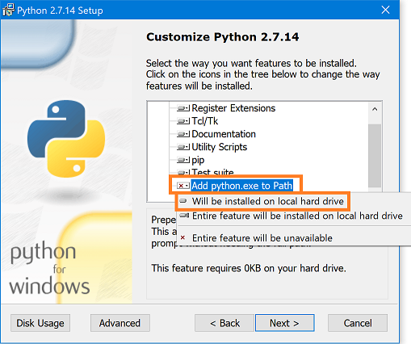</a>

## Installing OpenRTM-aist
This section introduces the installation procedure using the 64-bit installer OpenRTM-aist-1.2.1-RELEASE_x86_64.msi on Windows 10.

For downloading the installer, see [OpenRTM-aist-1.2.1-RELEASE]({{ site.baseurl }}/ja/node/6877).

**[Installation Procedure]**
1. Launch the installer. If the [Windows protected your PC] screen appears, click [More info] to display the [Run] button, then click [Run]. (This screen appears when installing applications that are not registered with Microsoft Corp. on certain Windows versions. Since this software is not registered, this screen is displayed.)
2. Click [Next].

<a href="Openrtm121-Install001.png">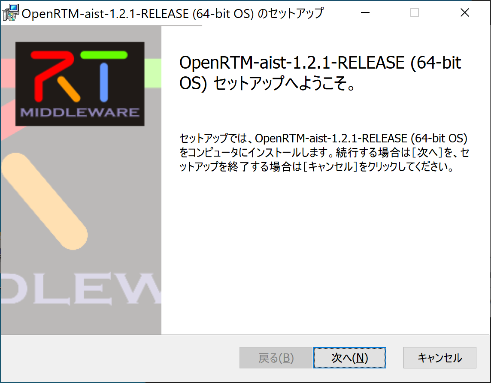</a>

 
3. This is the license agreement page. Accept the software license terms and click [Next].

<a href="Openrtm121-Install002.png">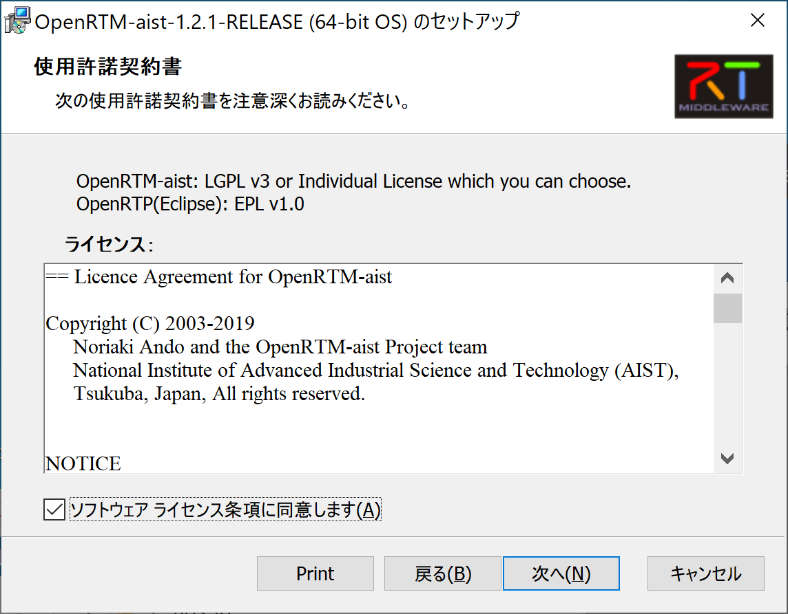</a>

 
4. Select the installation type. Click [Next] with the default settings.

<a href="OpenRTM121-Install003.png">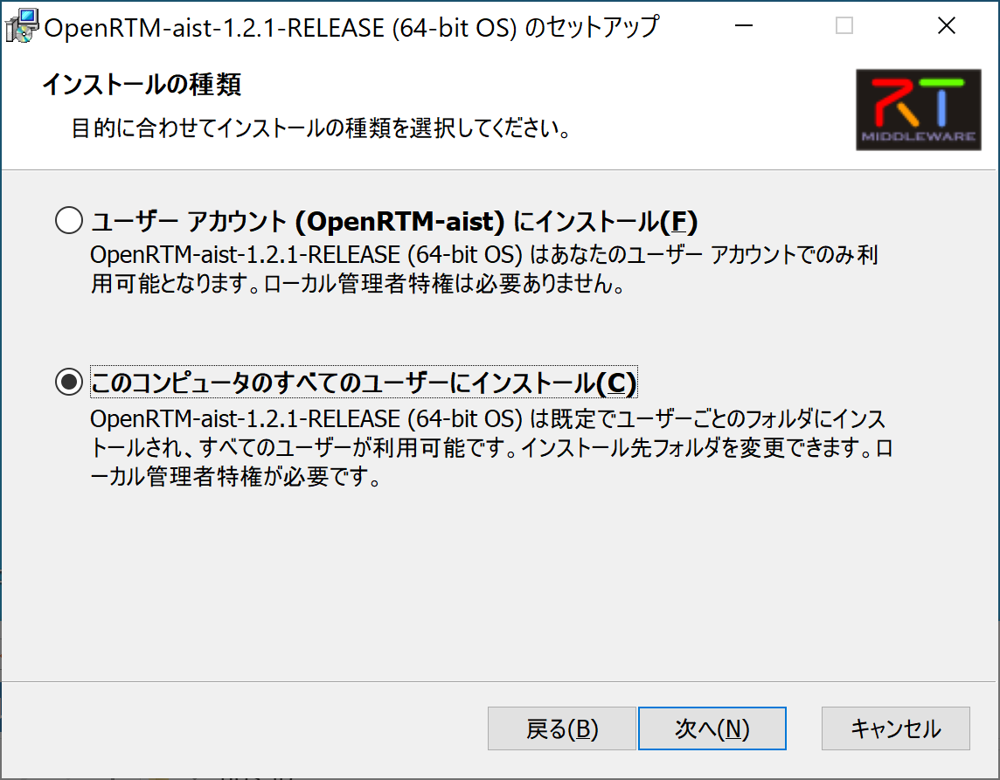</a>

 
5. Select the Visual Studio version.
  - Set the Visual Studio version used by the C++ edition in the system environment variables.
  - Select the installed Visual Studio version and click [Next].
    - For downloading Visual Studio, see [OpenRTM-aist-1.2.1-RELEASE]({{ site.baseurl }}/ja/node/6877).
    - The Visual Studio version can be changed after installation using the VCVerChanger tool. [(How to use VCVerChanger)]({{ site.baseurl }}/ja/content/vc_version_changer)
    - This setting is irrelevant for the Python and Java editions, so click [Next] with the default settings.

<a href="OpenRTM121-install004.png">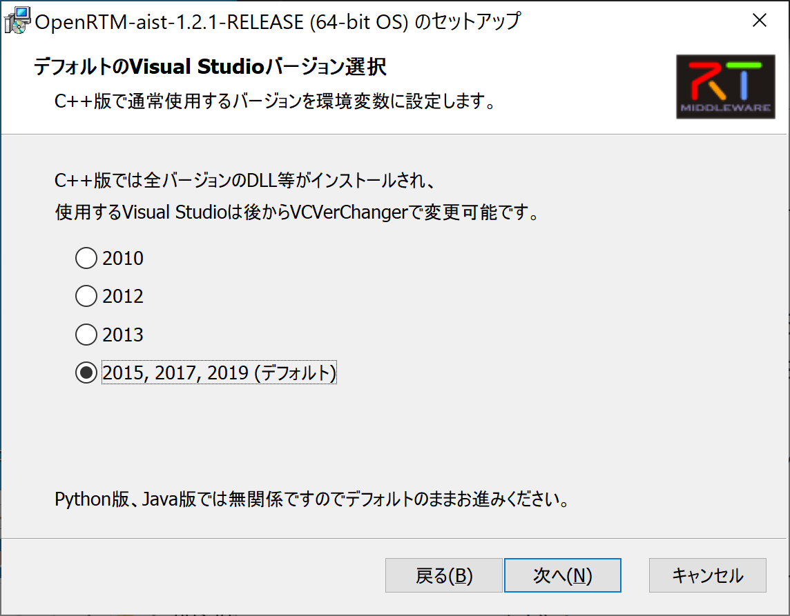</a>

 
6. Select the setup type.
If [Typical] is selected, the OpenRTM-aist C++, Java, and Python editions, OpenRTP, RTSystemEditorRCP, RTShell, runtime libraries for OpenRTM-aist C++ editions from Visual Studio 20010 to 2019, and runtime libraries for OpenRTM-aist versions 1.0.0 through 1.2.1 will be installed. If you have no specific reason to change it, click [Typical].
 

<a href="OpenRTM121-install005.png">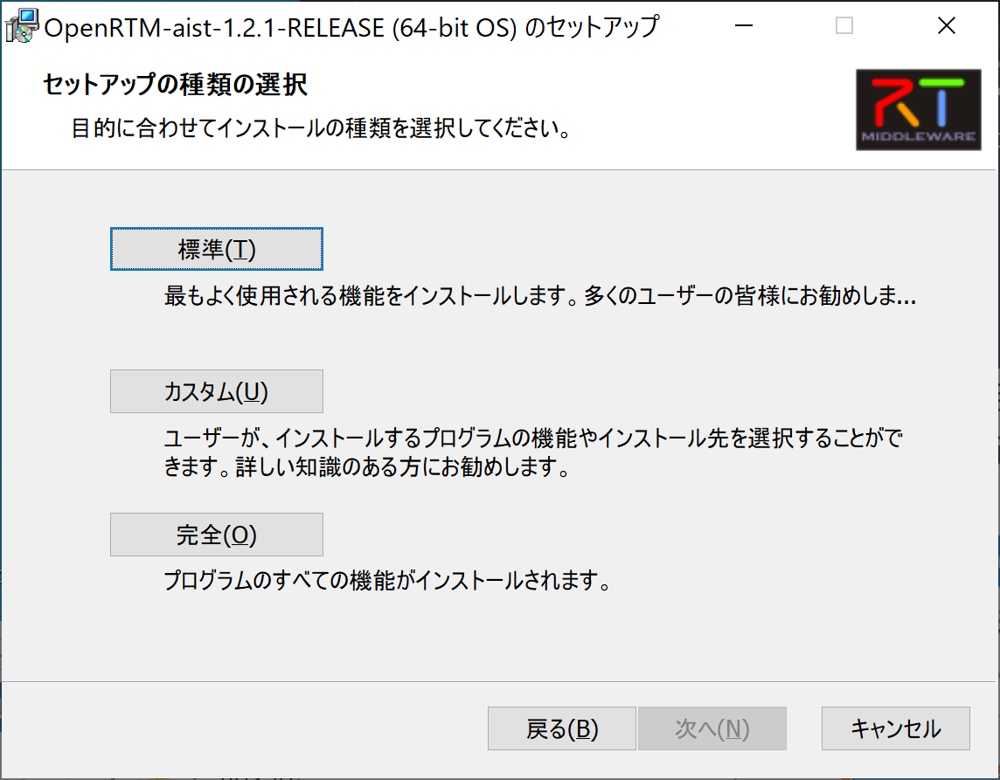</a>

 
7. Click [Install] to start the installation.

<a href="OpenRTM121-install006.png">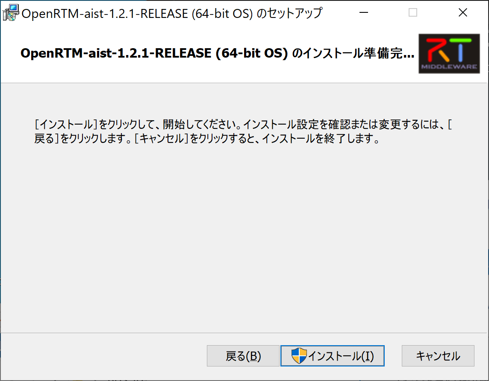</a>

 

<a href="OpenRTM121-install007.png">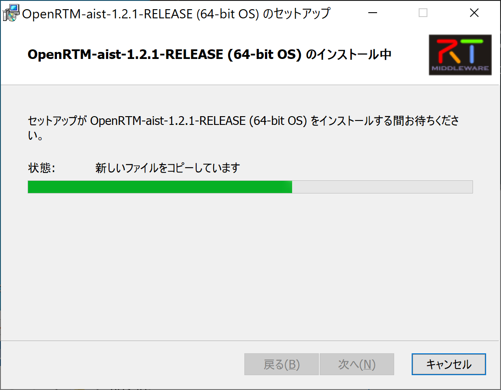</a>

 
8. Installation is complete. Click [Finish] to exit the installer.

<a href="OpenRTM121-install008.png">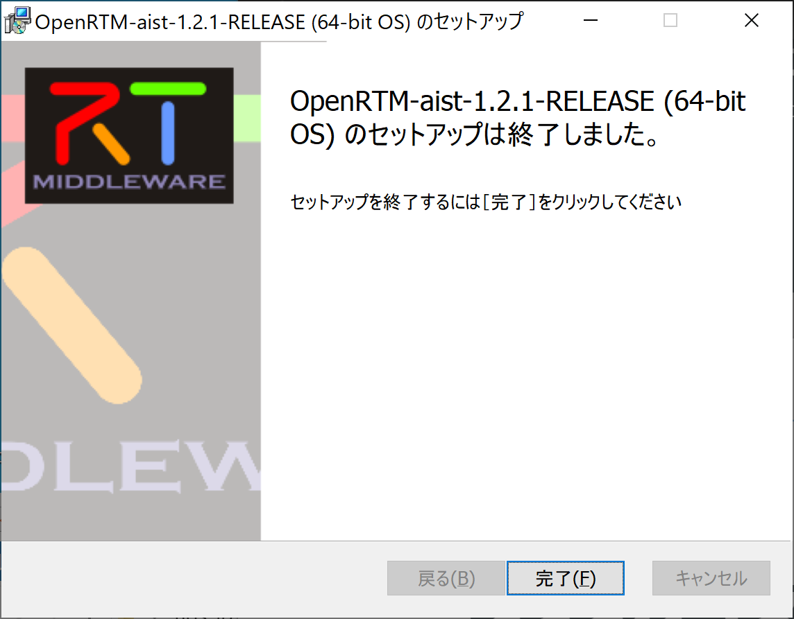</a>

 
<!-- ※使用しているVisual Studio のバージョンが2019(vc14)以外の場合は、以下のページを参考に環境変数のRTM_VC_VERSIONを変更してください。&br; -->
<!-- [[RTM_VC_VERSIONの変更:/ja/content/vc_version_changer]] -->

## Running Sample Components
### Preparation
- Although not required, many applications registered in the Start Menu will be launched from this point onward. Since navigating through the Start Menu every time can be cumbersome,
display the Start Menu from the Start button, right-click [OpenRTP] under [OpenRTM-aist 1.2.1 x86_64], and select [Open file location].
 

<a href="Startmenu001.png">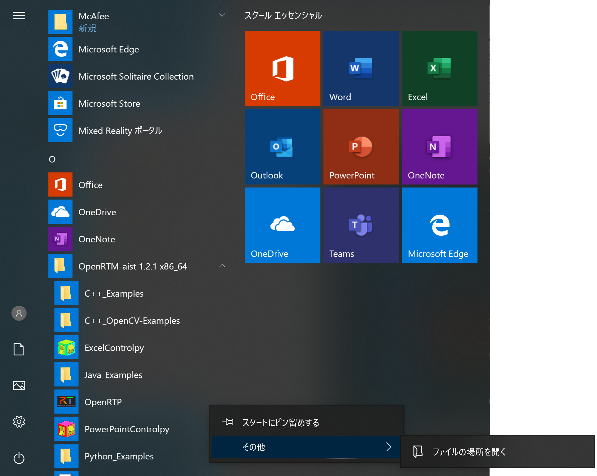</a>

<strong>Open file location</strong>

 

<a href="Startmenu002.png">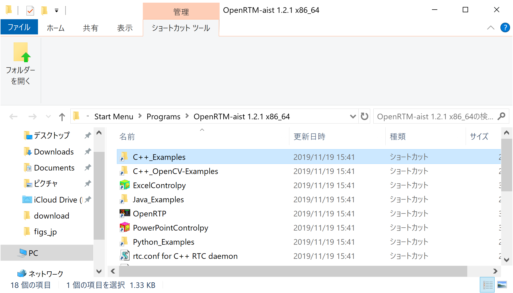</a>
 

<strong>Start Menu folder</strong>

 
  - In this way, the Start Menu folder opens, making it easier to access the applications registered in the menu.

## Starting the Naming Service
- Double-click Start Naming Service. A console window similar to the following will appear.

<a href="StartNameService001.png">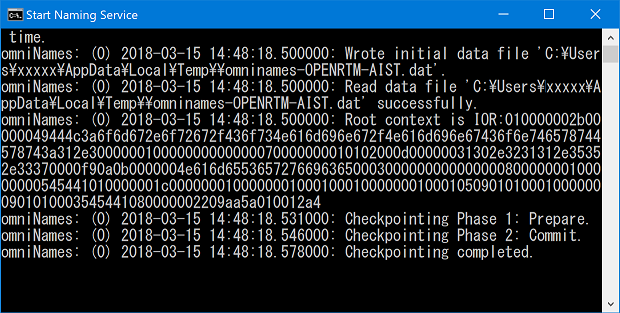</a>

<strong>Start Naming Service</strong>

 

## Sample Components
### Using ConsoleInComp and ConsoleOutComp
ConsoleInComp and ConsoleOutComp are samples demonstrating how to use DataInPort and DataOutPort. Numbers entered on the ConsoleIn side are displayed on the ConsoleOut side. Here, these two components are used to verify operation.

### Starting the Sample Components
- Double-click ConsoleIn.bat and ConsoleOut.bat in the [OpenRTM-aist 1.2.1 x86_64]>[C++_Example] folder. If the [Windows Security Alert] screen appears, check [Private networks (such as my home or work network)] and click [Allow access]. Console windows similar to the following will appear.

<a href="ConsoleIn001.png">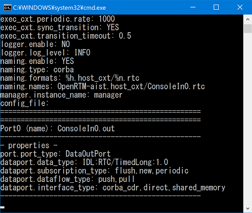</a>
;
<a href="ConsoleOut001.png">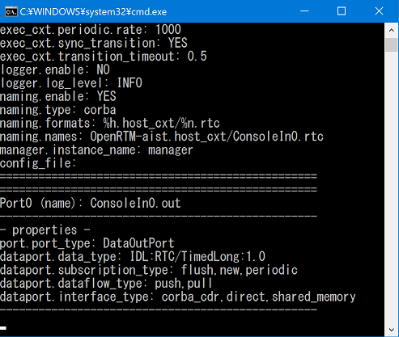</a>
;

<strong>ConsoleIn.bat and ConsoleOut.bat</strong>

 

&aname(openrtp_start);
## Starting OpenRTP
- Launch it by clicking the desktop shortcut. From the Start Menu, select [OpenRTM-aist 1.2.1 x86_64] > [OpenRTP]. You can also start it by double-clicking OpenRTP from the folder opened earlier.
  - Specify any appropriate location for the workspace.

<a href="OpenRTP001.png">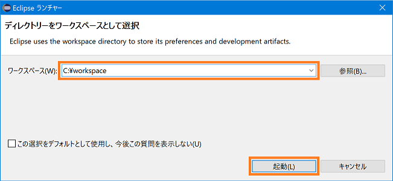</a>

<strong>Selecting a Workspace</strong>

 

- The "Welcome" screen is not needed, so click the [×] button on the [Welcome] tab in the upper-left corner to close it.

<a href="OpenRTP002.png">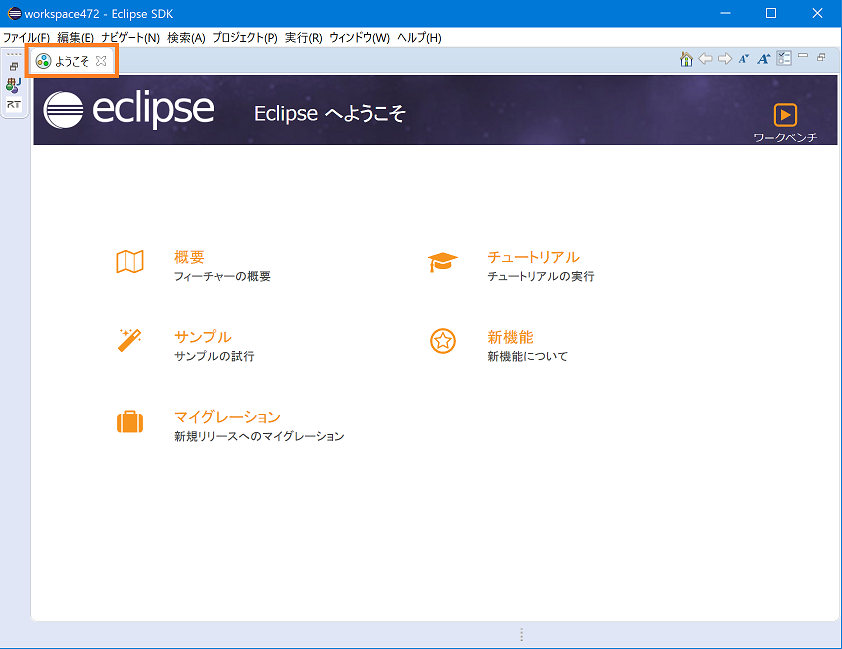</a>

<strong>Screen at Initial Startup</strong>

 

## Using RTSystemEditor
- Click [Open Perspective] in the upper-right corner of the screen. In the displayed dialog, select [RT System Editor] and click [Open] to start RTSystemEditor.

<a href="OpenRTP003.png">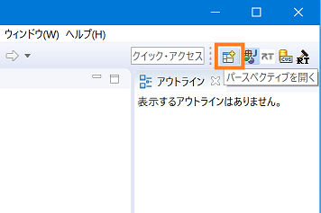</a>
;  
<a href="OpenRTP004.png">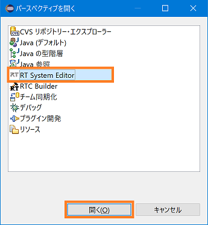</a>
;

<strong>Switching Perspectives</strong>

 

- Components are displayed in [NameServiceView]. Initially they are collapsed and not visible, but by clicking [>] to expand the tree, you can confirm the ConsoleIn and ConsoleOut components.

<a href="OpenRTP005.png">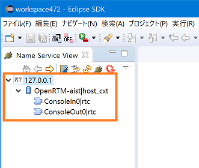</a>

<strong>Confirming Component Startup</strong>

 

  - If the name server is not displayed in NameServerView, add localhost manually. Click [Add Name Server] in the image to display the dialog. Enter "localhost" and click [OK] to add it. If it still does not start, close all console windows and retry the procedure beginning from starting the Naming Service.

<a href="OpenRTP006.png">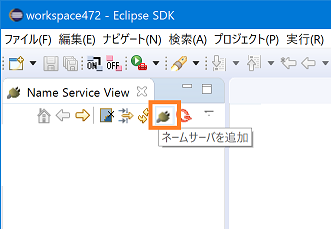</a>
;  
<a href="OpenRTP007.png">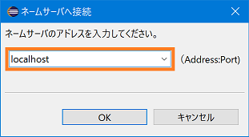</a>
;

<strong>Adding a Name Server</strong>

 

- Click [Open New System Editor] from the toolbar to display the [System Diagram].

<a href="OpenRTP008.png">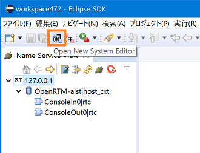</a>

<strong>Displaying the System Diagram</strong>

 

- Drag and drop the ConsoleIn and ConsoleOut components from [NameServiceView] onto the [System Diagram]. They will be displayed as shown below.

<a href="OpenRTP009.png">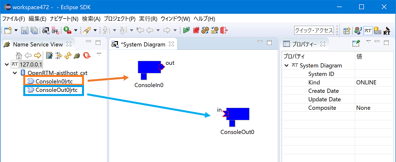</a>

<strong>Drag and Drop Components</strong>

 

- Connect the components by dragging and dropping between the data ports. Afterward, a dialog prompting for connection information will appear. Click [OK].

<a href="OpenRTP010.png">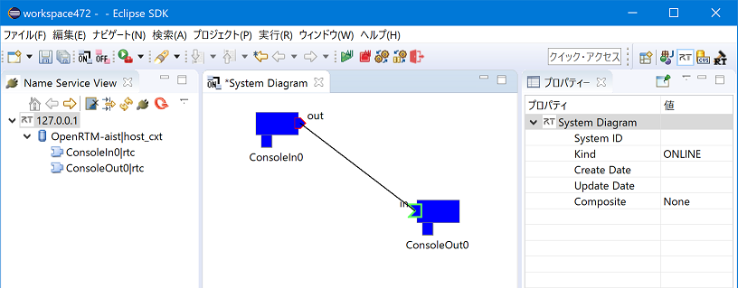</a>
;

<a href="OpenRTP011.png">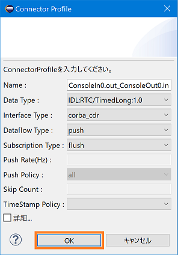</a>
;

<strong>Connecting Components</strong>

 

  - The connection will be established as shown in the image below.

<a href="OpenRTP012.png">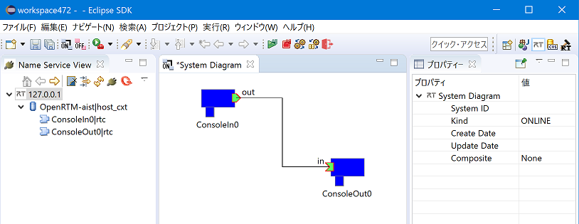</a>

<strong>Connection Complete</strong>

 

- Change the component state to Active. Click [All Activate]. If the component color changes from blue to light green, the operation was successful. Components can also be activated individually by selecting them and right-clicking. (If [All Activate] is not displayed, try restarting OpenRTP. Alternatively, activate the components individually.)

<a href="OpenRTP013.png">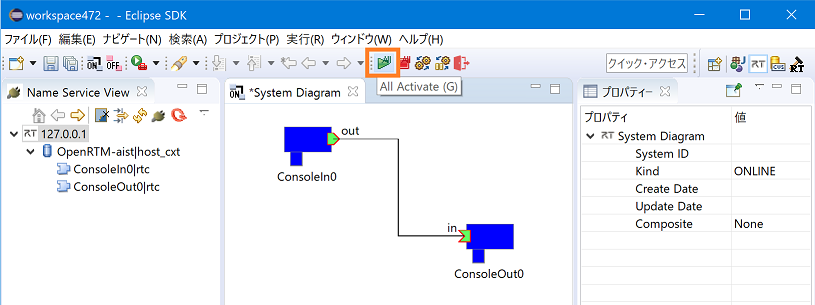</a>

 

<a href="OpenRTP014.png">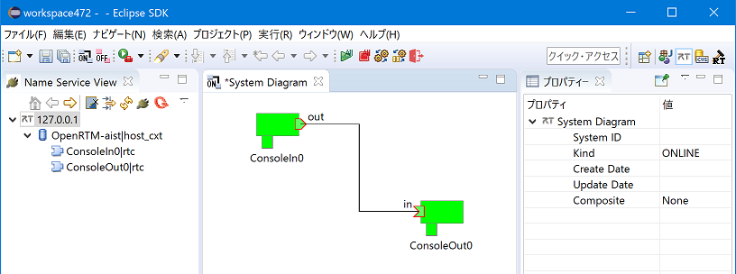</a>

<strong>Activation Complete</strong>

 

### Verifying Operation in the Component Console Windows
- Next, verify operation in the console windows. After connecting in RTSystemEditor, "Please input number:" is displayed in the ConsoleIn window.

<a href="Console001.png">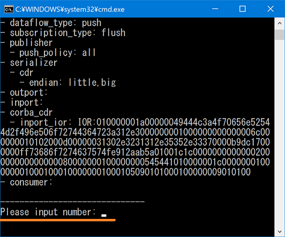</a>

<strong>"Please input number:" Displayed</strong>

 

- Enter any numeric value in the ConsoleIn window and press [Enter]. The value will be displayed in the ConsoleOut window.

<a href="Console002.png">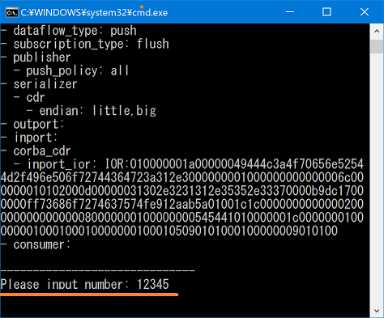</a>
;  
<a href="Console003.png">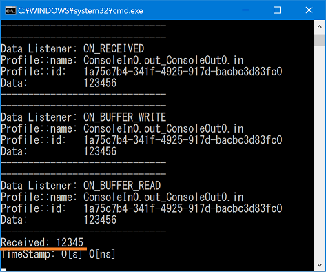</a>
;

<strong>Operation Verification</strong>

 

  - Entering non-numeric values or excessively large values may cause abnormal behavior. In that case, stop the batch file with the Ctrl-C key and restart from launching the batch files again.

- To terminate the components, click [All Deactivate] from the toolbar. Then right-click each component and select [Exit].
  - If deactivation takes a long time, ConsoleIn is waiting for numeric input. In that case, enter any number.

<a href="Console004.png">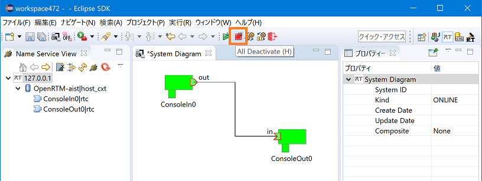</a>

<strong>Deactivating Components</strong>

 

<a href="Console005.png">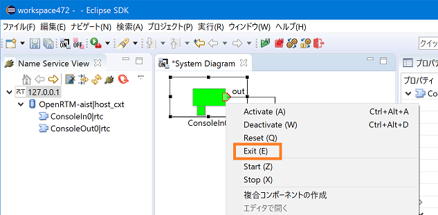</a>

<strong>Terminating Components</strong>

 

- This completes the operation verification using ConsoleIn and ConsoleOut.

## Using rtshell
rtshell is installed by default in OpenRTM-aist-1.2.1.
By using rtshell, you can activate, deactivate, and terminate RTCs from the command line.

- When the 64-bit version is installed, it may not function correctly due to missing DLLs. In that case, run Windows Update.

### Operating RTCs
Start the sample components, then use rtshell to connect data ports and activate, deactivate, and terminate RTCs from the command line.

### Starting rtm-naming
- Double-click Start Naming Service in the [OpenRTM-aist 1.2.1 x86_64] folder.

#### Starting the Sample Components
First, start the sample components and operate them using rtshell.

- Click ConsoleIn.bat and ConsoleOut.bat in the [OpenRTM-aist 1.2.1 x86_64] > [Python_Examples] folder to launch the console windows. If the [Windows Security Alert] screen appears, check [Private networks (such as my home or work network)] and click [Allow access]. At this point, the console windows only display the startup command for the Python program. The displayed output differs from that of the previously executed C++ Example.

#### Operation from the Command Prompt
- Next, launch [Command Prompt] from [Windows System Tools] in the Start Menu.

<a href="Console006.png">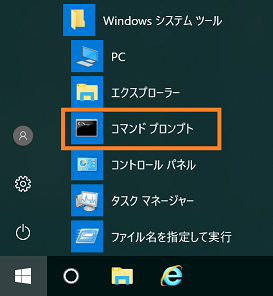</a>

<strong>Starting the Command Prompt</strong>

 

- If C:\Python27\Scripts has not been added to the PATH, configure it using the following command.

## Next...
Please refer to the links below.

- **Try running more samples　　　&t;：　**[Sample Components]({{ site.baseurl }}/ja/node/811)
- **Try creating a component　　　&t;：　**[Case Study]({{ site.baseurl }}/ja/node/110)
- **Learn OpenRTM from the basics　&t;：　**[Developer's Guide]({{ site.baseurl }}/ja/node/113)
- **Join the community　　　　　&t;：　**[Community]({{ site.baseurl }}/ja/node/624)
- **Browse published components　&t;：　**[Projects]({{ site.baseurl }}/ja/node/123)

