<!-- Title: Getting Started with OpenRTM-aist in 10 Minutes! -->
#contents

The latest version, OpenRTM-aist-2.0.2-RELEASE, installs the C++, Python, and Java editions, as well as OpenRTP and rtshell.

# Prerequisites

## Installing Python

If Python is not installed, OpenRTM-aist cannot be installed.

Please install Python before installing OpenRTM-aist. Supported versions are "3.12", "3.11", "3.10", "3.9", and "3.8".

For downloading Python, please refer to [Installing OpenRTM-aist 2.0 on Windows]({{ site.baseurl }}/en/doc/installation/install_2_0/install_windows_2_0/install_2_0).

The Python installation location corresponds to the [Customize installation] option during installation.

Configure the search path automatically using the following procedure. This will add both the directory containing python.exe and the Scripts directory to the PATH environment variable. 
(Example: Path=C:\Python38;C:\Python38\Scripts;...)

**[Installation Procedure]**

- Launch the Python installer. Version 3.8 is used as an example here.
- On the first screen, check [add python *** to PATH] at the bottom and select [Customize installation].

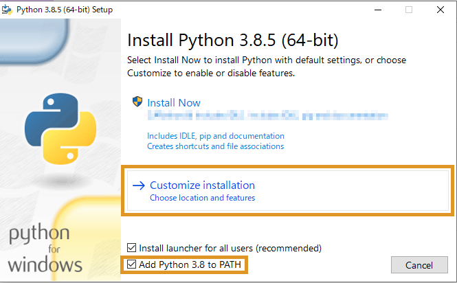

- No changes are required on the [Optional Features] screen. Click [Next] to continue.

- On the [Advanced Options] screen, check [Install for all users] and specify the installation location in [Customize install location].
(Example: Path=C:\Python38;C:\Python38\Scripts;...)

- Click [Install] to complete the installation.

## Downloading OpenRTM-aist

For downloading the installer, please refer to [Download]({{ site.baseurl }}/en/download).

If you are using Microsoft Edge and cannot download the installer because of the message shown below, follow these steps.

- Click the "..." button displayed when you hover over the download item.

- Click "Save".

- Click "Show more".

<a href="msi-download-04.png">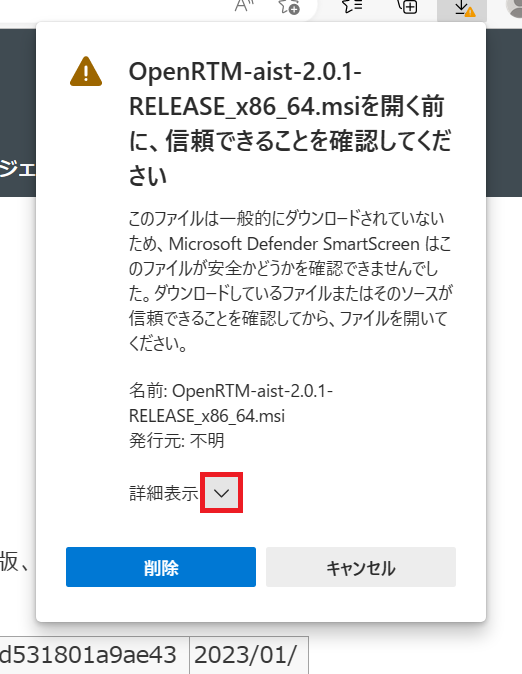</a>

- Click "Keep".

- The download is now complete. Click "Open file" to launch the installer.

<a href="msi-download-06.png">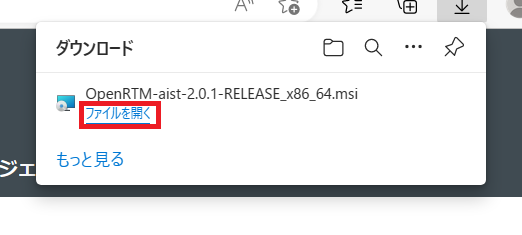</a>

## Installing OpenRTM-aist

**[Installation Procedure]**

1. Launch the installer. If the [Windows protected your PC] screen appears, click [More info] to display the [Run] button, then click [Run]. (This screen appears when installing applications that are not registered with Microsoft Corp. on certain versions of Windows. Since this software is not registered, this screen is displayed.)

1. Click [Next]. The screenshots below use version 2.0.0, but the procedure is the same for version 2.0.2.

<a href="RTM2.0.0-msi-1.png">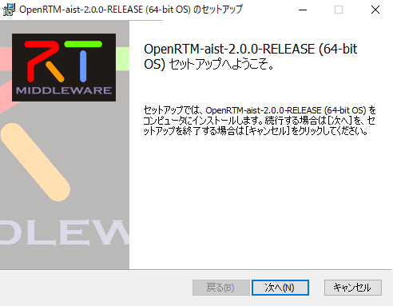</a>

 

1. This is the license agreement page. Accept the software license terms and click [Next].

 

1. Select the installation type. Leave the default settings and click [Next].

 

1. Select the version of Visual Studio.

   - The Visual Studio version used by the C++ edition will be configured in the system environment variables.
   - Select the installed version of Visual Studio and click [Next].

      - For downloading Visual Studio, please refer to [Installing OpenRTM-aist 2.0 on Windows]({{ site.baseurl }}/en/doc/installation/install_2_0/install_windows_2_0/install_2_0).
      - The Visual Studio version can be changed after installation using the VCVerChanger tool. [(How to Use VCVerChanger)]({{ site.baseurl }}/en/content/vc_version_changer)
      - This setting is irrelevant for the Python and Java editions, so you may simply leave the default setting and click [Next].

 

1. Select the setup type.

If you select [Typical], the following components will be installed:

- OpenRTM-aist C++
- OpenRTM-aist Java
- OpenRTM-aist Python
- OpenRTP
- RTSystemEditorRCP
- RTShell
- Runtime libraries for OpenRTM-aist C++ (Visual Studio 2015–2022)
- Runtime libraries for OpenRTM-aist versions 1.0.0 through 2.0.0

Unless you have a specific reason to change the configuration, click [Typical].

 

<a href="RTM2.0.0-msi-5.png">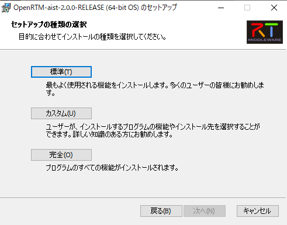</a>

 

1. Click [Install] to begin installation.

 

 

1. Installation is complete. Click [Finish] to exit the installer.

<a href="RTM2.0.0-msi-8.png">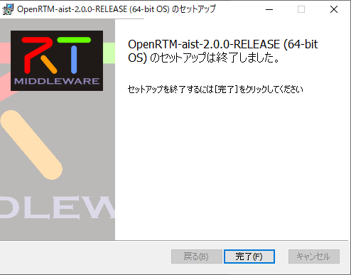</a>

 

## Running VCVerChanger

The installer registers the system environment variables used by OpenRTM-aist in the Windows registry. Some of these environment variables include another environment variable, %RTM_VC_VERSION%.

In some cases, nested environment variables like this may not be expanded recursively.

To resolve this issue, run VCVerChanger. Clicking the [Confirm] button expands the environment variables and writes the expanded values back to the registry.

[(How to Use VCVerChanger)]({{ site.baseurl }}/en/content/vc_version_changer)

## Running Sample Components

### Preparation

- Although not required, many applications registered in the Start Menu will be launched in the following steps. Navigating through the Start Menu every time can be inconvenient.

  Open the Start Menu, navigate to [OpenRTM-aist 2.0.2 x86_64] > [C++_Examples], right-click it, and select [Open file location].

 

<strong>Open File Location</strong>

 

<a href="start-menu-folder.png">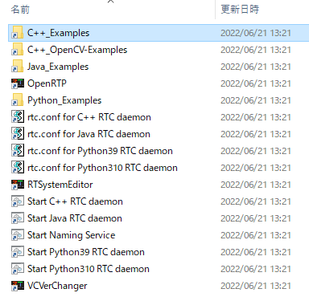</a>
 

<strong>Start Menu Folder</strong>

 

  - This will open the Start Menu folder, making it easier to access the applications registered in the menu.

## Starting the Naming Service

- Double-click **Start Naming Service**. A console window similar to the one below will appear.

<strong>Start Naming Service</strong>

 

## Sample Components

### Using ConsoleInComp and ConsoleOutComp

ConsoleInComp and ConsoleOutComp are sample components that demonstrate how to use DataInPort and DataOutPort.

Numbers entered in ConsoleIn are displayed in ConsoleOut.

In this section, we will use these two components to verify operation.

### Starting the Sample Components

- Double-click **ConsoleIn.bat** and **ConsoleOut.bat** in the [OpenRTM-aist 2.0.2 x86_64] > [C++_Examples] folder.

If the [Windows Security Alert] dialog appears, check [Private networks (such as home or work networks)] and click [Allow access].

The following console windows will appear.

<!-- CENTER:&ref(ConsoleIn001.png,center,90%);&ref(ConsoleOut001.png,center,90%); -->

<a href="ConsoleInOut122-001.png">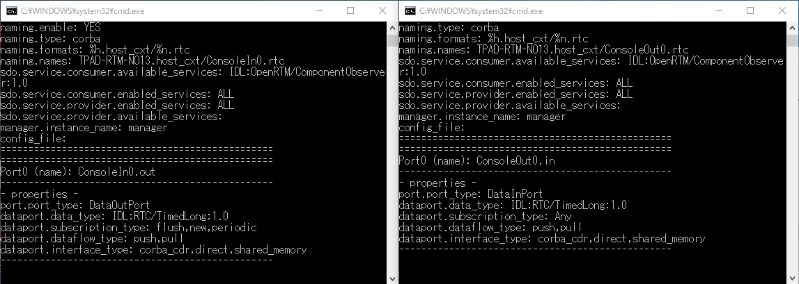</a>
;

<strong>ConsoleIn.bat and ConsoleOut.bat</strong>

 

&aname(openrtp_start);

## Starting OpenRTP

- Launch OpenRTP by clicking the desktop shortcut.

From the Start Menu, select:

[OpenRTM-aist 2.0.2 x86_64] > [OpenRTP]

You can also launch it by double-clicking OpenRTP in the folder opened earlier.

  - Select any convenient location as the workspace.

<a href="OpenRTP122-001.png">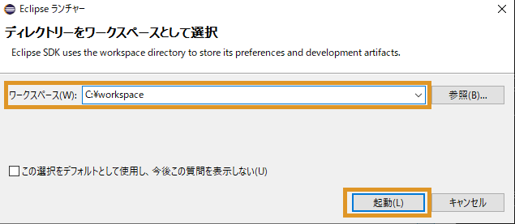</a>

<strong>Selecting a Workspace</strong>

 

- The Welcome screen is not required. Click the [×] button on the [Welcome] tab in the upper-left corner to close it.

<strong>Initial Startup Screen</strong>

 

## Using RTSystemEditor

- Click [Open Perspective] in the upper-right corner of the screen.

In the dialog that appears, select [RT System Editor] and click [Open] to launch RTSystemEditor.

;  
<a href="OpenRTP122-004.png">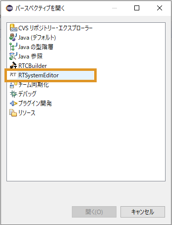</a>
;

<strong>Switching Perspectives</strong>

 

- Components will be displayed in [NameServiceView].

Initially, the tree is collapsed and the components are not visible. Expand the tree by clicking [>] to view the host context and the ConsoleIn and ConsoleOut components.

Depending on the configuration, the host context (the hierarchy shown as “hostname|host_cxt”, such as “TPAD-RTM-NO13|host_cxt” in the figure) may not be displayed, and the components may appear directly.

<strong>Verifying Component Startup</strong>

 

  - If the Name Server does not appear in NameServiceView, add localhost manually.

Click [Add Name Server] as shown in the figure to open the dialog.

Enter "localhost" and click [OK].

If the components still do not appear, close all console windows and repeat the procedure starting from **Starting the Naming Service**.

<a href="OpenRTP122-006.png">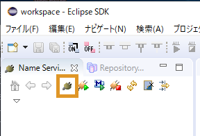</a>
;  

;

<strong>Adding a Name Server</strong>

 

- Click [Open New System Editor] from the toolbar to display the [System Diagram].

<a href="OpenRTP122-008.png">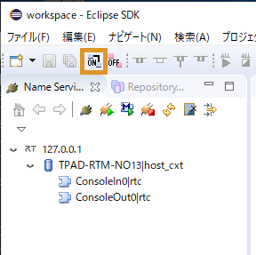</a>

<strong>Displaying the System Diagram</strong>

 

- Drag and drop the ConsoleIn and ConsoleOut components from [NameServiceView] onto the [System Diagram].

The components will appear as shown below.

<a href="OpenRTP122-009.png">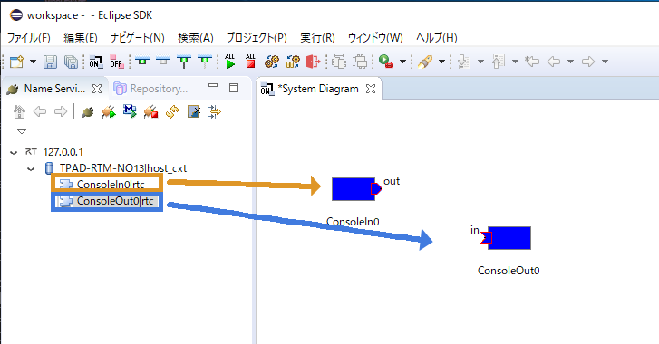</a>

<strong>Dragging and Dropping Components</strong>

 

- Connect the components by dragging and dropping between their data ports.

A dialog requesting the information required for the connection will appear. Click [OK].

<a href="OpenRTP122-010.png">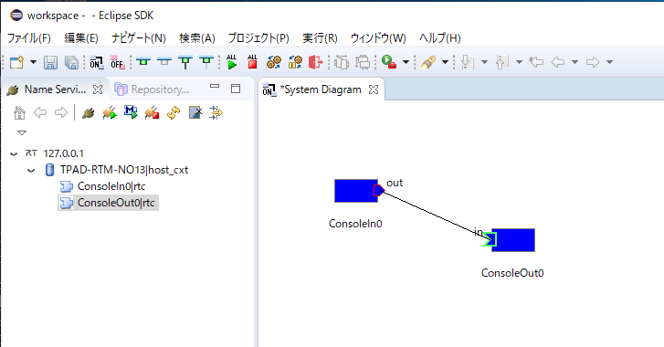</a>
;  
<a href="OpenRTP122-011.png">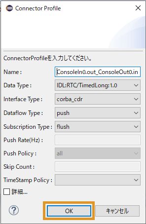</a>
;

<strong>Connecting Components</strong>

 

- The components will be connected as shown below.

<a href="OpenRTP122-012.png">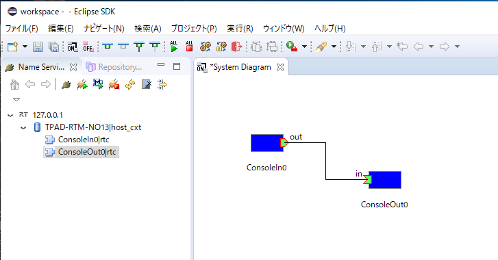</a>

<strong>Connection Complete</strong>

 

- Change the component state to Active.

Click [All Activate].

If the component color changes from blue to light green, activation has succeeded.

Components can also be activated individually by selecting a component, right-clicking it, and choosing the activation command.

(If [All Activate] is not displayed, try restarting OpenRTP. Alternatively, activate the components individually.)

 

<strong>Activation Complete</strong>

 

### Verifying Operation from the Component Console Windows

- Next, verify the operation using the console windows.

After connecting the components in RTSystemEditor, the message **"Please input number:"** will be displayed in the ConsoleIn window.

<a href="Console122-001.png">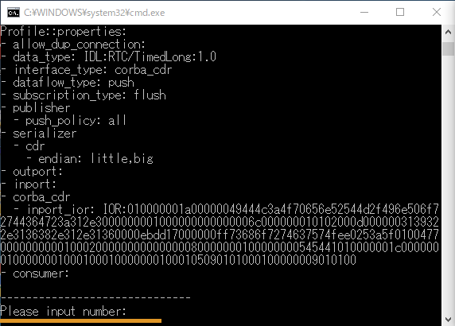</a>

<strong>"Please input number:" is displayed</strong>

 

- Enter any numeric value in the ConsoleIn window and press [Enter].

The entered value will then be displayed in the ConsoleOut window.

;

<strong>Operation Verification</strong>

 

  - Entering non-numeric values or excessively large numbers may cause unexpected behavior.

    In that case, stop the batch file by pressing Ctrl-C, then restart the procedure from launching the batch files again.

- To terminate the components, click [All Deactivate] on the toolbar.

  Then right-click each component and select [Exit].

  - If deactivation takes a long time, ConsoleIn is likely waiting for numeric input.

    In that case, enter any numeric value.

<a href="Console122-004.png">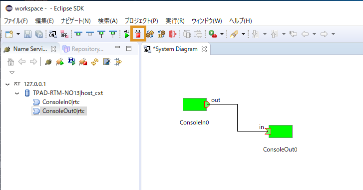</a>

<strong>Component Deactivation</strong>

 

<a href="Console122-005.png">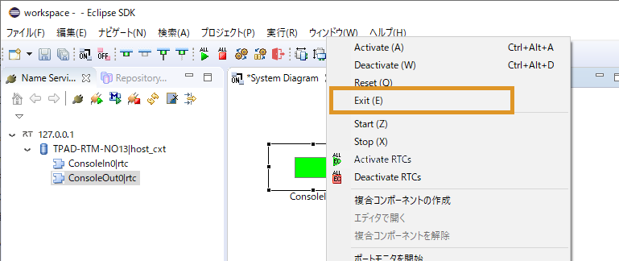</a>

<strong>Exiting Components</strong>

 

- This completes the operation verification using ConsoleIn and ConsoleOut.

## Using rtshell

rtshell is installed as a standard component of OpenRTM-aist.

By using rtshell, you can Activate, Deactivate, Exit, and perform other RTC operations from the command line. 

Please refer to:

[rtshell Installation and Operation Verification (Windows)]({{ site.baseurl }}/en/doc/installation/install_rtshell/check_windows)

## What's Next?

Please see the following links.

- **Try More Sample Components &t;：** [Sample Components]({{ site.baseurl }}/en/node/811)

- **Create Your Own Components &t;：** [Case Studies]({{ site.baseurl }}/en/node/110)

- **Learn OpenRTM from the Basics &t;：** [Developer's Guide]({{ site.baseurl }}/en/node/113)

- **Join the Community &t;：** [Community]({{ site.baseurl }}/en/node/624)

- **Explore Public Components &t;：** [Projects]({{ site.baseurl }}/en/node/123)

