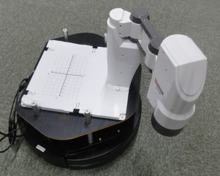
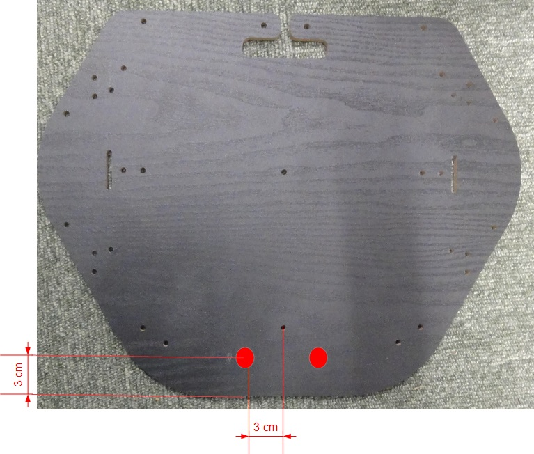
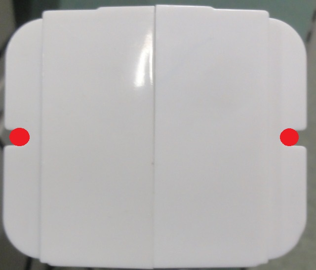
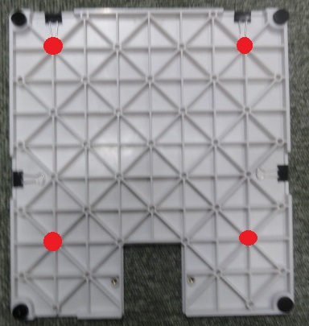
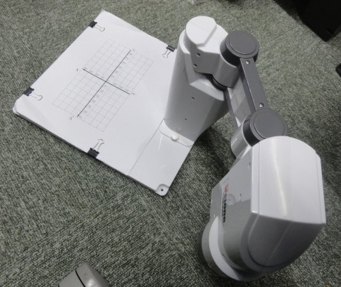
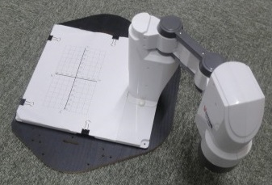
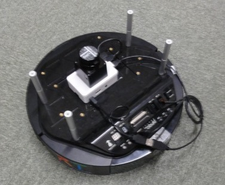
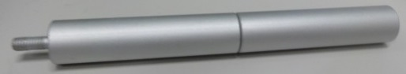
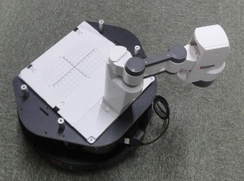
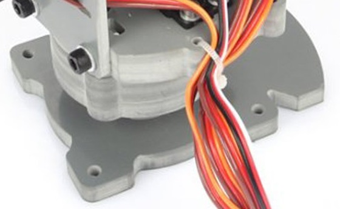

-------jp page!!-------

<!-- Title: Kobukiにロボットアームを搭載する手順 -->
#contents

## アカデミックスカラロボット

アカデミックスカラロボットはヴイストンが販売しているロボット制御学習用の水平多関節型ロボットアームです。

<!-- 以下の部分はあるとページを開くのが異様におそくなるので、コメントアウト -->
<!-- #br -->
<!--  -->
<!-- #ref(https://www.vstone.co.jp/products/scara_robot/img/MG_2393ass.jpg, left) -->
<!-- #br -->
<!--  -->
- [https://www.vstone.co.jp/products/scara_robot/](https://www.vstone.co.jp/products/scara_robot/)

アカデミックスカラロボット制御の RTC については以下のページを参考にしてください。

- [USBメモリーに搭載したポータブルRTM 環境を用いたロボット教育ツール]({{ site.baseurl }}/ja/node/5943)<!-- projectpage-->

この章ではアカデミックスカラロボットを Kobuki のプレートに固定する手順を説明します。

 

 

この作業には必要なものは以下の通りです。

<table class="table-alt">
  <tr>
    <th>名前</th>
    <th>数量</th>
  </tr>
  <tr>
    <td>Kobuki</td>
    <td>1台</td>
  </tr>
  <tr>
    <td>プレート</td>
    <td>1枚</td>
  </tr>
  <tr>
    <td>支柱(5cm)</td>
    <td>8本</td>
  </tr>
  <tr>
    <td>アカデミックスカラロボット</td>
    <td>1台</td>
  </tr>
  <tr>
    <td>木ネジ(2cm以上)</td>
    <td>4本</td>
  </tr>
</table>

### ロボットの仕様

<table class="table-alt">
  <tr>
    <th colspan="2" >アカデミックスカラロボットの仕様</th>
  </tr>
  <tr>
    <td>自由度</td>
    <td>4自由度 + ハンド</td>
  </tr>
  <tr>
    <td>サーボモーター</td>
    <td>RS304MD</td>
  </tr>
  <tr>
    <td>通信方法</td>
    <td>HID USB - UART ブリッジ</td>
  </tr>
</table>

### プレートに直接スカラボットを固定する場合
プレートに直接スカラロボットを取り付ける手順を説明します。

まずはプレートにキリ等で下穴をあけます。
以下の赤い点の位置に穴をあけてください。

 

 

後はスカラロボットの根元部分を木ねじで固定すれば固定できます。

 

 

### 土台ごと固定する場合
スカラロボットを土台に取り付けて、土台をプレートに固定する方法について説明します。

#### 土台の加工
Kobuki のプレートに固定するために、スカラロボットの土台に穴をあけます。
以下の図の赤い部分に穴をあけてください。穴の大きさは使用する木ねじの大きさで決めてください。

 

 

#### 土台の取り付け
まずスカラロボットを土台に取り付けます。
図のように逆向きの取り付けた後、ユリアねじで固定してください。

 

 

#### ロボットの取り付け
予めプレートにはキリ等で下穴をあけておいてください。
土台の穴をあけた部分に木ネジを差し込んでネジでプレートと接合すれば完成です。

 

 

### プレートの取り付け

まずは Kobuki に支柱を4本立てます。
レーザーレンジセンサー、Raspberry Pi は両面テープなどで Kobuki に接着しておいてください。

 

 

支柱は5cmの支柱を2つ接続したものを使用してください。

 

 

そしてプレートを載せてねじで留めれば完成です。

 

 

## サインスマート製4自由度ロボットアーム
この章ではサインスマートが販売している4自由度ロボットアームを Kobuki に取り付ける手順を説明します。

<iframe width="560" height="315" src="https://www.youtube.com/embed/-ky9icPtKZM" frameborder="0" allowfullscreen></iframe>

- [http://www.sainsmart.com/diy-4-axis-servos-control-palletizing-robot-arm-model-for-arduino-uno-mega2560.html](http://www.sainsmart.com/diy-4-axis-servos-control-palletizing-robot-arm-model-for-arduino-uno-mega2560.html)

4自由度ロボットアーム制御の RTC については以下のページを参考にしてください。

- [RTミドルウェア学習用ロボットアーム制御RTコンポーネント群]({{ site.baseurl }}/ja/node/5933)

この作業には必要なものは以下の通りです。

<table class="table-alt">
  <tr>
    <th>名前</th>
    <th>数量</th>
  </tr>
  <tr>
    <td>Kobuki</td>
    <td>1台</td>
  </tr>
  <tr>
    <td>プレート</td>
    <td>1枚</td>
  </tr>
  <tr>
    <td>支柱(5cm)</td>
    <td>8本</td>
  </tr>
  <tr>
    <td>4自由度ロボットアーム</td>
    <td>1台</td>
  </tr>
  <tr>
    <td>Arduino Uno※</td>
    <td>1台</td>
  </tr>
  <tr>
    <td>ジャンパーコード</td>
    <td>15本以上</td>
  </tr>
  <tr>
    <td>ブレッドボード</td>
    <td>1枚</td>
  </tr>
  <tr>
    <td>電池ボックス 単3×4本用</td>
    <td>1個</td>
  </tr>
  <tr>
    <td>単三電池</td>
    <td>4本</td>
  </tr>
  <tr>
    <td>木ネジ(2cm以上)</td>
    <td>4本</td>
  </tr>
</table>

※Intel Edison、Raspberry Pi から制御する場合は PCA9685 搭載のサーボドライバでも可

### ロボットの仕様

<table class="table-alt">
  <tr>
    <th colspan="2">4自由度ロボットアームの仕様</th>
  </tr>
  <tr>
    <td>自由度</td>
    <td>4自由度</td>
  </tr>
  <tr>
    <td>サーボモーター</td>
    <td>MG995、SG90 9G</td>
  </tr>
</table>

### ロボットの取り付け

4自由度ロボットアームには最初から取り付け用の穴があいているためこちらへの加工は不要です。

 

 

土台部分の穴に木ネジを差し込んでプレートと接合してください。

### プレートの取り付け

<!-- [[アカデミックスカラロボットの手順>#toc5]]と同じです。-->
[アカデミックスカラロボットの手順](#土台の取り付け)と同じです。

-------jp page!!-------
