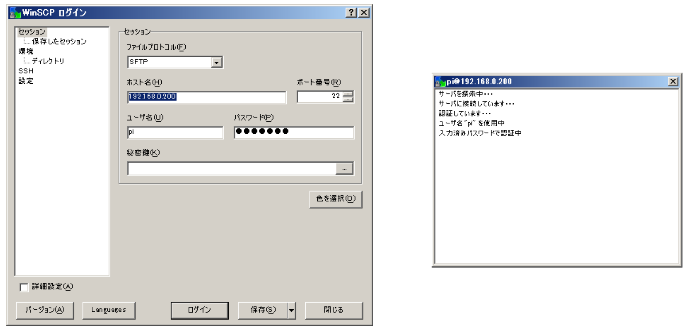
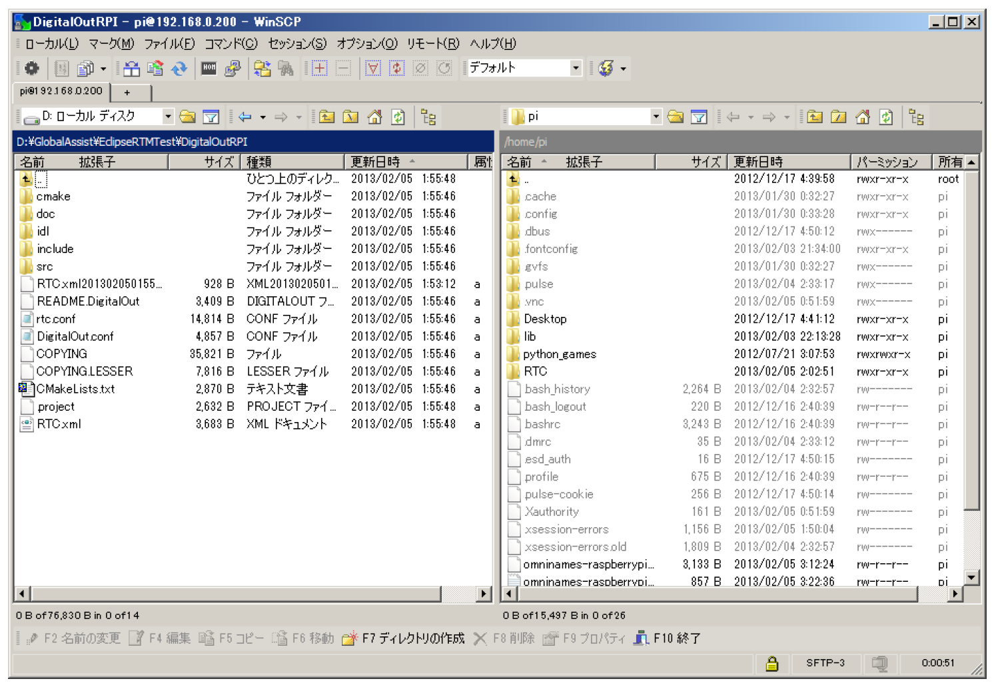
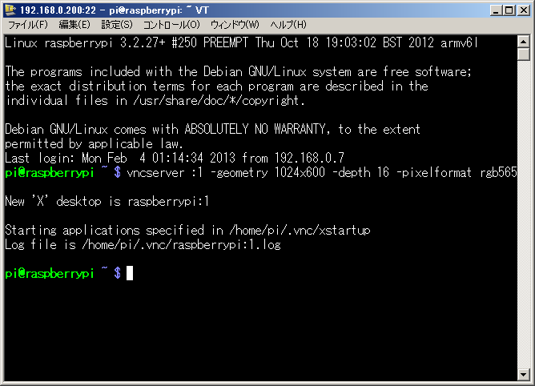
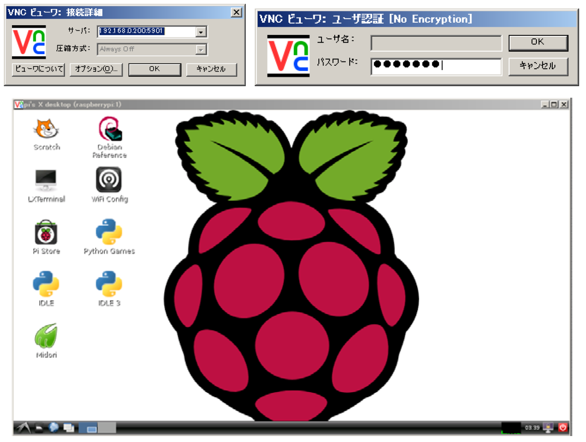

<!-- Title: Appendix -->

#contents

## Copying Files to Raspberry Pi

By enabling SSH in the Raspberry Pi configuration utility (**raspi-config**), **sFTP** becomes available.

To connect to a Raspberry Pi from Windows using sFTP, use an sFTP-compatible client such as **WinSCP**.

You can download WinSCP from the following page:

- http://winscp.net/eng/docs/lang:jp

<div align="center"><a href="4_app1.png"></a></div>
<div align="center"><a href="4_app2.png"></a></div>
<div align="center"><strong>Figure 4-1. sFTP Connection</strong></div>

## Using VNC (Virtual Network Computing)

To operate the Raspbian GUI environment from a development PC, install a VNC server on the Raspberry Pi.

You can download a VNC client from the following page:

- http://www.vector.co.jp/soft/win95/net/se324464.html

```bash
$ su
# apt-get install tightvncserver
```

During installation, you will be prompted to enter a password for VNC server access. Set an appropriate password.

After installing the VNC server, connect to the Raspberry Pi via SSH from your development PC and start the VNC server.

```bash
$ vncserver :1 -geometry 1024x600 -depth 16 -pixelformat rgb565
```

<div align="center"><a href="4_app3.png"></a></div>
<div align="center"><strong>Figure 4-2. Starting the VNC Server</strong></div>

To connect to the VNC server from Windows, use a VNC client application such as **RealVNC**.

<div align="center"><a href="4_app4.png"></a></div>
<div align="center"><strong>Figure 4-3. VNC Connection</strong></div>

