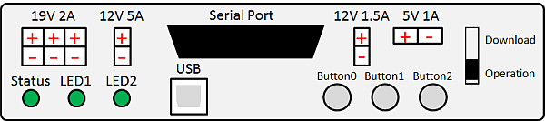
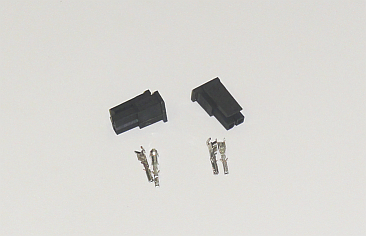
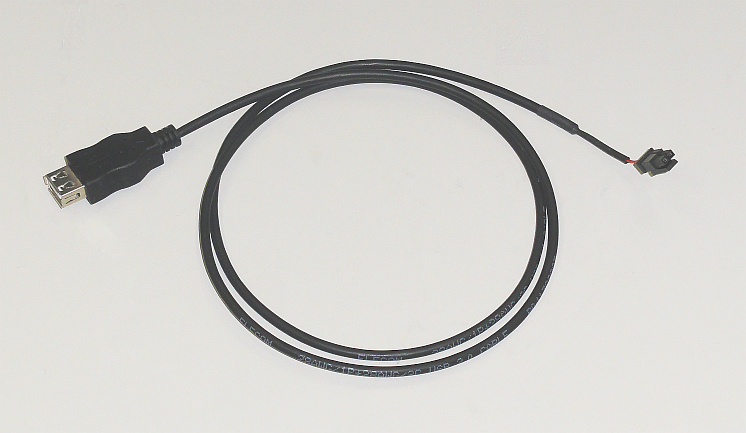
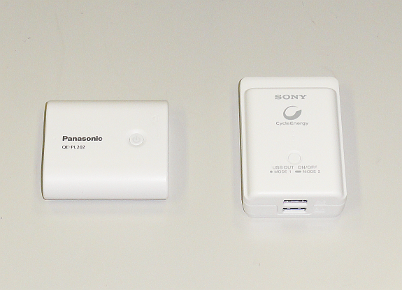
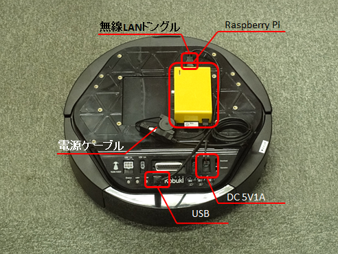
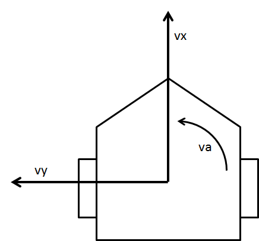
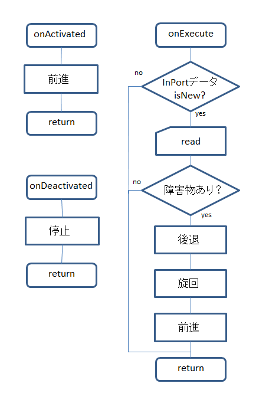

<!-- Title: 移動ロボットKobukiの制御 -->
<!-- * 移動ロボット Kobuki の制御 -->
#contents

Kobuki は Yujin Robotics から発売されている研究用移動ロボットです。
掃除機ロボット Roomba とほぼ同様の大きさで、USBシリアル接続でPC等から制御ができるようになっています。
また、IO、シリアル入出力、電源コネクタ、ボタン、LED等が装備されており、実験用ロボットとしての利用に適しています。

以下の Kobuki のサンプルを動作させるために必要なソフトウエアのインストールなどを行うスクリプトがこちらからダウンロードできます。

- [http://svn.openrtm.org/Embedded/trunk/RaspberryPi/tools/rpi.sh](http://svn.openrtm.org/Embedded/trunk/RaspberryPi/tools/rpi.sh)

```
 $ wget  http://svn.openrtm.org/Embedded/trunk/RaspberryPi/tools/rpi.sh
 $ chmod 755 rpi.sh
 $ sudo ./rpi.sh hostname --type kobuki
```

で、以下の解説で行っている環境構築と Kobuki のサンプルのコンパイルが自動で行われます。


## Raspberry Pi と Kobuki の接続

下図は Kobuki のメインパネルです。

<div align="center"><a href="kobuki_panel.png"></a></div>
<div align="center"><strong>Kobuki DC 出力コネクタ</strong></div>

Raspberry Pi への電源供給に 5V1A DC出力コネクタ、Raspberry Pi との接続には USBコネクタを利用します。


### 電源

Kobuki には 5V 1A 出力可能な DC出力コネクタがあり、Raspberry Pi の電源をここから供給することができます。

5V1A 出力コネクタは以下の型番のものを使用します。

<table class="table-alt">
  <tr>
    <th colspan="2">Kobuki 5V1A用コネクタ</th>
  </tr>
  <tr>
    <td>ハウジング</td>
    <td>Molex PN : 43645-0200</td>
  </tr>
  <tr>
    <td>ターミナル</td>
    <td>Molex PN : 43030-0001</td>
  </tr>
</table>

<div align="center"><a href="kobuki5v_connector.png"></a></div>
<div align="center"><strong>Kobuki DC5V1A用コネクタ</strong></div>

RTロボットショップなどでも購入できます。

- [Kobuki用コネクタセット￥450.-](http://www.rt-shop.jp/index.php?main_page=product_info&cPath=1001_1022&products_id=784)

下図のような DCコネクタと USBの変換ケーブルを作成することで、Raspberry Pi へ電源を供給します。

<div align="center"><a href="kobuki_raspberry_dccable.png"></a></div>
<div align="center"><strong>Raspberry Pi用 DCケーブル</strong></div>

近年ではスマートフォン用の USB出力端子がついたバッテリーが多数発売されていますので、こういった電源も利用できます。

<div align="center"><a href="battery.png"></a></div>
<div align="center"><strong>スマートフォン用バッテリー</strong></div>

### USB

Kobuki に付属している USB ケーブルで Kobuki と Raspberry Pi を接続します。
Raspberry Pi側からは /dev/ttyUSB0 として見えます。

```
 $ ls /dev/ttyUSB*
 /dev/ttyUSB0
```

### 接続

Raspberry Pi を Kobuki に搭載して、電源と USBを接続します。Raspberry Pi を無線LAN接続にすれば、無線遠隔操作可能な Kobuki になります。

<div align="center"><a href="kobuki_and_raspi.png"></a></div>
<div align="center"><strong>Raspberry Pi を搭載したKobuki</strong></div>

Kobuki 動作時に脱落する可能性がありますので、Raspberry Pi はマジックテープなどで固定するとよいでしょう。

## KobukiAIST RTコンポーネントのコンパイル

前節でも RTコンポーネントのコンパイルのテストを行いましたが、ここで再度おさらいします。まずは、KobukiAIST RTコンポーネントを以下のリポジトリからチェックアウトしビルドします。

- [KobukiAIST RTC](http://svn.openrtm.org/components/trunk/mobile_robots/kobuki)

```
  $ svn co http://svn.openrtm.org/components/trunk/mobile_robots/kobuki
  $ cd kobuki
  $ mkdir build
  $ cd build
  $ cmake -DCMAKE_INSTALL_PREFIX=/usr ..
  $ make
  $ cd src
  $ sudo make install
```

以上で、KobukiAIST RTCがビルドされ、実行ファイルが
- /usr/lib/openrtm-1.1/rtc/KobukiAISTComp
にインストールされるはずです。

試しに起動してみます。デバイスファイル /dev/ttyUSB0 へのアクセスには root 権限が必要ですので、sudo を使って起動しています。

```
 $ rtm-naming
 $ sudo /usr/lib/openrtm-1.1/rtc/KobukiAISTComp
```

RTSystemEditor を起動し、Raspberry Pi のホスト名またはIPアドレスに接続すると、KobukiAIST0 というコンポーネントが見えるはずです。
クリックして Configuration ダイアログを表示させてみてください。

LED1 や LED2 などの操作が行えるようになっていますので、radio ボタンで RED や GREEN などをクリックしてください。LED が点灯します。

## KobukiAIST コンポーネントの自動起動

KobukiAIST コンポーネントをRaspberry Pi 起動時に自動的に起動するようにします。
これにより、Kobuki に電源を投入すると、Raspberry Pi および KobukiAIST コンポーネントが自動的に起動するようになり、Raspberry Pi にいちいちログインしなくとも Kobuki を RTC 経由で操作できるようになります。

以下のようなスクリプトを /etc/kobuki.sh として作成します。

```
 $ sudo vi /etc/kobuki.sh
```

kobuki.sh の内容な以下の通りです。

```
 #!/bin/sh
 #
 # KobukiAIST RTC launch script
 #
 #       Copyright Noriaki Ando <n-ando@openrtm.org>
 #       2011.03.27
 #
 # This script should be executed from rc script like a rc.local
 # as the following command line.
 #
 #
 ns=/usr/bin/rtm-naming
 kobukiRTC=/usr/lib/openrtm-1.1/rtc/KobukiAISTComp
 workdir=/tmp/kobuki
 
 \$ns
 sleep 5
 
 if test -d $workdir ; then
         echo ""
 else
         mkdir \$workdir
 fi
 
 cd $workdir
 
 while :
 do
     rm -f \$workdir/*.log
     \$kobukiRTC
     sleep 5
 done
```

実行権限をつけます。

```
 $ sudo chmod 755 /etc/kobuki.sh
```

さらに、自動的に起動するように /etc/rc.local の最後の  **exit 0** の手前に以下のような一行を挿入します。

```
 /etc/kobuki.sh 2>&1 | perl -p -e 's/\n/\r\n/g' 1>&2 &
 exit 0
```

これで、Raspberry Pi が起動すると、KobukiAIST コンポーネントも自動的に起動します。
また、万一 KobukiAIST コンポーネントを exit で終了させても、5秒後再度起動します。
Kobuki に電源が入っている限り、KobukiAIST コンポーネントは常駐し続けるようになっています。

## Kobuki コンポーネントの操作

### TkJoystick による操作

TkJoystick は OpenRTM-aist-Python にサンプルとして含まれているコンポーネントです。ただし、出力はジョイスティックのX-Y値と、対向2輪型移動ロボットの車輪速度用の出力のみで、2次元速度ベクトル (TimedVelocity2D) 出力は有りません。

TkJoyStick コンポーネントを改良して、2次元速度ベクトル (TimedVelocity2D) の出力をするようにし、Kobukiと接続して操作してみてください。

- [オリジナルの TkJyoStick RTC](http://svn.openrtm.org/OpenRTM-aist-Python/trunk/OpenRTM-aist-Python/OpenRTM_aist/examples/TkJoyStick/)

Windows では以下のディレクトリーもインストールされています。(x.yはバージョン)

- C:\Program Files (x86)\OpenRTM-aist\x.y\examples\Python\TkJoyStick
- C:\Program Files\OpenRTM-aist\x.y\examples\Python\TkJoyStick

#### ヒント

TkJoystick.py の中では、左右の車輪速度を計算しています。ここから、移動ロボットの運動学を考慮すれば、速度 v および角速度 ω を計算することができます。
(参考のため、東北学院大学の熊谷先生のページへのリンクを張っておきます。) 

- [車輪移動ロボットの数学の項を参照](http://www.mech.tohoku-gakuin.ac.jp/rde/contents/course/robotics/wheelrobot.html)

なお、TimedVelocity2D は以下のようなデータ構造となっています。

```
 struct Velocity2D
 {
   double va; // 角速度 [rad/s]
   double vx; // 並進速度(前方) [m/s]
   double vy; // 並進速度(横方向) [m/s] 対向2輪型では0
 };
 struct TimedVelocity2D
 {
   Time tm;
   Velocity2D data;
 };
```

### 自律的に移動させる

Kobuki をセンサーを利用して自律的に移動させてみます。
Kobuki は、バンパセンサー、近接センサー(遠・近)、Cliffセンサーを装備されています。
ここでは、Roomba っぽく、前進し続けて壁を検知したら、少し下がり、回転し、再び前進をする、というアルゴリズムで動かしてみます。
(Roomba はもう少し賢く動きますが。。。)

KobukiAIST RTC のセンサ出力は以下のようになっています。
IRセンサはドックからの赤外線による信号を受けるためのもので、障害物検知には使用できません。したがって、バンパおよび崖センサーのみが障害物・崖検知に利用できます。

<table class="table-alt">
  <tr>
    <th>No.</th>
    <th>enum</th>
    <th>意味</th>
  </tr>
  <tr>
    <td>0</td>
    <td>RIGHT_BUMPER</td>
    <td>右バンパ</td>
  </tr>
  <tr>
    <td>1</td>
    <td>CENTER_BUMPER</td>
    <td>中央バンパ</td>
  </tr>
  <tr>
    <td>2</td>
    <td>LEFT_BUMPER</td>
    <td>左バンパ</td>
  </tr>
  <tr>
    <td>3</td>
    <td>RIGHT_WHEEL_DROP</td>
    <td>右車輪脱輪</td>
  </tr>
  <tr>
    <td>4</td>
    <td>LEFT_WHEEL_DROP</td>
    <td>左車輪脱輪</td>
  </tr>
  <tr>
    <td>5</td>
    <td>RIGHT_CLIFF</td>
    <td>右崖センサ</td>
  </tr>
  <tr>
    <td>6</td>
    <td>CENTER_CLIFF</td>
    <td>中央崖センサ</td>
  </tr>
  <tr>
    <td>7</td>
    <td>LEFT_CLIFF</td>
    <td>左崖センサ</td>
  </tr>
  <tr>
    <td>8</td>
    <td>RIGHT_IRFAR_RIGHT</td>
    <td>右IR/ドック右遠</td>
  </tr>
  <tr>
    <td>9</td>
    <td>RIGHT_IRFAR_CENTER</td>
    <td>右IR/ドック中央遠</td>
  </tr>
  <tr>
    <td>10</td>
    <td>RIGHT_IRFAR_LEFT</td>
    <td>右IR/ドック左遠</td>
  </tr>
  <tr>
    <td>11</td>
    <td>RIGHT_IRNEAR_RIGHT</td>
    <td>右IR/ドック右近</td>
  </tr>
  <tr>
    <td>12</td>
    <td>RIGHT_IRNEAR_CENTER</td>
    <td>右IR/ドック中央近</td>
  </tr>
  <tr>
    <td>13</td>
    <td>RIGHT_IRNEAR_LEFT</td>
    <td>右IR/ドック左近</td>
  </tr>
  <tr>
    <td>14</td>
    <td>CENTER_IRFAR_RIGHT</td>
    <td>中央IR/ドック右遠</td>
  </tr>
  <tr>
    <td>15</td>
    <td>CENTER_IRFAR_CENTER</td>
    <td>中央IR/ドック中央遠</td>
  </tr>
  <tr>
    <td>16</td>
    <td>CENTER_IRFAR_LEFT</td>
    <td>中央IR/ドック左遠</td>
  </tr>
  <tr>
    <td>17</td>
    <td>CENTER_IRNEAR_RIGHT</td>
    <td>中央IR/ドック右近</td>
  </tr>
  <tr>
    <td>18</td>
    <td>CENTER_IRNEAR_CENTER</td>
    <td>中央IR/ドック中央近</td>
  </tr>
  <tr>
    <td>19</td>
    <td>CENTER_IRNEAR_LEFT</td>
    <td>中央IR/ドック左近</td>
  </tr>
  <tr>
    <td>20</td>
    <td>LEFT_IRFAR_RIGHT</td>
    <td>左IR/ドック右遠</td>
  </tr>
  <tr>
    <td>21</td>
    <td>LEFT_IRFAR_CENTER</td>
    <td>左IR/ドック中央遠</td>
  </tr>
  <tr>
    <td>22</td>
    <td>LEFT_IRFAR_LEFT</td>
    <td>左IR/ドック左遠</td>
  </tr>
  <tr>
    <td>23</td>
    <td>LEFT_IRNEAR_RIGHT</td>
    <td>左IR/ドック右近</td>
  </tr>
  <tr>
    <td>24</td>
    <td>LEFT_IRNEAR_CENTER</td>
    <td>左IR/ドック中央近</td>
  </tr>
  <tr>
    <td>25</td>
    <td>LEFT_IRNEAR_LEFT</td>
    <td>左IR/ドック左近</td>
  </tr>
  <tr>
    <td>26</td>
    <td>KOBUKI_DOCKED</td>
    <td>ドック完了</td>
  </tr>
</table>


これらの出力を受けるため RTC::TimedBooleanSeq 型の InPort が一つ必要になります。
また、Kobuki に移動速度指令を出力するための TimedVelocity2D型の OutPort が一つ必要になります。

<table class="table-alt">
  <tr>
    <th colspan="2" style="text-align: center;">基本プロファイル</th>
  </tr>
  <tr>
    <td>コンポーネント名称</td>
    <td>KobukiAutoMove</td>
  </tr>
  <tr>
    <td>モジュール概要</td>
    <td>Kobuki auto move component</td>
  </tr>
  <tr>
    <td>バージョン</td>
    <td>1.0.0</td>
  </tr>
  <tr>
    <td>ベンダ名</td>
    <td>AIST</td>
  </tr>
  <tr>
    <td colspan="2" style="text-align: center;">アクティビティ</td>
  </tr>
  <tr>
    <td colspan="2">onInitialize、onFinalize、onActivated、onDeactivated、onExecute</td>
  </tr>
  <tr>
    <td colspan="2" style="text-align: center;">データポート</td>
  </tr>
  <tr>
    <td colspan="2">[in] bumper</td>
  </tr>
  <tr>
    <td>概要</td>
    <td>センサ情報　true:障害物検出（バンパ接触、車輪落下、崖検知）　false:障害物無し</td>
  </tr>
  <tr>
    <td>データ型</td>
    <td>TimedBooleanSeq</td>
  </tr>
  <tr>
    <td>詳細</td>
    <td>data[0]: 右バンパ、data[1]: 中央バンパ、... data[7]: 左崖センサ（上の表参照）</td>
  </tr>
  <tr>
    <td colspan="2">[out] targetVelocity</td>
  </tr>
  <tr>
    <td>概要</td>
    <td>移動ロボットの速度ベクトル</td>
  </tr>
  <tr>
    <td>データ型</td>
    <td>TimedVelocity2D</td>
  </tr>
  <tr>
    <td>詳細</td>
    <td>vx: 並進速度、vy: 0.0、va: 角速度</td>
  </tr>
  <tr>
    <td>単位</td>
    <td>vx [m/s]、va [rad/s]</td>
  </tr>
</table>


以上の情報を手掛かりに、Kobuki を自律移動させる簡単なコンポーネントを作成してみてください。
コンポーネントの接続でうまく行かない場合は、[トラブルシューティング]({{ site.baseurl }}/ja/doc/installation/other/raspberrypi_casestudy/install_development_env#trouble) をご覧ください。

#### ヒント

Kobuki の速度指令は TimedVelocity2D という型で、上でも示しましたが、以下のようなデータ構造です。

```
 struct Velocity2D
 {
   double va; // 角速度 [rad/s]
   double vx; // 並進速度(前方) [m/s]
   double vy; // 並進速度(横方向) [m/s] 対向2輪型では0
 };
 struct TimedVelocity2D
 {
   Time tm;
   Velocity2D data;
 };
```

対向2輪型移動ロボットでは、vyは常に0.0であると考え、たとえば直進なら

```
 va = 0.0; vx = 0.2; vy = 0.0;
```

となります。後進するなら、

```
 va = 0.0; vx = -0.2; vy = 0.0;
```

であり、その場で旋回するなら

```
 va = 0.0; vx = 0.0; vy = 1.0;
```

となります。

<div align="center"><a href="timed_velocity_2d.png"></a></div>
<div align="center"><strong>移動ロボットの座標系と TimedVelocity2D</strong></div>

InPort にデータが来ていたら、データを読み込みバンパ情報を取り出します。バンパ情報は、TimedBoolSeq というデータ型の .data という配列のメンバに格納されており、上の表で0,1,2番目の要素であることがわかります。
これらのどれかが true になっていたらバンパで衝突を検知したということですから、いったん下がり、旋回します。そして、再び前進します。
これらの動きを TimedVelocity2D のメンバーにそれぞれ設定して OutPort に writeすれば、速度指令データは Kobuki に伝達されます。
アルゴリズムのフローチャートを下に示します。

<div align="center"><a href="kobuki_auto.png"></a></div>
<div align="center"><strong>フローチャート</strong></div>

どのくらい下がるか・下がったか、あるいは旋回するか・したかを計測しながら制御するのが理想ですが、簡単のために sleep関数を使用することもできます。
Linuxではcoil::sleep が使えます

```
 coil::sleep(coil::TimeValue(0.01); // 10ms待つ
```

Windows では coil::sleep の精度が悪いので、Sleep関数を利用したほうがよいでしょう。
これらのヒントを基に、Kobuki を自律移動させるような制御コンポーネントを作成してみてください


## 解答

解答として、上記の TkJoyStick コンポーネントと自律移動コンポーネントを以下に示します。

- GUI ジョイスティック: [TkJoyStick.zip](TkJoyStick.zip)
- Kobuki 自律制御: [KobukiAutoMove.zip](KobukiAutoMove.zip)


