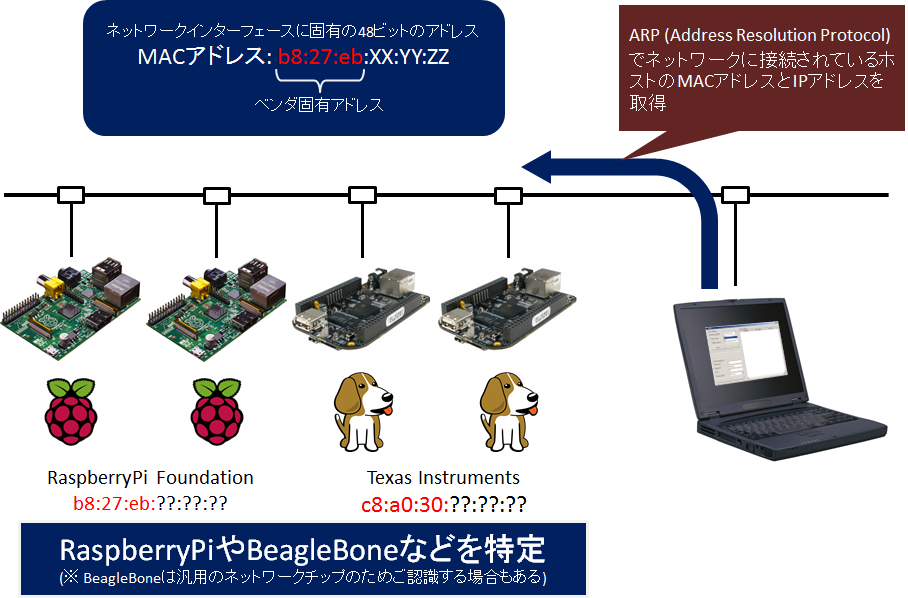
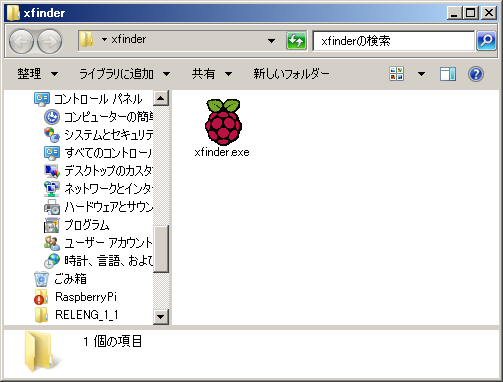
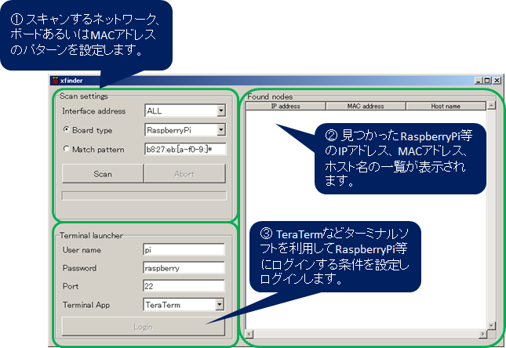
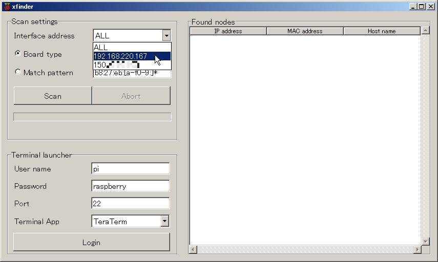
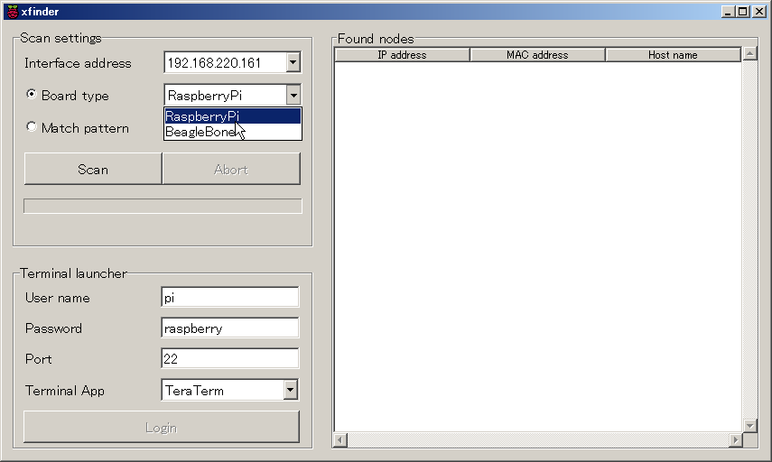
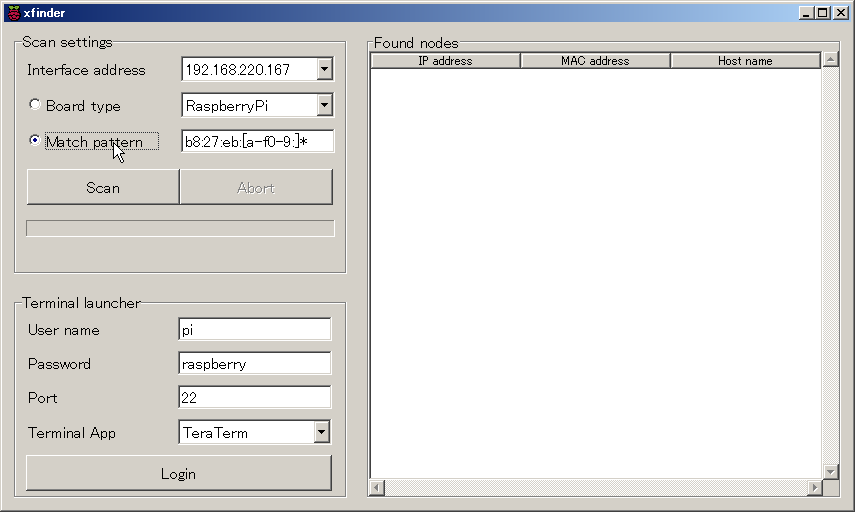
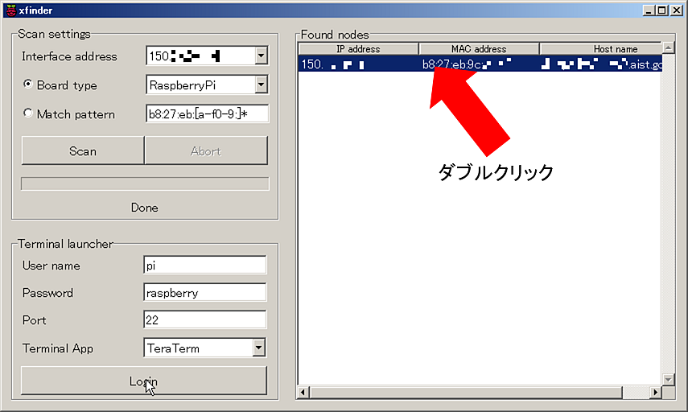
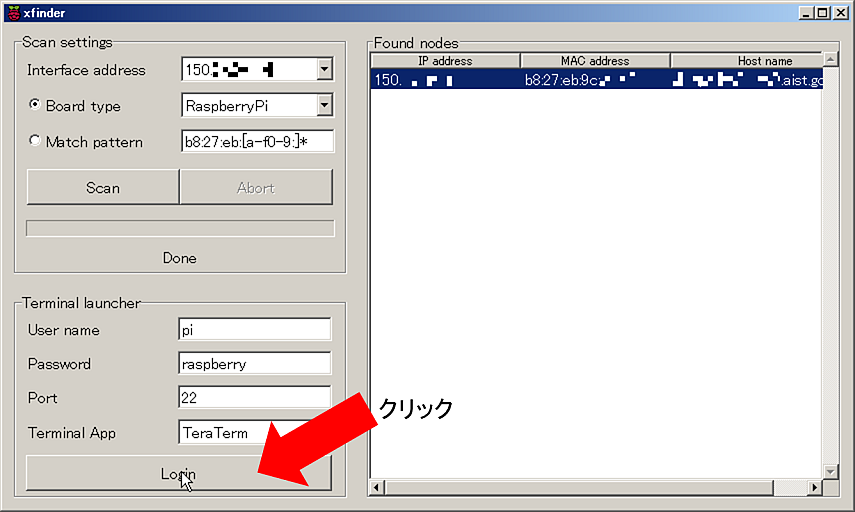
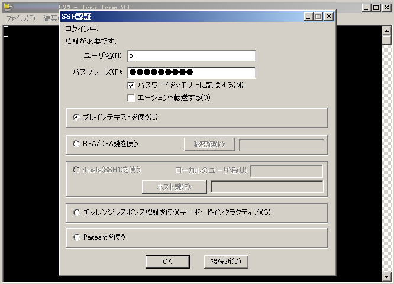

<!-- Title: xfinderの利用方法 -->
#contents(4)

Raspberry Pi はヘッドレス状態 (モニタ、キーボードを接続しない状態) では IPアドレスなどを知る術がないため初期設定を行うのは少々困難です。
最初にモニタとキーボードを接続して、ホスト名を設定し前述のように Avahi経由で IPアドレスをホスト名から知ることも可能ですが、全く設定していない Raspberry Pi についてはこの方法も使えません。

## xfinder とは

xfinder は Raspberry Pi や BeagleBone などのCPUボードに搭載されている Ethernet インターフェースの MAC (Media Access Control) アドレスからIPアドレスを割出しログインするためのツールです。

Ethernet のインターフェースには48ビットの固有のアドレス(MAC (Media Access Control) アドレス)が割り振られており、その上位24ビットはベンダ(ネットワーク機器を開発する企業など)の固有のアドレスとなっています。
Ethernet ではパケットの送受信をするために相互に MACアドレスを知る必要があり、IPアドレスから MACアドレスを調べるための ARP(Address Resolution Protocol) と呼ばれるプロトコルが利用できます。
xfinderでは、ネットワーク上に接続されている特定の MACアドレスのパターンを見つけることにより、Raspberry Pi などのヘッドレスシステムの IPアドレスを調べ、ssh 等でログインし設定・開発を容易に行えるようにサポートします。

<strong>xfinderでRaspberryPiを見つける</strong>

xfinder は一つの実行ファイルでコマンドラインツール (CUI モード) とグラフィカルユーザインターフェースツール (GUI モード) の2通りとして利用することができます。
ここでは、GUIモードの xfinder の使い方について説明します。

## xfinder のダウンロード

xfinder は以下の場所からダウンロードできます。

<table class="table-alt">
  <tr>
    <th>**xfinder**</th>
    <th>http://openrtm.org/pub/RaspberryPi/xfinder.exe</th>
  </tr>
</table>

<strong>ダウンロードした xfinder</strong>

## xfinder (GUIモード) を使う

xfinder の使い方は以下の3ステップです。

- ネットワークをスキャンしてRaspberry Pi 等を見つける
- スキャンして見つかった Raspberry Pi を確認する
- TeraTerm 等ターミナルソフトウエアでログインして作業をする

### 起動

xfinder.exeを起動すると、以下の様な画面が表示されます。

<strong>xfinder の GUI画面</strong>

まず、①左上のペインにてスキャンする条件（インターフェース、ボード、MACアドレスパターン等）を指定しスキャンを開始、②次にスキャンして見つかった Raspberry Pi 等のリストが表示されるので選択、③の左下のペインにてログイン条件を指定してターミナルアプリケーションを起動します。
ターミナルアプリケーションが起動後は、対象となる Raspberry Pi にログインして設定やプログラムの開発などを行うことができます。

なお、右のペインに表示されたボードのリストをダブルクリックすることでターミナルアプリケーションの起動とログインを行うことも可能です。

### Scan settings

左上の **Scan settings** では、ネットワークをスキャンするための条件を設定します。

#### Interface address

現在の PC のどのネットワークインターフェースから Raspberry Pi を探すかを選択します。複数のネットワークインターフェースがある場合、複数のIPアドレスが表示されるので、どのネットワーク(例えば、一つはグローバル側、もう一つがプライベート側のネットワークにつながっており、プライベート側のネットワークにある Raspberry Pi を探したい場合はここでプライベートアドレスを選択します。)をスキャンするかを選択します。

<strong>Interface addressでスキャンするネットワークインターフェースの IPアドレスを指定する</strong>

全てのネットワークインターフェースに対してスキャンを行う場合は**ALL**を選択してください。
どの IPアドレスがどのネットワークインターフェースと対応しているかわからない場合は、**コントロールパネル**→**ネットワークとインターネット**→**ネットワークと共有センター**→**アダプターの設定の変更**からアダプタのアイコンをクリックしてどのようなIPアドレスが割り当てられているか確認してください。

また、コマンドプロンプトを開いて **ipconfig** コマンドを実行しインターフェースと割り当てられているIPアドレスを確認することもできます。

#### Board type

どのボードを探すかコンボボックスから選択します。Raspberry Pi か BeagleBone を選択でき、デフォルトでは Raspberry Pi が選択されています。

<strong>スキャンするボードタイプを指定する</strong>

この一覧に探したいボードがない場合は、該当するボードのネットワークインターフェースの MACアドレスの上6ケタを調べ、次の Match Pattern のテキストボックスに入力しスキャンする必要があります。

Raspberry Pi にUSB 無線LANアダプタを付け、無線LANのみで接続している場合はここで Raspberry Pi を選択しても探すことはできません。
無線LANアダプタの MACアドレスの MACアドレスの上6ケタ (例えば Buffaroの場合10:6f:3f) を Match Pattern に入力して探します。

#### Match pattern

Raspberry Pi や BeagleBone 以外のボードを探す場合、ここに探したい MACアドレスのパターンを入力します。

<strong>スキャンする MACアドレスのパターンを指定する</strong>

また Raspberry Piに無線LANアダプタなどを装着している場合も、メーカー固有の MACアドレス上6ケタを入力することで探し出すことが可能です。
ただし、メジャーなメーカーの無線LANアダプタなどはスキャンすると多数発見されることもあります。

#### Scan ボタン/ Abort ボタン

**Scan** ボタンはスキャンを実行する際に押します。スキャン中は押すことができません。
**Abort**ボタンはスキャン実行中に途中でやめたい場合に押します。スキャン実行中のみ押すことができます。
ボタンの下のプログレスバーはスキャンの進捗状況を表示します。

<!-- div align="center"></div-->

<strong>スキャン実行時(※画像なし)</strong>

### Found nodes

右側の **Found nodes** のペインはスキャンして見つかったボードのIPアドレス、MACアドレスおよびホスト名を表示します。

- **IP address**: 見つかったボードの IPアドレスを表示します。ヘッダ部分を押すと IPアドレス順でソートします。
- **MAC address**: 見つかったボードの MACアドレスを表示します。ヘッダ部分を押すと MACアドレス順でソートします。
- **Host name**: 見つかったボードのホスト名を表示します。ヘッダ部分を押すとホスト名順でソートします。

なお、ここに表示されたリストをダブルクリックすると、左の **Terminal launcher** の設定に従ってターミナルアプリケーションが起動しログインできます。

<strong>Found nodes から直接ターミナルアプリケーションを起動する</strong>

### Terminal launcher

左側の **Terminal launcher** のペインは見つかったホストに対してターミナルアプリケーションを利用してログインする際に使用します。

- **User name**: ログイン時に使用するユーザー名を入力します。左上の**Scan setting** の **Board type** 設定によって自動的に値が入力されます。
- **Password**: ログイン時に使用するパスワードを入力します。左上の**Scan setting** の **Board type** 設定によって自動的に値が入力されます。
- **Port**: ログイン時に使用するポート番号を入力します。デフォルトでは ssh のデフォルトポート番号20が設定されています。
- **Terminal App**: 使用するターミナルアプリケーションがコンボボックスから選択で来ます。利用可能なターミナルアプリケーションは Windows では **TeraTerm**, **Poderosa**, **PuTTY** のいずれかで、起動時にこれらがインストールされているかチェックし、利用可能なものだけリストに表示されます。
- **Login**ボタン: 右側の Found nodes でログインするノード選択すると押下可能になります。このボタンを押すと、上の設定に従ってターミナルアプリケーションが起動され Raspberry Pi にログインできます。

<table class="table-alt">
  <tr>
    <th>ボードタイプ</th>
    <th>User name</th>
    <th>Password</th>
  </tr>
  <tr>
    <td>RaspberryPi</td>
    <td>pi</td>
    <td>raspberry</td>
  </tr>
  <tr>
    <td>BeagleBone</td>
    <td>root</td>
    <td>(パスワード無し)</td>
  </tr>
</table>

<strong>Login ボタンを押してターミナルアプリケーションを起動する</strong>

<strong>起動したターミナルアプリケーション (TeraTerm Pro)</strong>

