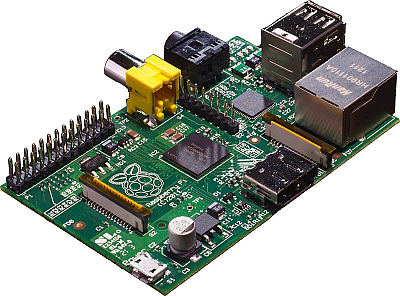
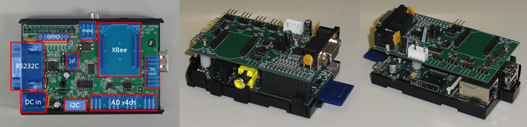
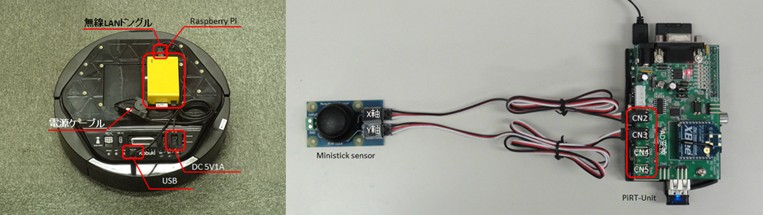

-------jp page!!-------

<!-- Title: Raspberry PiでのOpenRTM-aist活用事例 -->

## はじめに
Raspberry Piとは、ラズベリーパイ財団が英国で開発したARMプロセッサを搭載したシングルボードコンピューターです。

Raspberry Piは組込みボードサイズにも関わらず、ARM用の通常のLinux (Debian、Fedora、Arch Linux)やFreeBSDが動作し、ボード上でセルフコンパイルも行えるため大変使いやすいです。
ディスクも現在は安価で大容量なSDカードを利用でき、本体価格も3000円程度と非常に安価です。
また、基本的なI/Oが提供されており、外部のいろいろなデバイスとも接続できるため、ロボット制御やセンサーによる計測など、いろいろな応用が考えられます。

### 仕様

Raspberry Piの外観を以下に示します。

<strong>Raspberry Pi</strong>

Raspberry Piには３つの基本タイプ(Model A、Model B、Model Zero)があり、また基本タイプごとに複数のモデルがあります。詳細については下記Wikipediaのリンクなどを参照してください。

- Wikipediaより:http://ja.wikipedia.org/wiki/Raspberry_Pi

以下に代表的なモデルの仕様を表示します。

<table class="table-alt">
  <tr>
    <td colspan="4" style="text-align: center;" >仕様</td>
  </tr>
  <tr>
    <td></td>
    <td>3 Model B</td>
    <td>3 Model B+</td>
    <td>4 Model B (4G)</td>
  </tr>
  <tr>
    <td>ターゲット価格</td>
    <td>$35</td>
    <td>$35</td>
    <td>$55</td>
  </tr>
  <tr>
    <td>SoC</td>
    <td>Broadcom BCM2837</td>
    <td>Broadcom BCM2837B0</td>
    <td>Broadcom BCM2711</td>
  </tr>
  <tr>
    <td>CPU</td>
    <td>ARM Cortex-A53 1.2GHz</td>
    <td>ARM Coretex-A53 1.4GHz</td>
    <td>ARM Coretex-A72 1.5GHz</td>
  </tr>
  <tr>
    <td>GPU</td>
    <td colspan="2" style="text-align: center;">Broadcom VideoCore IV</td>
    <td>Broadcom VideoCore VI</td>
  </tr>
  <tr>
    <td>メモリ(SDRAM)</td>
    <td colspan="2" style="text-align: center;">1GB(GPU共有)</td>
    <td>4GB(GPU共有)</td>
  </tr>
  <tr>
    <td>USB 2.0ポート</td>
    <td>4(統合USBハブ)</td>
    <td>4</td>
    <td>2</td>
  </tr>
  <tr>
    <td>USB 3.0ポート</td>
    <td colspan="2" style="text-align: center;">-</td>
    <td>2</td>
  </tr>
  <tr>
    <td>映像出力</td>
    <td colspan="2"style="text-align: center;">コンポジット RCA(PAL&NTSC)、HDMI(rev 1.3 & 1.4)、MIPI DSI</td>
    <td>コンポジットRCA(PAL/NTSC)、micro-HDMI(up to 4kp60) 2.0 x 2、MIPI DSI</td>
  </tr>
  <tr>
    <td>音声出力</td>
    <td colspan="2" style="text-align: center;">3.5 mm ジャック、I2S、HDMI</td>
    <td>3.5 mmジャック、I2S、micro HDMI</td>
  </tr>
  <tr>
    <td>ストレージ</td>
    <td colspan="3" style="text-align: center;">SDメモリーカード/MMC/SDIOカードスロット</td>
  </tr>
  <tr>
    <td>ネットワーク</td>
    <td>10/100 Mbpsイーサネット(RJ45)</td>
    <td>Gigabit Ethernet over USB 2.0 (maximum throughput 300Mbps) (RJ45)</td>
    <td>Gigabit Ethernet (RJ45)</td>
  </tr>
  <tr>
    <td>低レベル周辺機器</td>
    <td colspan="3" style="text-align: center;">8 × GPIO、UART、I2C、SPIと2つのチップセレクト、+3.3V、+5V、接地</td>
  </tr>
  <tr>
    <td>電源</td>
    <td colspan="2" style="text-align: center;">2.5A(12.5W)</td>
    <td>3A(15 W)</td>
  </tr>
  <tr>
    <td>電源ソース</td>
    <td colspan="2" style="text-align: center;">5V/microUSBまたはGPIO</td>
    <td>5V/USB Type-CまたはGPIO</td>
  </tr>
  <tr>
    <td>大きさ</td>
    <td>85.0mm × 56.5mm</td>
    <td colspan="2" style="text-align: center;">85.0mm x 56.0mm</td>
  </tr>
</table>

より詳しくは上記Wikiなどを参照してください。

### このBookの概要

産総研が開発したI/O拡張基盤PiRT-Unitを利用すれば、比較的簡単にI/Oを利用することが可能です。

<strong>PiRT-Unit</strong>

OpenRTM-aist(C++、Python、Java)もボード上でコンパイル・実行可能ですので、組込みボードでありながら、通常のLinux PC上での開発プロセスとほぼ同様の使い方が可能です。

ここではOpenRTM-aistでRTコンポーネントを開発・実行するための環境構築方法、便利に使うためのノウハウ、移動ロボットの制御やI/Oの利用方法などを解説します。

<strong>Raspberry PiやPiRT-Unitを利用したアプリケーション</strong>

- [SDカードの準備](./prep_sdc)
- [Raspberry Pi の初期設定](./raspi_init_setting)
- [xfinderの利用方法](./howtouse_xfinder)
- [開発環境のインストール](./install_development_env)
- [サンプルコンポーネントの実行](./running_sample_comp)
- [PiRT-Unitを利用したIOプログラミング](./io_programming_pirt-unit)
- [移動ロボットKobukiの制御](./control_mobilerobot_kabuki)
- [Kobukiにロボットアームを搭載する手順](./adding_robotarm_kobuki)
- [付録](./appendix)

-------jp page!!-------
