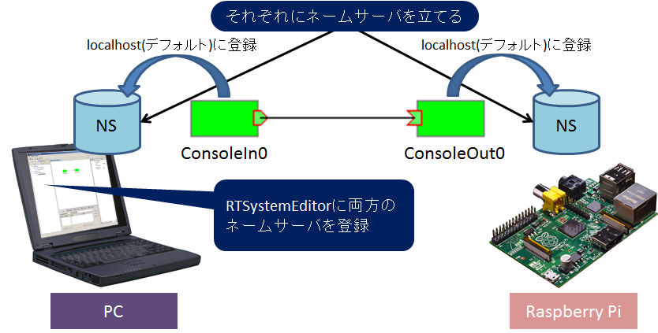
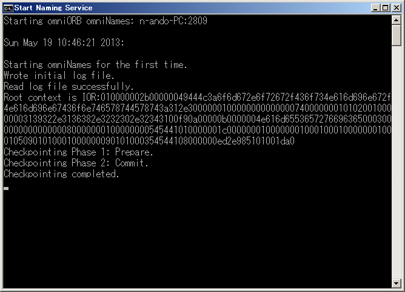
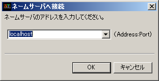
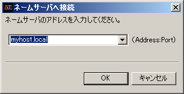
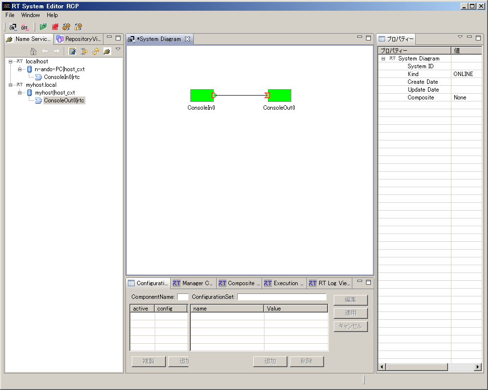
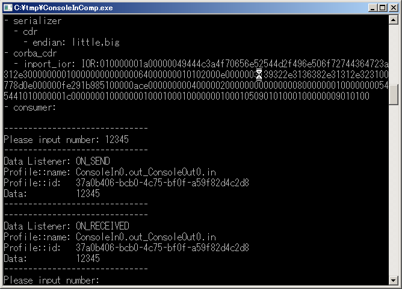
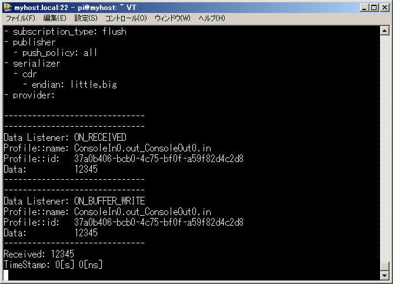

<!-- Title: 開発環境のインストール -->
<!-- * 開発環境のインストール -->
#contents

By installing the development environment on Raspberry Pi, you can develop using self-compilation directly on the Raspberry Pi. (For embedded Linux boards of this size, development is normally performed by cross-compilation.)

Therefore, RT Component code generated by RTCBuilder on a PC can be compiled and executed on the Raspberry Pi.
Unfortunately, installing Eclipse and using it at a practical speed appears to be difficult.

This section installs the packages required to develop RT Components.

<!-- ------------------------------------------------------------ -->
## Installing OpenRTM-aist
<!-- ------------------------------------------------------------ -->

OpenRTM-aist can be installed using apt-get.
First, modify sources.list.

```text
 $ sudo vi /etc/apt/sources.list
```

Add the following line to sources.list.

```text
 deb http://openrtm.org/pub/Linux/raspbian/ wheezy main
```

Next, install it using the following procedure.

```text
 # apt-get update
 # apt-get -y --force-yes install gcc g++ make uuid-dev
 # apt-get -y --force-yes install libomniorb4-dev omniidl omniorb-nameserver
 # apt-get -y --force-yes install openrtm-aist openrtm-aist-dev openrtm-aist-example
 # apt-get -y --force-yes install openrtm-aist-python openrtm-aist-python-example
```

### Running Sample Components

After installing OpenRTM-aist, start the sample components to check whether OpenRTM-aist has been installed correctly.

As shown below, run the name server and the ConsoleIn component on the PC side, and run the name server and the ConsoleOut component on the Raspberry Pi side.
By default, components connect to the localhost name server. Use this behavior to easily access the components without setting a specific name server in rtc.conf.
In RTSystemEditor on the PC, connect to the name server on the PC and the name server on the Raspberry Pi, then connect the ConsoleIn component and the ConsoleOut component.

<div align="center"><a href="sample_component_test.png"></a></div>
<div align="center"><strong>Running the Sample</strong></div>

#### Running ConsoleOut on Raspberry Pi

After connecting to the Raspberry Pi using TeraTerm or a similar tool, start the component.
Start the naming service first, and then start ConsoleOut.

```text
 $ rtm-naming
 $ /usr/share/OpenRTM-x.y/examples/ConsoleOutComp
 または
 $ python /usr/share/OpenRTM-x.y/examples/python/SimpleIO/ConsoleOutComp.py
```

When omniorb-nameserver is installed above, the omniORB name service is configured to start automatically when the system boots.
However, depending on the timing of name service startup and network interface startup, the name server may not be accessible correctly from outside.
In that case, restarting the name server using the rtm-naming command may resolve the problem.

#### Running ConsoleIn on the PC Side

First, start the name server.
On Windows, start it from **Start Naming Service** under “OpenRTM-aist x.y” → “C++” → “tools” in the Start menu.
Also start RTSystemEditor.

<div align="center"><a href="namingservice_on_windows.png"></a></div>
<div align="center"><strong>Starting the Naming Service</strong></div>

Next, start ConsoleIn.
Click ConsoleOut under “OpenRTM-aist x.y” → “C++” → “examples” to start the ConsoleOut component.

#### Connecting with RTSystemEditor

Click the plug icon in the NameService View on the left side of RTSystemEditor to connect to the name server.
First, connect to the name server on the local host. Enter localhost in the connection dialog.

<div align="center"><a href="connect_ns_localhost.png"></a></div>
<div align="center"><strong>Connecting to the Name Server (localhost)</strong></div>

Next, connect to the name server on the Raspberry Pi. Click the connection icon in the NameService View again, and enter the Raspberry Pi hostname plus .local in the dialog.

<div align="center"><a href="connect_ns_myhost.png"></a></div>
<div align="center"><strong>Connecting to the Name Server (Raspberry Pi)</strong></div>

The Name Service View displays the status of the two name servers, and you should see two components, ConsoleIn0 and ConsoleOut0, under their respective name servers.
Click the online editor icon in the RTSystemEditor menu bar (the icon labeled ON) to open the SystemEditor.
Drag and drop ConsoleIn0 and ConsoleOut0 from the NameService View onto the SystemEditor, then connect the InPort and OutPort.

<div align="center"><a href="rtsystemeditor_consoleinout.png"></a></div>
<div align="center"><strong>Connecting ConsoleIn and ConsoleOut with RTSystemEditor</strong></div>

Click the green play button in the menu bar to activate the two components, and the state will become as shown above.

Enter any number in the ConsoleIn component window on the PC side.

<div align="center"><a href="consolein_window.png"></a></div>
<div align="center"><strong>Entering a Number from ConsoleIn (PC)</strong></div>

Then, as shown below, the number entered in ConsoleIn appears in the ConsoleOut display on the Raspberry Pi side.

<div align="center"><a href="consoleout_window.png"></a></div>
<div align="center"><strong>ConsoleOut Display on the Raspberry Pi Side</strong></div>

&aname(trouble);

### Troubleshooting

Depending on the network environment or PC settings, the procedure above may not work correctly. Refer to the following troubleshooting information to resolve problems.

#### ConsoleOut Does Not Appear Under the Service on the Raspberry Pi Side

:Name server issue|This behavior occurs when the endpoint address of the name server is invalid. Restarting the name server with rtm-naming may resolve the issue.
In addition, if the Raspberry Pi has two or more network interfaces, such as wired LAN and wireless LAN, the issue may be resolved by configuring it to use only the network interface used for the connection to the PC.

**Component issue|The configuration file (rtc.conf) loaded by the component may specify a name server other than localhost. Configure the component to register with the localhost name server, for example by writing corba.nameservers**: localhost.
In addition, if the Raspberry Pi has two or more network interfaces, such as wired LAN and wireless LAN, the issue may be resolved by configuring it to use only the network interface used for the connection to the PC.

#### RTSystemEditor Cannot Connect or Stops Responding

:Component issue on the PC side|If the PC has two or more network interfaces, this behavior may occur when the interface address not used for the Raspberry Pi connection is used as the component reference.
Check the PC IP address using ipconfig from the command prompt, and set the IP address to be used in rtc.conf as follows.

```text
 corba.endpoints: 192.168.11.20
```

However, on Windows Vista and later, files under C:\Program Files cannot be edited easily. To work around this, copy ConsoleIn.exe and rtc.conf to an appropriate directory such as c:\tmp, or create new copies there.

:Component issue on the Raspberry Pi side|If the Raspberry Pi has two or more network interfaces, such as wired LAN and wireless LAN, and each is connected to a different network, the same issue as described above for the PC may occur. Use ifconfig to check the IP address to be used, and write it in rtc.conf as follows.

```text
 corba.endpoints: 192.168.11.21
```

## Installing CMake

cmake can be installed using apt-get. Install it as a user with root privileges.

```text
 $ sudo apt-get update
 $ sudo apt-get install cmake
```

## Installing Doxygen

In CMake-based RT Component projects, document generation using doxygen is enabled by default.
However, installing doxygen also installs LaTeX and related packages, which consumes significant SD card capacity. Therefore, Doxygen is not installed in this tutorial.

### How to Disable Document Generation

To suppress document generation with doxygen in a CMake-based RTC project, modify the top-level CMakeLists.txt as follows.

```text
 option(BUILD_DOCUMENTATION "Build the documentation" ON)
    ↓
 option(BUILD_DOCUMENTATION "Build the documentation" OFF)
```

### Installing Doxygen

If there is sufficient space on the SD card, doxygen can be installed with apt-get as follows.

```text
 $ sudo apt-get install doxygen
```

<span style="color:red;">* It takes about several tens of minutes for Doxygen installation to complete.</span>;

## Installing Subversion/Git

Since subversion/git is frequently used to obtain source code from external repositories, installing them is recommended.

```text
 $ sudo apt-get install subversion git
```

## Compilation Test

Test whether components can be compiled.
The following repository contains components for the Kobuki mobile robot. Check them out and compile them.

- [KobukiAIST RTC](http://svn.openrtm.org/components/trunk/mobile_robots/kobuki)

### Checking Out the Source Code

Check out the source code.

```text
 $ svn co http://svn.openrtm.org/components/trunk/mobile_robots/kobuki
```

   : Omitted

```text
 A    kobuki/libkobuki/doc/CMakeLists.txt
 A    kobuki/libkobuki/License.rtf
 A    kobuki/libkobuki/CMakeLists.txt
 A    kobuki/rtc.conf
 A    kobuki/CMakeLists.txt
 Checked out revision 2.
 $
```

The source code has been checked out under the kobuki directory. Create a build directory, then build and install it there.

```text
  $ cd kobuki
  $ mkdir build
  $ cd build
  $ cmake -DCMAKE_INSTALL_PREFIX=/usr ..
  $ make
  $ cd src
  $ make install
```

In this source code, document generation with Doxygen is disabled by default, so it should build even if Doxygen is not installed.

