<!-- Title: Ministickコンポーネントの作成 -->
<!-- * Ministickコンポーネントの作成 -->

#contents

## Creating a Ministick Component

Phidgets are IO expansion boards and sensor products sold by Phidgets Inc.
In Japan, they can be purchased from Plat'Home and other suppliers.

- Phidgets Inc.: http://www.phidgets.com/
- Plat'Home: http://online.plathome.co.jp/

This is a kit that allows you to connect a USB-connected expansion IO board to a PC, add various sensors and actuator units, and perform measurement and control from programs and other software.

When connecting to a PC, an Interface Kit is required, but when using it only with PiRT-Unit, the Sensor Kit alone should be sufficient.

- [Phidget Interface Kit #1](http://online.plathome.co.jp/item/detail/41595459/Phidgets/Phidget-Interface-Kit-Package--1/2005_1)
- [Phidget Interface Kit #2](http://online.plathome.co.jp/item/detail/41595460/Phidgets/Phidget-Interface-Kit-Package--2/2006_1)
- [Phidget Sensor Kit #1](http://online.plathome.co.jp/item/detail/41595256/Phidgets/Phidget-Sensor-Kit--1/42000_1)
- [Phidget Sensor Kit #2](http://online.plathome.co.jp/item/detail/41595257/Phidgets/Phidget-Sensor-Kit--2/42001_0)

The AD pins of PIRT-Unit have a pin assignment that allows Phidget sensors to be connected, making it easy to expand by connecting Phidget devices.

Here, we will try controlling a mobile robot using the Phidget Ministick sensor.
The Ministick sensor is included in Phidget Sensor Kit #2.

## Connecting the Ministick sensor and PiRT-Unit

Connect the output pins of the Ministick sensor to PiRT-Unit as follows.

- X-axis direction: CN2
- Y-axis direction: CN3

<div align="center"><a href="ministick_connection.png">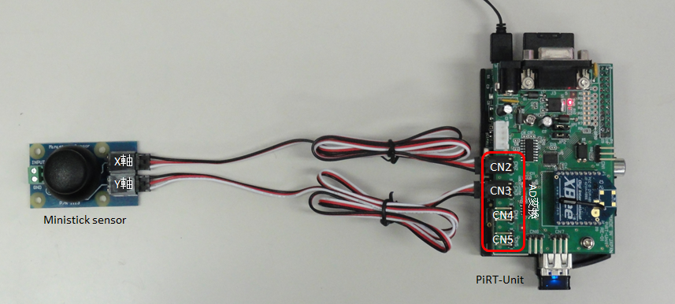</a></div>
<div align="center"><strong>Connection between the Ministick sensor and PiRT-Unit</strong></div>

The X-axis direction (horizontal direction) corresponds to AD CH0, and the Y-axis direction (vertical direction) corresponds to AD CH1.

Let's write a program in Python to read this data.

### Sample Program

```python

#!/usr/bin/env python

-- coding: euc-jp --

import sys
import time
import spidev

class ADC:
def init(self):
self.spi = spidev.SpiDev()
self.spi.open(0, 0)

def get_value(self, channel):
sned_ch = [0x00,0x08,0x10,0x18]
if ((channel > 3) or (channel < 0)):
return -1
r = self.spi.xfer2([sned_ch[channel],0,0,0])
ret = ((r[2] << 6 ) & 0x300) | ((r[2] << 6) & 0xc0) | ((r[3] >> 2) & 0x3f)
return ret

def get_voltage(self, channel):
ret = self.get_value(channel) * 5.0 / 1024
return ret

def main():
adc = ADC()
while 1:
adc1 = adc.get_value(0)
msg1 = "%1.5fV(%04x)" % ((float(adc1)*5/1024),adc1)
print msg1,

 adc1 = adc.get_value(1)
 msg1 = "%1.5fV(%04x)" % ((float(adc1)*5/1024),adc1)
 print msg1,

 adc2 = adc.get_value(2)
 msg2 = "%1.5fV(%04x)" % ((float(adc2)*5/1024),adc2)
 print msg2,

 adc3 = adc.get_value(3)
 msg3 = "%1.5fV(%04x)" % ((float(adc3)*5/1024),adc3)
 print msg3,

 sys.stdout.write("\n")
 time.sleep(0.5)

if name == 'main':
main()
```

Create a program like this. Log in to the Raspberry Pi using TeraTerm or similar software, then create and test the sample program.


```
Linux raspbian-armhf 3.2.27+ #307 PREEMPT Mon Nov 26 23:22:29 GMT 2012 armv6l

The programs included with the Debian GNU/Linux system are free software;
the exact distribution terms for each program are described in the
individual files in /usr/share/doc/*/copyright.

Debian GNU/Linux comes with ABSOLUTELY NO WARRANTY, to the extent
permitted by applicable law.
Last login: Tue May 14 07:07:04 2013 from dhcpe2078.a02.aist.go.jp
pi@raspbian-armhf ~ $ vi adc_test.py
pi@raspbian-armhf ~ $ chmod 755 adc_test.py
pi@raspbian-armhf ~ $ ./adc_test.py

```

When you run the sample program, the following screen appears. If you move the joystick, the Ch0 and Ch1 data change.

<div align="center"><a href="ministick_teraterm.png"></a></div>
<div align="center"><strong>Coordinate axes of the ministick sensor</strong></div>

You can see that the voltage value increases when the X-axis is tilted to the left and when the Y-axis is tilted upward, and decreases when tilted in the opposite directions.
The relationship of the coordinates of the ministick sensor is shown in the figure below.

<div align="center"><a href="ministick_axis_ja.png">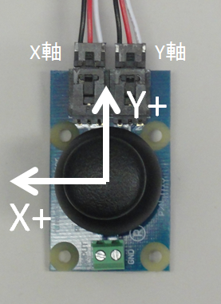</a></div>
<div align="center"><strong>Coordinate axes of the ministick sensor</strong></div>

Since the X-axis is reversed from a typical coordinate system, care must be taken when processing sensor values.

You can also see that at the center position, each indicates about half of 5.0V, or approximately 2.5V.
However, this value is not exactly 2.5V and changes depending on the conditions, so calibration may be necessary before use.

## Joystick Component Specifications

Create a joystick component using the ministick sensor.
The specifications are as follows.

<table class="table-alt">
  <tr>
    <th colspan="2" style="text-align: center;">Basic Profile</th>
  </tr>
  <tr>
    <td>Component name</td>
    <td>Ministick</td>
  </tr>
  <tr>
    <td>Module overview</td>
    <td>Phidget ministick sensor component</td>
  </tr>
  <tr>
    <td>Version</td>
    <td>1.0.0</td>
  </tr>
  <tr>
    <td>Vendor name</td>
    <td>AIST</td>
  </tr>
  <tr>
    <td>Module category</td>
    <td>Input Device</td>
  </tr>
  <tr>
    <td colspan="2" style="text-align: center;">Activities</td>
  </tr>
  <tr>
    <td colspan="2" >
    onInitialize, onFinalize, onActivated, onDeactivated, onExecute</td>
  </tr>
  <tr>
    <td colspan="2" style="text-align: center;">Data Ports</td>
  </tr>
  <tr>
    <td colspan="2" >[out] pos</td>
  </tr>
  <tr>
    <td>Overview</td>
    <td>X-Y position data of the joystick</td>
  </tr>
  <tr>
    <td>Data type</td>
    <td>TimedFloatSeq</td>
  </tr>
  <tr>
    <td>Details</td>
    <td>data[0]: x position, data[1]: y position</td>
  </tr>
  <tr>
    <td>Unit</td>
    <td>None</td>
  </tr>
  <tr>
    <td colspan="2" >[out] vel</td>
  </tr>
  <tr>
    <td>Overview</td>
    <td>Velocity vector of the mobile robot</td>
  </tr>
  <tr>
    <td>Data type</td>
    <td>TimedVelocity2D</td>
  </tr>
  <tr>
    <td>Details</td>
    <td>vx: translational velocity, vy: 0.0, va: angular velocity</td>
  </tr>
  <tr>
    <td>Unit</td>
    <td>vx [m/s], va [rad/s]</td>
  </tr>
  <tr>
    <td colspan="2" >[out] wheel_vel</td>
  </tr>
  <tr>
    <td>Overview</td>
    <td>Wheel velocity</td>
  </tr>
  <tr>
    <td>Data type</td>
    <td>TimedFloatSeq</td>
  </tr>
  <tr>
    <td>Details</td>
    <td>data[0]: left wheel angular velocity, data[1]: right wheel angular velocity</td>
  </tr>
  <tr>
    <td>Unit</td>
    <td>[rad/s]</td>
  </tr>
  <tr>
    <td colspan="2" style="text-align: center;">Configuration</td>
  </tr>
  <tr>
    <td colspan="2" >scaling</td>
  </tr>
  <tr>
    <td>Overview</td>
    <td>Scaling factor</td>
  </tr>
  <tr>
    <td>Data type</td>
    <td>double</td>
  </tr>
  <tr>
    <td>GUI control</td>
    <td>slider.0.1</td>
  </tr>
  <tr>
    <td>Constraint condition</td>
    <td>0.0<=x<=10.0</td>
  </tr>
  <tr>
    <td colspan="2" >tread</td>
  </tr>
  <tr>
    <td>Overview</td>
    <td>Tread width of the mobile robot</td>
  </tr>
  <tr>
    <td>Data type</td>
    <td>double</td>
  </tr>
  <tr>
    <td>GUI control</td>
    <td>slider.0.01</td>
  </tr>
  <tr>
    <td>Constraint condition</td>
    <td>0.0<=x<=1.0</td>
  </tr>
  <tr>
    <td colspan="2" >print_xy</td>
  </tr>
  <tr>
    <td>Overview</td>
    <td>Debug flag for printing XY data</td>
  </tr>
  <tr>
    <td>Data type</td>
    <td>string</td>
  </tr>
  <tr>
    <td>GUI control</td>
    <td>radio</td>
  </tr>
  <tr>
    <td>Constraint condition</td>
    <td>(YES,NO)</td>
  </tr>
  <tr>
    <td colspan="2" >print_vel</td>
  </tr>
  <tr>
    <td>Overview</td>
    <td>Debug print flag for vel data</td>
  </tr>
  <tr>
    <td>Data type</td>
    <td>string</td>
  </tr>
  <tr>
    <td>GUI control</td>
    <td>radio</td>
  </tr>
  <tr>
    <td>Constraint condition</td>
    <td>(YES,NO)</td>
  </tr>
  <tr>
    <td colspan="2" >print_wvel</td>
  </tr>
  <tr>
    <td>Overview</td>
    <td>Debug print flag for wheel_vel data</td>
  </tr>
  <tr>
    <td>Data type</td>
    <td>string</td>
  </tr>
  <tr>
    <td>GUI control</td>
    <td>radio</td>
  </tr>
  <tr>
    <td>Constraint condition</td>
    <td>(YES,NO)</td>
  </tr>
</table>

Following these specifications, generate the Python template code with RTCBuilder.

<div align="center"><a href="ministick_builder_basic.png">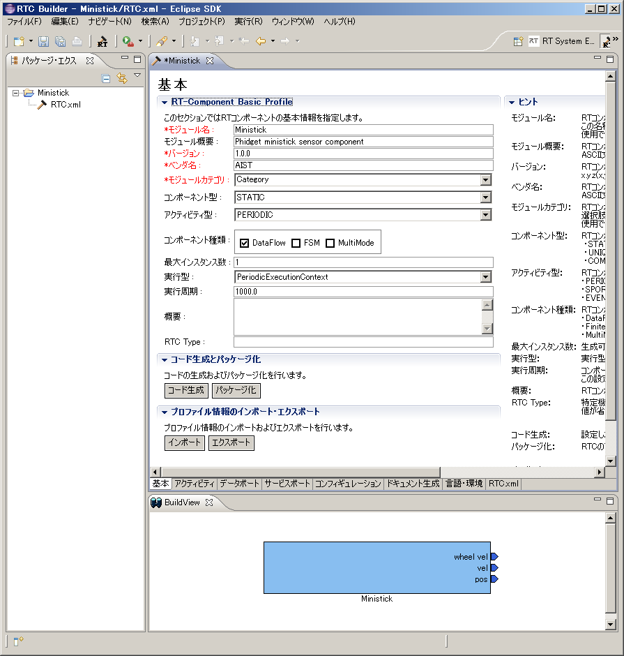</a>
<a href="ministick_builder_activity.png">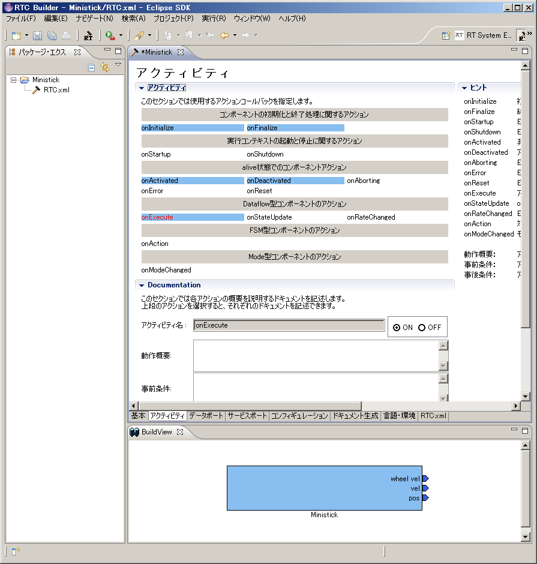</a>
<a href="ministick_builder_dataport.png">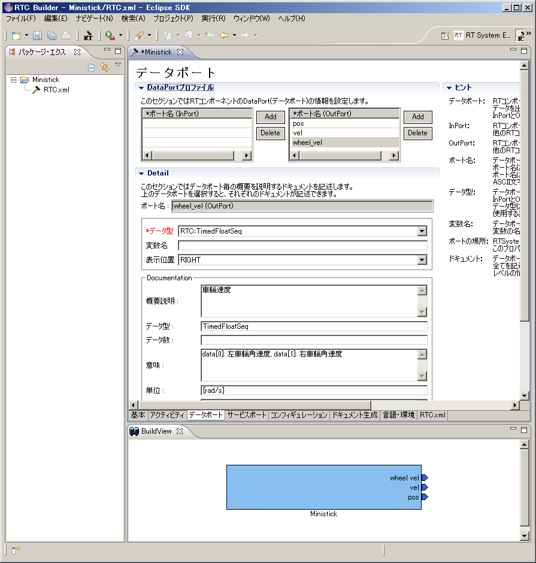</a></div>;<br>
<div align="center"><a href="ministick_builder_configuration.png">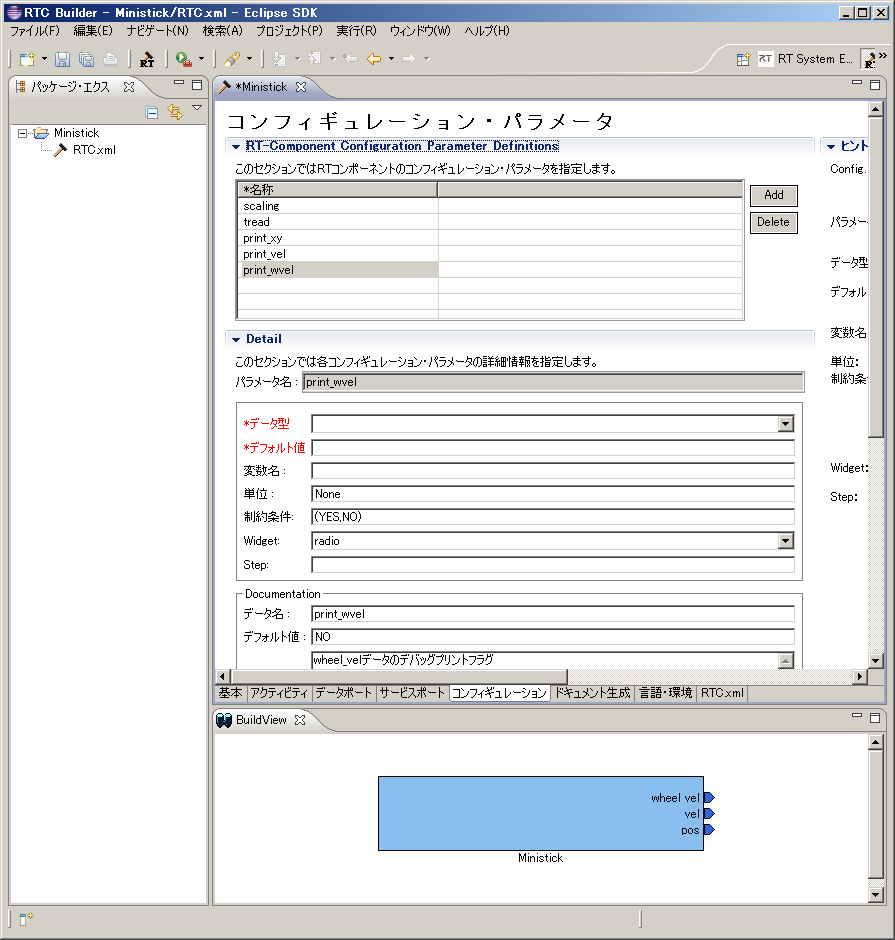</a>
<a href="ministick_builder_documentation.png">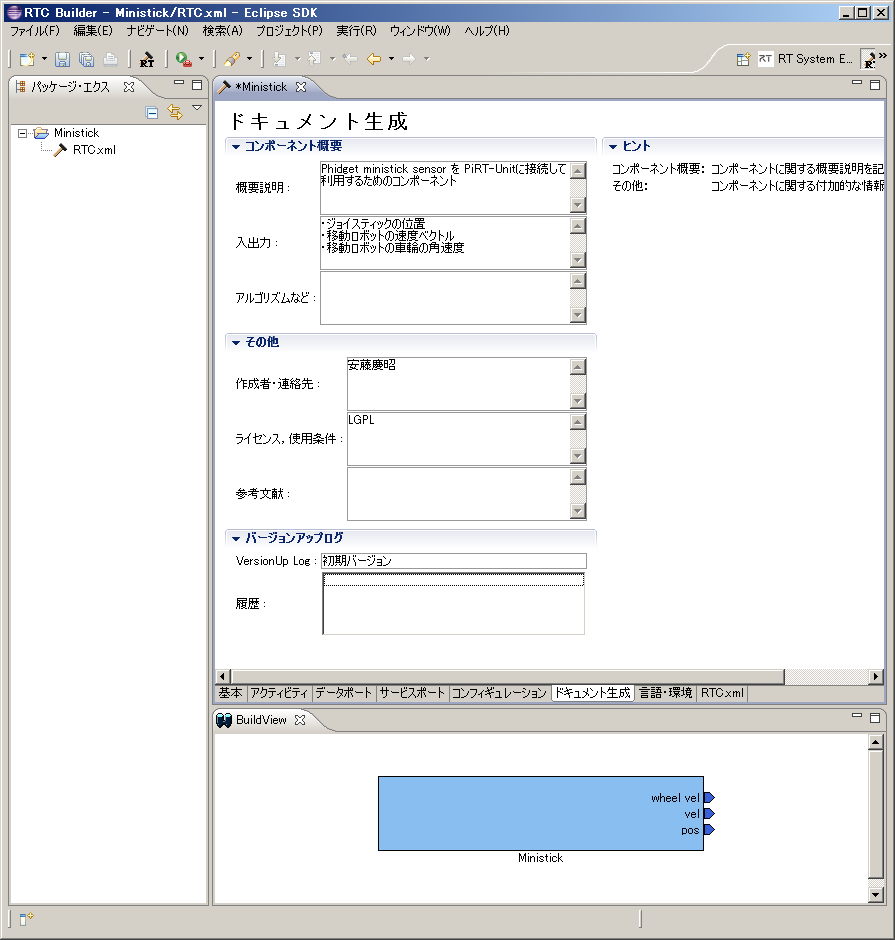</a>
<a href="ministick_builder_lang.png">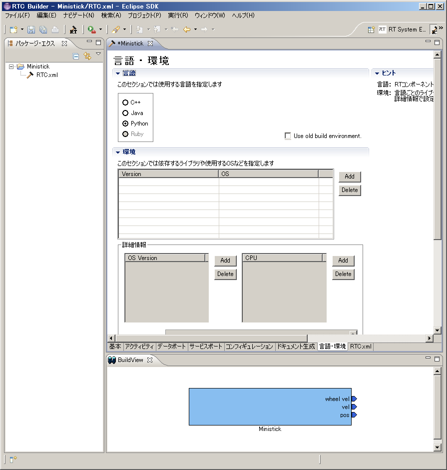</a></div>;
<div align="center"><strong>RTCBuilder configuration screens (click to enlarge)</strong></div>


## Implementation

Add functions such as ADC reading to the component.

### Initializing the SPI Module


First, create and initialize the SPI object in the component constructor.

Add a line to import spidev near the other import statements. Also import the math module because it is used for calculations and other processing.

```python
Import RTM module

import RTC
import OpenRTM_aist

import math
import spidev

```

Furthermore, in the constructor, initialize the necessary variables and create the SPI object.

```python
class Ministick(OpenRTM_aist.DataFlowComponentBase):
def init(self, manager):
OpenRTM_aist.DataFlowComponentBase.init(self, manager)

 self._scaling = [1.0]
 self._tread = [0.2]
 self._print_xy = ["NO"]
 self._print_vel = ["NO"]
 self._print_wvel = ["NO"]
 self.x = 0.0
 self.y = 0.0
 self.spi = spidev.SpiDev()
 self.spi.open(0, 0)
```


### Adding the get_adc Function

Add a function for reading data from the AD converter to the Ministick class.
Add the following function around immediately after the <u>init</u>() function.

```python

def get_adc(self, channel):
sned_ch = [0x00,0x08,0x10,0x18]
if ((channel > 3) or (channel < 0)):
return -1
r = self.spi.xfer2([sned_ch[channel],0,0,0])
ret = ((r[2] << 6 ) & 0x300) | ((r[2] << 6) & 0xc0) | ((r[3] >> 2) & 0x3f)
return ret

```


### X-Y Position to Wheel Velocity Conversion Function

Add a function that converts the X-Y position to wheel velocity to the Ministick class.

```python
dev xy_to_wvel(self, x, y):
th = math.atan2(y, x)
v = math.hypot(x, y)
vl = v * math.cos(th - (math.pi/4.0))
vr = v * math.sin(th - (math.pi/4.0))
return (vl, vr)

```


### Wheel Velocity to Velocity Vector Conversion Function

Add a function that converts wheel velocity to a velocity vector to the Ministick class.
```python
def wvel_to_vel2d(self, vl, vr):
v = (vr + vl) / 2.0
if v < 0.0:
w = - (vr - vl) / self._tread[0]
else:
w = (vr - vl) / self._tread[0]
return RTC.Velocity2D(v, 0.0, w)
```

### Calibration

When initializing the component, calibrate the neutral position of the joystick.
Read data from the AD converter about 100 times, average it, and save it as offset data.

```python
def onInitialize(self):
     : 中略
self.x_offset_v = 0.0
self.y_offset_v = 0.0
for i in range(1, 100):
  self.x_offset_v += self.get_adc(0)
  self.y_offset_v += self.get_adc(1)
self.x_offset_v = self.x_offset_v / 100.0
self.y_offset_v = self.y_offset_v / 100.0

return RTC.RTC_OK
```

### Implementing onExecute

Finally, implement the onExecute function.


```python
def onExecute(self, ec_id):
self.x = - (self.get_adc(0) - self.x_offset_v) * self._scaling[0] / 1000.0
self.y = (self.get_adc(1) - self.y_offset_v) * self._scaling[0] / 1000.0
if self._print_xy[0] != "NO":
print "(x, y) = ", self.x, self.y
self._d_pos.data = [self.x, self.y]

self._d_wvel.data = self.xy_to_wvel(self.x, self.y)
if self._print_wvel[0] != "NO":
  print "(vl, vr) = ", self._d_wvel.data[0], self._d_wvel.data[1]
self._d_vel.data = self.wvel_to_vel2d(self._d_wvel.data[0],
                                      self._d_wvel.data[1])
if self._print_vel[0] != "NO":
  print "(vx, va) = ", self._d_vel.data.vx, self._d_vel.data.va

self._posOut.write()
self._velOut.write()
self._wvelOut.write()

return RTC.RTC_OK

```

<!-- ============================================================ -->
## Test

Connect the Ministick component to various things and test it.

### Connecting to a Sample Included with OpenRTM-aist-Python

Try connecting it to TkMobileRobotCanvas.

Start TkMobileRobotCanvas from the OpenRTM-aist-Python samples installed on Windows.
At the same time, start the name service and RTSystemEditor as well.

<div align="center"><a href="tkmobilerobotcanvas.png">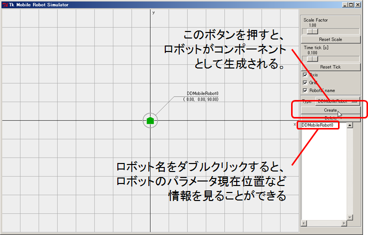</a></div>
<div align="center"><strong>Tk Mobile Robot Simulator screen</strong></div>

Press the Create button to generate one mobile robot.
One component appears in the name server, so drag and drop it onto SystemEditor.

Next, start the name server and the Ministick component on the Raspberry Pi.

```
$ rtm-naming
$ ./Ministick.py

```

When you connect to the RaspberryPi name server from RTSystemEditor, the Ministick component is visible, so drag and drop it onto SystemEditor.

Connect the port from the Ministick wvel data port to the mobile robot component generated earlier.

<div align="center"><a href="ministick_and_mobilerobot.png">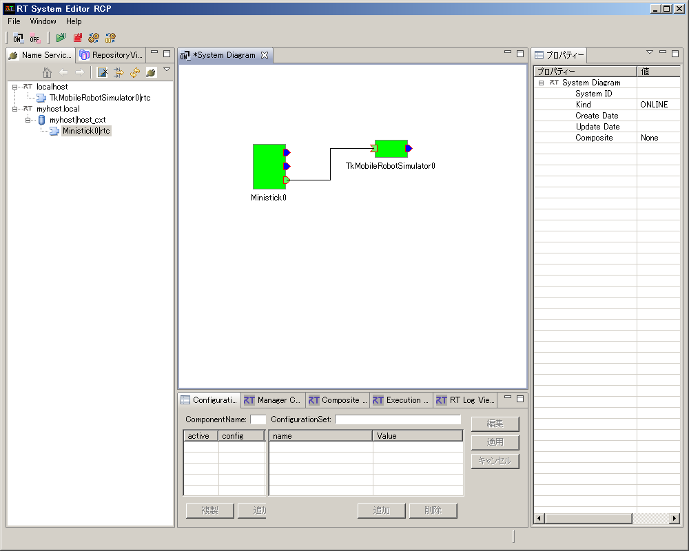</a></div>
<div align="center"><strong>Connection between Ministick and the mobile robot component</strong></div>

When activated, both components turn green and become operable.

### Connecting to Kobuki

Start the Kobuki component on the RaspberryPi according to the section on controlling Kobuki described earlier.

<!-- - [移動ロボットKobukiの制御]({{ site.baseurl }}/en/content/raspberrypi_kobuki_control)-->
- [Controlling the Kobuki Mobile Robot]({{ site.baseurl }}/en/doc/installation/other/raspberrypi_casestudy/control_mobilerobot_kobuki)

Start the Ministick component on another Raspberry Pi.

Have each component register its reference with the local name server (default), and connect to these two name servers with RTSystemEditor from another PC.
You should see the two components in the Name Service View, so connect them (Ministick vel and KobukiAIST targetVelocity). (See the figure below.)

<div align="center"><a href="ministick_and_kobuki.png">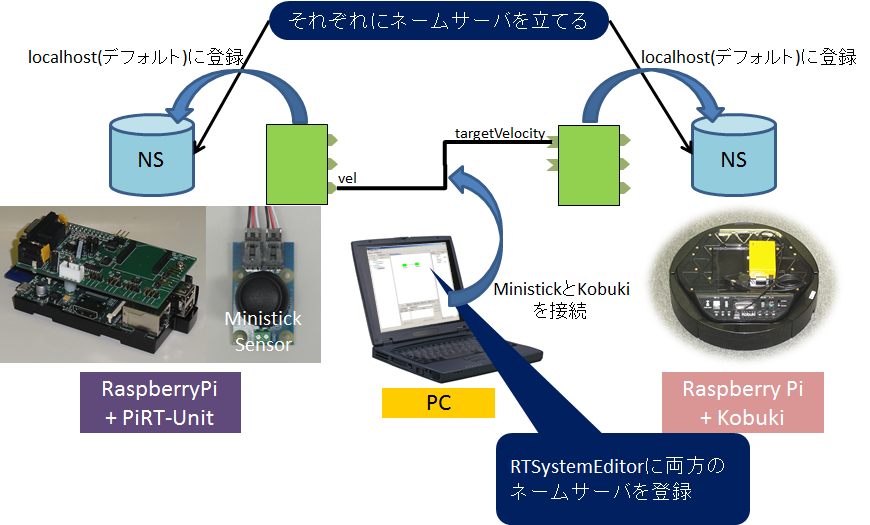</a></div>
<div align="center"><strong>Connection between Ministick RTC and KobukiAIST RTC</strong></div>

When you press the green play button (Activate All) on the RTSystemEditor menu bar, the system starts running and you can operate Kobuki with Ministick.

## Troubleshooting

### The Robot Moves Even When Ministick Is in the Neutral State

Even when Ministick is in the neutral state, the TkMobileRobot robot or Kobuki may move little by little. This is because calibration of the neutral state is not sufficient.
Improve the Ministick component to make it easier to use.

For example, if calibration is performed in onActivated, you can reset the zero point by deactivating once and then activating again.
Also, if velocity 0 is output during onDeactivated, the robot will stop safely when Jyoistick is deactivated.
Alternatively, by setting a dead zone near the zero point, you can ensure that 0 is always output in the neutral state even if the calibration is slightly off.

### Permission denied Error

A permission-related error such as the following may occur.
The udev settings described above may not have been configured correctly, so check them again.


```
pi@raspbian-armhf ~ $ ./adc_text.py
Traceback (most recent call last):
File "./adc_text.py", line 47, in <module>
main()
File "./adc_text.py", line 25, in main
adc = ADC()
File "./adc_text.py", line 10, in init
self.spi.open(0, 0)
IOError: [Errno 13] Permission denied
```

It can also be run using sudo.
