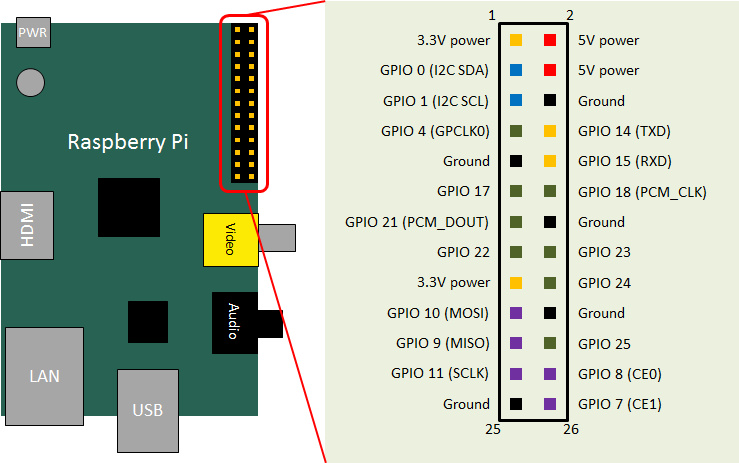
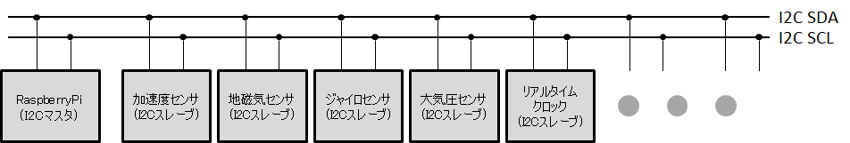
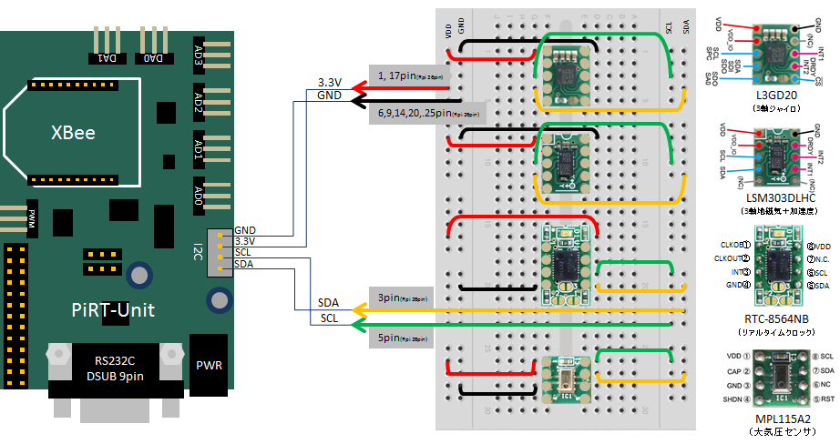
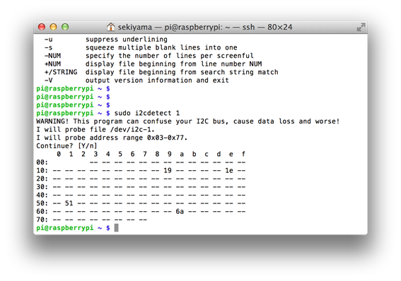
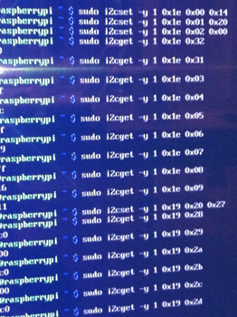

<!-- Title: PiRT-UnitによるI2Cデバイスの利用 -->
#contents

## Introduction

By using the I2C pins (2 pins) among the GPIO pins on the Raspberry Pi, multiple I2C devices can be operated.
This section describes the setup for using I2C, actual examples of programming in C, and hints for converting them into RT components.

### Requirements

- A Raspberry Pi with the C++ version of OpenRTM-aist installed
- Materials for wiring I2C devices (breadboard, cables, resistors, etc.)
- I2C devices (available from Akizuki, Strawberry Linux, Switch Science, etc.)
- Network connection (Internet, for apt-get)

In this document, the following I2C devices are covered:
- [LSM303DLHC (3-axis geomagnetic + acceleration sensor)](http://strawberry-linux.com/catalog/items?code=12114)
- [L3GD20 (3-axis gyro sensor)](http://strawberry-linux.com/catalog/items?code=12120)
- [RTC-8564NB (real-time clock)](http://akizukidenshi.com/catalog/g/gI-00233/)
- [MPL115A2 (barometric pressure sensor)](http://strawberry-linux.com/catalog/items?code=12103)

## What Is I2C (I-Squared-C)?

I2C is a type of serial bus communication that uses two wires. By using the edges of the clock line, values are exchanged on the data line, and multiple devices on the bus can be controlled.
There are masters and slaves on the bus, and although the standard appears to allow multiple masters/slaves, in practice it is easy to use a single master with multiple slaves.
When using it from a microcontroller or similar device, it is necessary to implement it while considering the transmission of clock signals by the master and the implementation of the data communication protocol. However, by using Raspberry Pi, existing libraries can be used to operate I2C devices very easily.

Among the GPIO ports (26 pins) of the Raspberry Pi, there are two GPIO pins that are originally configured specifically for I2C communication. (See the figure below.)
GPIO 0 is preconfigured as the I2C data port, and GPIO 1 is preconfigured as the I2C clock port. By using these, I2C communication can be performed easily.

<div align="center"><a href="raspberry_gpio.png"></a></div>
<div align="center"><strong>Raspberry Pi GPIO ports, GPIO0 (I2C SDA), GPIO1 (I2C SCL)</strong></div>

By simply connecting I2C devices directly using these two ports, the clock line drive, interpretation of the communication protocol, and other processing are all handled by Linux on the Raspberry Pi.
Users can acquire data from devices and output data to devices by reading from and writing to device files (/dev/i2c-*).

Multiple devices can be connected using a bus connection (figure below).
Arbitration between devices is also handled to some extent on the Raspberry Pi side.
Note that the GPIO 0 and GPIO 1 ports above are pulled up by pull-up resistors on the Raspberry Pi board, so no additional pull-up is required.

<div align="center"><a href="i2c_devices.png"></a></div>
<div align="center"><strong>I2C bus connection</strong></div>

## Preparation

### System Settings

To use I2C communication on Raspberry Pi, several configuration files must be changed.
Edit the files with root privileges.

#### Editing /etc/modules
Add the following line to /etc/modules.

```
 i2c-dev
```

This enables /dev/i2c-*.

#### Editing /etc/modprobe.d/raspi-blacklist.conf

Comment out the following line in /etc/modprobe.d/raspi-blacklist.conf.

```
 # blacklist i2c-bcm2708
```


After completing the above changes, reboot to apply the changes.

### Installing i2c-tools

i2c-tools is a set of tools for accessing I2C devices from the command line.
During actual development, you will often want to check the operation of I2C devices from the command line, so install i2c-tools in advance.

```
 sudo apt-get install i2c-tools
```

Install it as shown above.

## Wiring

In the block diagram above, only the two SDA and SCL lines were wired for the I2C devices, but in practice it is of course necessary to supply power to each device.
For I2C devices that do not consume much power, the power supplied from pins 2 and 3 (5V) and pins 1 and 17 (3.3V) of the 26-pin GPIO pin header on the Raspberry Pi can be used.
After referring to the manual or datasheet of the I2C device, supply the appropriate power, either 5V or 3.3V.
PiRT-Unit also includes a 4-pin connector for I2C, allowing SDA, SCL, 3.3V, and GND to be wired.

Since all I2C devices used here operate at 3.3V, power is supplied to each device from pins 1 and 17 (3.3V) of the Raspberry Pi.
The wiring diagram below shows the four devices above placed on a breadboard.

<div align="center"><a href="i2c_devices_circuit.png"></a></div>
<div align="center"><strong>Connection between I2C devices and RaspberryPi</strong></div>

When wiring, carefully read the manual/datasheet of each device and make sure there are no mistakes. If the wiring is incorrect, the device may not only fail to be recognized, but in some cases the device may also be damaged.

Depending on the type of device, jumpers may be required as appropriate depending on the usage, or interrupt and reset signals may be required in addition to the two I2C signal lines. In such cases, it is necessary to use the Raspberry Pi GPIO pins as appropriate and control them from the program.

## Operation Check

### Checking Device Addresses

After completing the wiring above, you can operate the devices from the Raspberry Pi using i2c-tools.
First, use the **i2cdetect** command to check the addresses of all devices connected to the I2C bus. If you type the following, a display like the figure below appears.

```
 $ sudo i2cdetect 1
```


<div align="center"><a href="i2c_i2ctools_i2cdetect.png"></a></div>
<div align="center"><strong>Connection between I2C devices and RaspberryPi</strong></div>

In the figure, you can confirm that four devices are present. Hexadecimal numbers are displayed in places other than **- (minus)**, and each represents the address of each device. The details are as follows.

- 0x19: LSM303DLHC acceleration sensor
- 0x1e: LSM303DLHC geomagnetic sensor
- 0x51: RTC-8564NB (real-time clock)
- 0x6a: L3GD20 (gyro sensor)

By comparing this command with the manual/datasheet of each device, you can confirm whether the Raspberry Pi is able to recognize the I2C devices.
Note that depending on the revision of the Raspberry Pi, the bus number entered after the command may be either 0 or 1.

### Device Control Test

Use the **i2cset** command to actually write data to the device, and the **i2cget** command to read data from the device. (See the figure below.)

<div align="center"><a href="i2c_i2ctest.png"></a></div>
<div align="center"><strong>State of I2C device control using the i2ctest command</strong></div>

```
 // LSM303DLHCの地磁気センサーへアクセス
 $ sudo i2cset -y 1 0x1e 0x00 0x14
 $ sudo i2cset -y 1 0x1e 0x01 0x20
 $ sudo i2cset -y 1 0x1e 0x02 0x00
 $ sudo i2cget -y 1 0x1e 0x32
 $ sudo i2cget -y 1 0x1e 0x31
 $ sudo i2cget -y 1 0x1e 0x03
 $ sudo i2cget -y 1 0x1e 0x04
 $ sudo i2cget -y 1 0x1e 0x05
 $ sudo i2cget -y 1 0x1e 0x06
 $ sudo i2cget -y 1 0x1e 0x07
 $ sudo i2cget -y 1 0x1e 0x08
 $ sudo i2cget -y 1 0x1e 0x09
 // LSM303DLHCの加速度センサーへアクセス
 $ sudo i2cset -y 1 0x19 0x20 0x27
 $ sudo i2cget -y 1 0x19 0x28
 $ sudo i2cget -y 1 0x19 0x29
 $ sudo i2cget -y 1 0x19 0x2a
 $ sudo i2cget -y 1 0x1e 0x2b
 $ sudo i2cget -y 1 0x1e 0x2c
 $ sudo i2cget -y 1 0x1e 0x2d
```

In this example, according to the LSM303DLHC manual, first, to operate the geomagnetic sensor, the specified values are written to internal registers 0x00 to 0x02 of the device at address 0x1e, and internal registers 0x31 to 32 and 0x03 to 0x09 are read.
After that, to operate the acceleration sensor of the LSM303DLHC, the specified value is written to internal register 0x20 of the device at address 0x19, and the values from 0x28 to 0x2d are read.

Note that the i2c-tools commands can only be executed with root privileges, so you need to use sudo or become root with sudo bash before executing them.


## Device Operation in C

To access these devices from a program, open the device file (/dev/i2c-0 or /dev/i2c-1) and read from or write to it to operate the device registers and read values.

However, depending on the type of I2C device, some devices have a specific initialization sequence, or require a certain procedure for reading and writing device data. It is necessary to create programs while checking the manual or datasheet of each device.
(There appears to be various information on the Internet about how to control I2C devices from RaspberryPi, AVR microcontrollers, Arduino, and so on, so please refer to those as well.)

The following is a sample program using the L3GD20 digital 3-axis gyro sensor module.

This module is a sensor module that can communicate via I2C and SPI. When used as an I2C device, the address can be selected from two types: 0x6a and 0x6b. Here, it is used with the address set to 0x6a.

The internal registers are as follows:
<table class="table-alt">
  <tr>
    <th>0x0f</th>
    <th>Always outputs 0xd4</th>
  </tr>
  <tr>
    <td>0x20</td>
    <td>Starts operation by writing 0x0f</td>
  </tr>
  <tr>
    <td>0x28-2d</td>
    <td>Stores 3-axis gyro data</td>
  </tr>
</table>

In addition, settings such as detection range and sampling rate are also possible, but they are not covered here.

### Program

The program is shown below.
It can also be downloaded from here. In addition, a data acquisition component and a display component, created by converting I2C sensors into RT components, are also provided as samples.

- Gyro L3GD20 test program: [i2c_gyrotest.c](i2c_gyrotest.c)
- I2C sensor data acquisition component: [Pi_I2CSensor.zip](Pi_I2CSensor.zip)
- I2C sensor display component: [Pi_SensorDataOutPut.zip](Pi_SensorDataOutPut.zip)


```
 #include <stdio.h>
 #include <stdlib.h>
 #include <time.h>
 #include <unistd.h>
 
 #include <linux/i2c-dev.h> // I2C用インクルード
 #include <fcntl.h>
 #include <sys/ioctl.h>
 
 #include <wiringPi.h> // delay関数用にインクルード
 
 // プロトタイプ宣言
 void L3GD20_readData(int *gyrodata, int fd);
 void L3GD20_write(unsigned char address, unsigned char data, int fd);
 unsigned char L3GD20_read(unsigned char address, int fd);
 void L3GD20_init(int fd);
 
 int main(int argc, char **argv)
 {
 	int i2c_fd;       // デバイスファイル用ファイルディスクリプタ
    // char *i2cFileName = "/dev/i2c-0"; // I2Cデバイスファイル名
 	char *i2cFileName = "/dev/i2c-1"; // RaspberryPiのリビジョンに合わせて変更
 	int i2cAddress = 0x6a;   // L3GD20のI2Cアドレス
 	int gyroData[3]; // ジャイロ3軸（x,y,z）データ格納用
 	
 	printf("i2c Gyro(L3GD20) test program\n");
 	delay(500);
    // I2Cデバイスファイルをオープン
 	if ((i2c_fd = open(i2cFileName, O_RDWR)) < 0) 
 	{
 		printf("Faild to open i2c port\n");
 		exit(1);
 	}
 	// L3GD20用にセット
 	if (ioctl(i2c_fd, I2C_SLAVE, i2cAddress) < 0) 
 	{
 		printf("Unable to get bus access to talk to slave\n");
 		exit(1);
 	}
 	//デバイス初期化
 	L3GD20_init(i2c_fd);
 	
 	// 1秒ごとに20回ジャイロデータを取得、表示
 	int i;
 	for(i=0; i<20; i++){
 		// デバイスからデータ取得
 		L3GD20_readData(gyroData, rtc); 
 		// 取得したデータを校正して表示、1秒待ち
 		printf("x, y, z : %5.2f, %5.2f, %5.2f\n",
               (float)gyroData[0]*0.00875,(float)gyroData[1]*0.00875,
               (float)gyroData[2]*0.00875);
 		delay(1000); 
 	}
 	return;
 }
 
 // L3GD20用 1バイト書き込みルーチン：addressで示すレジスタにdataを書き込む
 void L3GD20_write(unsigned char address, unsigned char data, int fd)
 {
 	unsigned char buf[2];
 	buf[0] = address;
 	buf[1] = data;
    if((write(fd,buf,2))!=2){
 		printf("Error writing to i2c slave\n");
 		exit(1);
    }
 	return;
 }
   
 // L3GD20用 1バイト読み出しルーチン： addressで示すレジスタの値を読み出す
 // 戻り値がレジスタ値
 unsigned char L3GD20_read(unsigned char address, int fd)
 {
 	unsigned char buf[1];
 	buf[0] = address;
 	if((write(fd,buf,1))!= 1){ // addressを一度書き込む所に注意
 		printf("Error writing to i2c slave\n");
 		exit(1);}
 	if(read(fd,buf,1)!=1){
 		printf("Error reading from i2c slave\n");
 		exit(1);}
 	return buf[0];
 }
 
 // L3GD20用 ジャイロデータ読み出しルーチン：
 // 整数値配列へのポインタを使ってデータを受け渡す
 void L3GD20_readData(int *gyrodata, int fd)
 {
 	unsigned char data[6];
 	// センサから3軸に対して2バイトずつデータを読み出す
 	int i;
 	for(i=0; i<6; i++){
 		data[i]=L3GD20_read(0x28+i,fd);
 	}
 	// 各数値を32bit幅の整数に整形する
 	// センサの数値精度が16bit・2の補数表現での出力のため、シフトで加工
 	gyrodata[0]=((int)data[1]<<24|(int)data[0]<<16)>>16;
 	gyrodata[1]=((int)data[3]<<24|(int)data[2]<<16)>>16;
 	gyrodata[2]=((int)data[5]<<24|(int)data[4]<<16)>>16;
 	return;
 }
 
 // L3GD20用 ジャイロデータイニシャライズルーチン
 void L3GD20_init(int fd)
 {
 	unsigned char Data;
 	printf("L3GD20 init seq. start\n");
 	// L3GD20 動作確認
 	// L3GD20の0x0fレジスタは常に0xd4にセットされているため動作確認ができる
 	Data = L3GD20_read(0x0f,fd);
 	if(Data != 0xd4){
 		printf("L3GD20 is not working\n");
 		exit(1);}
 	delay(10);
 	// レジスタへの書き込みチェックとイニシャライズを同時に行う
 	printf("read OK, Now writing check...\n");
 	// 0x20レジスタに0x0fを書き込むことで動作させる
 	L3GD20_write(0x20, 0x0f, fd);
 	// 0x20レジスタに実際に0x0fが書かれたか確認
 	Data = L3GD20_read(0x20,fd); if(Data != 0x0f){
 		printf("Writing miss\n");
 		exit(1);
 	} 
 	printf("Writing OK\n");
 	delay(10); 	
 	return;
 }
```


## Hints for Creating an RT Component

A program that accesses I2C devices on RaspberryPi can be written as described above. When converting the above code into an RT component, for example, implement the initialization part in **onInitialize** or **onActivated** of the RT component, implement the routine that acquires and displays data from the device in **onExecute**, and output it from an OutPort. This creates a component that outputs sensor data.

The period of the execution context needs to be determined based on the speed of the I2C device and bus, the number of I2C devices connected to the bus, and the sampling rate of each I2C device.

When converting multiple I2C-connected devices into components, it is necessary to consider the scheduling of data reading and writing between each device.
Possible implementation methods include:
- Handling all I2C devices as a single component
- Leaving access to the I2C bus to a single component and acquiring data from individual devices via port communication
- Implementing exclusive control such as locks using shared objects
and so on. Since each has its advantages and disadvantages, it is advisable to choose according to the situation.

