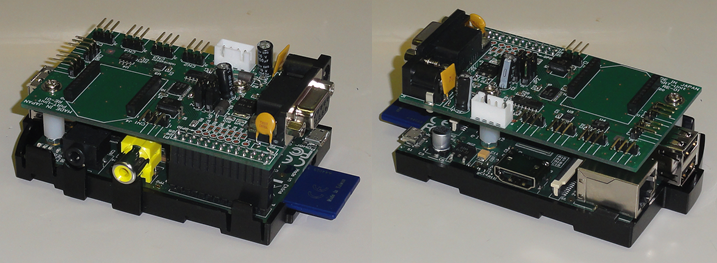
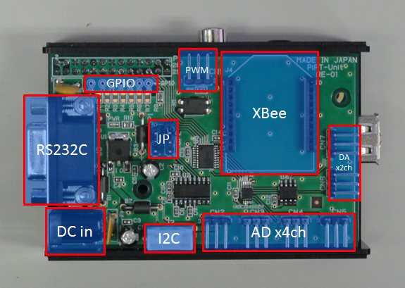
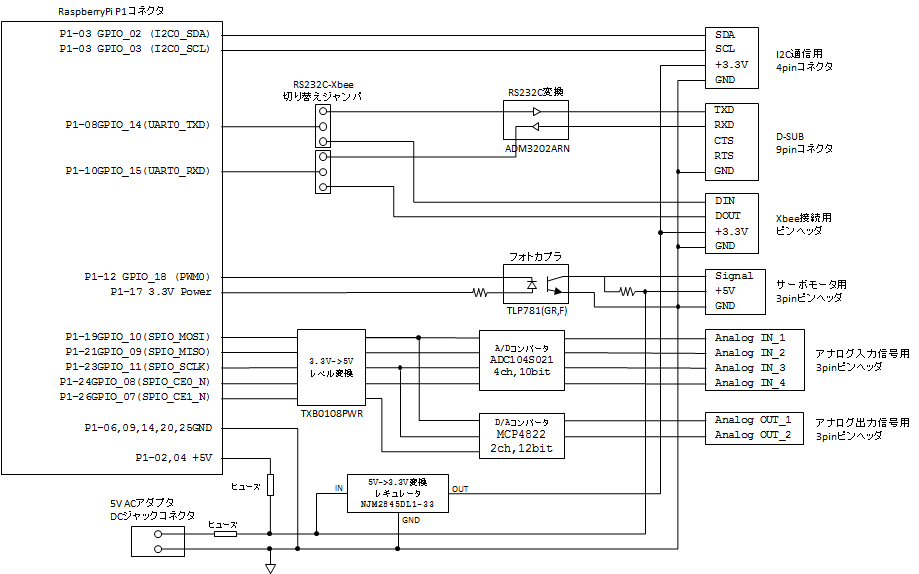

<!-- Title: PiRT-Unitを利用したIOプログラミング -->
#contents

この Book では、Raspberry Pi と PiRT-Unit を組み合わせてOpenRTM-aist から利用する方法を解説します。

## PiRT-Unit を利用する

PiRT-Unit は産総研で開発された、Raspberry Pi用 IO拡張ボードです。
ウィン電子工業から発売中です。

<!-- ウィン電子工業から購入することができます。 -->

- ウィン電子工業:  http://win-ei.com/
  - ラズベリーパイ拡張ボード: http://cgi3.win-ei.com/wordpress/?page_id=135
    - 品名：Pi RT-Unit
    - 型名：RE-01
    - 価格：\6,615（税込）

#clear

<strong>PiRT-Unit概観</strong>

PiRT-Unit からは、AD (4ch)、DA (2ch)、PWM (1ch)、I2C (1ch)、RS232C/XBee (1ch) がそれぞれ利用できます。

<strong>PiRT-Unit 入出力コネクタ配置図</strong>

### 特長

- アナログ入力 (10bit ADC x 4ch) 利用可能
- アナログ出力 (12bit DAC x 2ch) 利用可能
- PWM x1ch: RCサーボモーター利用可能
- I2C シリアル通信利用可能
- RS232C Dsub コネクタ利用可能
- Xbee接続用コネクタ利用可能（上記 RS232C との選択式）
- 5V DC入力： Raspberry Pi に電源供給可能
  - 秋月電子等で安価に購入可能な ACアダプタを利用できます

### 仕様

<table class="table-alt">
  <tr>
    <th colspan="2" style="text-align: center;">Raspberry Pi拡張IOボード</th>
  </tr>
  <tr>
    <td>ADコンバータ</td>
    <td>10bit, 4ch   チップ: ADC104S021   サンプリング 200kHz</td>
  </tr>
  <tr>
    <td>DAコンバータ</td>
    <td>12bit, 2ch   チップ MCP4822</td>
  </tr>
  <tr>
    <td>PWM出力</td>
    <td>1ch, RCサーボモータードライブ用   フォトカプラ絶縁</td>
  </tr>
  <tr>
    <td>RS232C</td>
    <td>D-SUB 9pinコネクタ   XBee とジャンパにて切り替え</td>
  </tr>
  <tr>
    <td>XBee</td>
    <td>XBee接続コネクタ   XBee: Digi International 製 Zigbeeモジュール   XBee とジャンパにて切り替え</td>
  </tr>
  <tr>
    <td>電源入力</td>
    <td>5V DC入力   Raspberry Piに電源供給可能   Raspberry Piからの電源供給でも動作</td>
  </tr>
</table>

<strong>PiRT-Unit 回路ブロック図</strong>

- [PiRT-Unitのためのシステム設定](./system_setting_pirt-unit)
- [IOのテスト](./io_test)
- [Ministickコンポーネントの作成](./create_ministick_comp)
- [PiRT-UnitによるXBeeモジュールの利用](./xbee_use_pirt-unit)
- [PiRT-UnitによるI2Cデバイスの利用](./i2c_device_use_pirt-unit)

