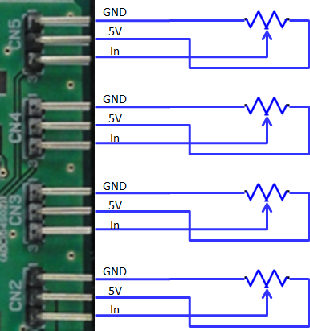
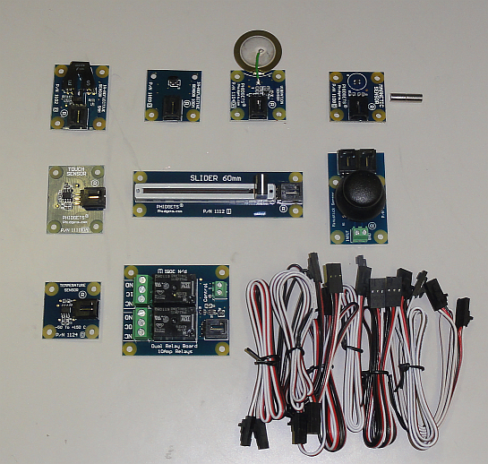
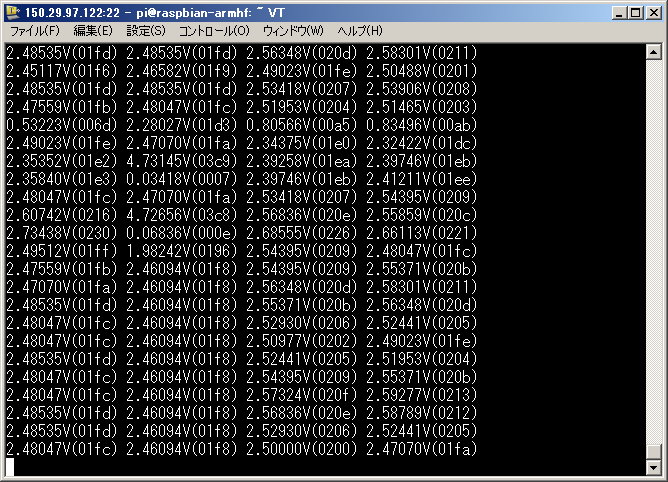

<!-- Title: IOのテスト -->
#contents

Here, we will briefly test each input and output of PiRT-Unit.

## AD Converter Test

CN2-CN5 on PiRT-Unit are the AD converter pins.
The pin assignment is shown in the figure below. By applying a voltage divided between GND and 5V to the input pin, sensor values and other data can be read.

<div align="center"><a href="adc_circuit.png"></a></div>
<div align="center"><strong>AD Converter and Connection Circuit</strong></div>

The easiest way to test the AD converter is to connect a Phidgets sensor.
Phidgets are IO expansion boards and sensor products sold by Phidgets Inc.
In Japan, they can be purchased from Plat'Home and other suppliers.

- Phidgets Inc.: http://www.phidgets.com/
- Plat'Home: http://online.plathome.co.jp/

This is a kit that allows you to connect a USB-connected expansion IO board to a PC, add various sensors and actuator units, and perform measurement and control from programs and other software.

When connecting to a PC, an Interface Kit is required, but when using it only with PiRT-Unit, the Sensor Kit alone should be sufficient.

- [Phidget Interface Kit #1](http://online.plathome.co.jp/item/detail/41595459/Phidgets/Phidget-Interface-Kit-Package--1/2005_1)
- [Phidget Interface Kit #2](http://online.plathome.co.jp/item/detail/41595460/Phidgets/Phidget-Interface-Kit-Package--2/2006_1)
- [Phidget Sensor Kit #1](http://online.plathome.co.jp/item/detail/41595256/Phidgets/Phidget-Sensor-Kit--1/42000_1)
- [Phidget Sensor Kit #2](http://online.plathome.co.jp/item/detail/41595257/Phidgets/Phidget-Sensor-Kit--2/42001_0)

<div align="center"><a href="phidget_sensorkit2.png"></a></div>
<div align="center"><strong>Phidget Sensor Kit #2</strong></div>

The AD pins of PIRT-Unit have a pin assignment that allows Phidget sensors to be connected, making it easy to expand by connecting Phidget devices.

### Sample Program

adc_test.py

```python
#!/usr/bin/env python

-- coding: euc-jp --

import sys
import time
import spidev

class ADC:
def init(self):
self.spi = spidev.SpiDev()
self.spi.open(0, 0)

def get_value(self, channel):
sned_ch = [0x00,0x08,0x10,0x18]
if ((channel > 3) or (channel < 0)):
return -1
r = self.spi.xfer2([sned_ch[channel],0,0,0])
ret = ((r[2] << 6 ) & 0x300) | ((r[2] << 6) & 0xc0) | ((r[3] >> 2) & 0x3f)
return ret

def get_voltage(self, channel):
ret = self.get_value(channel) * 5.0 / 1024
return ret

def main():
adc = ADC()
while 1:
adc1 = adc.get_value(0)
msg1 = "%1.5fV(%04x)" % ((float(adc1)*5/1024),adc1)
print msg1,

 adc1 = adc.get_value(1)
 msg1 = "%1.5fV(%04x)" % ((float(adc1)*5/1024),adc1)
 print msg1,

 adc2 = adc.get_value(2)
 msg2 = "%1.5fV(%04x)" % ((float(adc2)*5/1024),adc2)
 print msg2,

 adc3 = adc.get_value(3)
 msg3 = "%1.5fV(%04x)" % ((float(adc3)*5/1024),adc3)
 print msg3,

 sys.stdout.write("\n")
 time.sleep(0.5)

if name == 'main':
main()

```


### Test

Connect an appropriate variable resistor or Phidget sensor to the AD converter pin, then run adc_test.py. The sensor values can be read as shown in the figure below.

<div align="center"><a href="ministick_teraterm.png"></a></div>
<div align="center"><strong>Reading the AD converter with adc_test.py</strong></div>


## DA Converter Test

dac_test.py

```python

#!/usr/bin/env python

-- coding: euc-jp --

import spidev
from time import sleep

spi = spidev.SpiDev()
spi.open(0,1)

def changeLevel(ch, onOff, percent):
bit7 = ch << 7
bit6 = 0 << 6
bit5 = 1 << 5
bit4 = onOff << 4
size=12
number=(2**size-1)*percent/100
number= number<<(12-size)
number= number<<(12-size)
bottomPart= number % 256
topPart=(number-bottomPart)>>8
firstByte=bit7+bit6+bit5+bit4+topPart
secondByte=bottomPart
return spi.xfer2([firstByte,secondByte])

def which_channel():
channel = raw_input("Which channel do you want to test? Type 0 or 1.\n")
while not channel.isdigit():
channel = raw_input("Try again - just numbers 0 or 1 please!\n")
return channel

def main():
channel = 3
while not (channel == 1 or channel == 0):
channel = int(which_channel())

print "These are the connections for the digital to analogue test:"
print "jumper connecting GP11 to SCLK"
print "jumper connecting GP10 to MOSI"
print "jumper connecting GP9 to MISO"
print "jumper connecting GP7 to CSnB"
print "Multimeter connections (set your meter to read V DC):"
print " connect black probe to GND"
print " connect red probe to DA%d on J29" % channel

raw_input("When ready hit enter.\n")
percent=[0,25,75,100]

for p in percent:
r = changeLevel(channel,1,p)
print "Your meter should read about {0:.2f}V".format(p*2.048/100.0)
raw_input("When ready hit enter.\n")

r = changeLevel(0,0,0)
r = changeLevel(1,0,0)

if name == 'main':
main()

```

## I2C Test

i2c_test.py

```python

#!/usr/bin/env python

-- coding: euc-jp --

import smbus
import time

def main():

LCD initialize

i2c = smbus.SMBus(1)
addr = 0x3e
contrast = 42 # 0-63
i2c.write_byte_data(addr, 0, 0x38) # function set(IS=0)
i2c.write_byte_data(addr, 0, 0x39) # function set(IS=1)
i2c.write_byte_data(addr, 0, 0x14) # internal osc
i2c.write_byte_data(addr, 0,(0x70 | (contrast & 0x0f))) # contrast
i2c.write_byte_data(addr, 0,(0x54 | ((contrast >> 4) & 0x03))) # contrast/icon/power
i2c.write_byte_data(addr, 0, 0x6c) # follower control
time.sleep(0.2)
i2c.write_byte_data(addr, 0, 0x38) # function set(IS=0)
i2c.write_byte_data(addr, 0, 0x0C) # Display On
i2c.write_byte_data(addr, 0, 0x01) # Clear Display
i2c.write_byte_data(addr, 0, 0x06) # Entry Mode Set
time.sleep(0.2)

LCD Clear

i2c.write_byte_data(addr, 0, 0x38) # function set(IS=0)
i2c.write_byte_data(addr, 0, 0x0C) # Display On
i2c.write_byte_data(addr, 0, 0x01) # Clear Display
i2c.write_byte_data(addr, 0, 0x06) # Entry Mode Set
time.sleep(0.2)

Send to LCD

line1 = 'test'
for c in line1:
i2c.write_byte_data(addr, 0x40, ord(c))
i2c.write_byte_data(addr, 0, 0xc0) # 2nd line
line2 = '!(^^)!'
for c in line2:
i2c.write_byte_data(addr, 0x40, ord(c))

if name == 'main':
main()
```

## PWM Test
## XBee Test
