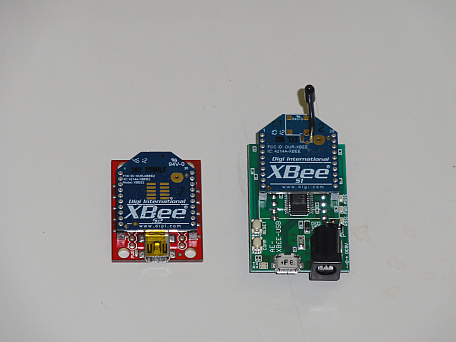
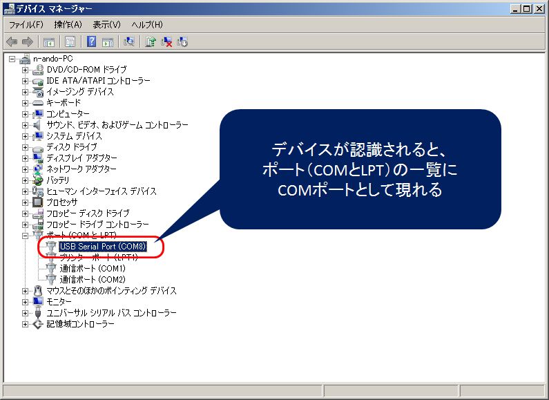
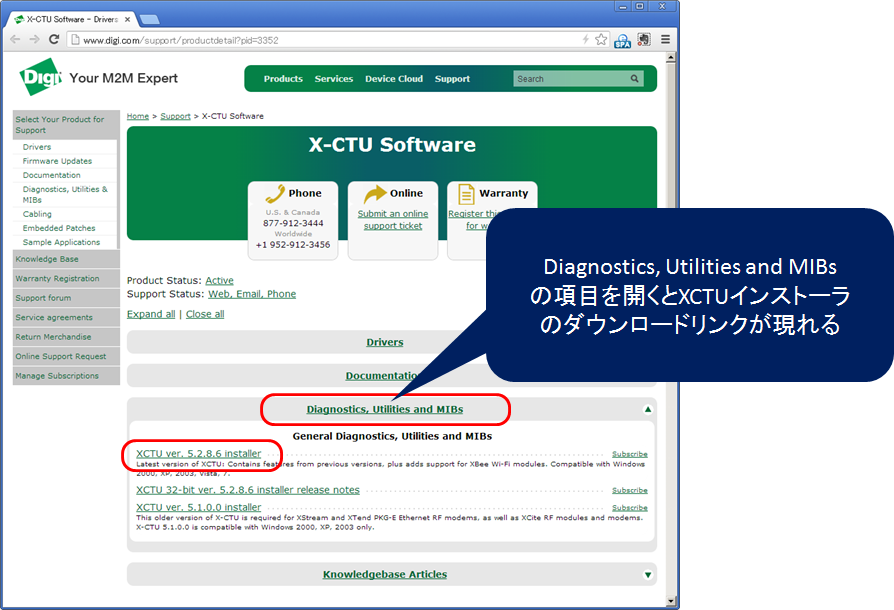
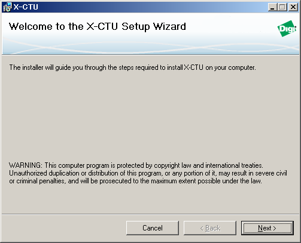
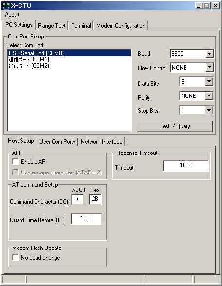
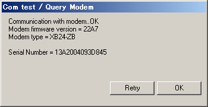
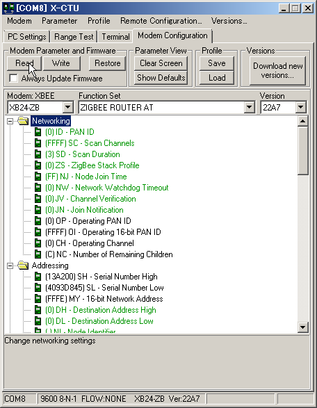
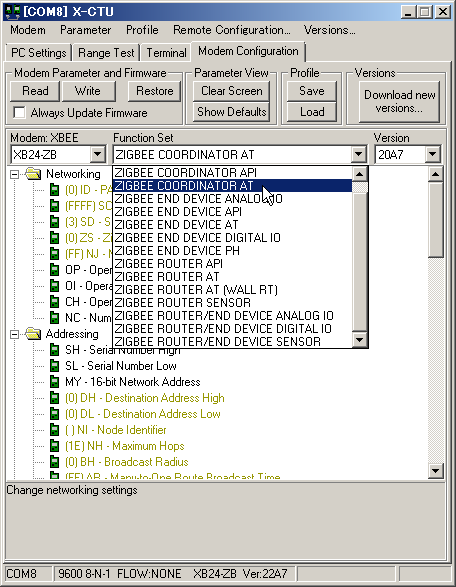
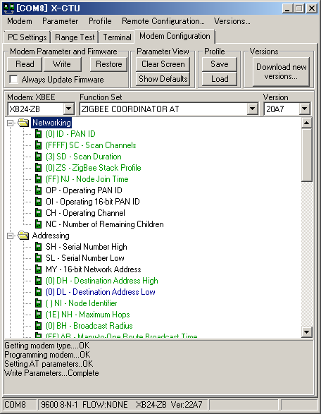

<!-- Title: PiRT-UnitによるXBeeモジュールの利用 -->
#contents

## PiRT-UnitによるXBeeモジュールの利用

PiRT-UnitにはZigBeeモジュールXBeeを接続するためのコネクタがあります。
RaspberryPiからシリアルデバイス経由で利用して、他のZigBeeモジュールとの通信に利用したり、シリアルコンソールを無線化するのにも利用できます。
Raspbian Wheesyではデフォルトでシリアルコンソールに設定されています。
この解説では、シリアルコンソールをXBeeで無線化する方法を説明します。

### XBeeとPCの接続

XBeeモジュールとPCを接続するにはXBee-USBエクスプローラを利用する必要があります。
XBeeモジュール接続コネクタとUSBコネクタがついており、PCに接続してPCからXBeeの各種設定を行ったり、XBeeをシリアルポートとして利用することができます。

XBee-USBエクスプローラは、様々なメーカーから発売されています。

<table class="table-alt">
  <tr>
    <th>商品名</th>
    <th>メーカー</th>
    <th>価格</th>
    <th>URL</th>
  </tr>
  <tr>
    <td>AE-XBEE-USB</td>
    <td>秋月電子通商</td>
    <td>1,280円</td>
    <td>http://akizukidenshi.com/catalog/g/gK-06188/</td>
  </tr>
  <tr>
    <td>SFE-WRL-08687</td>
    <td>Sparkfun   Switch Science</td>
    <td>2,619 円</td>
    <td>http://www.switch-science.com/catalog/30/   http://strawberry-linux.com/catalog/items?code=18128 でも入手可能</td>
  </tr>
  <tr>
    <td>SFE-WRL-09819</td>
    <td>Sparkfun   Switch Science</td>
    <td>2,619 円</td>
    <td>http://www.switch-science.com/catalog/344/</td>
  </tr>
</table>

<strong>XBee-USBエクスプローラ (Sparkfun(左), 秋月電子通商(右))</strong>

#### デバイスマネージャを開く (Windows)

デバイスマネージャを開いてください。
Windows7では、**「コントロールパネル」→「システムとセキュリティ」→「システム」→「デバイスマネージャー」**から開くことができます。
デスクトップに「コンピュータ」がある場合、**右クリック→「プロパティー(R)」→「デバイスマネージャー」**から開くのが最も早いでしょう。

#### XBee-USBエクスプローラの接続

XBee-USBエクスプローラをPCのUSBポートに接続します。
初めて接続する場合は、デバイスの認識とデバイスドライバのインストールでしばらく時間がかかります。
デバイスドライバのインストールが終了すると、以下のようにデバイスマネージャにCOMポートとして現れます。
この時、どのCOMポートに割り当てられたかを覚えておいてください。(下の例ではCOM8に割り当てられた。)

<strong>デバイスマネージャに現れたXBee-USBエクスプローラデバイス</strong>

#### デバイスが認識されない場合

運悪くドライバが自動でインストールされない場合、FTDI社のチップ(FT232B等)を使ったXBee-USBエクスプローラの場合はFTDI者から直接ドライバをダウンロードしてインストールしてください。

- FTDI社ドライバダウンロードサイト: http://www.ftdichip.com/Drivers/VCP.htm

なお、秋月およびSparkfunのXBee-USBエクスプローラでは、Windows7はドライバのインストールは不要でした。

### XBeeモジュールの設定

XBeeモジュールは大きく分けて親機と子機に分かれており、そのXBeeモジュールを親機にするか子機にするかはXBee-USBエクスプローラ経由でPCから設定します。

一つのXBeeネットワーク内には必ず1台の親機"Coordinator"が必要で、親機に対して複数の子機がぶら下がる形になります。
一方、購入直後のXBeeモジュールは子機"Router"に設定されており、初めてXBeeネットワークを構成する際には、どれか一つを親機"Coordinator"にしてあげる必要があります。

XBeeモジュールを設定するには、DigiのWebページからX-CTUという設定ソフトウエアをダウンロードしPCにインストールする必要があります。

#### X-CTUのダウンロード・インストール

DigiのX-CTUのダウンロードサイトへ行きます(更新等によるリンク切れがあった場合はMLなどでお知らせいただければ幸いです)。

- [Digi X-CTU ダウンロードサイト](http://www.digi.com/support/productdetail?pid=3352)

ページの **Diagnostics, Utilities and MIBs** の項目をクリックすると、X-CTUのインストーラへのリンクが現れるので、クリックしてダウンロードします。(63MB程度あります。)

<strong>X-CTUインストーラのダウンロード</strong>

ダウンロードした実行ファイル **40003002_C.exe** (このファイル名はバージョンアップなどにより変更されるかもしれません) をクリックして実行すると、インストーラが開始されます。指示に従ってインストールを完了してください。

<strong>X-CTUインストーラの実行</strong>

最後に、frimwareのバージョンアップをするか聞いてくることがありますが、特に必要がなければスキップしてください。(結構時間がかかります。)

#### X-CTUの起動

インストール完了後、X-CTUを起動します。起動後は以下のような画面が表示されます。

<strong>X-CTU起動後の画面</strong>

X-CTUの**「PC-Settings」**を選択します。
タブ内の**Select Com Port**でXBee-USBエクスプローラデバイスが接続されているCOMポートを選択します。(この例ではCOM8です。)
XBee-USBエクスプローラデバイスが接続されているCOMポートが不明な場合は、一旦デバイスをPCから取り外し、デバイスマネージャでなくなるCOMポートを観察するか、X-CTUを再度起動してなくなったCOMポートを見つけるなどして対応するCOMポートを特定してください。

**Select Com Port**で対象となるCOMポートを選択したら、右下の**Test/Query**ボタンを押してください。XBeeと通信を行い、以下のようにシリアルナンバーなどを表示します。

<strong>接続テスト</strong>

#### ファームウエア設定情報の読み込み

次に接続されているXBeeが現在どのような設定になっているか、ファームウエアの情報を読み込みます。
X-CTUの**「Modem Configuration」**タブをクリックし、下の**Modem Parameter and Firmware**のエリアの**「Read」**ボタンをクリックします。
すると、XBeeとの通信が開始され、少し経つと以下のようにXBeeの設定情報が下のエリアにツリー表示されます。

<strong>ファームウエア設定情報の読み込み</strong>

また、**「Modem」**の部分にXBeeモジュールの種類、**「Function Set」**の部分にファームウェアの種類、「Version」にファームウェアのバージョンが表示されます。

**「Function Set」**の部分はおそらく **ZIGBEE ROUTER AT** となっているはずですが、これはこのXBeeモジュールが"Router"すなわち子機として設定されていることを意味します。

#### RouterからCoordinatorへの変更

ここで子機"Router"を親機"Coordinator"に変更してみます。
親機すなわり**「Coordinator」**に変更するために、プルダウンメニューから**ZIGBEE COORDINATOR AT**を選択します。

<strong>ファームウエア ZIGBEE COORDINATOR AT への変更</strong>

**「Write」**ボタンを押すとXBeeへの書き込みが開始されます。1から2分程度で書き込みが終了します。

<strong>ファームウエアの書き込み</strong>

#### ATとAPIの違い

先ほどのファームウエアの選択時に、**ZIGBEE COORDINATOR AT** のほかに **ZIGBEE COORDINATOR API** というファームウエアがあったことに気付かれたかもしれません。
**AT** とつくものは、ATコマンドでXBeeの設定を行うタイプのファームウエアで、一方**API**とつくものは、API経由でXBeeの設定を行うタイプのファームウエアを意味します。

## もしXBeeが全く応答しなくなったら

もしXBeeが全く応答しなくなったら、強制的にファームウエアを上書きし出荷状態に戻します。
以下の手順に従って、工場出荷状態に戻してください。

1. XBee-USBエクスプローラデバイスからXBeeを外す
1. その状態でXBee-USBエクスプローラデバイスをPCに接続する
1. X-CTUを起動
1. "Modem Configuration"タブをクリック
1. "Always update firmware" チェックボックスをクリック
1. 適切な"Modem"タイプを選択
1. 適切な"Function Set"を選択
1. "Write"をクリック。しばらくすると、エラーダイアログが出るので、XBeeをXBee-USBエクスプローラデバイスに挿入
1. ファームウエアの書き込みが始まる

