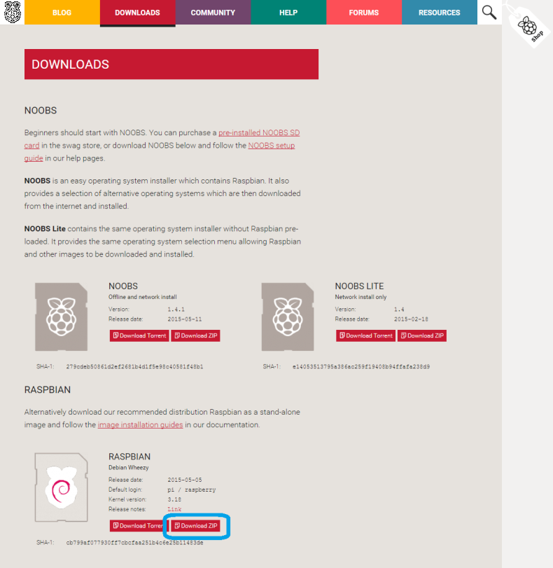
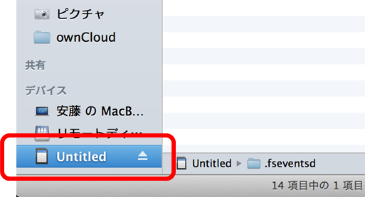

<!-- Title: SDカードの準備 -->
<!-- -*- pukiwiki-edit -*- -->
#contents

## Introduction

This section explains how to install the runtime environment required to run RTCs for Raspberry Pi (hereafter referred to as RPI RTCs).

The following installation procedure assumes a Windows environment.
If you are using an environment other than Windows, refer to sites such as the following.

- [http://elinux.org/RPi_Easy_SD_Card_Setup](http://elinux.org/RPi_Easy_SD_Card_Setup)

This section explains how to download an OS image from the official Raspberry Pi website and perform the required setup.
The general procedure for using OpenRTM on Raspberry Pi is as follows.

- Write the OS image to an SD card
- Perform basic OS setup
- Install OpenRTM-aist
- Test component execution

Images with OpenRTM-aist and the Kobuki component already installed are also provided below, so the following steps can be skipped.

- OpenRTM-aist installation (not yet available)
- Kobuki component installation (not yet available)
- PiRT-Unit setup (not yet available)

## SD Card Capacity

The SD card used must be at least **2 GB**, but in actual use, **4 GB or more is required**. Be sure to prepare an SD card of 4 GB or larger.

## Downloading the Image

Download the Raspberry Pi OS, Raspbian “wheezy,” from the following site.
Raspbian is a Debian-based Linux distribution for Raspberry Pi.

<!-- wheezyには armhf と armel の二つのタイプがありますが、''armhf'' を使用してください。 -->

- Raspbian Wheezy: [http://www.raspberrypi.org/downloads](http://www.raspberrypi.org/downloads)

<div align="center"><a href="raspbian_download_site2.png"></a></div>
<div align="center"><strong>Downloading Raspbian</strong></div>

Extract the downloaded file `YYYY-MM-DD-wheezy-raspbian.zip`.
A file of about 2 GB named `YYYY-MM-DD-wheezy-raspbian.img` should be extracted.

```text
 $ ls -al 
 total 4752840
 drwxr-xr-x  4 n-ando  staff         136  5 18 13:30 .
 drwxr-xr-x  9 n-ando  staff         306  5 18 13:30 ..
```

```text
 -rw-r--r--  1 n-ando  staff  1939865600  2  9 12:44 2013-02-09-wheezy-raspbian.img
 -rwxr-xr-x  1 n-ando  staff   493587826  5  7 21:08 2013-02-09-wheezy-raspbian.zip
```

If extraction fails, the download may have failed and the file may be corrupted. Delete the corrupted file and download it again.

## Writing the Image

The extracted `yyyy-mm-dd-wheezy-raspbian.img` is called an image file. It contains the complete disk state required to boot Raspbian, copied byte by byte from the beginning to the end of the disk.

<span style="color:red;">Simply copying this file to the SD card will not work!!</span>;

Write it to the SD card using the method described below.

### Writing the Image (Windows)

On Windows, the image can be written using a tool called Win32DiskImager.
Download the Win32DiskImager binary from the following site.

- Win32DiskImager: [http://sourceforge.jp/projects/sfnet_win32diskimager/](http://sourceforge.jp/projects/sfnet_win32diskimager/)

<div align="center"><a href="win32diskimager_site.png"></a></div>
<div align="center"><strong>Downloading Win32DiskImager</strong></div>

Extract the downloaded file (`win32diskimager-vX.X-binary.zip`).

<span style="color:red;">* Win32DiskImager does not support double-byte characters, so extract `YYYY-MM-DD-wheezy-raspbian.zip` to a location where the path does not contain full-width characters or spaces.</span>;

Insert the SD card to be used with Raspberry Pi into the PC, and start Win32DiskImager.

<span style="color:red;">* The SD card must be recognized as a drive, so format it in FAT32 format beforehand.</span>;

Specify the extracted Raspbian image file (`YYYY-MM-DD-wheezy-raspbian.img`) in “Image File,” specify the SD card drive in “Drive,” and click the “Write” button.

<div align="center"><a href="win32diskimager.png"></a></div>
<div align="center"><strong>Writing the Image Data</strong></div>

This completes the preparation of the SD card.
After writing is complete, insert the SD card into the Raspberry Pi and turn on the power.

### Writing the Image (Linux)

On Linux, images can be read and written using the `dd` command.
The `dd` command is usually installed by default on UNIX-like operating systems.

After inserting the SD card, check the kernel messages using the `dmesg` command.

```text
 $ dmesg
   : Omitted
 [333478.822170] sd 3:0:0:0: [sdb] Assuming drive cache: write through
 [333478.822174]  sdb: sdb1 sdb2
 [333478.839563] sd 3:0:0:0: [sdb] Assuming drive cache: write through
 [333478.839567] sd 3:0:0:0: [sdb] Attached SCSI removable disk
 [333479.094873] EXT4-fs (sdb2): mounted filesystem with ordered data mode
 [333527.658195] usb 1-1: USB disconnect, address 2
```

Check the SD card device name from this message. In this example, `sdb` appears to be the SD card device name. Check under `/dev/`.

```text
 ls -al /dev/sd*
 brw-rw---- 1 root disk 8,  0 May  7 17:28 /dev/sda
 brw-rw---- 1 root disk 8,  1 May  7 17:28 /dev/sda1
 brw-rw---- 1 root disk 8,  2 May  7 17:28 /dev/sda2
 brw-rw---- 1 root disk 8,  5 May  7 17:28 /dev/sda5
 brw-rw---- 1 root disk 8, 16 May 18 14:19 /dev/sdb
 brw-rw---- 1 root disk 8, 17 May 18 14:19 /dev/sdb1
 brw-rw---- 1 root disk 8, 32 May 18 14:19 /dev/sdc
```

`sda` is usually the system disk, so you must **never** touch it.

Depending on the distribution, if the SD card contains a mountable filesystem, it may be mounted automatically.
In that case, unmount the disk. (On Ubuntu, the mounted filesystem folder appears on the desktop, so right-click it and remove it. On other systems, unmount it using the `umount` command.)

<div align="center"><a href="ubuntu_adcard_mount.png"></a></div>
<div align="center"><strong>SD Card Mounted on Ubuntu (can be removed from the right-click menu)</strong></div>

Enter and execute a command in the form **dd if=image file of=SD card device file bs=1M**.
Writing to a device file requires administrator (root) privileges, so use `sudo`.

```text
 $ unzip  2013-02-09-wheezy-raspbian.zip
 Archive:  2013-02-09-wheezy-raspbian.zip
   inflating: 2013-02-09-wheezy-raspbian.img
 $ sudo dd if=2013-02-09-wheezy-raspbian.img of=/dev/sdb bs=1M
 1850+0 records in
 1850+0 records out
 1939865600 bytes (1.9 GB) copied, 201.543 s, 9.6 MB/s
```

While the command is running, you can check whether writing is proceeding correctly by running the `iostat` command in another terminal.
(On recent distributions, it may not be installed by default. On Debian/Ubuntu, you can use the `iostat` command by running `apt-get install sysstat`.)

```text
 $ iostat -mx 1
  avg-cpu:  %user   %nice %system %iowait  %steal   %idle
            0.00    0.00    0.00   50.25    0.00   49.75
 
 Device:         rrqm/s   wrqm/s     r/s     w/s    rMB/s    wMB/s avgrq-sz avgqu-sz   await  svctm  %util
 sda               0.00     0.00    0.00    1.00     0.00     0.00     8.00     0.00    0.00   0.00   0.00
 sdb               0.00  1856.00    0.00   78.00     0.00     9.14   240.00   143.40 1855.85  12.82 100.00
```

Looking at the `sdb` entry, you can see that data is being written at 9.14 MB/s.
If a class 6 SD card writes at around 6 MB/sec, or a class 10 SD card writes at around 10 MB/sec, it is reasonable to assume the write is proceeding normally.

After writing is complete, some distributions may automatically mount the SD card again. In that case, unmount it before removing the SD card.

### Writing the Image (Mac OS X)

On Mac OS X, as with Linux, the `dd` command is used to write the image.
However, on Mac, when an SD card is inserted it is automatically mounted, and while it is mounted, `dd` cannot write to the SD card. Therefore, it must be unmounted (removed from the OS).

When the SD card is inserted, an SD card icon appears in Finder as shown below.
Be careful **not to press the eject button** when you intend only to unmount it for writing.

<div align="center"><a href="sdcard_mac.png"></a></div>
<div align="center"><strong>SD Card Mounted on Mac</strong></div>

In this example, the SD card volume name is **Untitled**. Remember this volume name.
Entering the `df` command from the command prompt displays the following.

```text
 $ df -k
 Filesystem                        1024-blocks      Used Available Capacity   iused    ifree %iused  Mounted on
 /dev/disk0s2                        500000000 437664508  62079492    88% 109480125 15519873   88%   /
 devfs                                     194       194         0   100%       679        0  100%   /dev
 map -hosts                                  0         0         0   100%         0        0  100%   /net
 map auto_home                               0         0         0   100%         0        0  100%   /home
 /dev/disk1s1                            57288     18992     38296    34%       512        0  100%   /Volumes/Untitled
```

```text
The bottom entry, `/Volumes/Untitled`, is the mount point of the SD card. Remember the device name on the far left, `/dev/disk1s1`.
```

Unmount this SD card temporarily. Use the `diskutil` command and enter it in the form **diskutil umount <mount point>**.

```text
 $ diskutil umount /Volumes/Untitled
 Volume (null) on disk1s1 unmounted
 $ df -k
 Filesystem                        1024-blocks      Used Available Capacity   iused    ifree %iused  Mounted on
 /dev/disk0s2                        500000000 437664716  62079284    88% 109480177 15519821   88%   /
 devfs                                     194       194         0   100%       679        0  100%   /dev
 map -hosts                                  0         0         0   100%         0        0  100%   /net
 map auto_home                               0         0         0   100%         0        0  100%   /home
```

The previous `/Volumes/Untitled` entry has disappeared, showing that the SD card has been unmounted.

Next, use the `dd` command to write the image.
Enter it in the form **dd if=image file of=/dev/rdisk1 bs=1m**.
The `of=/dev/rdisk1` device name is created from the device file remembered earlier, `/dev/disk1s1`, by removing the trailing **s1** and adding **r** before `disk` to indicate that it is a raw device.

This command accesses the device file, so it cannot be executed unless you have administrator (root) privileges. Use `sudo` as follows.

```text
 $ sudo dd if=2013-02-09-wheezy-raspbian.img of=/dev/rdisk1 bs=1m
 1850+0 records in
 1850+0 records out
 1939865600 bytes transferred in 302.377337 secs (6415380 bytes/sec)
 $
```

During writing, you can check whether writing is proceeding correctly by viewing “Disk Activity” in Activity Monitor.
If a class 6 SD card writes at around 6 MB/sec, or a class 10 SD card writes at around 10 MB/sec, it is reasonable to assume the write is proceeding normally.

When writing is complete, the card will automatically be mounted again. This time, press the eject button in Finder and remove the SD card.
