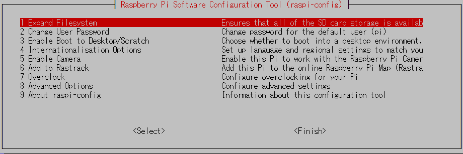
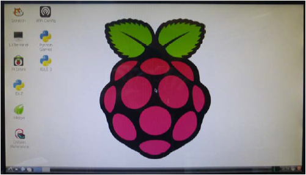
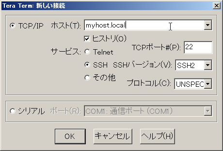

<!-- Title: Raspberry Pi の初期設定 -->
<!-- -*- pukiwiki-edit -*- -->
<!-- * Raspberry Pi の初期設定 -->

#contents

## Starting Raspberry Pi

Connect an HDMI monitor, keyboard, and network cable to the Raspberry Pi.

When you insert the SD card and power on the Raspberry Pi for the first time, various drivers will be loaded and the following configuration screen (`raspi-config`) will appear.

If you are operating through the PiRT-Unit serial console described later, `raspi-config` will not be displayed automatically.
In that case, log in using the following username and password, then execute the `raspi-config` command to perform the initial setup.

- **User ID**: pi
- **Password**: raspberry

```text
 Debian GNU/Linux 7.0 rtunit0 ttyAMA0

 rtunit0 login: pi
 Password:
 Last login: Sat Feb  9 03:40:44 UTC 2013 on ttyAMA0
 Linux rtunit0 3.6.11+ #371 PREEMPT Thu Feb 7 16:31:35 GMT 2013 armv6l

 The programs included with the Debian GNU/Linux system are free software;
 the exact distribution terms for each program are described in the
 individual files in /usr/share/doc/*/copyright.

 Debian GNU/Linux comes with ABSOLUTELY NO WARRANTY, to the extent
 permitted by applicable law.

 NOTICE: the software on this Raspberry Pi has not been fully configured.
 Please run 'sudo raspi-config'

 $ raspi-config
```

<div align="center"><a href="raspi-config2.png"></a></div>
<div align="center"><strong>Raspberry Pi Initial Setup Screen</strong></div>

### Configuration Items

The available settings are listed below.
Configure them as necessary.

<table class="table-alt">
  <tr>
    <th><strong>1 Expand Filesystem</strong></th>
    <th>Expands the partition on the SD card. By default, the entire SD card capacity is not used, so it is recommended to expand it unless there is a specific reason not to.</th>
  </tr>
  <tr>
    <td><strong>2 Change User Password</strong></td>
    <td>Changes the password for the default user "pi". Set it to a password that is easy for the user to remember.</td>
  </tr>
  <tr>
    <td><strong>3 Enable Boot to Desktop/Scratch</strong></td>
    <td>Configures the startup mode. The default is console mode. Select this option if you want to boot directly into the GUI desktop environment.</td>
  </tr>
  <tr>
    <td><strong>4 Internationalisation Options</strong></td>
    <td>Configures locale, timezone, and keyboard layout settings.</td>
  </tr>
  <tr>
    <td>I1 Change Locale</td>
    <td>Configures locale settings. If necessary, select options such as <code>ja_JP.EUC-JP</code>. Note that Japanese font installation may also be required.</td>
  </tr>
  <tr>
    <td>I2 Change Timezone</td>
    <td>Configures the timezone. For use in Japan, select <strong>Asia → Tokyo</strong>.</td>
  </tr>
  <tr>
    <td>I3 Change Keyboard Layout</td>
    <td>Configures the keyboard layout. Set it appropriately, for example to a Japanese keyboard layout if needed.</td>
  </tr>
  <tr>
    <td><strong>5 Enable Camera</strong></td>
    <td>Enable this option if a camera module is connected.</td>
  </tr>
  <tr>
    <td><strong>6 Add to Rastrack</strong></td>
    <td>Registers the device with Rastrack.</td>
  </tr>
  <tr>
    <td><strong>7 Overclock</strong></td>
    <td>Configures CPU overclocking.</td>
  </tr>
  <tr>
    <td><strong>8 Advanced Options</strong></td>
    <td>Additional settings. Only options relevant to the PiRT-Unit environment are described here.</td>
  </tr>
  <tr>
    <td>A6 SPI</td>
    <td>Set to <strong>Enable</strong> if SPI will be used. (Default: Disable)</td>
  </tr>
  <tr>
    <td>A7 I2C</td>
    <td>Set to <strong>Enable</strong> if I²C will be used. (Default: Disable)</td>
  </tr>
  <tr>
    <td><strong>9 About raspi-config</strong></td>
    <td>Displays information about this configuration tool.</td>
  </tr>
</table>

After configuring the required items, press **[Tab]** to select **[Finish]** and execute it.

The Raspberry Pi will reboot and the new settings will take effect.

After rebooting, when the command prompt appears, execute:

```bash
$ startx
```

to launch the Raspbian desktop environment.

<div align="center"><a href="raspberry_xwindow.png"></a></div>
<div align="center"><strong>Raspbian Desktop Screen</strong></div>

To shut down the Raspberry Pi, execute the following command and then disconnect the power supply.

```bash
$ sudo halt
```

## Configuring Wireless LAN

By connecting a USB wireless LAN adapter (dongle) and configuring it, the Raspberry Pi can operate wirelessly.
This is particularly useful when mounting it on mobile robots.

### Editing /etc/network/interfaces

First, edit `/etc/network/interfaces`:

```bash
$ sudo vi /etc/network/interfaces
```

Modify the following two lines.

```text
iface wlan0 inet manual
        ↓
iface wlan0 inet dhcp
```

```text
wpa-roam /etc/wpa_supplicant/wpa_supplicant.conf
                     ↓
wpa-conf /etc/wpa_supplicant/wpa_supplicant.conf
```

### Editing /etc/wpa_supplicant/wpa_supplicant.conf

Next, register the wireless LAN ESSID and key.

```bash
$ sudo bash
# cd /etc/wpa_supplicant
# wpa_passphrase ESSID pass >> wpa_supplicant.conf
```

Replace:

- `ESSID` with the wireless network SSID
- `pass` with the wireless network password

Be careful to use **>>** (append) rather than **>** (overwrite).

The result should look similar to the following:

```text
ctrl_interface=DIR=/var/run/wpa_supplicant GROUP=netdev
update_config=1
network={
        ssid="OpenRTM"
        #psk="4332221111"
        psk=142914b76be167767055ff945898baaaf83c42b3ad3b99afb0ae531e8fb15e5e
}
```

Depending on the wireless access point, additional settings may be required.
For example:

```text
ctrl_interface=DIR=/var/run/wpa_supplicant GROUP=netdev
update_config=1
network={
        ssid="OpenRTM"
        proto=WPA2
        key_mgmt=WPA-PSK
        pairwise=TKIP CCMP
        group=TKIP CCMP
        #psk="4332221111"
        psk=142914b76be167767055ff945898baaaf83c42b3ad3b99afb0ae531e8fb15e5e
}
```

Finally, restart the wireless interface.

```bash
# ifdown wlan0
# ifup wlan0
```

Example output:

```text
Internet Systems Consortium DHCP Client 4.2.2
Copyright 2004-2011 Internet Systems Consortium.
All rights reserved.
For info, please visit https://www.isc.org/software/dhcp/

DHCPREQUEST on wlan0 to 255.255.255.255 port 67
DHCPOFFER from 192.168.11.1
DHCPACK from 192.168.11.1
bound to 192.168.11.26 -- renewal in 34810 seconds.
```

If the wireless LAN does not connect successfully, review the settings in:

- `/etc/network/interfaces`
- `/etc/wpa_supplicant/wpa_supplicant.conf`

Check the interface status:

```text
# ifconfig wlan0

wlan0     Link encap:Ethernet  HWaddr XX:XX:XX:XX:XX:XX
          inet addr:192.168.11.26  Bcast:192.168.11.255  Mask:255.255.255.0
          UP BROADCAST RUNNING MULTICAST  MTU:1500  Metric:1
          RX packets:1218 errors:0 dropped:0 overruns:0 frame:0
          TX packets:21 errors:0 dropped:0 overruns:0 carrier:0
          collisions:0 txqueuelen:1000
          RX bytes:250608 (244.7 KiB)  TX bytes:4506 (4.4 KiB)
```

If successful, an IP address will be assigned to the wireless interface `wlan0`.

## Remote Access Using a Hostname

When accessing a Raspberry Pi remotely via SSH, if a static IP address is not assigned, you normally need to determine its IP address before connecting.

To avoid this, install **avahi**, a Bonjour-compatible service.

Bonjour is a service proposed by Apple that enables automatic discovery of devices and services on a network.
By using avahi, a Raspberry Pi that receives its IP address via DHCP can still be accessed by hostname.

### Setting the Hostname

Choose a hostname that does not conflict with other hosts on the network.

```bash
$ sudo vi /etc/hostname
```

Enter the hostname on the first line of `/etc/hostname`.
The default hostname is `raspberrypi`.

Next, edit `/etc/hosts` and replace:

```text
127.0.1.1 raspberrypi
```

with your chosen hostname.

```bash
$ sudo vi /etc/hosts
```

### Installing avahi-daemon

Install the avahi daemon using the following commands:

```bash
$ sudo apt-get update
$ sudo apt-get install avahi-daemon
```

Test it by pinging your own host using the hostname with the `.local` suffix:

```bash
$ ping myhost.local
```

If the ping succeeds, avahi is most likely configured correctly.

### Installing Bonjour (Windows Only)

To access a Raspberry Pi configured with avahi from a Windows PC, the PC must also have either avahi or Bonjour installed.

- Linux users can simply install `avahi-daemon`.
- macOS already includes Bonjour by default.

Windows does not include Bonjour by default.

The easiest way to install Bonjour is to install iTunes:

- [Download iTunes](http://www.apple.com/jp/itunes/download/)

If you do not want to install iTunes, you can extract `BonjourSetup.exe` from the downloaded `iTunesSetup.exe` using an archive utility.

Bonjour is also included with Apple's Bonjour Print Services package:

- [Apple Bonjour](http://www.apple.com/jp/support/bonjour/)
  - [Bonjour Print Services (v2.0.2.0)](http://support.apple.com/kb/DL999)

Apple no longer distributes Bonjour for Windows as a standalone package, but several third-party sites still host older versions. Use them at your own risk.

- BonjourSetup.exe (v1.0.6.2)
- Bonjour64Setup.exe (v1.0.6.2)
- Apple Bonjour SDK (requires Apple Developer login)

#### If Bonjour Does Not Work Properly

If a firewall is active, Bonjour may not function correctly.

In that case:

- Open UDP port 5353, or
- Temporarily disable the firewall.

See:

- "Bonjour for Windows does not work because of firewall settings"

### Installing Tera Term

To log in to a Raspberry Pi via SSH from Windows, an SSH client is required.

There are many available SSH clients; here we introduce **Tera Term**.

- [Tera Term](http://sourceforge.jp/projects/ttssh2/)

<div align="center"><a href="teraterm_connect.png"></a></div>
<div align="center"><strong>Connecting with Tera Term</strong></div>

After installing Tera Term, launch it.
When the connection dialog appears, enter:

```text
<hostname>.local
```

in the **Host** field and click **OK**.

If the password has not been changed, log in using:

- **User ID:** pi
- **Password:** raspberry

For Linux and macOS, open a terminal and connect using:

```bash
$ ssh pi@myhost.local
```

This will establish an SSH connection to the Raspberry Pi using its hostname.

