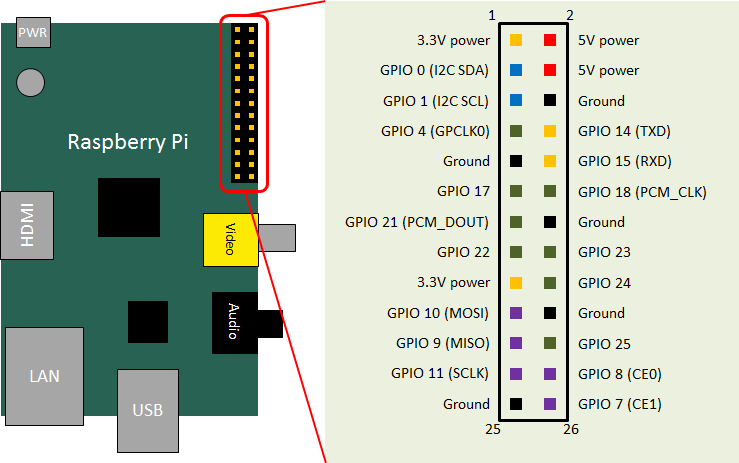
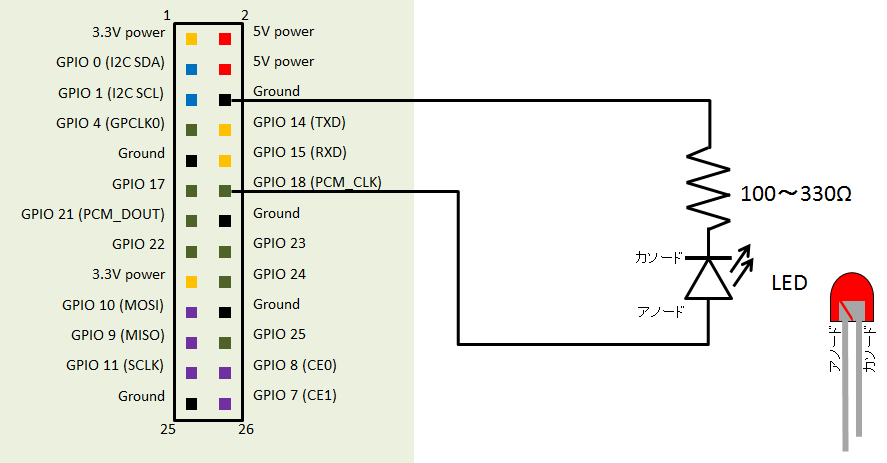
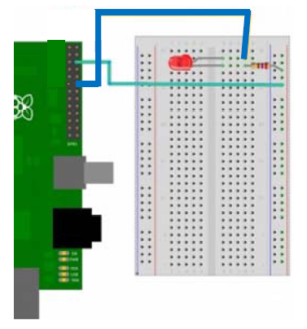
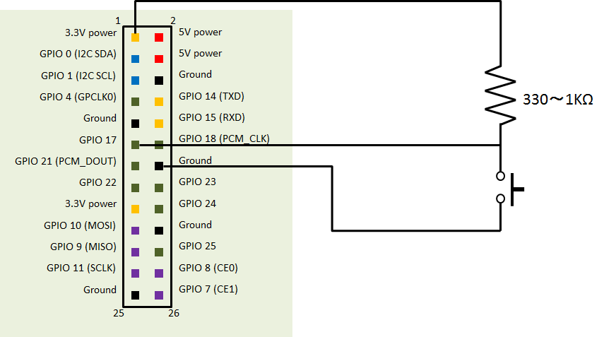
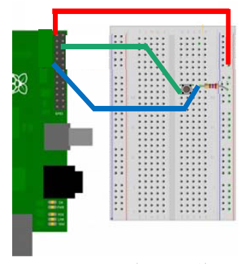
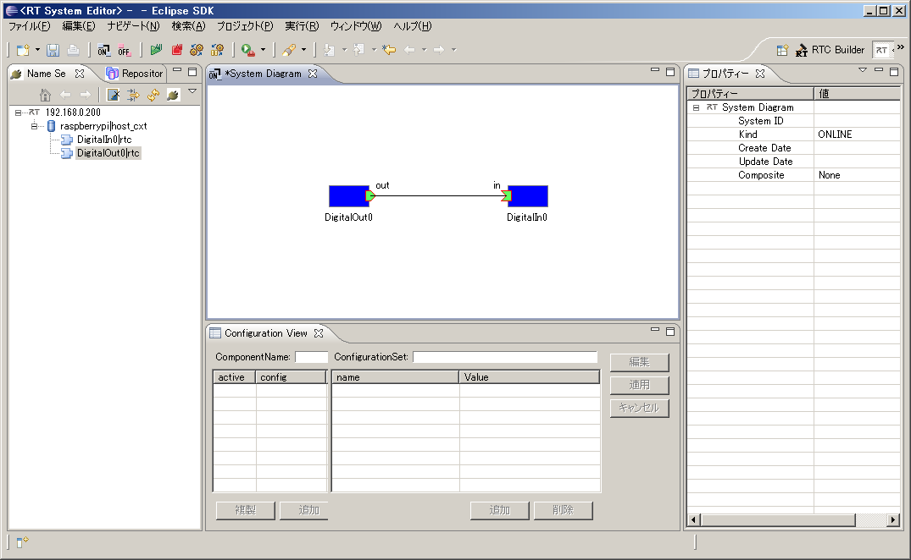

<!-- Title: サンプルコンポーネントの実行 -->
<!-- * GPIOを利用したサンプル -->

#contents

The following example uses GPIO to detect switch ON/OFF states and control LED illumination through RT Components (**DigitalIn-RTC** and **DigitalOut-RTC**). By building and running these components, you can gain a better understanding of how to use the Raspberry Pi's GPIO functionality.

The sample component source code can be downloaded from:

- [Sample Component Source Code](RaspberryPi_sample.zip)

## Raspberry Pi GPIO

The Raspberry Pi provides GPIO (General Purpose Input/Output) pins that can be used to interface with a variety of external devices.

The GPIO pin assignments are shown below.

<div align="center"><a href="raspberrypi_gpio_pinassign.png"></a></div>
<div align="center"><strong>Raspberry Pi GPIO Pin Assignment</strong></div>

When using GPIO pins, pay close attention to the pin layout. In particular, incorrect wiring involving the **5V pins** may damage the Raspberry Pi itself or the SD card. Proceed with caution.

## Breadboard Wiring Examples

In this example, we will build:

- An LED circuit
- A switch circuit for detecting ON/OFF states

Using a breadboard makes circuit assembly straightforward. However, since the number of components is small, the circuits can also be built by soldering wires directly.

The required parts are listed below.

<table class="table-alt">
  <tr>
    <th colspan="2" style="text-align: center;">Parts List</th>
  </tr>
  <tr>
    <td colspan="2" style="text-align: center;">LED Circuit</td>
  </tr>
  <tr>
    <td>LED</td>
    <td>1</td>
  </tr>
  <tr>
    <td>Resistor</td>
    <td>100Ω (Brown-Black-Brown-Gold) to 330Ω (Orange-Orange-Brown-Gold)</td>
  </tr>
  <tr>
    <td>Wires</td>
    <td>As needed</td>
  </tr>
  <tr>
    <td colspan="2" style="text-align: center;">Switch Circuit</td>
  </tr>
  <tr>
    <td>LED</td>
    <td>1</td>
  </tr>
  <tr>
    <td>Resistor</td>
    <td>330Ω (Orange-Orange-Brown-Gold) to 1kΩ (Brown-Black-Red-Gold)</td>
  </tr>
  <tr>
    <td>Wires</td>
    <td>As needed</td>
  </tr>
</table>

If you have only one Raspberry Pi, connect both the LED and switch circuits to the same board.

If you have two Raspberry Pis, it may be interesting to connect an LED and switch to each device and communicate between them.

### Wiring Example for DigitalIn-RTC

**DigitalIn-RTC** outputs a Boolean value (`true`/`false`) received through its data port to a specified GPIO pin.

To observe the GPIO output, connect an LED and resistor between the **Ground** pin and **GPIO 18**, as shown below.

<div align="center"><a href="gpio_led_circuit.png"></a></div>
<div align="center"><strong>LED Connection Circuit Diagram</strong></div>

The equivalent breadboard wiring is shown below.

<div align="center"><a href="3_rp2.png"></a></div>
<div align="center"><strong>Breadboard Example for LED Circuit</strong></div>

### Wiring Example for DigitalOut-RTC

**DigitalOut-RTC** reads a Boolean value (`true`/`false`) from a GPIO pin and outputs it through a data port.

To provide input to the GPIO pin, connect a resistor and switch to **Ground**, **3.3V Power**, and **GPIO 17**, as shown below.

<div align="center"><a href="gpio_stiwch_circuit.png"></a></div>
<div align="center"><strong>Tact Switch Connection Circuit Diagram</strong></div>

The corresponding breadboard wiring is shown below.

<div align="center"><a href="3_rp3.png"></a></div>
<div align="center"><strong>Breadboard Example for Switch Circuit</strong></div>

## Compiling the Components

Download the source code onto the Raspberry Pi and compile the DigitalIn-RTC and DigitalOut-RTC components.

- [Sample Component Source Code](RaspberryPi_sample.zip)

### Compiling DigitalIn-RTC

```bash
$ unzip RaspberryPi_sample.zip
$ cd RaspberryPi_sample/DigitalInRPI/
$ vi CMakeLists.txt
```

Edit `CMakeLists.txt` to disable documentation generation.

```cmake
option(BUILD_DOCUMENTATION "Build the documentation" ON)
 ↓
option(BUILD_DOCUMENTATION "Build the documentation" OFF)
```

Then build the component.

```bash
$ mkdir build
$ cd build
$ cmake ..
-- The C compiler identification is GNU 4.6.3
-- The CXX compiler identification is GNU 4.6.3
   : omitted
-- Configuring done
-- Generating done
-- Build files have been written to:
   /home/pi/RaspberryPi_sample/DigitalInRPI/build
```

If OpenRTM-aist is installed correctly, configuration should complete without errors.

If errors occur indicating that OpenRTM or Coil cannot be found, verify that OpenRTM-aist (C++ version) is installed correctly.

Example:

```bash
$ dpkg -l | grep openrtm
```

Build the component:

```bash
$ make
  : omitted
Scanning dependencies of target DigitalInComp
[ 66%] Building CXX object ...
[100%] Building CXX object ...
Linking CXX executable DigitalInComp
[100%] Built target DigitalInComp
$
```

The compiled executable is located in the `src` directory.

```bash
$ ls src/
CMakeFiles  cmake_install.cmake
DigitalInComp  DigitalIn.so  Makefile
```

### Compiling DigitalOut-RTC

Compile DigitalOut-RTC in the same manner.

```bash
$ cd RaspberryPi_sample/DigitalOutRPI/
$ vi CMakeLists.txt
```

Edit `CMakeLists.txt`:

```cmake
option(BUILD_DOCUMENTATION "Build the documentation" ON)
 ↓
option(BUILD_DOCUMENTATION "Build the documentation" OFF)
```

Then configure the build.

```bash
$ mkdir build
$ cd build
$ cmake ..
-- The C compiler identification is GNU 4.6.3
-- The CXX compiler identification is GNU 4.6.3
   : omitted
-- Configuring done
-- Generating done
-- Build files have been written to:
   /home/pi/RaspberryPi_sample/DigitalOutRPI/build
```

Build the component.

```bash
$ make
-- OpenRTMConfig.cmake found.
-- Configured by configuration mode.
   : omitted
Scanning dependencies of target DigitalOutComp
[ 66%] Building CXX object ...
[100%] Building CXX object ...
Linking CXX executable DigitalOutComp
[100%] Built target DigitalOutComp
$
```

The compiled executable is located in the `src` directory.

```bash
$ ls src/
CMakeFiles  cmake_install.cmake
DigitalOutComp  DigitalOut.so  Makefile
```

## Running the Components

After both RTCs have been successfully compiled, start the Name Server and launch the components.

```bash
$ rtm-naming
$ sudo /home/pi/RaspberryPi_sample/DigitalOutRPI/build/src/DigitalOutComp &
$ sudo /home/pi/RaspberryPi_sample/DigitalInRPI/build/src/DigitalInComp &
```

**Because these sample components use GPIO, they must be executed with root privileges.**

Start RTSystemEditor on a PC and connect to the Name Server running on the Raspberry Pi.

Place the RTCs in the system diagram, connect their ports, and activate them.

<div align="center"><a href="3_rp4.png"></a></div>
<div align="center"><strong>Running the Sample RTCs</strong></div>

When both RTCs are operating correctly, pressing and releasing the tact switch will cause the LED to turn on and off accordingly.


# Comments

### About Name Server Configuration

**Permalink** Submitted by SUZUKAWA Yuichi on Tue, 2013-04-23 00:53.

<table class="table-alt">
<tr>
<td>

I tried this method immediately, but although the Naming Server started successfully, it did not appear in Eclipse, which caused some confusion.

As a workaround, I manually configured the Raspberry Pi naming server host address as something like:

```text
192.168.0.X:100
```

and forcibly opened the port.

Normally, it uses localhost, which causes it to appear as:

```text
RaspberryPi:port_number
```

making it inaccessible from outside.

</td>
</tr>
</table>

### Creating a Raspberry Pi UART Communication Component

**Permalink** Submitted by SUZUKAWA Yuichi on Tue, 2013-04-23 01:02.

<table class="table-alt">
<tr>
<td>

As an additional note, I successfully created a simple UART loopback communication component.

The program was based on the following reference sites and worked with only minor modifications.

Reference sites:

- Chick Lab: *Serial Communication on Raspberry Pi*  
  http://chicklab.blog84.fc2.com/blog-entry-46.html

- Junk Room of Crafts and Gadgets  
  http://junkroom2cyberrobotics.blogspot.jp/2013/03/raspberry-pi-uart.html

The code worked almost unchanged after porting.

</td>
</tr>
</table>
