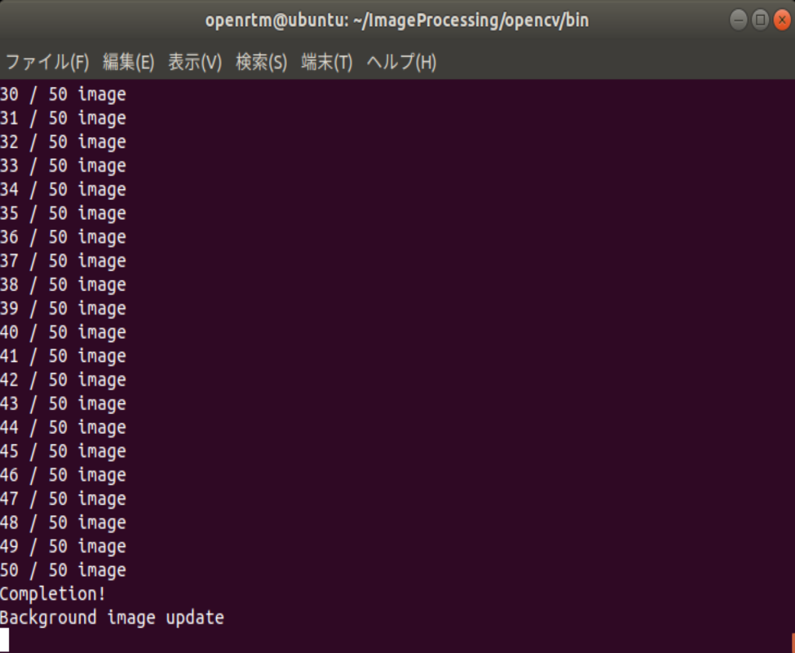
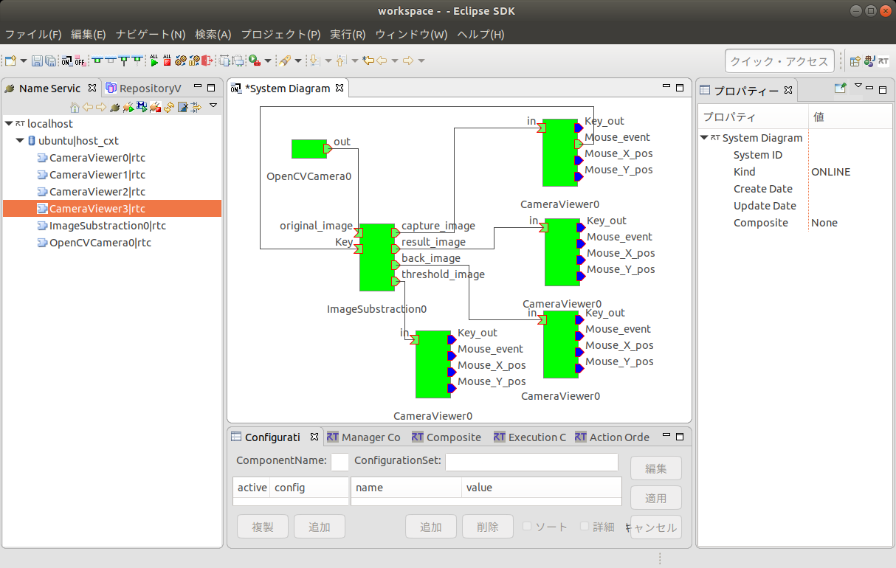
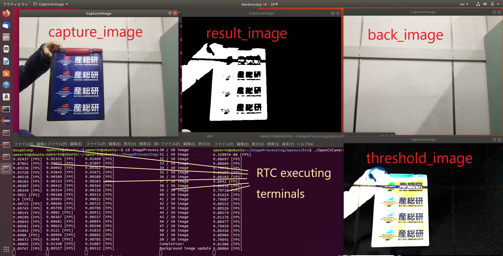

<!-- Title: ImageSubtraction -->

#contents

Please note that this sample is not included with the Python or Java editions of OpenRTM-aist. On Linux, build and install it according to [Building OpenCV Sample Code on Linux]({{ site.baseurl }}/en/doc/installation/sample_components/opencv_sample_build).

### Overview

By starting ImageSubtraction, background images are extracted from the input image, foreground regions are detected, and both a mask image for extracting the foreground and the background image are output.

It is used together with OpenCVCamera and CameraViewer. (Please note that this component does not currently operate correctly on Windows unless it is rebuilt. Therefore, use on Ubuntu 18.04 is recommended.)

### Startup Screen

<div align="center"><a href="ImageSubtract_exe.png"></a></div>
<div align="center"><strong>ImageSubtraction Component Execution Example</strong></div>

### Usage

ImageSubtraction is a component for extracting a background image from an input image. In this example, it is used together with the OpenCVCamera component for capturing images from a USB camera and the CameraViewer component for displaying processed images.

- Procedure (The following steps are for Ubuntu 18.04.)

  - Start a terminal.

  - Install the sample code according to [Building OpenCV Sample Code on Linux]({{ site.baseurl }}/en/doc/installation/sample_components/opencv_sample_build).

  - Start OpenRTP and RTSystemEditor according to [OpenRTP]({{ site.baseurl }}/en/doc/installation/install_1_2/start_openrtp_linux_1_2), and make sure RTCs are displayed in the Name Service View. Open a new SystemEditor. For details on using RTSystemEditor, refer to [RTSystemEditor]({{ site.baseurl }}/en/doc/toolmanuals/rtsystemeditor-1_2_0).

  - Open a new terminal window.

  - Execute the following commands to edit rtc.conf.

```bash
$ cd ImageProcessing/opencv/bin
$ sudo vi rtc.conf
```

  - Add the following line to the end of the file.

```text
manager.components.naming_policy: ns_unique
```

  - Open a new terminal and execute:

```bash
$ cd ImageProcessing/opencv/bin
$ ./CameraViewerComp
```

  After starting the terminal, repeat the above command three more times to launch four CameraViewer components.

  - Open a new terminal.

```bash
$ cd ImageProcessing/opencv/bin
$ ./OpenCVCameraComp
```

  to start OpenCVCameraComp.

  - Open another terminal and execute:

```bash
$ cd ImageProcessing/opencv/bin
$ ./ImageSubtractionComp
```

  to start the ImageSubtraction component.

  - In the RTSystemEditor Name Service View, click [>] and confirm that the components CameraViewer0, CameraViewer1, CameraViewer2, CameraViewer3, OpenCVCamera0, and ImageSubtraction0 are displayed.

  - In RTSystemEditor, click the [Open New System Editor] button <a href="icon_open_editor_ja.png"></a> at the top of the screen to open a new System Editor and display a new [System Diagram].

  - Drag and drop the above components onto the System Diagram.

  - Connect the ports of each component as shown below.

<div align="center"><a href="RTSystemEditor_ImageSubtraction.png"></a></div>
<div align="center"><strong>ImageSubtraction Component Execution Example</strong></div>

  - Right-click any component and select [Activate Systems].

  - Arrange the windows so that all four CameraViewer windows are visible.

<div align="center"><a href="compexec.png"></a></div>
<div align="center"><strong>ImageSubtraction Output Images</strong></div>

  - Move the mouse cursor out of the capture_image window. At that moment, the background image is captured and displayed in back_image. Observe how the other windows change as well.

The following configuration parameters can be set.

<table class="table-alt">
  <tr>
    <th>Parameter Name</th>
    <th>Description</th>
  </tr>
  <tr>
    <td>control_mode</td>
    <td>Either <code>b</code> or <code>m</code> can be selected. When <code>b</code> is selected, a background image is captured in response to a key event. When <code>m</code> is selected, the mode switches between DYNAMIC_MODE, which determines a threshold for each pixel, and CONSTANT_MODE, which uses a single threshold value for the entire image.</td>
  </tr>
  <tr>
    <td>image_height</td>
    <td>Specifies the vertical pixel count. This parameter is not functional in this sample.</td>
  </tr>
  <tr>
    <td>image_width</td>
    <td>Specifies the horizontal pixel count. This parameter is not functional in this sample.</td>
  </tr>
  <tr>
    <td>threshold_coefficient</td>
    <td>Coefficient used in DYNAMIC_MODE.</td>
  </tr>
  <tr>
    <td>constant_threshold</td>
    <td>Threshold value used in CONSTANT_MODE.</td>
  </tr>
</table>
