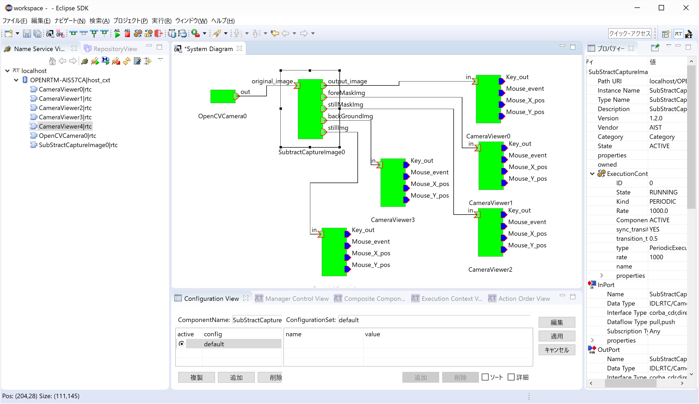
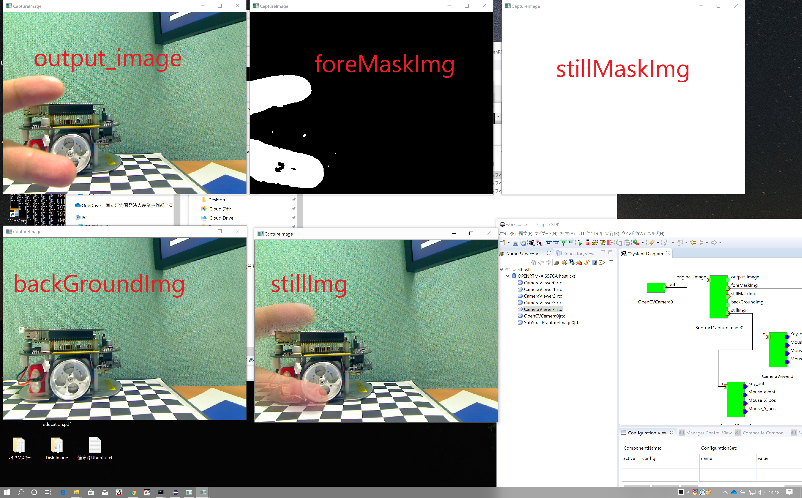
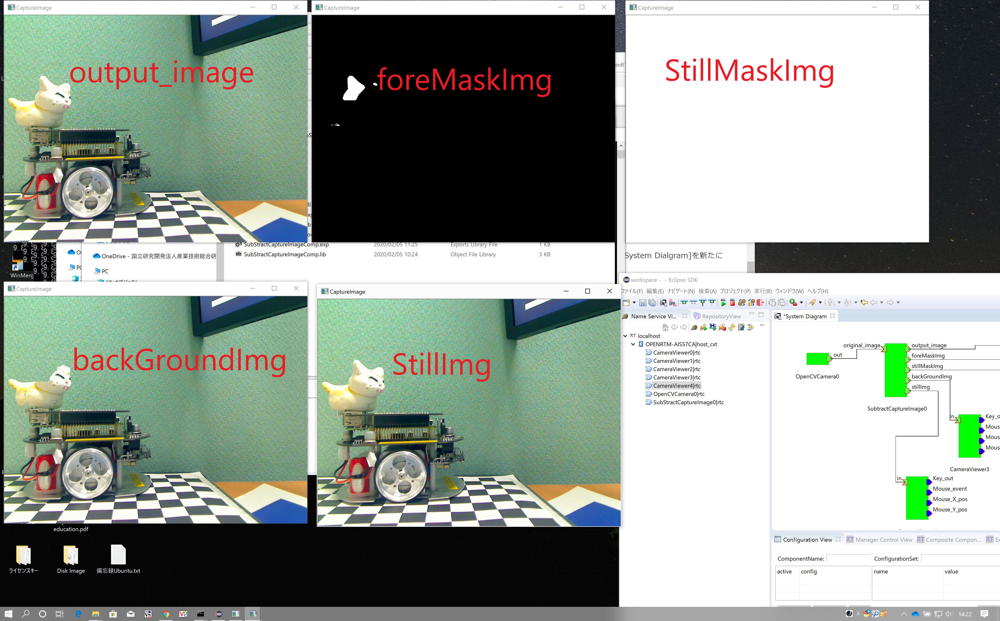

<!-- Title: SubtractCaptureImage -->

#contents

Please note that this sample is not included with the Python or Java editions of OpenRTM-aist. On Linux, build and install it according to [Building OpenCV Sample Code on Linux]({{ site.baseurl }}/en/doc/installation/sample_components/opencv_sample_build).

### Overview

SubtractCaptureImage is a component that identifies unchanged regions in the input image as background and outputs a mask image that extracts the foreground (moving objects). It is a sample component that performs real-time background updating using a dynamic background subtraction method.

It is used together with the OpenCVCamera and CameraViewer components.

### Usage

SubtractCaptureImage treats objects that remain motionless in the input image as part of the background. In addition, newly introduced objects that remain stationary for a certain period are gradually incorporated into the background image.

The component outputs the following images:

- Input image
- Foreground mask image (indicating moving objects)
- Mask image indicating regions that are neither foreground nor background
- Background image
- Image showing the process of incorporating stationary objects into the background

To observe the behavior of this component, start multiple CameraViewer components so that multiple output images can be displayed simultaneously. Alternatively, reconnect CameraViewer to different output ports and inspect each image individually. Using OpenCVCamera as the image source is recommended.

- Procedure (Windows Environment)

  - Start OpenRTP and RTSystemEditor according to [Procedure for Starting OpenRTP (1.2 Series, Windows)]({{ site.baseurl }}/en/doc/installation/install_1_2/start_openrtp_proc_windows_1_2), and ensure that RTCs are displayed in the Name Service View. For details on using RTSystemEditor, refer to [RTSystemEditor]({{ site.baseurl }}/en/doc/toolmanuals/rtsystemeditor-1_2_0).

  - Open a command prompt with administrator privileges so that multiple CameraViewer components can be executed.

  - Edit rtc.conf. For example:

```text
cd "\Program Files\OpenRTM-aist\1.2.1\Components\C++\OpenCV\vc14"
notepad rtc.conf
```

  Add the following line:

```text
manager.components.naming_policy: ns_unique
```

  - Close the command prompt.

  - In Explorer, navigate to:

```text
\Program Files\OpenRTM-aist\1.2.1\Components\C++\OpenCV
```

  - Double-click CameraViewer.bat.

  - Double-click CameraViewer.bat four more times, for a total of five CameraViewer components.

  - Double-click OpenCVCamera.bat.

  - Double-click SubtractCaptureImage.bat.

  - In the RTSystemEditor Name Service View, click [>] and confirm that the following components are displayed:

    - CameraViewer0
    - CameraViewer1
    - CameraViewer2
    - CameraViewer3
    - CameraViewer4
    - SubtractCaptureImage0
    - OpenCVCamera0

  - In RTSystemEditor, click the [Open New System Editor] button <a href="icon_open_editor_ja.png"></a>, open a new System Editor, and display a new [System Diagram].

  - Drag and drop the seven components above onto the System Diagram.

  - Connect the ports as shown below.

<div align="center"><a href="RTSE_SubtractCaptureImage.png"></a></div>
<div align="center"><strong>SubtractCaptureImage Component Connections</strong></div>

  - Right-click any component and select [Activate Systems].

  - Arrange the windows so that all CameraViewer windows are visible.

  - First, observe the CameraViewer3 window connected to backGroundImg and the CameraViewer0 window connected to output_image, which displays the same image as the input image. Confirm that both display images.

  - Next, observe the CameraViewer1 window connected to foreMaskImg. Initially, white regions are visible, but the image gradually becomes completely black. In this image, black regions represent areas identified as background, while white regions represent areas identified as foreground. Foreground regions correspond to changing areas—in other words, moving objects.

    Once the image becomes completely black, introduce a moving object into the camera view. The moving object should appear as a white region. You can also observe that in StillImg (displayed by CameraViewer3), objects that stop moving gradually become more clearly visible as stationary objects.

    An example is shown below.

<div align="center"><a href="SubtractCaptureImageOut1.png"></a></div>
<div align="center"><strong>Images from Each Output Port — Foreground Detection</strong></div>

  - In the example above, after foreMaskImg became completely black, a finger was slowly moved into the camera view from the side. In foreMaskImg, the moving finger is recognized as foreground (a moving object). Because the movement is slow, portions of the finger begin to be regarded as stationary objects in stillImg.

  - The next example shows a scene containing a Raspberry Pi–controlled mobile robot ("RasPiMouse"). After the scene was observed for a period of time, a cat figurine was placed on top of the robot. The images illustrate how the cat figurine is gradually recognized as a stationary object and incorporated into the background.

<div align="center"><a href="SubtractCaptureImageOut2.png"></a></div>
<div align="center"><strong>Images from Each Output Port — Stationary Object Detection and Background Updating</strong></div>

  - The StillImg image indicates that the cat figurine is being recognized as a stationary object. In this algorithm, additional time is required before a stationary object is regarded as part of the background. The object is gradually incorporated into the background over time.

    In the backGroundImg image, parts of the cat figurine become visible, indicating that those regions are now considered background. Eventually, backGroundImg evolves into an image that is nearly identical to StillImg.

    In contrast, foreMaskImg still contains white regions, indicating areas that are still regarded as foreground (moving objects).

  - The stillMaskImg output is difficult to represent with a static image, so only fully white sample images are shown here. To understand its behavior, display the output image directly.

    Under normal conditions, stillMaskImg outputs an entirely white image. Only in situations where a stationary object is removed immediately before it would otherwise be classified as background are those regions displayed in black.

