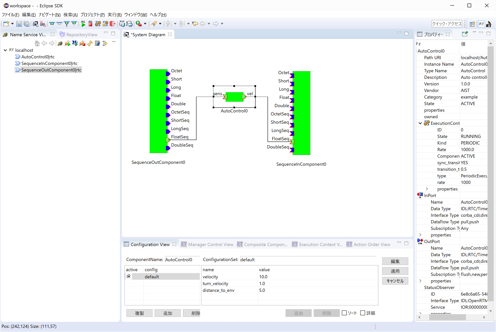
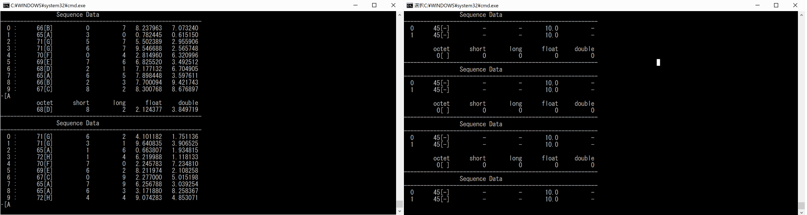

<!-- Title: Autocontrol -->

#contents

This sample is included only in the Python edition.

### Overview

This component evaluates data received through an InPort according to a certain criterion and outputs a different form of data through an OutPort. It can be used together with SeqIn and SeqOut.

When the corresponding ports are connected, the output values on the SeqOut side and the input values on the SeqIn side are displayed in their respective console windows. (Use RTSystemEditor to connect the ports.)

### Startup Screens

<strong>Autocontrol Execution Example (RTSystemEditor Connection Screen)</strong>

<strong>Console Windows of SeqIn and SeqOut Components</strong>

### Usage

The Autocontrol sample compares the fourth element of the data input through the Sens port with the parameter distance_to_env, which can be configured through Configuration. If the value is less than or equal to distance_to_env, the component outputs (turn_vel, -turn_vel) from the vel port. If the value is greater than distance_to_env, it outputs (velocity, velocity).

Connect the corresponding ports of Autocontrol, SeqOut, and SeqIn in RTSystemEditor. When both components are activated, not only the output values of SeqOut but also the values displayed by SeqIn change continuously, allowing observation of data port input and output.

- Procedure

  1. Start RTSystemEditor and create a SystemEditor. For details on how to use RTSystemEditor, refer to [RTSystemEditor]({{ site.baseurl }}/en/doc/toolmanuals/rtsystemeditor-1_2_0).
  2. Start the Autocontrol, SeqOut, and SeqIn components. In Explorer, navigate to the directory "\Program Files\OpenRTM-asit\1.2.x\Components\Python" and double-click "Autocontrol.bat", "SeqIn.bat", and "SeqOut.bat".
  3. The three components will appear in the NameServiceView of RTSystemEditor. Drag and drop them onto the SystemEditor.
  4. Connect the corresponding ports of the components. (Refer to the execution example shown above.)
  5. Right-click either component and select [Activate System].
  6. Select the Autocontrol0 component in the [System Diagram], then click the [Edit] button in the [Configuration View] displayed at the bottom of the screen. If [Configuration View] is not visible, click the [Configuration View] tab.
  7. Modify the parameter values. In this system configuration example, easy-to-understand settings are: [velocity] = 10.0, [turn_velocity] = 1.0, and [distance_to_env] = 5.0.
  8. Pay attention to the fourth float data value displayed in the SeqOut console window and the two Sequence Data values displayed in the SeqIn console window. Verify that the SeqOut value is compared with the [distance_to_env] value and that either [turn_vel], -[turn_vel] or [velocity], [velocity] is output to the SeqIn console window. You may also experiment by changing the Configuration parameters to observe how the relationship between input and output changes.

