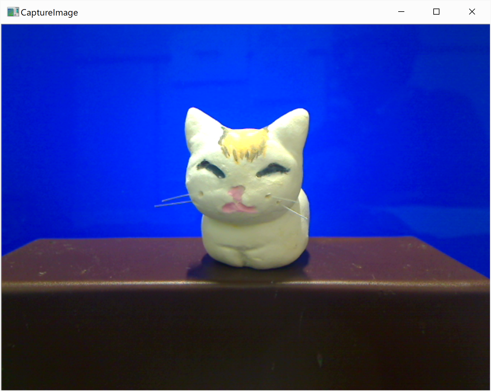
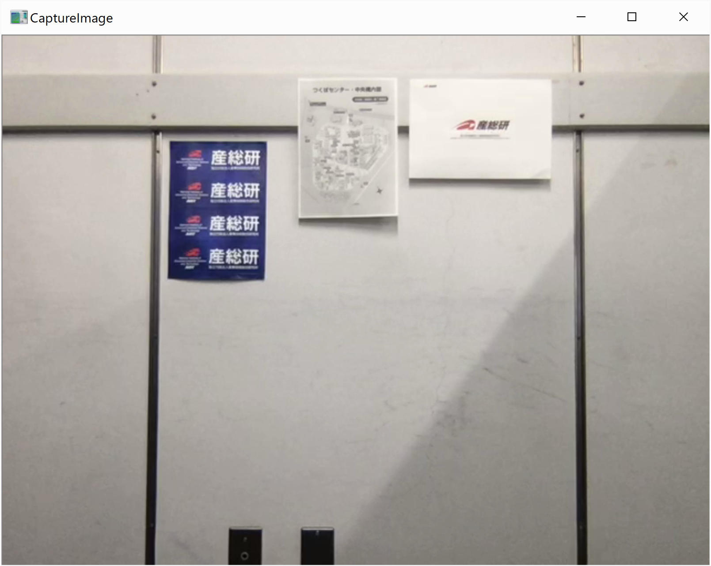
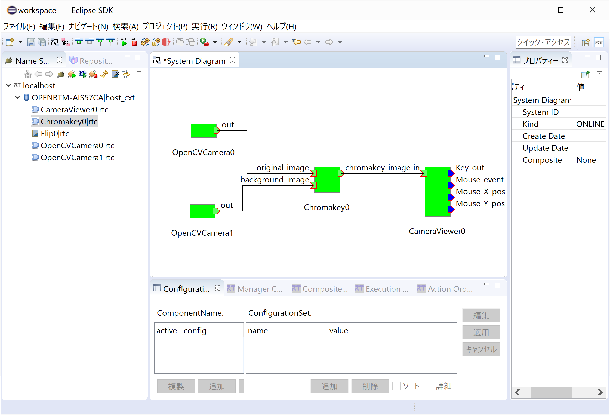
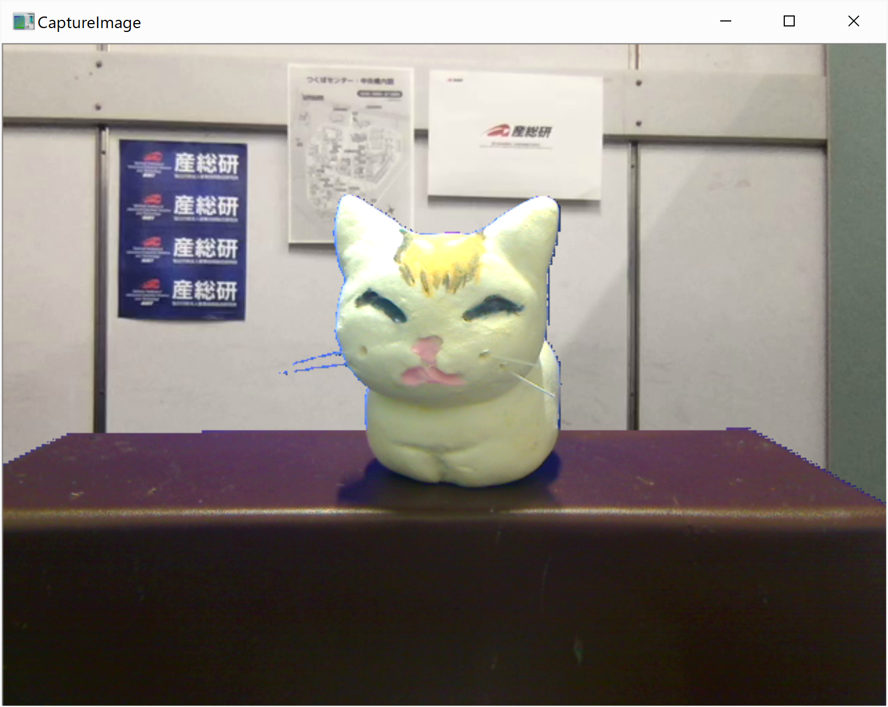

<!-- Title: Chromakey -->

#contents

OpenRTM-aistのPython版、Java版には付属していませんのでご注意ください。また、Linux上では、[LinuxにおけるOpenCVサンプルコードのビルド手順]({{ site.baseurl }}/ja/doc/installation/sample_components/opencv_sample_build)に従ってビルドしてインストールしてください。

### 概要
Chromakeyは、2つの画面をクロマキー合成をするOpenCVコンポーネントのサンプルです。
OpenCVCamera、CameraViewerといっしょに使用します。

### 使い方
Chromakeyは、ある特定の色を背景(例えば緑色)として撮影を行った画像のその特定色のところを透明化して、別の画面と合成するクロマキー合成という手法を実現するRTCコンポーネントです。　実行にあたっては、OpenCVCameraコンポーネントを2つ起動して2つの画面を取り込みます。また出力はCameraViewerコンポーネントを使用します。
- 合成する2つの画面

<div align="center"><a href="foreground.png"></a></div>
<div align="center"><strong>前面画像</strong></div>

<div align="center"><a href="background.png"></a></div>
<div align="center"><strong>背景画像</strong></div>

- 手順 (Windows環境)
  - [OpenRTPの起動手順(1.2系、Windows)]({{ site.baseurl }}/ja/doc/installation/install_1_2/start_openrtp_proc_windows_1_2)に従いOpenRTPを起動しRTSystemEditorを起動し、Name Service ViewにRTCが表示されるようにします。RTSystemEditorの使用方法の詳細については[RTSystemEditor]({{ site.baseurl }}/ja/doc/toolmanuals/rtsystemeditor-1_2_0)を参照してください。
  - 管理者権限でコマンドプロンプトを開きOpenCVCameraコンポーネントを2つ実行できるようにします。
  - rtc.confを編集します。例えば、以下のようなコマンドを入力し編集を行います。
```
cd "\Program Files\OpenRTM-aist\1.2.1\Components\C++\OpenCV\vc14"
notepad rtc.conf
```
とし、以下の行を付け加えます。
```
 manager.components.naming_policy: ns_unique
```

    - コマンドプロンプトを閉じます。
  - エクスプローラーで\Program Files\OpenRTM-aist\1.2.1\Components\C++\OpenCVとたどります。
  - CameraViewer.batをダブルクリックします。
  - OpenCVCamera.batをダブルクリックします。
  - OpenCVCamera.batをもう一度ダブルクリックします。
  - Chromakey.batをダブルクリックします。
  - RTSystemEditorの画面のName Service viewのところの[>]をクリックして、起動したコンポーネントCameraViewer0、Chromakey0、OpenCVCamera0、OpenCVCamera1のコンポーネントが表示されているのを確認します。
  - RTSystemEditorで上部の[Open New System Editor]ボタン<a href="icon_open_editor_ja.png"></a>をクリックし、新規System Editorを開き、[System Dialgram]を新たに表示させます。
  - 上記の4つのコンポーネントをSystem Diagram上にドラッグ&ドロップします。
  - 下記の画面のように各コンポーネントのポートを接続します。

<div align="center"><a href="rtse_chromakey.png"></a></div>
<div align="center"><strong>Chromakeyコンポーネントの接続</strong></div>

  - OpenCVCamera0コンポーネントを右クリックして、[Activate]を選択します。緑色に表示が変わらない場合は、このコンポーネントを選択後、下部のConfiguration Viewを開き、[編集]をクリックし、device_numを接続されている、前面画像撮影用のUSBカメラに対応している番号に変え、[適用]ボタンをクリックします。
  - OpenCVCamera1コンポーネントを右クリックして、[Activate]を選択します。緑色に表示が変わらない場合は、このコンポーネントを選択後、下部のConfiguration Viewを開き、[編集]をクリックし、device_numを接続されている、背景画像撮影用のUSBカメラに対応している番号に変え、[適用]ボタンをクリックします。
  - どれかのコンポーネントを右クリックし、[Activate Systems]を選択します。
  - 画面のウィンドウを動かしながらCameraViewerの画面を表示させます。
  - [System Dialog](System Editor View)上のChromakey0コンポーネントをクリックします。すると下部にConfiguration Viewが表示されます。もし表示されない場合は[Configuration]タブをクリックしてください。
  - [編集]ボタンをクリックしてクロマキーカラーの設定をします。
lower_blue、uppder_blue、lower_green、upper_green、lower_red、upper_redの値を前面画像でバックグラウンドとして透明化する色(この例では緑色)のRGB値の青、緑、赤の成分範囲値を設定します。
  - [適用]ボタンをクリックします。
  - 下記のように2つの画像が合成されるの確認してください。

<div align="center"><a href="chromakeyCameraViewer.png"></a></div>
<div align="center"><strong>クロマキー合成出力画像</strong></div>


